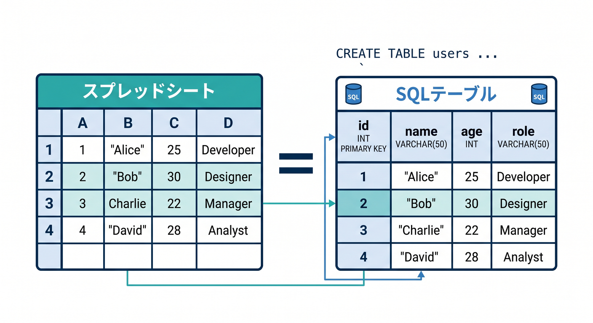
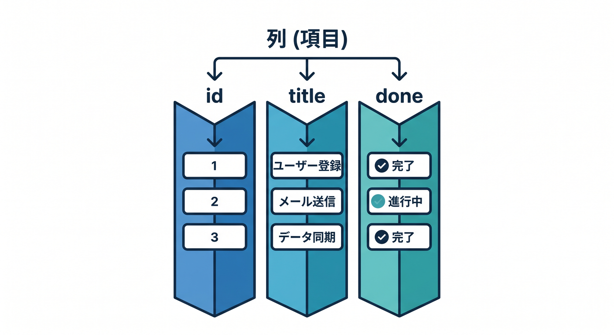
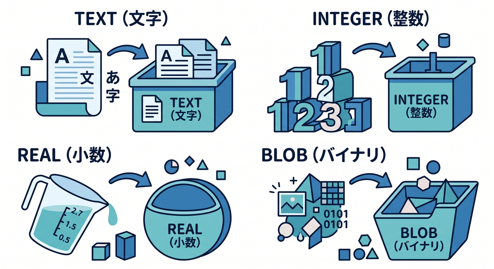

# 第02章：SQLの超基礎：表・行・列を理解しよう 📊🧩

SQLを学ぶ前に、まず表・行・列のイメージを持ちましょう。  
難しく考えず、スプレッドシートのような表を思い浮かべると分かりやすいです 😊



---

## 1. テーブルは表 📋

テーブルは、データを入れる表です。

Todoアプリなら、`todos` というテーブルを作れます。

```text
todos
```

テーブル名は、何のデータを入れるかが分かる名前にします。


---

## 2. 行は1件のデータ 📝

行は、1件分のデータです。

たとえばTodoなら、1行が1つのTodoです。

```text
1行目: 牛乳を買う
2行目: D1を勉強する
3行目: 部屋を片付ける
```

アプリでは、この行を追加したり、更新したり、削除したりします。


---

## 3. 列は項目 🧾

列は、データの項目です。

Todoなら、次のような列が考えられます。

- `id`
- `title`
- `done`
- `created_at`

表で見るとこうです。

```text
id | title        | done | created_at
1  | 牛乳を買う   | 0    | 2026-04-24
```



---

## 4. 型をざっくり知る 🔤

SQLite系では、よく使う型として次を覚えれば十分です。

- `TEXT`: 文字列
- `INTEGER`: 数値
- `REAL`: 小数
- `BLOB`: バイナリ

最初のTodoアプリでは、`TEXT` と `INTEGER` が中心です。



---

## 5. 章末チェック ✅

- テーブルは表だと分かる
- 行は1件のデータだと分かる
- 列は項目だと分かる
- Todoテーブルの列を考えられる
- SQLをスプレッドシート感覚で見られる

この章で覚える一言はこれです。  
**SQLは、表に入ったデータを追加・探すための言葉です 📊**
