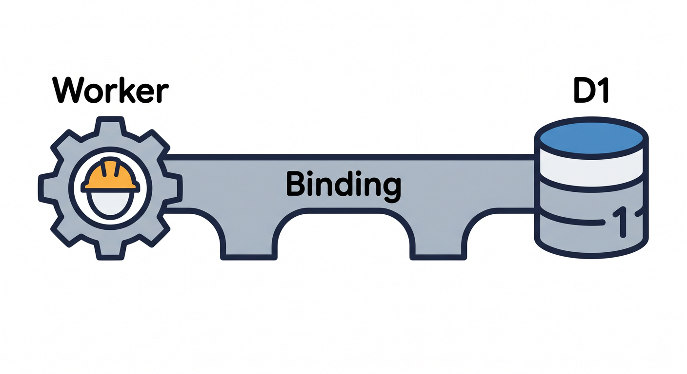
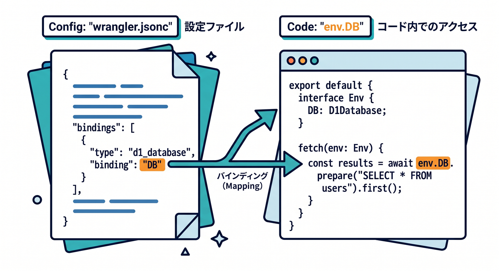
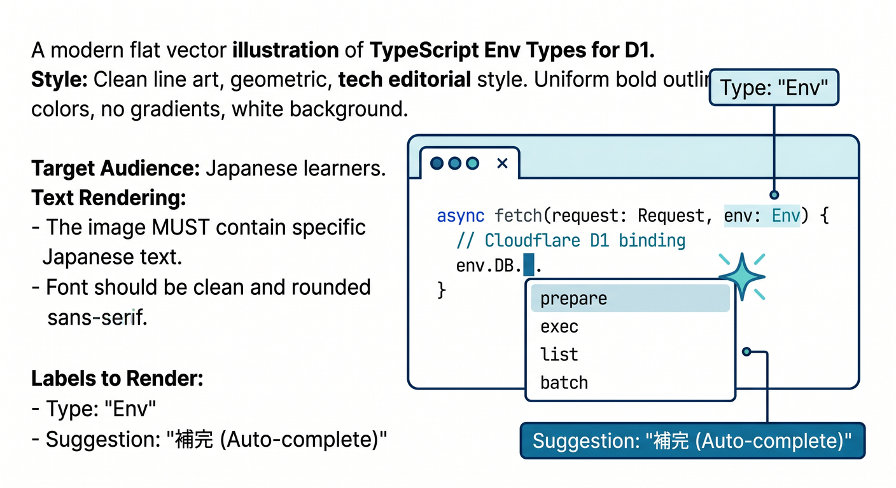
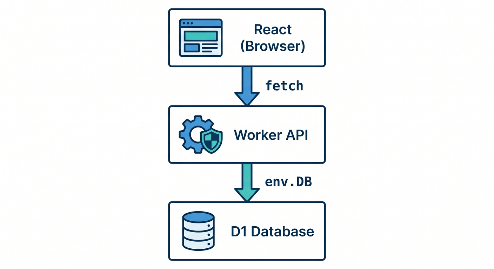

# 第03章：D1データベースを作り、WorkerにBindingしよう 🌉🛠️

D1をWorkerから使うには、D1 databaseを作り、Workerにbindingします。  
bindingは、WorkerとD1をつなぐ橋です。



この章では、Wranglerと `wrangler.jsonc` の基本を見ます 😊

---

## 1. D1 databaseを作る 🧾

WranglerでD1 databaseを作成します。


```powershell
npx wrangler d1 create study-db
```

作成すると、database名やdatabase IDが表示されます。  
この情報を `wrangler.jsonc` に設定します。

---

## 2. `wrangler.jsonc` にbindingを書く 🧾

例です。

```jsonc
{
  "d1_databases": [
    {
      "binding": "DB",
      "database_name": "study-db",
      "database_id": "<DATABASE_ID>",
    },
  ],
}
```

`binding` に書いた `DB` が、Workerの `env.DB` になります。



---

## 3. TypeScriptのEnv型を書く ✍️

```ts
export interface Env {
  DB: D1Database;
}

export default {
  async fetch(request: Request, env: Env): Promise<Response> {
    const result = await env.DB.prepare("SELECT 1 AS ok").first();
    return Response.json(result);
  },
};
```

型を書くと、補完が効きやすくなります。  
`DB` のスペルミスにも気づきやすくなります。



---

## 4. Reactから直接D1へ触らない 🔐

Reactはブラウザで動きます。  
D1へ直接触らせるのではなく、Worker APIを通します。

```text
React
  ↓ fetch
Worker
  ↓ env.DB
D1
```

この形なら、SQL injection対策、入力チェック、認証、ログをWorker側に置けます。



---

## 5. 章末チェック ✅

- `wrangler d1 create` の役割が分かる
- `d1_databases` bindingを書ける
- `env.DB` からD1を使うと分かる
- TypeScriptの `D1Database` 型を使える
- Reactから直接D1に触らないと分かる

この章で覚える一言はこれです。  
**D1はdatabaseを作り、bindingでWorkerにつないで使います 🌉**
