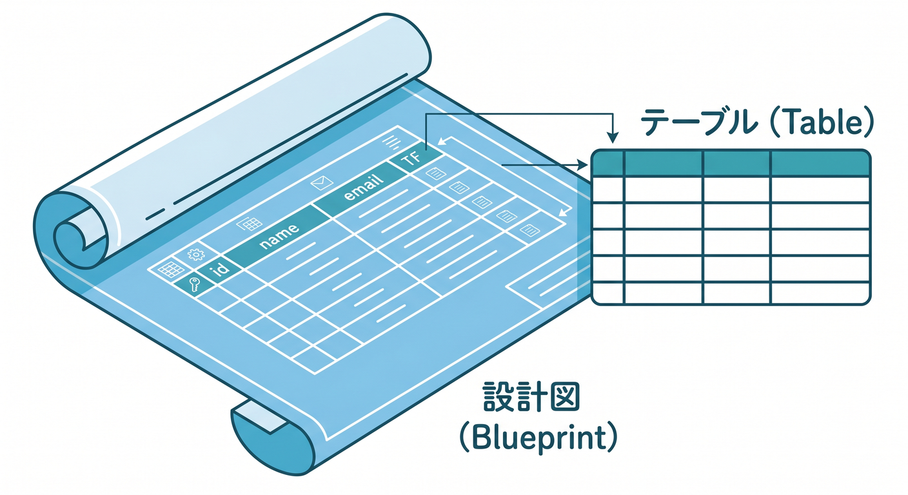
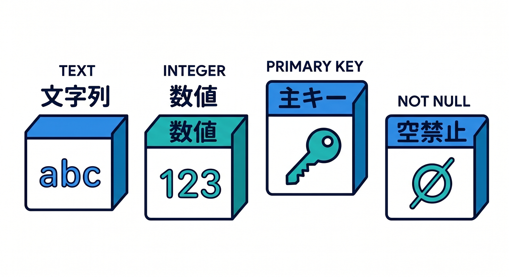
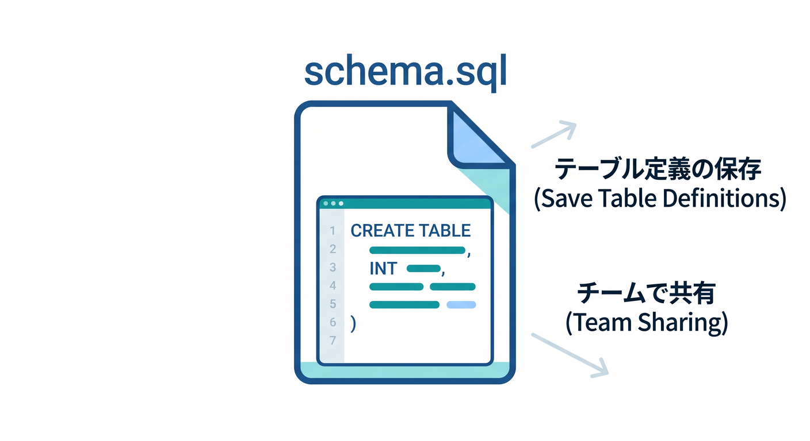
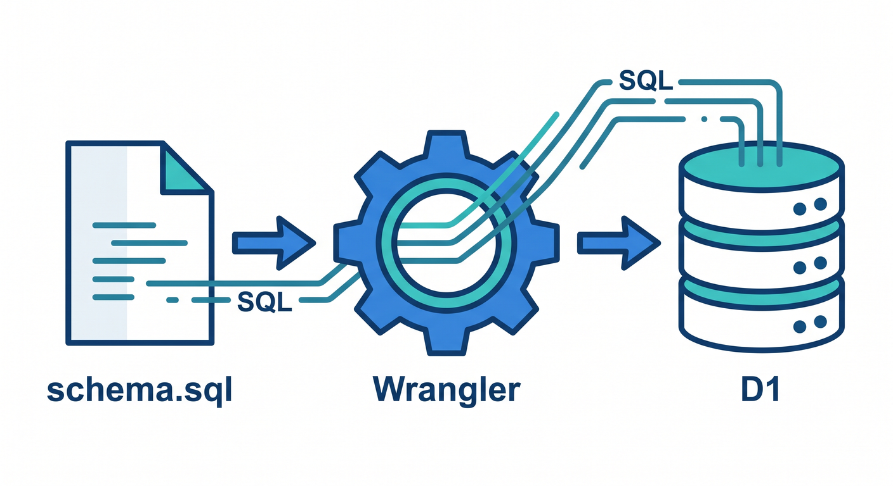

# 第04章：最初のテーブルを作ろう：CREATE TABLE 🧱📊

D1にデータを入れるには、まずテーブルを作ります。  
テーブルは、どんな列を持つかを決める設計図です。



この章では、Todoアプリ用の最小テーブルを作ります 😊

---

## 1. Todoテーブルを考える 📝

Todoに必要な項目を考えます。

- `id`: TodoのID
- `title`: Todoの内容
- `done`: 完了したか
- `created_at`: 作成日時

これをSQLでテーブルにします。


---

## 2. CREATE TABLEを書く 🧾

```sql
CREATE TABLE IF NOT EXISTS todos (
  id TEXT PRIMARY KEY,
  title TEXT NOT NULL,
  done INTEGER NOT NULL DEFAULT 0,
  created_at TEXT NOT NULL
);
```

意味です。

- `TEXT`: 文字列
- `INTEGER`: 数値
- `PRIMARY KEY`: 主キー
- `NOT NULL`: 空にしない
- `DEFAULT 0`: 指定がなければ0



---

## 3. SQLファイルに保存する 📄

たとえば `schema.sql` に保存します。

```sql
CREATE TABLE IF NOT EXISTS todos (
  id TEXT PRIMARY KEY,
  title TEXT NOT NULL,
  done INTEGER NOT NULL DEFAULT 0,
  created_at TEXT NOT NULL
);
```

SQLをファイルに残すと、あとで見返せます。  
チーム開発でも「どんなテーブルを作ったか」が分かりやすくなります。



---

## 4. Wranglerで実行する 🛠️

SQLファイルはWranglerで実行できます。

```powershell
npx wrangler d1 execute study-db --file=./schema.sql
```

remoteに対して実行する場合は `--remote` を付ける場面があります。

```powershell
npx wrangler d1 execute study-db --remote --file=./schema.sql
```

本番DBへ実行するときは、内容を必ず確認しましょう。



---

## 5. 章末チェック ✅

- テーブルはデータの形を決める設計図だと分かる
- `CREATE TABLE` を読める
- `PRIMARY KEY` や `NOT NULL` の意味が分かる
- SQLファイルとして保存できる
- WranglerでSQLファイルを実行する流れが分かる

この章で覚える一言はこれです。  
**テーブル作成は、アプリが覚えるデータの形を決める作業です 🧱**
