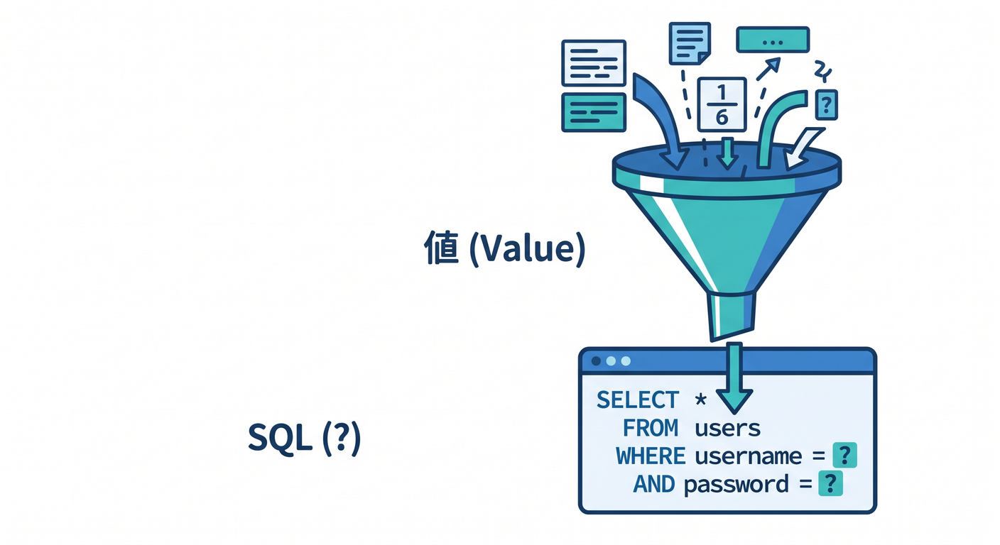
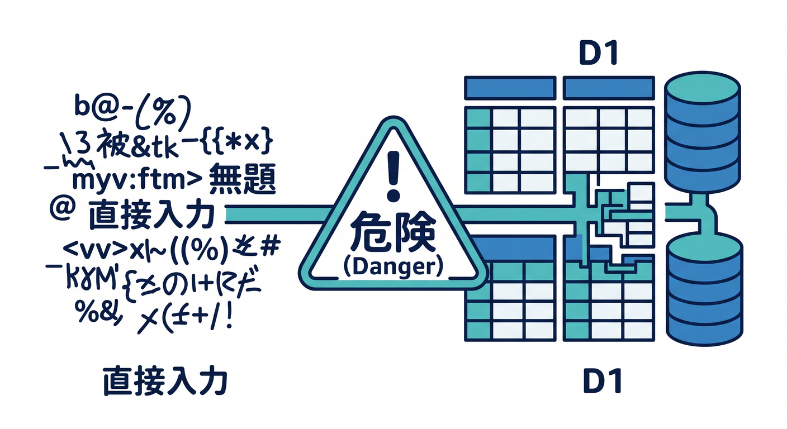

# 第05章：データを追加しよう：INSERT ✍️🧾

テーブルができたら、次はデータを追加します。  
SQLでは `INSERT` を使います。


この章では、Todoを1件追加するAPIを考えます 😊

---

## 1. INSERTの基本 ✍️

SQLは次のような形です。

```sql
INSERT INTO todos (id, title, done, created_at)
VALUES (?, ?, 0, ?);
```

`?` は、あとから安全に値を入れる場所です。  
ユーザー入力をSQL文字列に直接つなげないために使います。



---

## 2. Workerで実行する 🧑‍💻

```ts
await env.DB.prepare(
  "INSERT INTO todos (id, title, done, created_at) VALUES (?, ?, 0, ?)",
)
  .bind(id, title, new Date().toISOString())
  .run();
```

`prepare()` でSQLを用意し、`bind()` で値を渡し、`run()` で実行します。

この形はD1でとてもよく使います。


---

## 3. SQL injectionを避ける 🔐

悪い例です。

```ts
const sql = `INSERT INTO todos (title) VALUES ('${title}')`;
```

ユーザー入力をSQL文字列へ直接入れると危険です。  
SQL injectionの原因になります。



D1では、基本的に `prepare().bind()` を使いましょう。

---

## 4. 入力チェックも入れる 🧪

保存前に、titleを確認します。

```ts
if (!title || title.length > 100) {
  return new Response("Invalid title", { status: 400 });
}
```

DBに入れる前に、APIの入口で変な入力を止めることが大事です。


---

## 5. 章末チェック ✅

- `INSERT` でデータを追加できる
- `prepare().bind().run()` の流れが分かる
- SQL文字列にユーザー入力を直接入れないと分かる
- 保存前に入力チェックを入れられる
- Todoを1件追加するAPIを考えられる

この章で覚える一言はこれです。  
**D1への追加は、INSERT + prepare + bindで安全に行います ✍️🔐**
