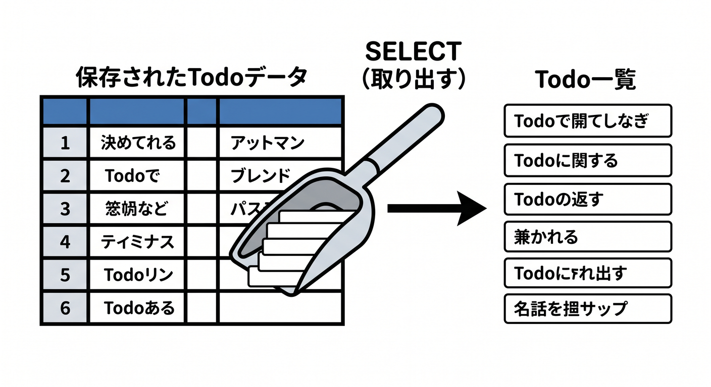
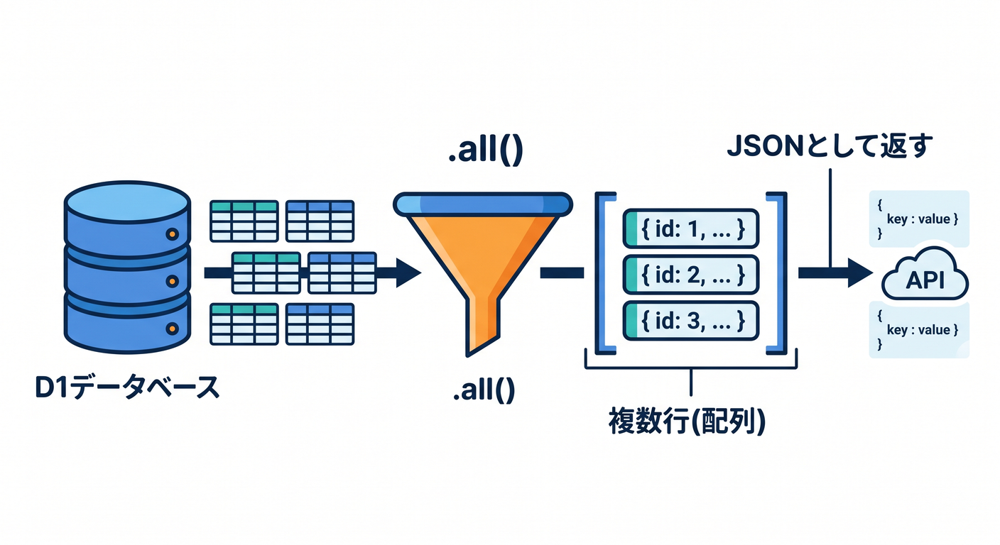
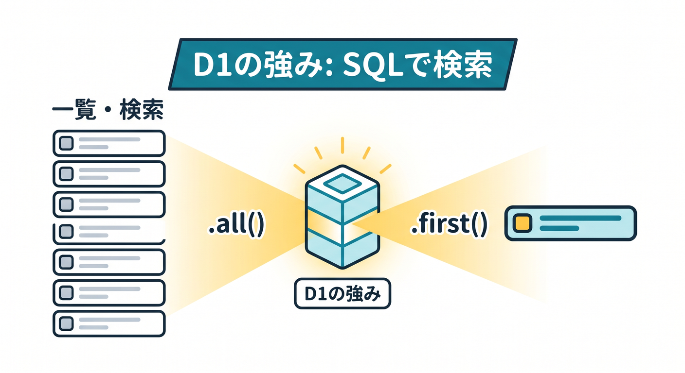

# 第06章：一覧を取得しよう：SELECT 📋👀

保存したデータは、`SELECT` で取り出します。  

Todoアプリでは、保存したTodo一覧を画面に表示したくなります。  
この章では、一覧取得と1件取得の基本を学びます 😊

---

## 1. SELECTの基本 📋

```sql
SELECT id, title, done, created_at
FROM todos
ORDER BY created_at DESC;
```

意味です。

- `SELECT`: 取り出す列
- `FROM`: どのテーブルから
- `ORDER BY`: 並び順
- `DESC`: 新しい順

一覧画面ではよく使う形です。


---

## 2. D1で複数行を取る 🧑‍💻

```ts
const result = await env.DB.prepare(
  "SELECT id, title, done, created_at FROM todos ORDER BY created_at DESC",
).all();

return Response.json(result.results);
```

`all()` は複数行を取り出すときに使います。  
APIではJSONとして返すとReactから扱いやすいです。


---

## 3. 1件だけ取る `first()` 🔎

IDで1件だけ取りたいときは `first()` が便利です。

```ts
const todo = await env.DB.prepare(
  "SELECT id, title, done, created_at FROM todos WHERE id = ?",
)
  .bind(id)
  .first();
```

見つからなければ `null` として扱います。


---

## 4. WHEREで絞る 🎯

条件を付けるには `WHERE` を使います。

```sql
SELECT * FROM todos WHERE done = 0;
```

未完了のTodoだけ取る、ユーザーIDで絞る、特定日以降だけ取る、などに使えます。


---

## 5. 章末チェック ✅

- `SELECT` でデータを取り出せる
- `ORDER BY` で並び順を指定できる
- D1の `all()` と `first()` の使い分けが分かる
- `WHERE` で条件を絞れる
- ReactへJSONで一覧を返す流れが分かる

この章で覚える一言はこれです。  
**D1の強みは、保存した表データをSQLで一覧・検索できることです 📋**

