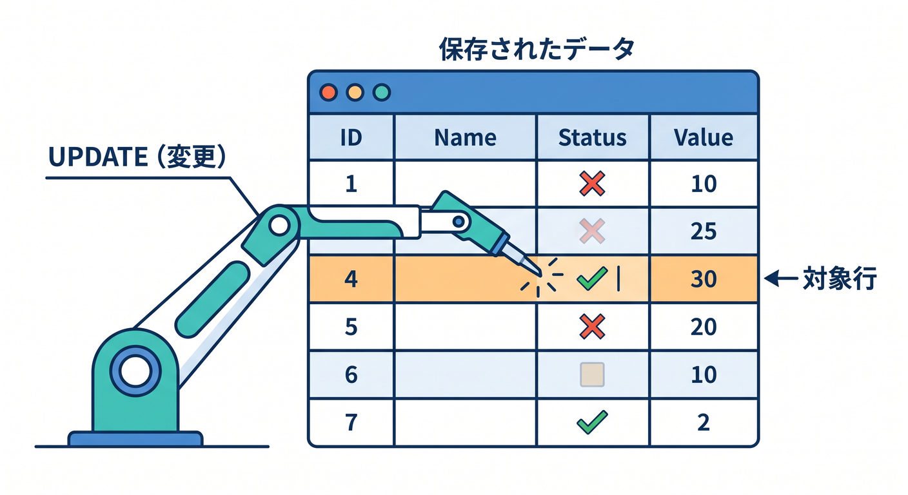
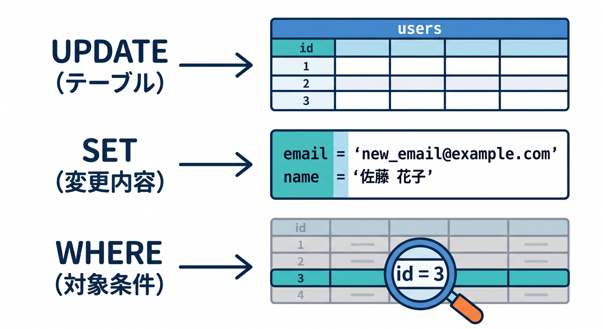
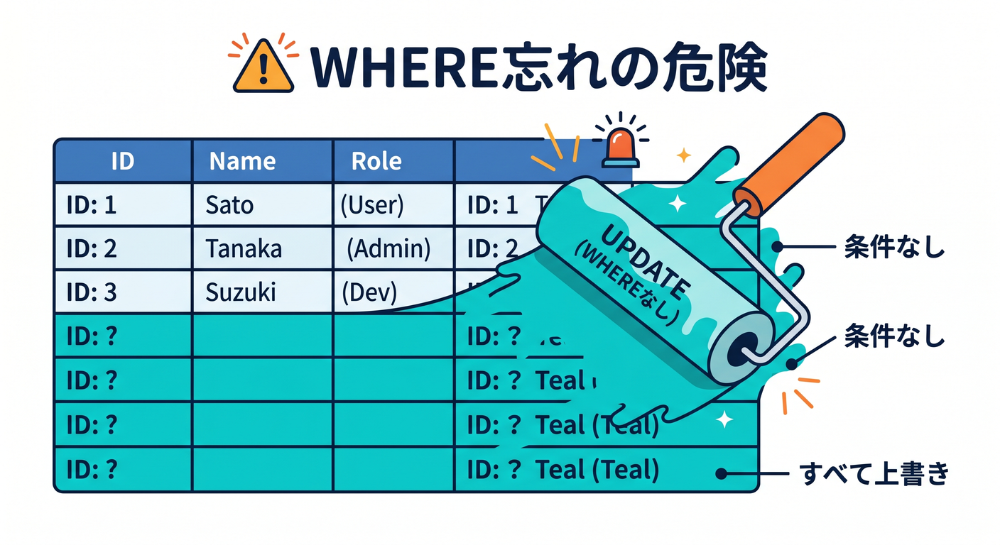
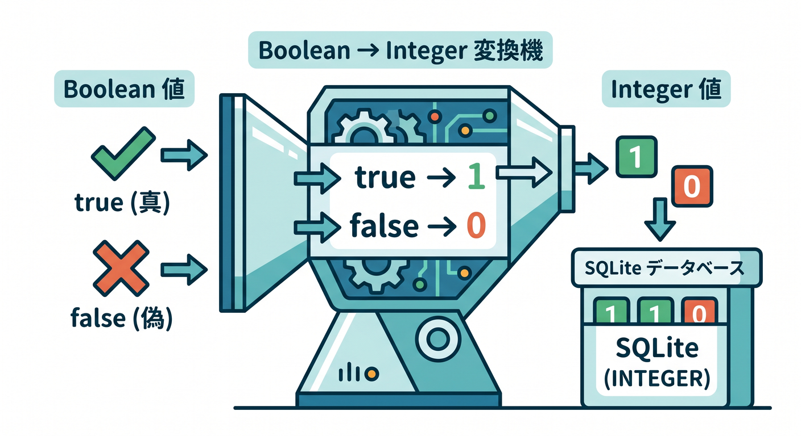
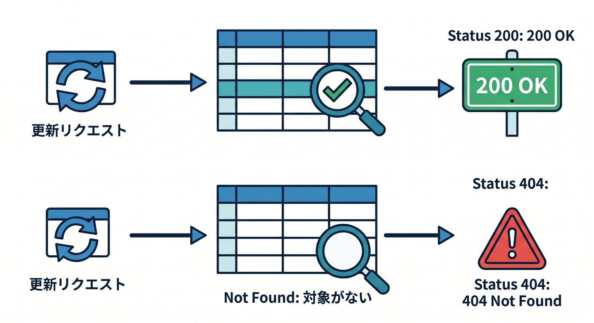
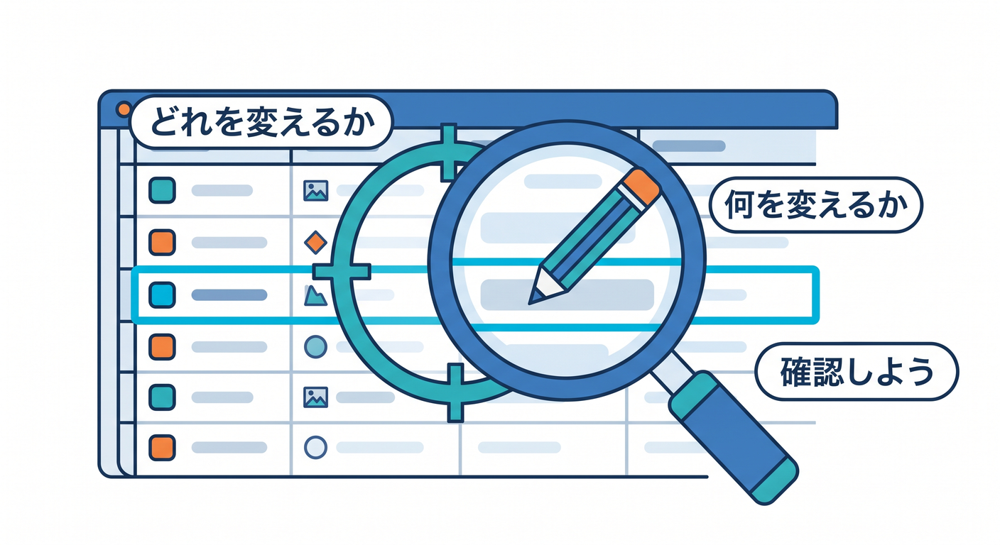

# 第07章：更新しよう：UPDATE 🔁✅

保存したデータは、あとから変更したくなります。  
Todoなら、完了状態を切り替えたり、タイトルを編集したりします。  
この章では `UPDATE` の基本を学びます 😊


---

## 1. UPDATEの基本 🔁

```sql
UPDATE todos
SET done = 1
WHERE id = ?;
```

これは、指定したIDのTodoを完了にするSQLです。

`SET` は変更内容、`WHERE` は対象条件です。


---

## 2. WHEREを忘れない ⚠️

`UPDATE` で一番怖いのは、`WHERE` を忘れることです。

```sql
UPDATE todos SET done = 1;
```

これは全Todoを完了にしてしまいます。  
本番データでは大事故になります。

更新では、必ず「どの1件を更新するのか」を意識しましょう。


---

## 3. Workerで更新する 🧑‍💻

```ts
await env.DB.prepare("UPDATE todos SET done = ? WHERE id = ?")
  .bind(done ? 1 : 0, id)
  .run();
```

booleanをD1へ入れるとき、学習用には `0` / `1` のINTEGERとして扱うと分かりやすいです。


---

## 4. 更新対象がない場合 🤔

存在しないIDを更新しても、アプリとしては分かりやすい返事をしたいです。

更新後に対象を再取得する、または結果の情報を見て判断します。

```text
対象がなければ404
更新できたら200
```

APIの返し方も設計の一部です。


---

## 5. 章末チェック ✅

- `UPDATE` でデータを変更できる
- `SET` と `WHERE` の意味が分かる
- `WHERE` なしUPDATEの危険が分かる
- Workerから安全に更新できる
- 更新対象がない場合を考えられる

この章で覚える一言はこれです。  
**UPDATEでは、何を変えるかより先に“どれを変えるか”を確認しよう 🔁⚠️**

