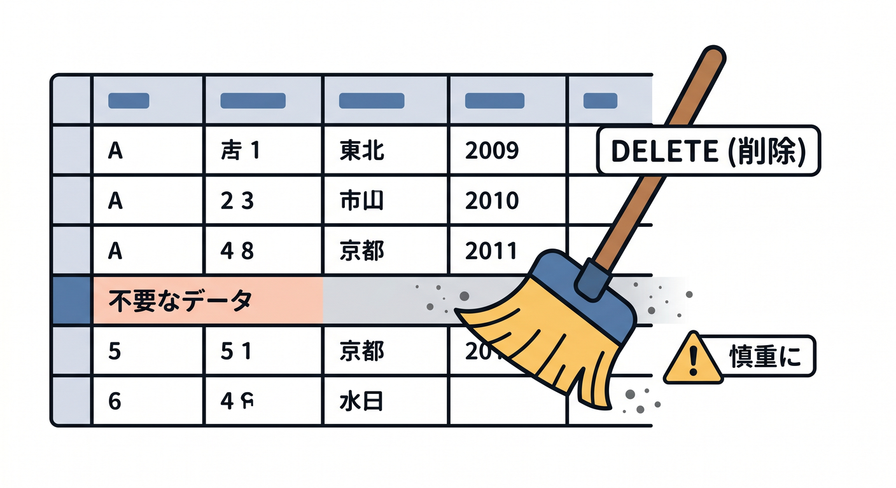
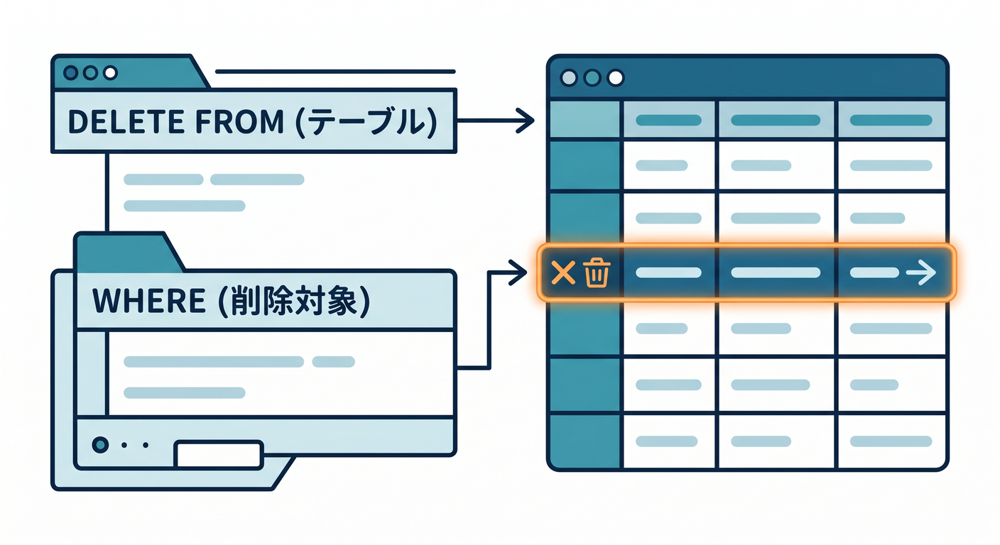
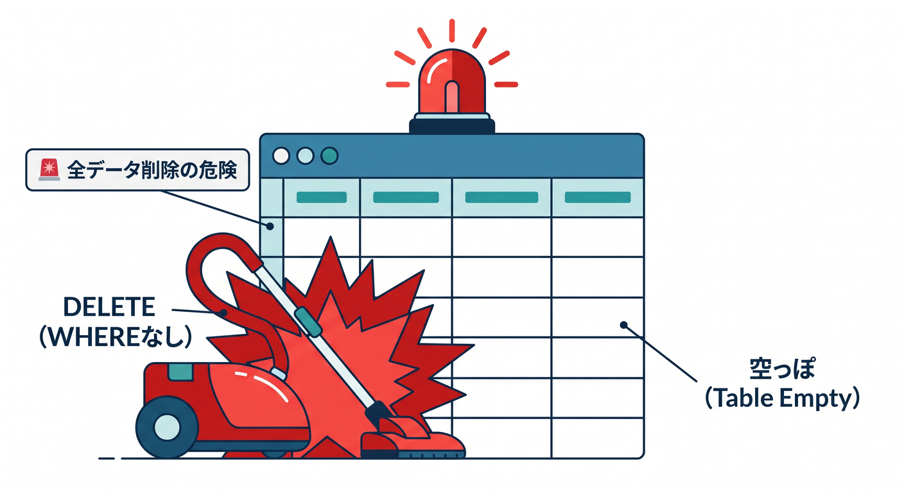
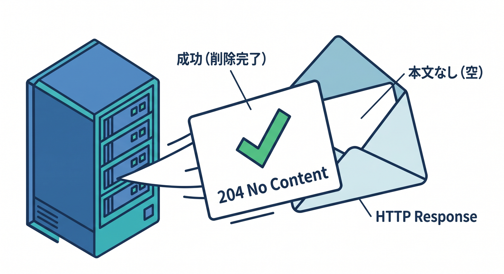
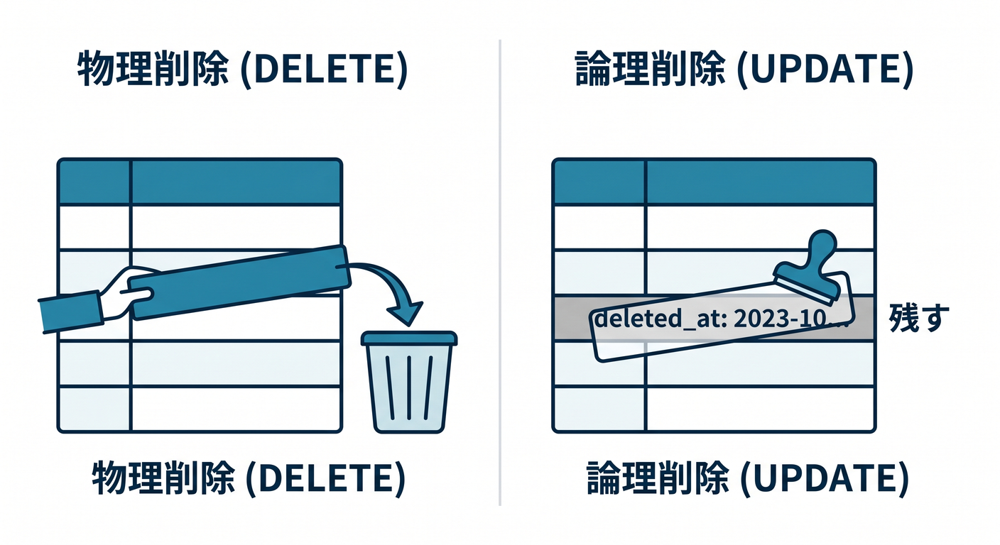
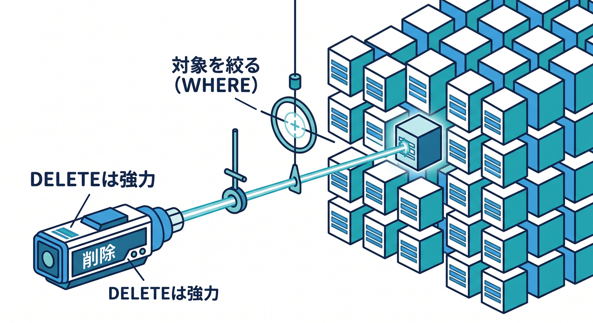

# 第08章：削除しよう：DELETE 🧹🚨

不要になったデータは `DELETE` で削除できます。  
ただし、DELETEは強力なので慎重に扱います。  
この章では、1件だけ安全に削除する基本を学びます 😊


---

## 1. DELETEの基本 🧹

```sql
DELETE FROM todos
WHERE id = ?;
```

これは、指定したIDのTodoを削除するSQLです。  
`WHERE` が削除対象を決めます。


---

## 2. WHEREなしDELETEは危険 🚨

次のSQLは危険です。

```sql
DELETE FROM todos;
```

これは `todos` テーブルの全データを削除します。  
学習中でも、本番DBでは絶対に雑に実行しないようにします。

DELETEでは、`WHERE` を確認する習慣が大事です。


---

## 3. Workerで削除する 🧑‍💻

```ts
await env.DB.prepare("DELETE FROM todos WHERE id = ?").bind(id).run();
```

削除後は、次のようなレスポンスを返せます。

```ts
return new Response(null, { status: 204 });
```

204は、処理成功で返す本文がないときに使えます。


---

## 4. 物理削除と論理削除 🧠

完全に消すことを物理削除と考えます。  
一方、`deleted_at` のような列を用意して、消した扱いにする方法もあります。

```sql
UPDATE todos SET deleted_at = ? WHERE id = ?;
```

これを論理削除と呼ぶことがあります。  
復元や履歴が必要なアプリでは検討します。


---

## 5. 章末チェック ✅

- `DELETE` でデータを削除できる
- `WHERE` なしDELETEの危険が分かる
- Workerから1件削除できる
- 204レスポンスの使い方が分かる
- 物理削除と論理削除の考え方が分かる

この章で覚える一言はこれです。  
**DELETEは強力。必ずWHEREで対象を絞ろう 🧹🚨**

