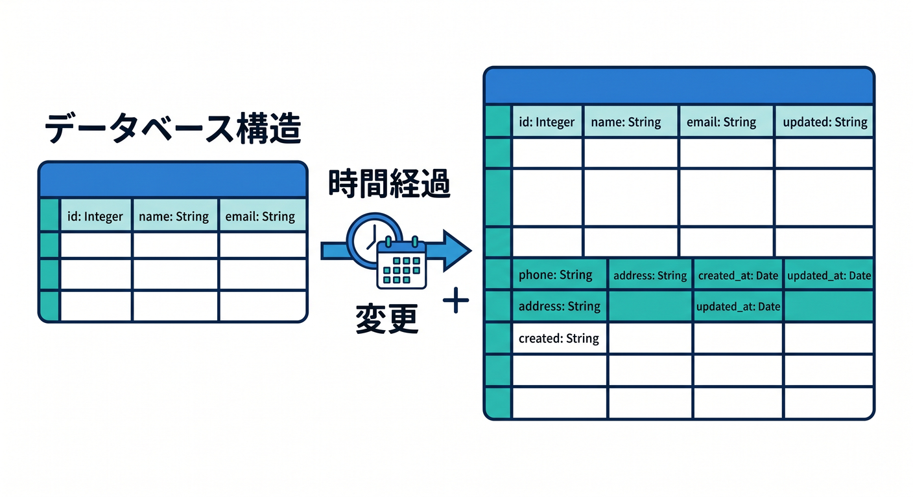
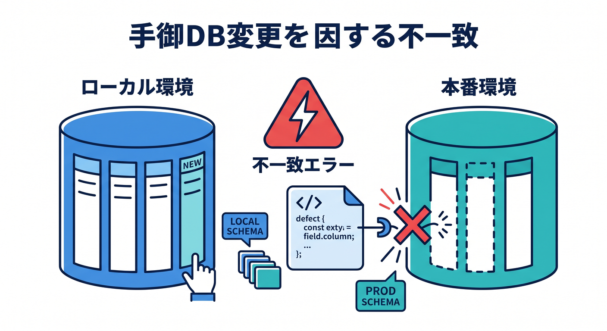
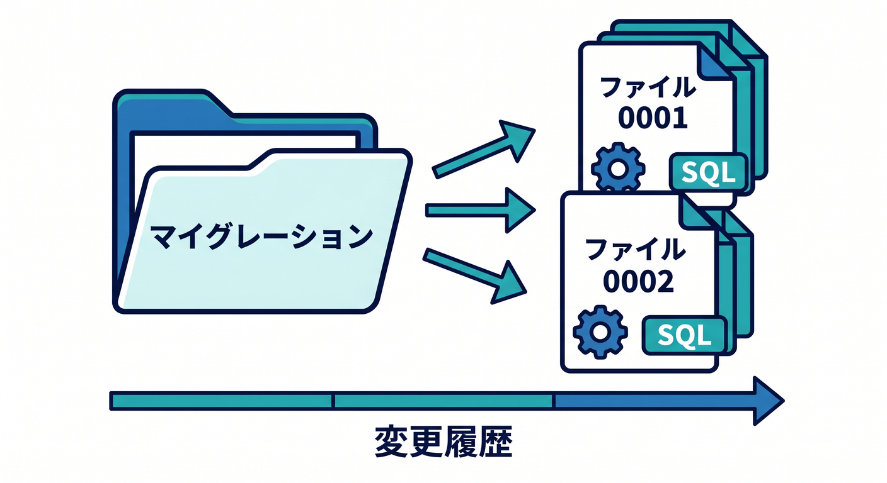
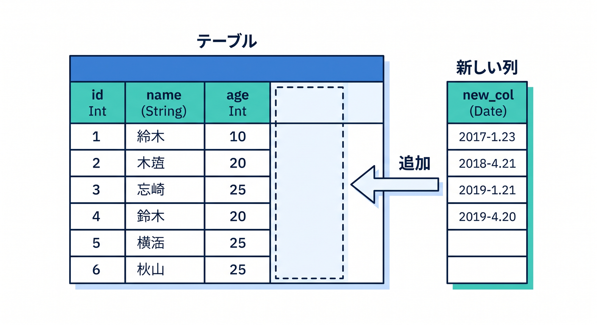
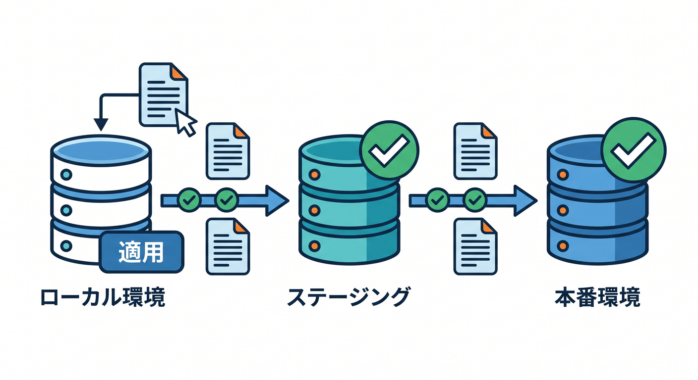

# 第09章：Migrationsでテーブル変更を管理しよう 🧭📄

アプリを作っていると、テーブル構造を変えたくなります。  

列を追加したり、indexを作ったり、新しいテーブルを増やしたりします。  
その変更を管理するのがmigrationsです 😊

---

## 1. なぜmigrationsが必要？🧠

手作業でDBだけ変更すると、あとで何をしたか分からなくなります。

たとえば、ローカルでは列があるのに、本番では列がない、という事故が起きます。


migrationsを使うと、DB構造の変更をファイルとして残せます。


```text
migrations/
  0001_create_todos.sql
  0002_add_user_id_to_todos.sql
```

---

## 2. migrationファイルの例 🧾

```sql
ALTER TABLE todos ADD COLUMN user_id TEXT;
```

このように、変更内容をSQLファイルとして保存します。

テーブル作成も、列追加も、index追加もmigrationとして管理できます。


---

## 3. WranglerのD1 migrations 🛠️

WranglerにはD1 migrations用のコマンドがあります。  
公式のWrangler D1 commandsでは、migrationの作成、一覧、適用などが案内されています。

具体的なコマンド形式はWranglerのバージョンで更新されることがあるため、実行前に公式ドキュメントを確認します。

教材では、まず「DB変更をファイルで管理する」考え方を重視します。

---

## 4. localからremoteへ順番に適用する 🌱



安全な流れです。

1. local D1でmigrationを試す
2. stagingへ適用する
3. 動作確認する
4. productionへ適用する

いきなり本番DBへ変更を入れるのは避けます。

---

## 5. 章末チェック ✅

- migrationsはDB構造変更の履歴だと分かる
- SQLファイルとして変更を残す意味が分かる
- local/staging/productionの順に適用する発想が分かる
- 手作業変更の危険が分かる
- WranglerのD1 migrationsを調べる入口が分かる

この章で覚える一言はこれです。  
**テーブル変更は、その場の手作業ではなくmigrationとして残そう 🧭**

