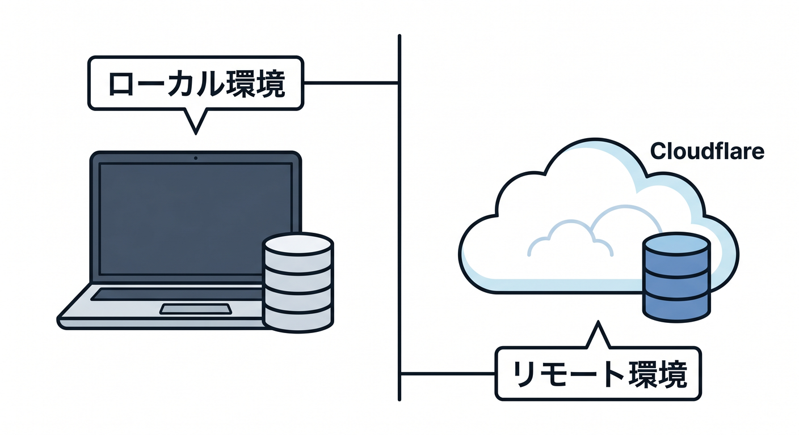
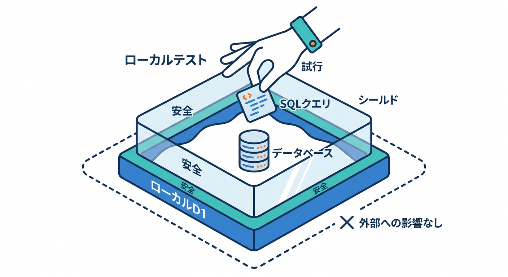
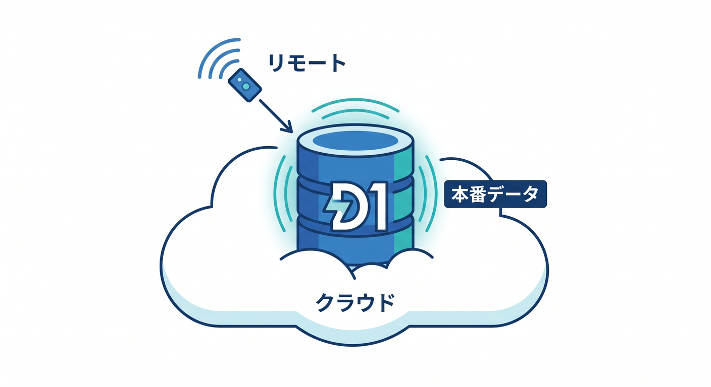
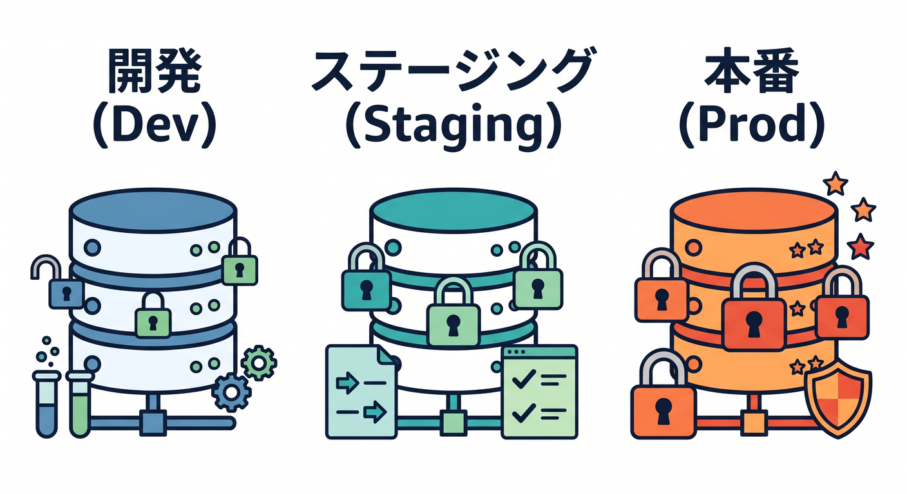
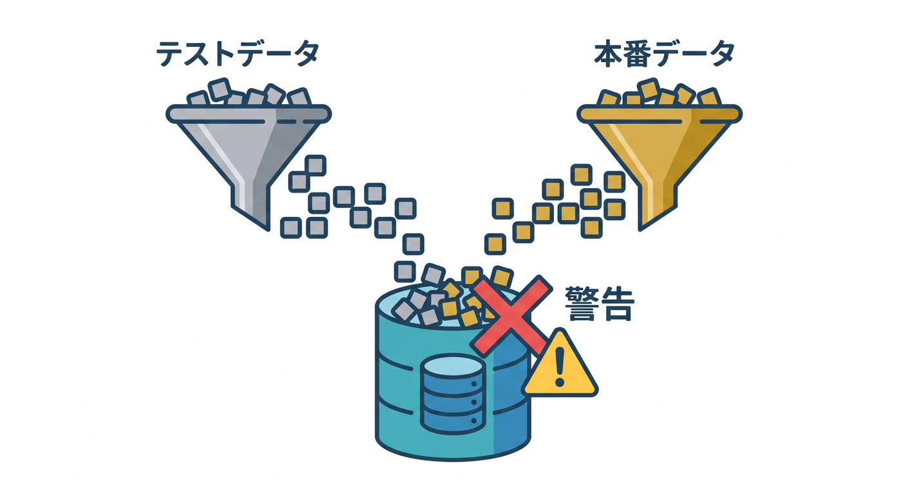
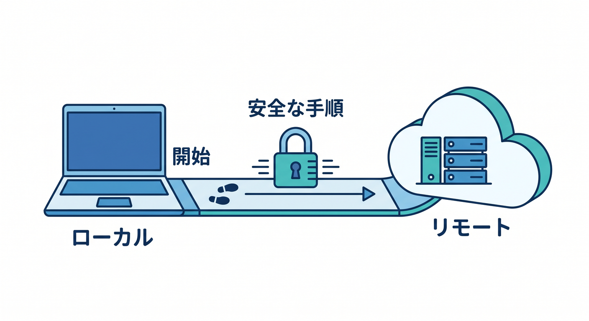

# 第10章：Local developmentとremote D1を分けよう 🧪☁️

D1を使うとき、localとremoteの違いを理解することが大切です。  
開発中に本番データを壊さないためです。  

この章では、ローカル開発とCloudflare上のD1を分けて考えます 😊

---

## 1. local D1とは 🧪

local D1は、開発中に手元で試すためのD1です。  
テーブル作成やINSERT、SELECTを安全に試せます。


本番データではないので、失敗しても被害が小さいです。

まずlocalで試し、問題なければremoteへ進むのが基本です。

---

## 2. remote D1とは ☁️

remote D1はCloudflare上にあるD1 databaseです。  
本番やstagingで使う実データが入る場所です。


`--remote` を付ける操作では、Cloudflare上のDBに対して実行することがあります。

```powershell
npx wrangler d1 execute study-db --remote --command="SELECT * FROM todos"
```

remoteへの操作は慎重に行います。

---

## 3. 本番とstagingを分ける 🌱

安全な運用では、DBを環境ごとに分けます。


```text
study-db-dev
study-db-staging
study-db-production
```

本番DBで実験しないことが大切です。  
migrationも、まずstagingで試してからproductionへ適用します。

---

## 4. テストデータと本番データを混ぜない 🔐

開発中のテストTodoやダミーユーザーを本番DBに入れると、あとで困ります。


対策です。

- localで試す
- staging DBを使う
- productionには確認済みmigrationだけ適用する
- dumpファイルをGitへ入れない

データベースはコードより取り返しにくいことがあります。

---

## 5. 章末チェック ✅

- local D1とremote D1の違いが分かる
- `--remote` の意味を慎重に扱える
- stagingとproductionを分ける発想が分かる
- 本番DBで実験しないと分かる
- migrationを段階的に適用する流れが分かる

この章で覚える一言はこれです。  
**D1では、localで試してremoteへ進む。これが安全な基本です 🧪☁️**

