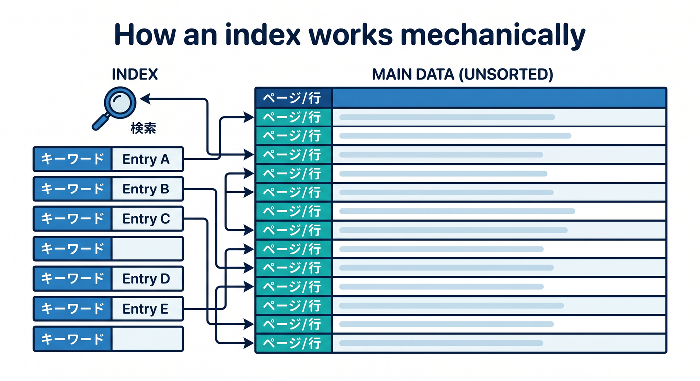
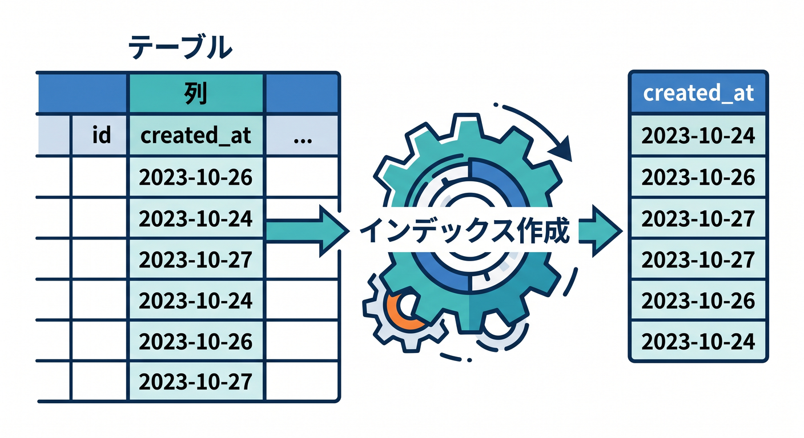
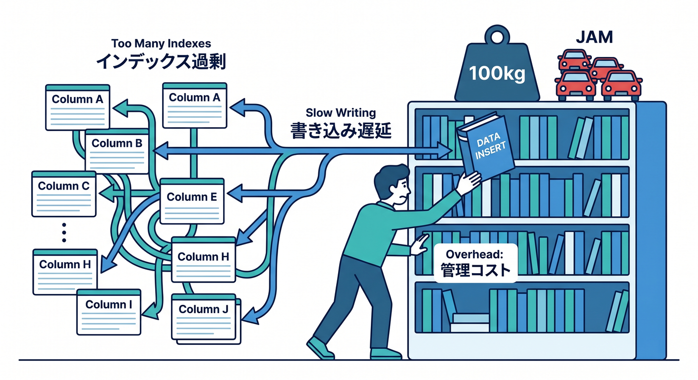
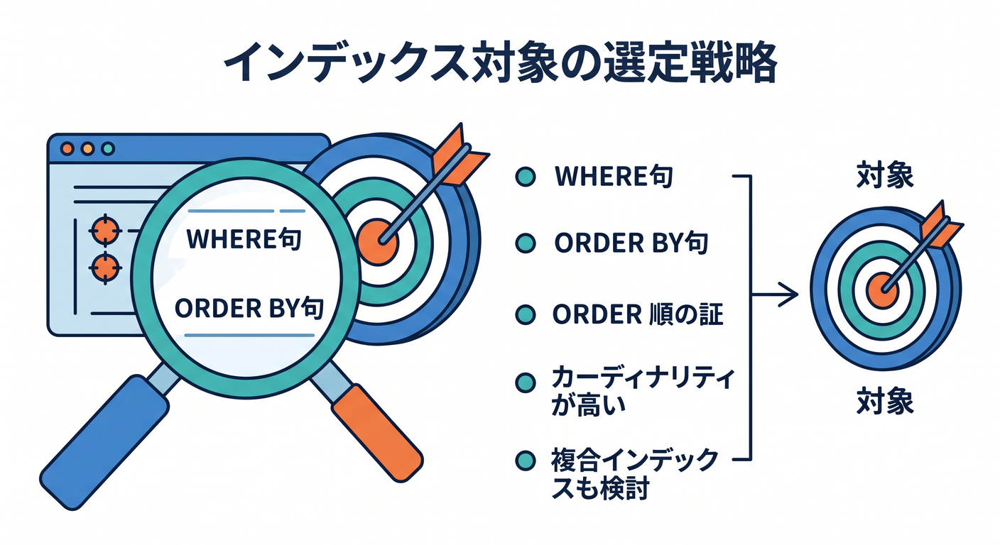
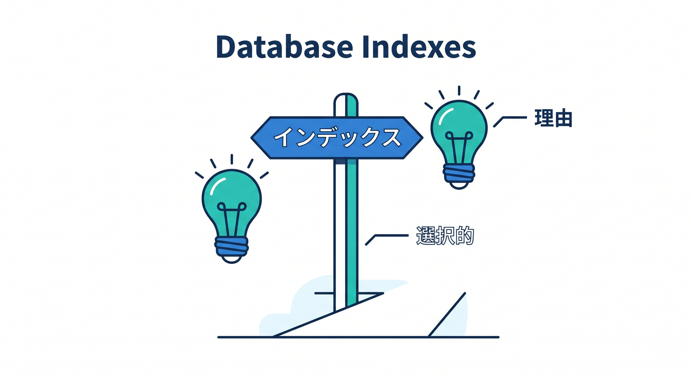

# 第11章：Indexと検索の基本を知ろう 🔎📚

データが少ないうちは、何も考えなくても検索できます。  
でもデータが増えると、検索速度を考える必要があります。  
この章では、indexを本の索引のように理解します 😊


---

## 1. indexは探しやすくする仕組み 📖

本の最後にある索引を思い出してください。  
キーワードからページを探しやすくなります。

DBのindexも似ています。  
特定の列で探しやすくするための仕組みです。


---

## 2. indexを作るSQL 🧾

作成日時で並べることが多いなら、次のようなindexを考えます。

```sql
CREATE INDEX IF NOT EXISTS idx_todos_created_at
ON todos(created_at);
```

ユーザーごとにTodoを探すなら、`user_id` にindexを作ることもあります。


```sql
CREATE INDEX IF NOT EXISTS idx_todos_user_id
ON todos(user_id);
```

---

## 3. 何でもindexにしない ⚠️

indexは便利ですが、作りすぎると書き込みや管理に影響します。  
最初から全列にindexを付ける必要はありません。


考え方です。

- よく `WHERE` で使う列
- よく `ORDER BY` で使う列
- データが増えて遅くなった場所

必要なところに絞ります。


---

## 4. D1 Best practicesで確認する 📚

Cloudflare D1のbest practicesでも、indexesについて案内されています。  
実際のアプリで遅さを感じたら、クエリとindexを一緒に見ます。

初心者のうちは、indexは「検索を助ける索引」と理解できれば十分です。

---

## 5. 章末チェック ✅

- indexは検索を助ける仕組みだと分かる
- `CREATE INDEX` の基本形が分かる
- `WHERE` や `ORDER BY` と関係すると分かる
- indexを作りすぎないと分かる
- 遅くなったクエリと一緒に考えると分かる

この章で覚える一言はこれです。  
**indexはDBの索引。よく探す列にだけ、理由を持って作ろう 🔎**

