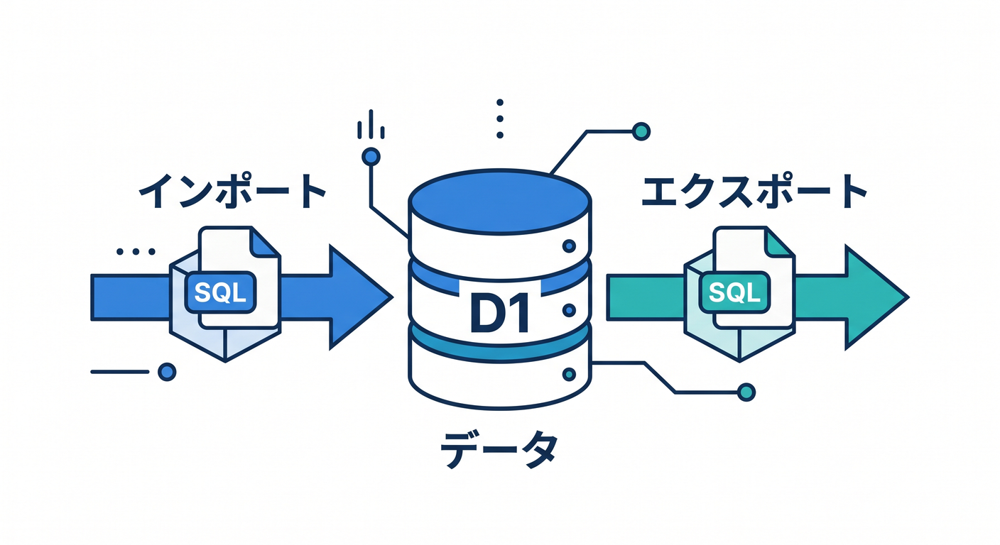
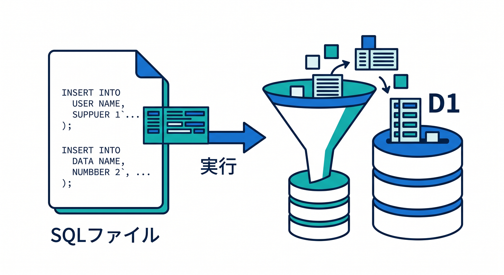
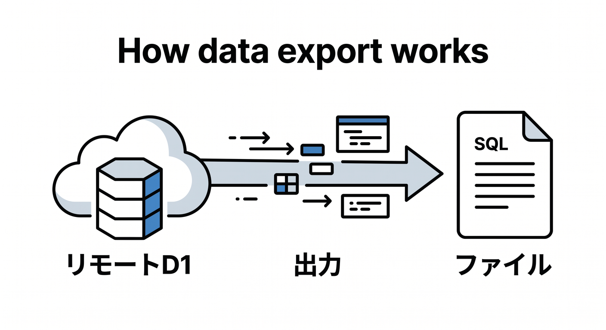
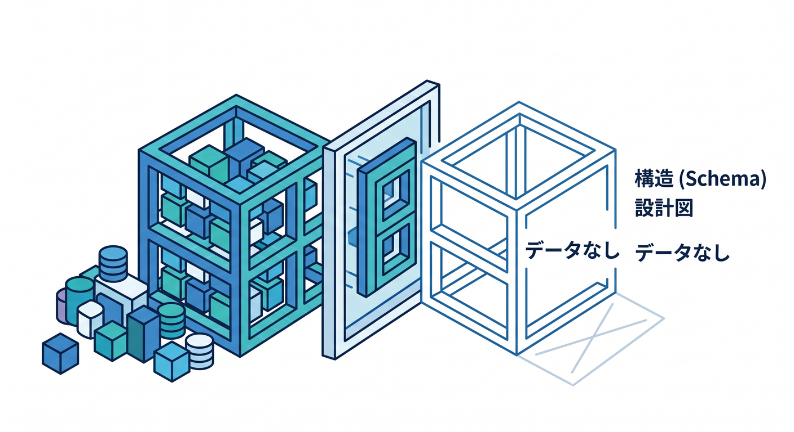
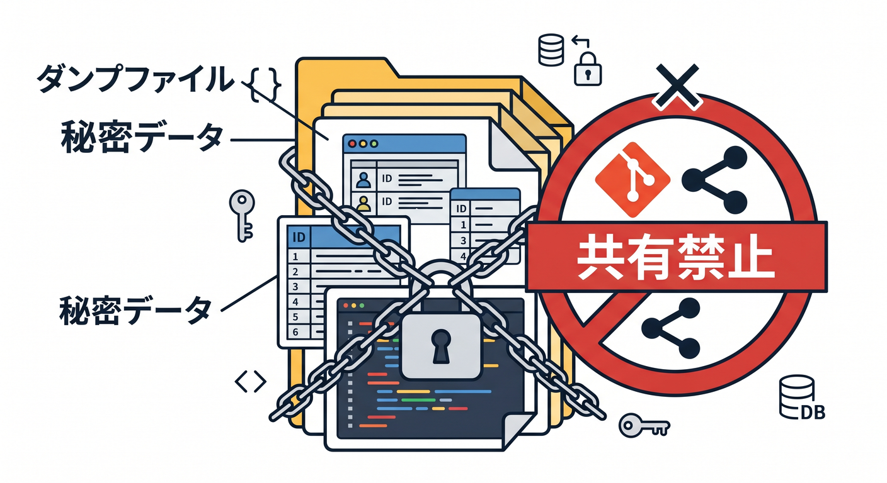
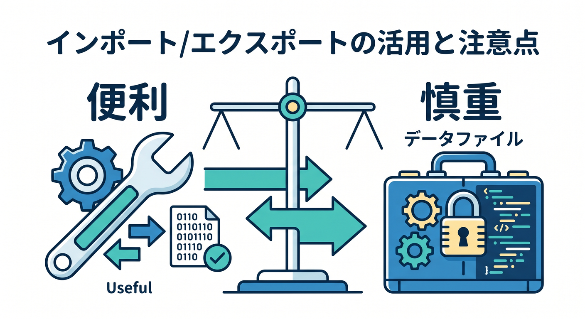

# 第12章：Import / Exportでデータを出し入れしよう 📦🧳

D1では、SQLファイルを使ってデータをimportしたり、D1の内容をexportしたりできます。  
移行、バックアップ、ローカル検証に役立ちます。  
この章では、データをファイルとして扱う基本を学びます 😊



---

## 1. Importとは 📥

Importは、SQLファイルの内容をD1へ入れることです。



たとえば、`schema.sql` や `seed.sql` を実行します。

```powershell
npx wrangler d1 execute study-db --file=./schema.sql
```

既存SQLiteのデータをD1へ移すときにも使います。

---

## 2. Exportとは 📤

Exportは、D1のschemaやdataをSQLファイルへ出すことです。



公式ドキュメントでは、次のような例が案内されています。

```powershell
npx wrangler d1 export study-db --remote --output=./database.sql
```

ローカル開発や検証用に、remote DBの内容を取り出したいときに使えます。

---

## 3. schemaだけ出す 🧾

データなしでテーブル定義だけ出すこともあります。



```powershell
npx wrangler d1 export study-db --remote --output=./schema.sql --no-data
```

schemaだけなら、構造確認や環境再現に便利です。

---

## 4. dumpファイルの扱いに注意 🔐

ExportしたSQLファイルには、個人情報や本番データが含まれることがあります。



注意点です。

- Gitに入れない
- 共有しない
- 不要になったら削除する
- 本番データは最小限に扱う

データファイルも秘密情報として扱う場面があります。

---

## 5. 章末チェック ✅

- ImportはSQLファイルをD1へ入れることだと分かる
- ExportはD1をSQLファイルへ出すことだと分かる
- schemaだけexportする考え方が分かる
- dumpファイルをGitに入れないと分かる
- 移行や検証にimport/exportを使えると分かる

この章で覚える一言はこれです。  
**D1のimport/exportは便利。でも本番データのSQLファイルは慎重に扱おう 📦🔐**


