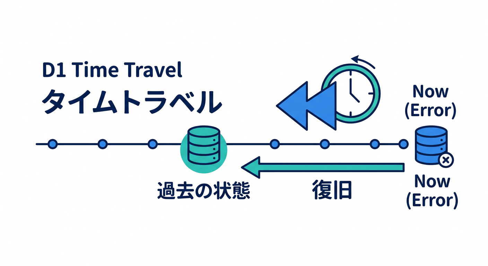
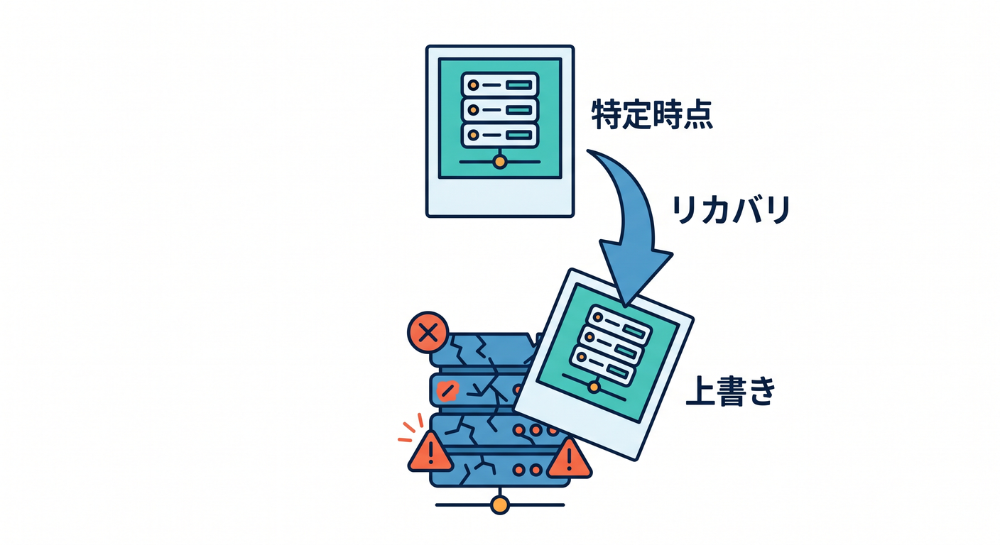
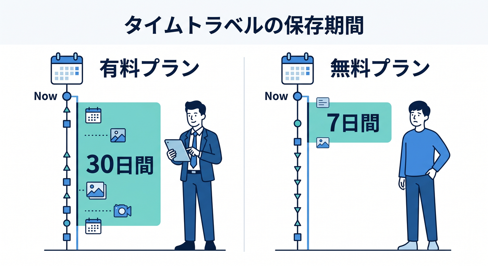

# 第13章：Time Travelとバックアップの考え方 ⏳🧯

データベースでは、間違った変更や削除が起きることがあります。  
D1にはTime Travelというpoint-in-time recoveryの仕組みがあります。  
この章では、復旧手段を知りつつ、慎重に扱う考え方を学びます 😊



---

## 1. Time Travelとは 🕰️

Time Travelは、D1の過去の状態へ戻すための仕組みです。  
公式ドキュメントでは、production backendのD1でpoint-in-time recoveryができると案内されています。

失敗したmigrationや、間違ったUPDATE/DELETEのあとに、過去の状態へ戻す考え方です。



ただし、restoreは破壊的操作です。  
気軽に本番で実行するものではありません。

---

## 2. どれくらい戻せる？📅

公式ドキュメントでは、Workers Paid planでは最大30日、Free planでは最大7日まで戻せると案内されています。



制限は変わる可能性があるため、実際に使う前には公式Limitsを確認します。

---

## 3. bookmarkを使う 🧾

Time Travelでは、bookmarkという考え方が出てきます。  
ある時点を表す目印のようなものです。


例です。

```powershell
npx wrangler d1 time-travel info study-db
```

復旧時にはtimestampやbookmarkを指定します。

---

## 4. restoreは慎重に 🚨

restoreはDBを過去の状態で上書きします。  
実行中のqueryがキャンセルされることもあります。


そのため、実行前に必ず確認します。

- 対象DBは正しいか
- stagingではなくproductionか
- いつの時点へ戻すのか
- 影響範囲を理解しているか
- 関係者へ共有したか

---

## 5. 章末チェック ✅

- Time Travelはpoint-in-time recoveryだと分かる
- 戻せる期間にプラン差があると分かる
- bookmarkの考え方が分かる
- restoreは破壊的操作で慎重に扱うと分かる
- 事故を防ぐ設計が第一だと分かる

この章で覚える一言はこれです。  
**Time Travelは最後の復旧手段。まずは事故を起こさないSQL運用をしよう ⏳🧯**


