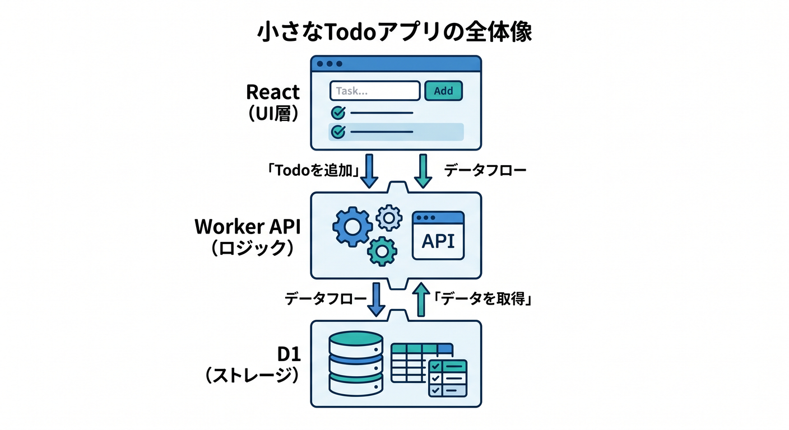
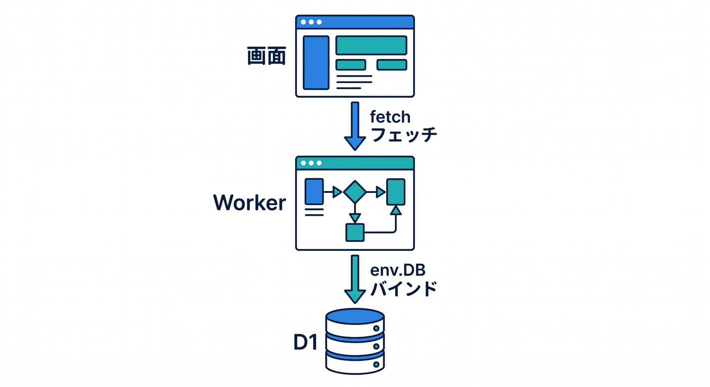
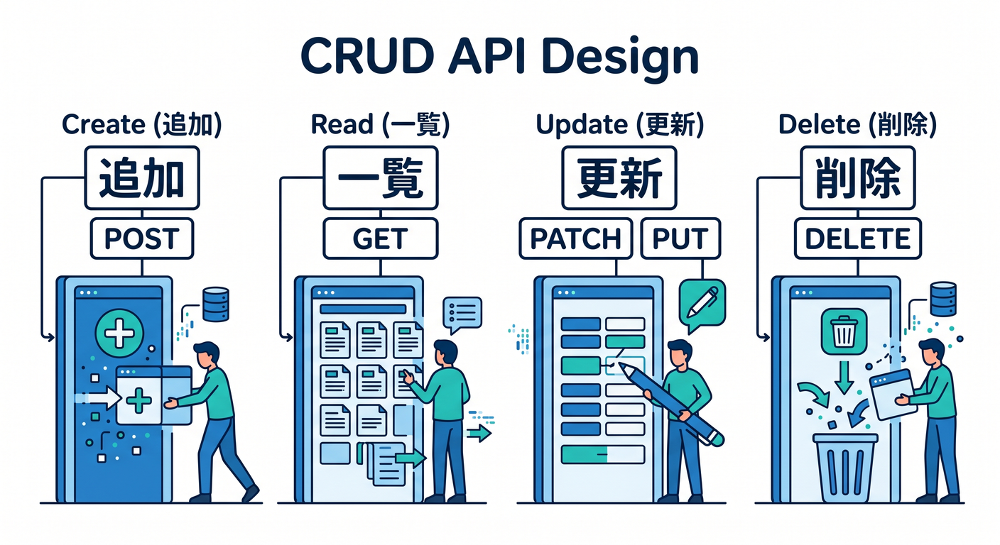
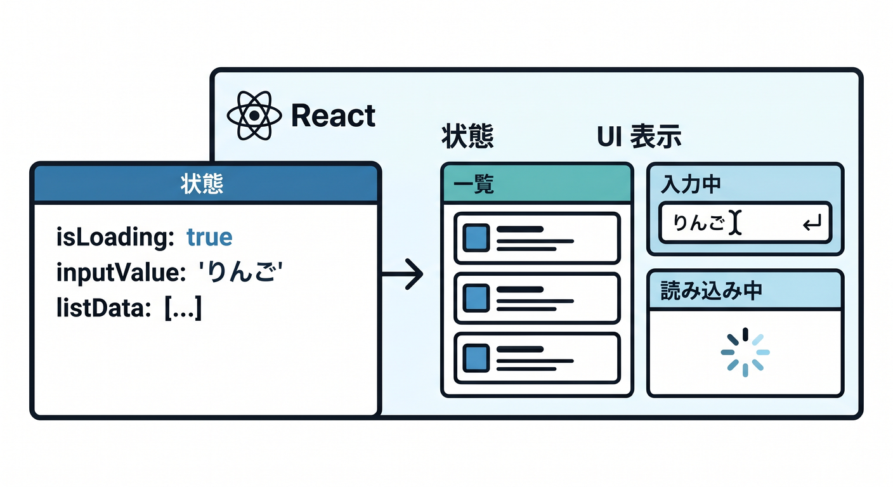
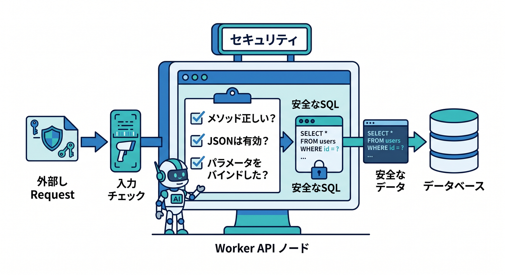
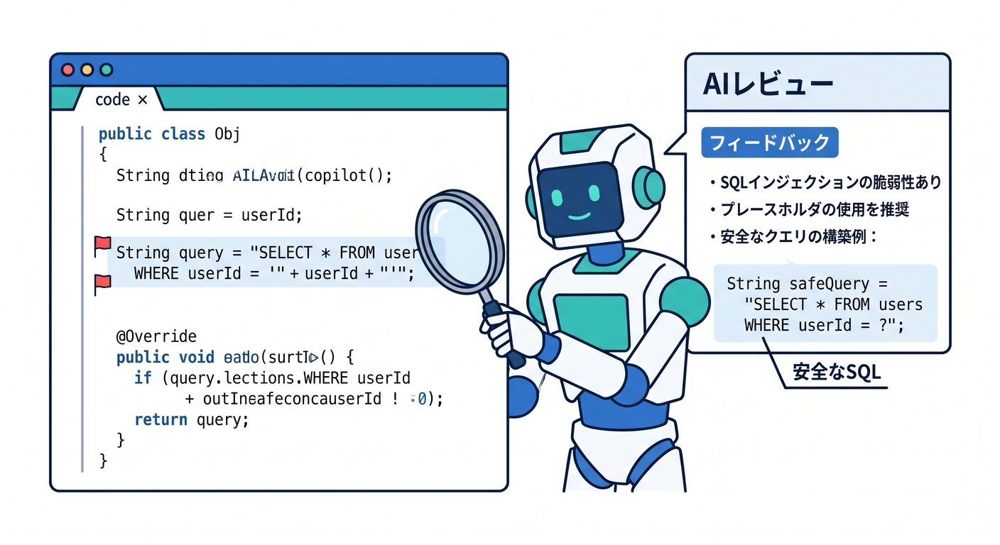
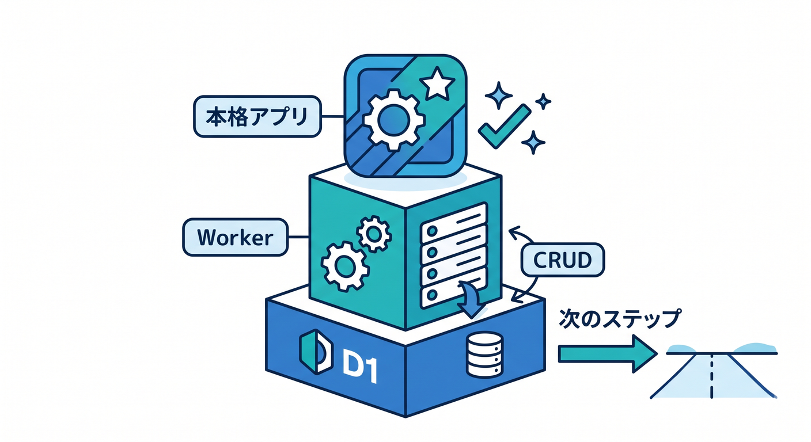

# 第14章：React + Workers API + D1で小さなTodoを作ろう ⚛️📝

ここまで学んだSQLを使って、小さなTodoアプリを設計します。  
Reactは画面、WorkerはAPI、D1は保存先です。  
この章では、CRUDが1つのアプリになる流れを見ます 😊



---

## 1. 全体構成 🧩

```text
React画面
  ↓ fetch
Workers API
  ↓ env.DB
D1 todos table
```

Reactから直接D1へ触らず、Worker APIを通します。



---

## 2. API設計 🚪

Todo用APIです。

```text
GET    /todos       一覧
POST   /todos       追加
PATCH  /todos/:id   更新
DELETE /todos/:id   削除
```

この4つで基本的なCRUDを体験できます。



---

## 3. React側の状態 ⚛️

React側では、次の状態を持ちます。

- Todo一覧
- 入力中のtitle
- 読み込み中かどうか
- エラーメッセージ

ボタンを押したらAPIへfetchし、結果を画面に反映します。



---

## 4. Worker側の注意点 🔐

Worker APIでは、次を確認します。

- メソッドが正しいか
- JSONが読めるか
- titleが長すぎないか
- SQLは `prepare().bind()` を使うか
- `UPDATE` / `DELETE` に `WHERE` があるか

小さなアプリでも、安全な癖をつけます。



---

## 5. Copilotにレビューさせる 🤖

```text
Cloudflare Workers + D1のTodo APIです。
SQL injection、WHERE漏れ、入力チェック、エラー処理の観点でレビューしてください。
```

SQLを扱うときは、Copilotにも安全観点を明示して見てもらうと有効です。



---

## 6. 章末チェック ✅

- React、Worker、D1の役割を分けられる
- Todo CRUD APIを設計できる
- Reactからfetchする流れが分かる
- Worker側で入力チェックとSQL安全性を考えられる
- D1を使った小さな本格アプリをイメージできる

この章で覚える一言はこれです。  
**D1を使うと、一覧・追加・更新・削除を持つ本格的な小アプリが作れます ⚛️🧾**


