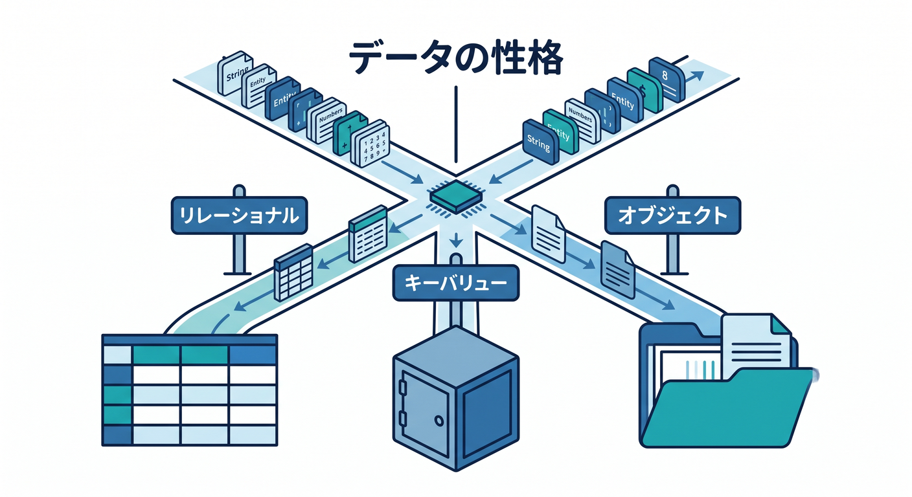
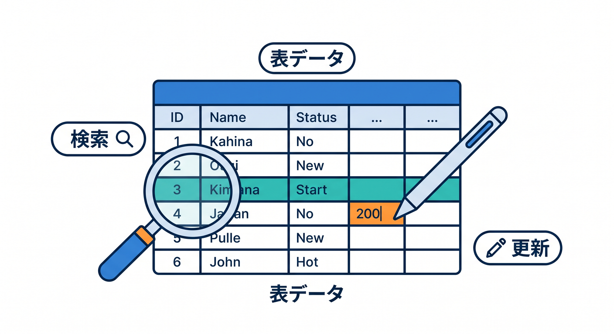
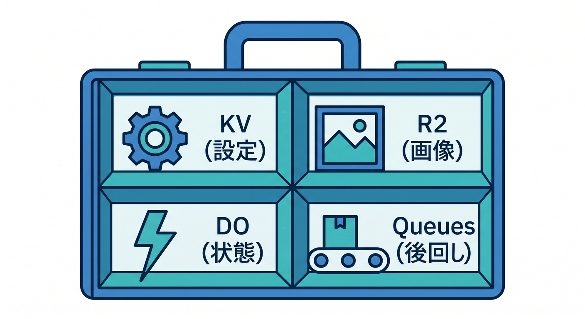
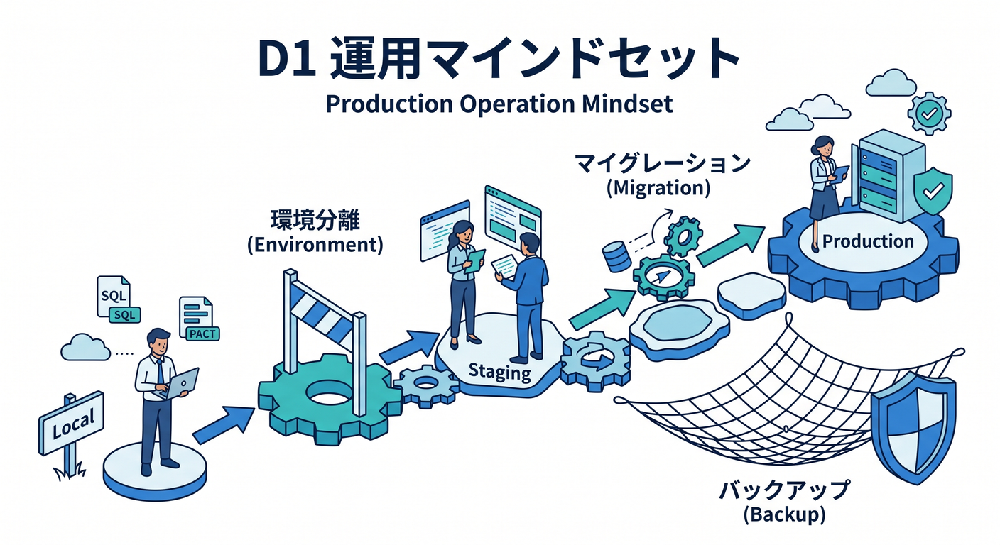
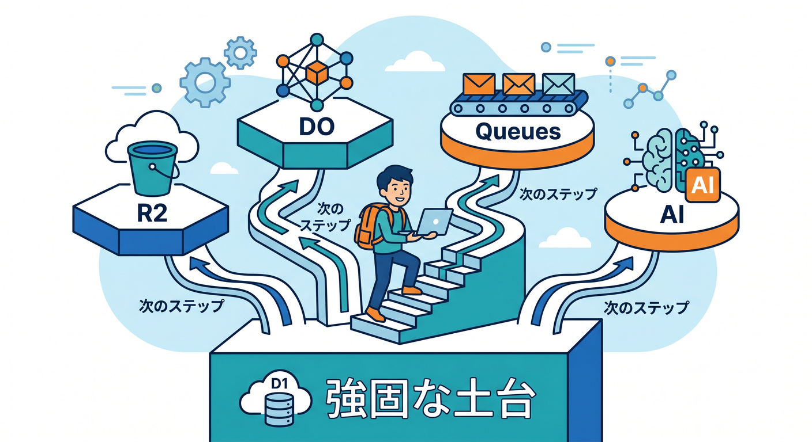
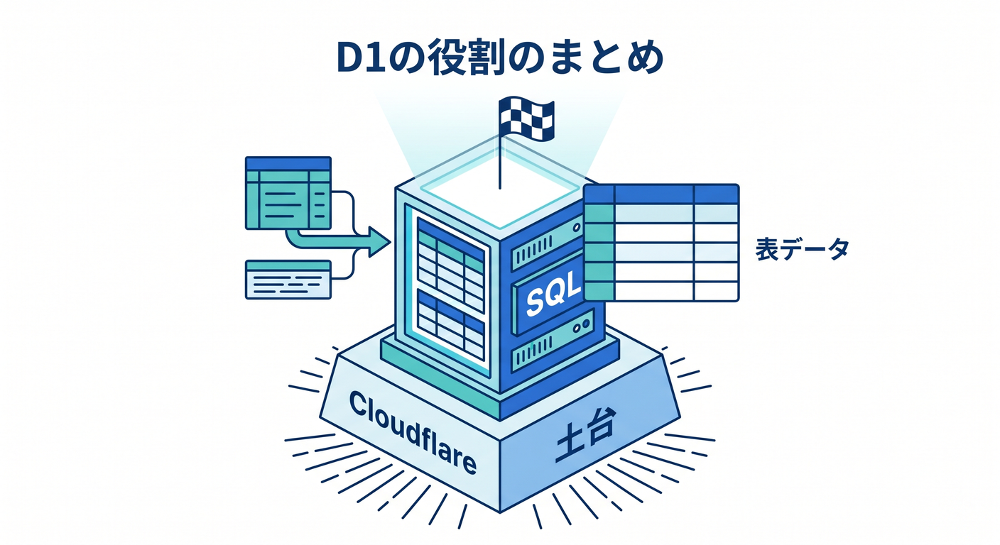

# 第15章：D1の使いどころと次の学習地図 🏁🗺️

最後に、D1をいつ使うか、いつ別の保存先を選ぶかを整理します。  
D1は便利ですが、Cloudflareの保存先はD1だけではありません。  
データの性格で選ぶことが大切です 😊

---

## 1. D1が向いているもの ✅

D1が向いているものです。

- Todo
- メモ
- 投稿
- ユーザー一覧
- 履歴
- 注文
- AI要約履歴

共通点は、表として整理でき、一覧や検索、更新が必要なことです。

---

## 2. 他の保存先を選ぶもの 🧩

D1以外が向くものです。

- 軽い設定: KV
- 画像やPDF: R2
- リアルタイム状態: Durable Objects
- 後回し処理: Queues
- 既存Postgres/MySQL: Hyperdrive

全部D1に入れようとせず、役割ごとに選びます。

---

## 3. 運用で意識すること 🧭

D1を使うなら、次を意識します。

- migrationsでschema変更を管理する
- localとremoteを分ける
- stagingで試してからproductionへ
- import/exportでデータを扱う
- Time Travelを復旧手段として知る
- dumpファイルをGitに入れない

SQLが書けるだけでなく、運用の流れも大事です。

---

## 4. 次に学ぶとよいこと 📚

D1の次は、次のテーマへ進むと自然です。

- R2で画像やファイルを扱う
- Durable Objectsで状態のあるアプリを作る
- Queuesで後処理を分ける
- Hyperdriveで既存DBへ接続する
- Workers AIの履歴をD1に保存する

D1はCloudflareアプリの“データ管理の入口”として強い土台になります。

---

## 5. 章末チェック ✅

- D1が表形式データに向くと分かる
- KV/R2/DO/Queues/Hyperdriveとの違いが分かる
- migrationsやlocal/remoteを意識できる
- Time Travelを復旧手段として知っている
- D1を選ぶ理由を説明できる

この章で覚える一言はこれです。  
**D1は、CloudflareアプリにSQLで扱える表データの土台を作ります 🏁🧾**

