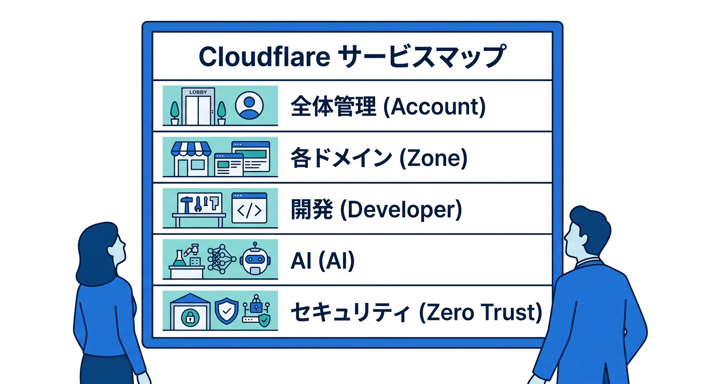
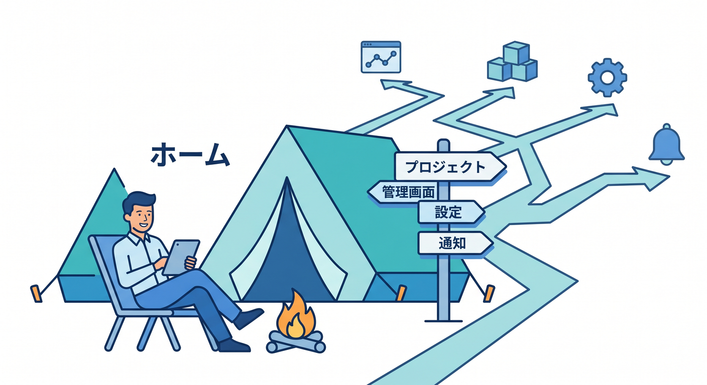
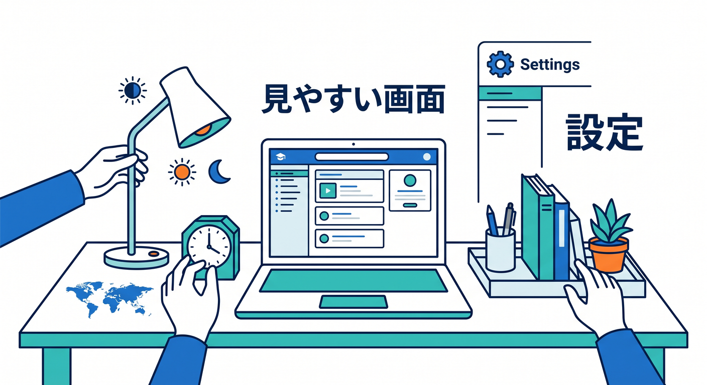
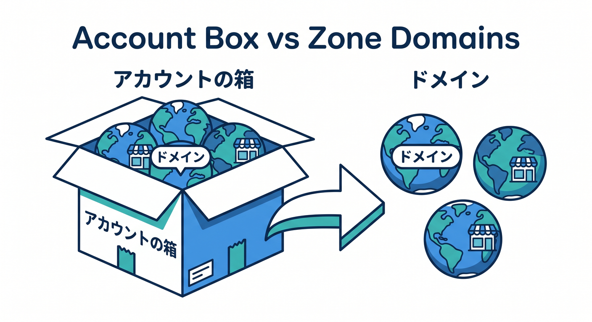
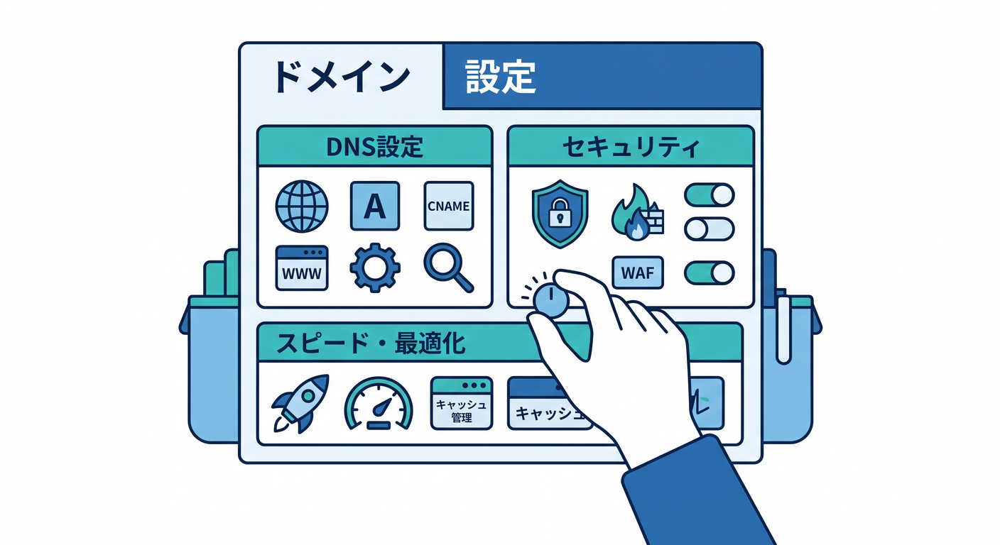
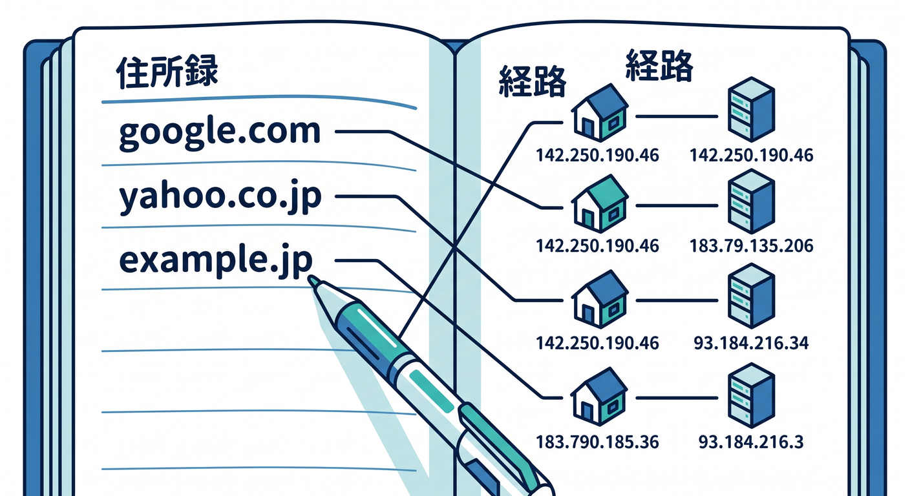
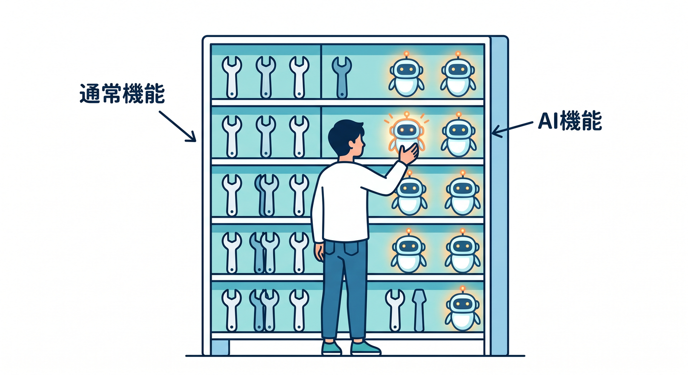

# Cloudflareの管理画面を散歩しよう 👀☁️🧭 15章構成のアウトライン

## 第01章：まずは迷子にならない地図を持とう 🗺️☁️👀

Cloudflareの管理画面は、最初に見ると「どこを触ればいいの…？」となりやすいです 😵
この章では、まず全体を「アカウントまわり」「ドメインまわり」「開発まわり」「AIまわり」「Zero Trustまわり」に分けて見ます。
細かい設定名を覚えるより先に、**管理画面は“大きな建物のフロアマップ”みたいなもの**だとつかむところから始めます。
最初の目標は、全部わかることではなく、**見ても怖くなくなること**です 🌱

## 第02章：ログインして最初に見る場所を覚えよう 🚪☁️🧭

Cloudflareでは最初の入口として **Account home** が基準になりやすく、ここから各機能へ入っていく感覚がとても大事です。
この章では、ログイン後にどこを見ればよいか、アカウント一覧・基本メニュー・最初に確認すべき場所をやさしく整理します。
「とりあえずここへ戻れば落ち着ける」というホームポジションを作ります。 ([Cloudflare Docs][3])

## 第03章：プロフィール設定で“見やすい画面”に整えよう ⚙️🌙✨

実は学習のしやすさは、見た目設定でもかなり変わります 😊
この章では、プロフィールから **言語・表示テーマ・通知・タイムゾーン** を調整して、学習向けの見やすい状態に整えます。
最初にここを整えるだけで、後の学習ストレスがぐっと減ります。
「学ぶ前に机を片づける章」みたいな位置づけです。 ([Cloudflare Docs][4])

## 第04章：AccountとZoneの違いをふんわり理解しよう 🏷️☁️🧭

Cloudflareでつまずきやすいのが、**アカウント** と **Zone（ドメイン単位）** の違いです。
この章では「アカウントは管理の箱」「Zoneはサイトやドメインの単位」という感覚を、難しい言葉を使いすぎずに整理します。
ここが分かると、なぜ設定によって場所が違うのかが急に納得しやすくなります。
以後の章の迷子防止にかなり効く土台章です 🌟

## 第05章：ドメインを追加したあと、何がどこに出るのか見てみよう 🌐🚶‍♀️✨

Cloudflareにドメインを載せると、Zone側の設定が一気に増えます。
この章では、DNS、SSL/TLS、キャッシュ、セキュリティなどが「どのまとまりで置かれているか」をざっくり見ます。
ここではまだ細かく設定しません。
**“どこにどんな系統のメニューがあるのか”を散歩する章**として進めます 🚶‍♂️✨

## 第06章：DNSまわりは“住所録”だと思って見よう 📬☁️

初心者が緊張しやすい DNS 画面を、やさしく眺める章です。
A、CNAME、TXT を厳密暗記するより先に、「どの名前をどこへ向けるかを管理する場所」として理解します。
Cloudflareの管理画面でDNSがどれくらい重要な位置にいるかも感じてもらいます。
ここは“設定を極める章”ではなく、“怖くなくする章”です ☁️

## 第07章：Workers & Pages を見て、開発系の中心地を覚えよう 🧑‍💻☁️🚪

今のCloudflareでは、アプリ開発系の入口として **Workers & Pages** がとても重要です。
この章では「静的な公開」「Worker の実行」「テンプレートからの作成」など、開発者向けの中心エリアをざっくり把握します。
ブラウザだけで試せる導線もあるので、まずは“ここが開発の玄関”だと覚えれば十分です。 ([Cloudflare Docs][5])

## 第08章：Worker詳細画面を読めるようになろう 📊🔍☁️

最近の Workers には、**Overview を起点に状態を把握しやすい画面**が用意されています。
この章では、リクエスト数、エラー、CPU time、bindings、最近のバージョンなどを「何となく読める」状態を目指します。
“いじる前に観察する” 習慣をここで作ると、後でかなり強いです。
管理画面をただ眺めるのでなく、**アプリの健康状態を見る目**を育てます 🔍 ([Cloudflare Docs][6])

## 第09章：R2をのぞいて、ファイル置き場の感覚をつかもう 🪣🖼️☁️

R2 は Cloudflare のオブジェクトストレージで、画像・PDF・アップロードファイルなどと相性がよいです。
この章では、バケット、オブジェクト、APIトークンという言葉を、管理画面ベースでやさしく整理します。
「データベースとは違う保存先なんだな」という感覚が持てれば成功です。
Cloudflare内で“ファイルを置く場所”が見えてきます。 ([Cloudflare Docs][7])

## 第10章：AIまわりの入口を散歩しよう 🤖✨

CloudflareのAI機能は近年かなり整理され、**Workers AI と AI Gateway は見つけやすくなった**のが大きいです。
この章では、AIの場所を見つけて、何が「モデル実行」なのか、何が「管理・制御」なのかをふんわり区別します。
最初はモデル名を覚えなくても大丈夫です。
まずは **AIもCloudflareの中に普通に並んでいる** と体感することが大切です。 ([Cloudflare Docs][8])

## 第11章：AI Searchまで見て、“AIアプリの地図”を作ろう 🧠🔎☁️✨

AI Search は、R2 に置いたデータ、Vectorize、Workers AI、AI Gateway などとつながる実用寄りの導線です。
この章では、管理画面から AI Search を作る流れを見ながら、「AI機能は単体ではなく、複数サービスの組み合わせで動く」ことを学びます。
ここで Cloudflare の AI 全体像が一気に立体的になります。
後の AI 学習章への橋渡しになる、とてもおいしい章です 🍰 ([Cloudflare Docs][9])

## 第12章：Zero Trustは“別館”として見よう 🏢🔐

Zero Trust 系は、通常の開発やWeb配信のメニュー感覚とは少し違い、**Cloudflare One 側の管理導線**として見ると理解しやすいです。
この章では、Access、Gateway、Tunnel、DLP などを「会社や組織の守りを扱うフロア」として紹介します。
Webサイト管理と同じ棚に無理やり入れず、**役割の違う別館**として整理します。
ここで区別できると、Cloudflare全体の見取り図がかなりスッキリします。 ([Cloudflare Docs][10])

## 第13章：権限・メンバー・APIトークンの基本を知ろう 🪪👥🔑☁️

管理画面は、ひとりで触る前提だけではありません。
この章では、アカウント権限、読み取り専用、R2管理、Zero Trust管理、Workers系の権限などを「誰が何を触れるか」という視点で整理します。
さらに API トークンも、**人の代理で動くもの**と **サービス用に長く使うもの**の違いをやさしく見ます。
運用っぽさが出てきますが、ここを知ると“本番感”が出ます 💼✨ ([Cloudflare Docs][11])

## 第14章：VS Code・Copilot・MCPと管理画面をつなげよう 🧩☁️💻✨

ここでは、管理画面だけを眺めて終わりにせず、**VS Code と Copilot を横に置いた学び方**へ進みます。
分からないメニューを見つけたら Copilot に聞く、MCP で Cloudflare Docs や Observability をつなぐ、という流れを教材に組み込みます。
「読む→探す→聞く→試す」が1本につながるので、初心者でもかなり進みやすくなります。
AIを“チート”ではなく、**管理画面を理解する相棒**として使う章です 🤝✨ ([GitHub Docs][12])

## 第15章：最後に“迷わない散歩コース”を完成させよう 🏁☁️🧭

締めくくりでは、Cloudflareダッシュボードを開いて、
「アカウント設定を見る → Zoneを見る → Workers & Pagesを見る → R2を見る → AIを見る → Zero Trustを見る」
という一連の散歩ルートを、自力で一周できる状態を目指します。
全部説明できなくても大丈夫です。
**“どこへ行けば何があるか分かる”** なら、この教材の目的は大成功です 🎉

## この15章構成のねらい 🌈

この構成は、設定をいきなり深掘りするのではなく、
**「場所を知る → 区別する → 少し読める → 開発画面とつなげる」**
という順番で不安を減らしていく作りです。

特に今回は、ただの画面紹介ではなく、

* 管理画面の全体地図 🗺️
* 開発系の中心としての Workers & Pages 🧑‍💻
* 保存先としての R2 🪣
* AI系の入口としての Workers AI / AI Gateway / AI Search 🤖
* 組織セキュリティ側としての Zero Trust 🔐
* VS Code + Copilot + MCP と組み合わせる学び方 ✨

までを、ひとつの流れでつなぐ設計にしてあります。現在の公式導線でも、Workers はブラウザから試しやすく、AI はダッシュボード上で見つけやすくなっており、Copilot と MCP も教材に組み込みやすい状態です。 ([Cloudflare Docs][5])

[1]: https://developers.cloudflare.com/fundamentals/account/find-account-and-zone-ids/ "Find account and zone IDs · Cloudflare Fundamentals docs"
[2]: https://developers.cloudflare.com/workers/vite-plugin/ "Vite plugin · Cloudflare Workers docs"
[3]: https://developers.cloudflare.com/fundamentals/user-profiles/login/?utm_source=chatgpt.com "Log in to Cloudflare"
[4]: https://developers.cloudflare.com/fundamentals/user-profiles/customize-account/ "Profile settings · Cloudflare Fundamentals docs"
[5]: https://developers.cloudflare.com/workers/get-started/dashboard/ "Get started - Dashboard · Cloudflare Workers docs"
[6]: https://developers.cloudflare.com/changelog/post/2025-10-06-new-worker-overview-page/ "New Overview Page for Cloudflare Workers · Changelog"
[7]: https://developers.cloudflare.com/r2/?utm_source=chatgpt.com "Overview · Cloudflare R2 docs"
[8]: https://developers.cloudflare.com/changelog/post/2026-02-19-ai-dashboard-experience-improvements/ "AI dashboard experience improvements · Changelog"
[9]: https://developers.cloudflare.com/ai-search/get-started/dashboard/ "Dashboard · Cloudflare AI Search docs"
[10]: https://developers.cloudflare.com/cloudflare-one/ "Overview · Cloudflare One docs"
[11]: https://developers.cloudflare.com/fundamentals/manage-members/roles/ "Account roles · Cloudflare Fundamentals docs"
[12]: https://docs.github.com/ja/copilot/how-tos/chat-with-copilot/chat-in-ide "GitHub CopilotにIDEで質問を行う - GitHubドキュメント"

