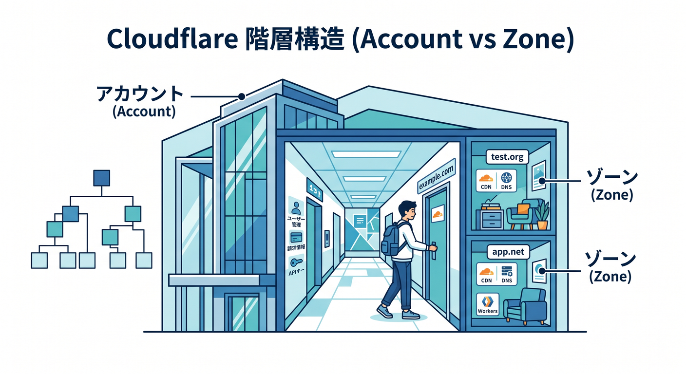
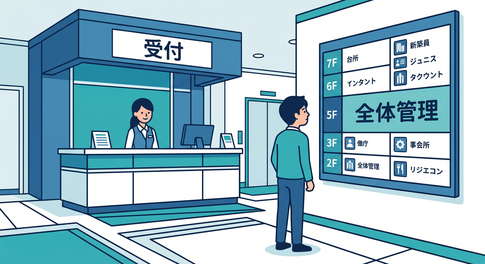
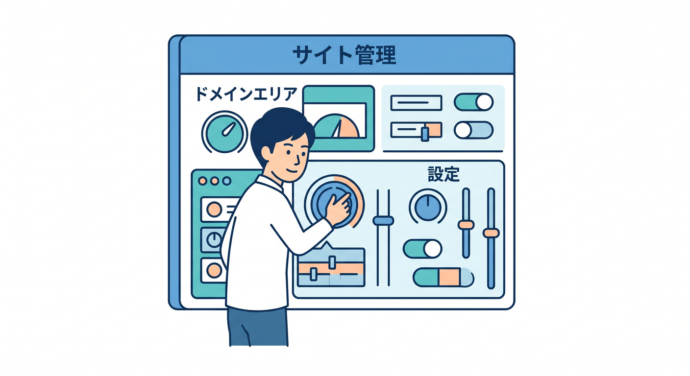
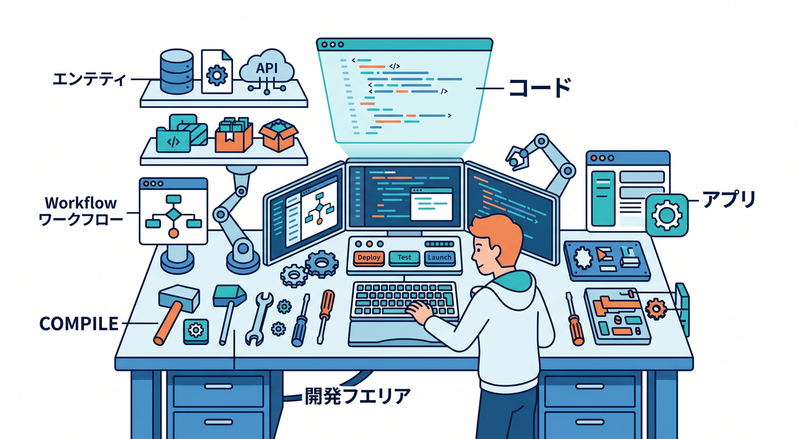
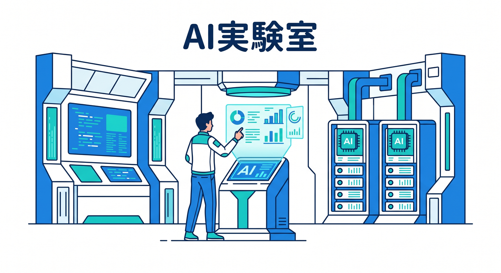
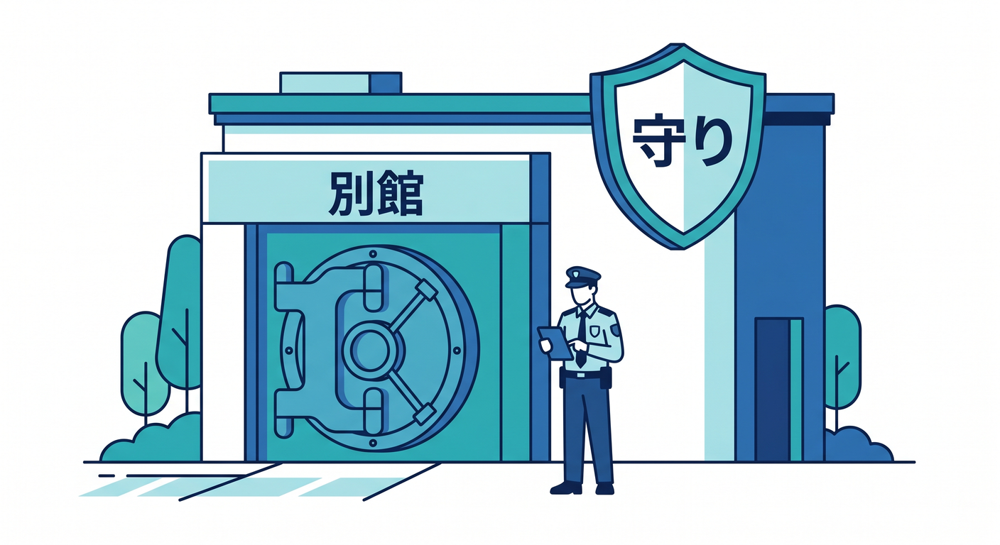
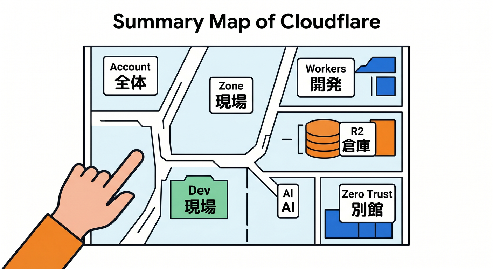

# 第01章：まずは迷子にならない地図を持とう 🗺️☁️👀

Cloudflare の管理画面って、最初に開くと「メニュー多っ！😵」「どこから見ればいいの？💦」となりやすいです。
でも安心してください 🌱 最初から全部理解する必要はありません。最初にやるべきことは、設定名を暗記することではなく、**「この画面は大きく何エリアに分かれているか」**をつかむことです。Cloudflare 公式でも、アカウントを選ぶ前はアカウント単位の製品が見え、Zone に入るとそのドメイン向けの製品が見える構造になっています。つまり、**同じ管理画面でも“今どの階層にいるか”で見えるものが変わる**のが基本です。 ([Cloudflare Docs][1])

この章のゴールはシンプルです ✨
**「Cloudflare の管理画面は、巨大なショッピングモールやオフィスビルみたいなものだ」と分かること。**
そして、次の5つをざっくり言い分けられるようになることです。
**①アカウントまわり 🏠 ②ドメインまわり 🌐 ③開発まわり 🧑‍💻 ④AIまわり 🤖 ⑤Zero Trustまわり 🔐**
この“地図感覚”ができるだけで、後の学習がかなりラクになります。 ([Cloudflare Docs][1])

---

## 1. まず覚えたい超重要ルールは「Cloudflareには階層がある」こと 🧭

Cloudflare では、ログインしてすぐの世界と、ドメインの中に入った後の世界が違います。公式ドキュメントでは、アカウントを選んだ段階では**account-level products**がサイドバーに並び、Zone に入ると**zone-related products**が並ぶと説明されています。さらに Zone レベルのサービスは、その Zone のサイト・アプリ・API にだけ効き、同じアカウント内の別 Zone には自動では効きません。 ([Cloudflare Docs][1])

ここでいう言葉を、むずかしく考えなくて大丈夫です 😊
**Account = 管理の箱 📦**
**Zone = その箱の中にある、個別のドメイン単位 🌍**
という感覚で十分です。たとえば、自分が複数のサイトを持っていたら、1つの Cloudflare アカウントの中に複数の Zone が入っているイメージです。だから「さっき見ていた設定が消えた😱」ではなく、**見ている階層が切り替わっただけ**、ということがよくあります。 ([Cloudflare Docs][1])

---

## 2. 管理画面を「5つのフロア」に分けて見ると一気にラクになる 🏢✨

## 2-1. アカウントまわり 🏠

ここは“建物の受付”みたいな場所です。
Account home からアカウント一覧や基本情報に戻れますし、公式にはここから Account ID を確認したり、Profile に進んで表示言語やダッシュボード外観を変えたりできます。Cloudflare は Profile の Settings で言語や Light / Dark / system setting を切り替えられるので、見づらいまま我慢しなくて大丈夫です。 ([Cloudflare Docs][2])

## 2-2. ドメインまわり 🌐

ここは“自分のサイトの管理フロア”です。
Cloudflare にドメインを追加すると、そのドメイン用の DNS zone が作られ、DNS Records ページにレコードが並びます。Cloudflare は既存レコードの自動スキャンもできますが、公式も「全部見つかる保証はないので確認してね」と案内しています。つまり、ここはサイト公開の土台を触る場所です。 ([Cloudflare Docs][3])

## 2-3. 開発まわり 🧑‍💻

ここは“アプリを作る工房”です。
Workers の公式ガイドでは、Cloudflare ダッシュボードの **Workers & Pages** から新しいアプリを作成します。しかも Workers AI アプリも、まずは **Workers & Pages** からテンプレートを選んで作る流れになっています。つまり、Cloudflare の開発系を学ぶときは、**まず Workers & Pages を開発の中心地として覚える**のがとても自然です。 ([Cloudflare Docs][4])

## 2-4. AIまわり 🤖

ここは“AIアプリの実験室”です。
2026年2月の Cloudflare 公式 changelog では、**AI がダッシュボードのトップレベルのセクションとして見つけやすくなった**と案内されています。Workers AI と AI Gateway の導線が改善され、AI Gateway では OpenAI 互換エンドポイントの表示や Playground の補助も強化されました。最初の印象としては、AI がもう「おまけ」ではなく、**Cloudflare の主要フロアの1つ**になっていると見てよいです。 ([Cloudflare Docs][5])

## 2-5. Zero Trustまわり 🔐

ここは“別館のセキュリティ棟”です。
Cloudflare One は Cloudflare の SASE / Zero Trust プラットフォームで、Access、Tunnel、SWG、DLP、CASB などをまとめた統合コントロールプレーンです。しかも専用ダッシュボードがあり、最近の changelog ではナビゲーション再編やダッシュボード検索の改善も行われています。普通のサイト運営と同じ棚で考えるより、**役割の違う別館**だと思うほうが初心者には分かりやすいです。 ([Cloudflare Docs][6])

---

## 3. 章1の時点では「どこで何をする場所か」だけ分かれば十分です 🙆‍♂️🌼

初心者のうちは、こんなふうに理解しておけばOKです。

**アカウントまわり**
「自分の Cloudflare 全体の入口」🏠

**Zone / ドメインまわり**
「そのサイトの交通整理と配信設定」🌐

**Workers & Pages**
「コードを動かしたり公開したりする開発エリア」🧑‍💻

**R2**
「ファイルを置く倉庫」🪣
R2 は Cloudflare のオブジェクトストレージで、非構造データを大量に保存する用途に向いています。画像、PDF、ユーザーアップロード、AI学習向けデータなど、“ファイルっぽいもの”を置く場所と見ると分かりやすいです。 ([Cloudflare Docs][7])

**Workers AI / AI Gateway / AI Search**
「AIを動かす・見守る・検索につなぐ場所」🤖
Workers AI はサーバーレスに AI モデルを実行する土台、AI Gateway は AI アプリの可視化・制御・キャッシュ・レート制限などを担う管理レイヤー、AI Search は Web サイトや非構造データから継続更新される検索インデックスを作り、自然言語で問い合わせできるサービスです。しかも AI Search は R2、Workers AI、AI Gateway などと統合される設計です。 ([Cloudflare Docs][8])

この時点で大事なのは、**全部の機能説明を言えることではなく、「あ、あの話はこのフロアだな」と思えること**です 😌✨

---

## 4. いまの Cloudflare ダッシュボードを歩くときのおすすめ順路 🚶‍♂️☁️

最初の散歩コースは、次の順で十分です。

1. **Account home を見る** 🏠
   まず“自分はいま全体管理にいるのか”を意識します。Account home は Account ID 確認や Profile への入口にもなります。 ([Cloudflare Docs][2])

2. **ドメインを1つ開く** 🌐
   Zone に入ると、以後の見え方が“そのドメイン基準”に切り替わる感覚を体験します。 ([Cloudflare Docs][1])

3. **Workers & Pages を開く** 🧑‍💻
   「開発の入口はここなんだな」と覚えます。Workers も Workers AI アプリもここから始められます。 ([Cloudflare Docs][4])

4. **R2 をのぞく** 🪣
   「これは DB ではなく、ファイル置き場なんだな」と感覚だけつかみます。 ([Cloudflare Docs][7])

5. **AI をのぞく** 🤖
   2026年2月時点で AI はトップレベル導線が強化されています。AI Gateway も始めやすくなっていて、AI Search もダッシュボードから作成できます。なお、公式 AI Search ガイドでは **Compute & AI > AI Search** と案内されているため、画面改修の時期によっては見え方が少し違うことがあります。「AI Search という名前で探す」がコツです。 ([Cloudflare Docs][5])

6. **Zero Trust は最後に“別館見学”する** 🔐
   ここは Web サイト配信の続きではなく、組織向けのアクセス制御や保護の世界です。混ぜずに切ると頭がスッキリします。 ([Cloudflare Docs][6])

---

## 5. 初心者がここで覚えなくていいもの 🙅‍♂️📚

この章では、まだ次のものは覚えなくてOKです。

* すべての DNS レコード種類
* すべてのセキュリティ設定名
* AI モデル名の一覧
* Zero Trust の細かい製品差
* API の細かい権限設計

Cloudflare は製品群が大きいので、最初に細部へ入ると迷いやすいです。公式ドキュメントを見ても、Workers、R2、AI、Cloudflare One はそれぞれ独立した大きな製品群として整理されています。だから最初は**分類だけ分かれば勝ち**です 🎉 ([Cloudflare Docs][9])

---

## 6. GitHub Copilot と AI を使った、この章らしい学び方 🤝✨

いまの学び方では、分からない単語をその場で AI に聞けるのがかなり強いです。GitHub 公式では、Copilot Chat を IDE で使って、コード説明、修正提案、単体テスト生成などができ、さらに MCP サーバー利用で外部ツールやサービスとの統合も拡張できると案内しています。Cloudflare 側も独自の MCP サーバーを公開しており、設定の読み取りや情報処理、提案、変更支援まで多サービス横断で行えると説明しています。 ([GitHub Docs][10])

この章の段階なら、Copilot にコードを書かせるより、**管理画面の言葉を通訳してもらう相棒**として使うのがおすすめです 😊
たとえば VS Code で、こんな感じで聞くと学習が進みやすいです。

* 「Cloudflare の Account と Zone の違いを初心者向けに例え話で説明して」
* 「Workers & Pages と R2 の役割の違いを3行で説明して」
* 「AI Gateway は Workers AI と何が違う？」
* 「Zero Trust は Web サイト運営のどの部分とは別物？」

こういう聞き方なら、管理画面を眺めながら理解を補強できます。GitHub Copilot 側でも IDE チャット、スラッシュコマンド、参照ファイル、MCP の利用などが案内されているので、**“画面を見て疑問を持つ → AI にたずねる → また画面に戻る”**の往復がかなりやりやすい時代です。 ([GitHub Docs][10])

---

## 7. この章のミニ実践ワーク 📝☁️

次の3つだけやってみてください。
時間は 5〜10分くらいでOKです ⏰

**ワーク1**
Cloudflare にログインして、**いま自分が Account レベルにいるのか、Zone レベルにいるのか**を言葉にしてみる。
見分けポイントは、アカウント単位の製品が並んでいるか、ドメイン単位の製品が並んでいるかです。 ([Cloudflare Docs][1])

**ワーク2**
サイドバーを見て、項目を5分類してみる。
「これはアカウント」「これはサイト」「これは開発」「これはAI」「これはZero Trustっぽい」とざっくり仕分けできれば成功です。公式の製品構造ともズレにくい分類です。 ([Cloudflare Docs][4])

**ワーク3**
AI の場所を見つけてみる。
2026年2月時点では AI の導線改善が入っているので、以前より見つけやすくなっています。もし AI Search の場所で迷ったら、公式どおり **AI Search** の名前で探すつもりで見ればOKです。 ([Cloudflare Docs][5])

---

## 8. この章のまとめ 🌈

この章でいちばん大事なのは、
**Cloudflare の管理画面は「1枚の画面」ではなく、「階層と役割で分かれた地図」だと知ること**です。 ([Cloudflare Docs][1])

覚え方はこれで十分です ✨

* **Account** は全体の入口 🏠
* **Zone** は各ドメインの現場 🌐
* **Workers & Pages** は開発の中心 🧑‍💻
* **R2** はファイル置き場 🪣
* **AI** はモデル実行・管理・検索のエリア 🤖
* **Zero Trust** は組織セキュリティの別館 🔐

これが頭に入れば、Cloudflare ダッシュボードを開いたときの怖さはかなり減ります。
次の章からは、この地図を持った状態で、少しずつ「どこに何があるか」を散歩していけば大丈夫です 🚶‍♂️☁️🌟

---

## 理解チェック ✅

1. Account と Zone の違いを、自分の言葉で言えますか？ ([Cloudflare Docs][1])
2. Workers & Pages は何の中心地でしたか？ ([Cloudflare Docs][4])
3. R2 はデータベースというより、何として考えると分かりやすいですか？ ([Cloudflare Docs][7])
4. AI Gateway と Workers AI と AI Search は、ざっくりどう役割が違いますか？ ([Cloudflare Docs][8])
5. Zero Trust はなぜ“別館”と考えると理解しやすいですか？ ([Cloudflare Docs][6])

次はこのまま、第2章用に「ログインして最初に見る場所を覚えよう 🚪」の詳細版も同じ調子で作れます。

[1]: https://developers.cloudflare.com/fundamentals/concepts/accounts-and-zones/ "Accounts, zones, and profiles · Cloudflare Fundamentals docs"
[2]: https://developers.cloudflare.com/fundamentals/account/find-account-and-zone-ids/ "Find account and zone IDs · Cloudflare Fundamentals docs"
[3]: https://developers.cloudflare.com/fundamentals/manage-domains/add-site/ "Onboard a domain · Cloudflare Fundamentals docs"
[4]: https://developers.cloudflare.com/workers/get-started/dashboard/ "Get started - Dashboard · Cloudflare Workers docs"
[5]: https://developers.cloudflare.com/changelog/post/2026-02-19-ai-dashboard-experience-improvements/ "AI dashboard experience improvements · Changelog"
[6]: https://developers.cloudflare.com/cloudflare-one/ "Overview · Cloudflare One docs"
[7]: https://developers.cloudflare.com/r2/ "Overview · Cloudflare R2 docs"
[8]: https://developers.cloudflare.com/workers-ai/?utm_source=chatgpt.com "Overview · Cloudflare Workers AI docs"
[9]: https://developers.cloudflare.com/?utm_source=chatgpt.com "Cloudflare Docs: Welcome to Cloudflare"
[10]: https://docs.github.com/ja/copilot/how-tos/chat-with-copilot/chat-in-ide "GitHub CopilotにIDEで質問を行う - GitHubドキュメント"

