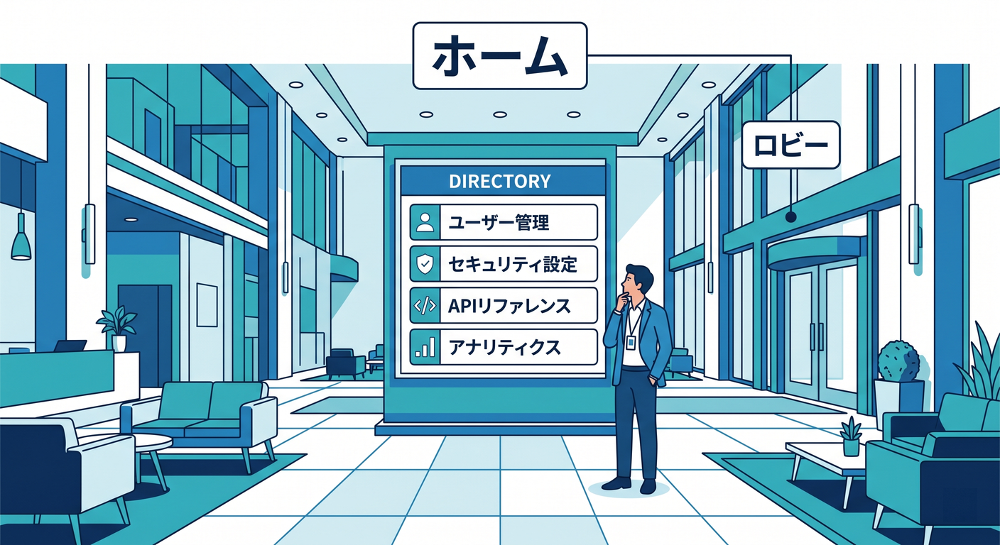
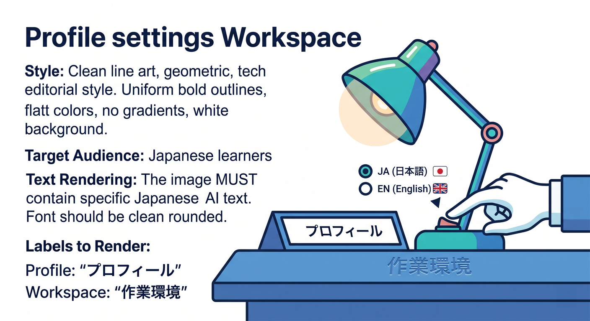
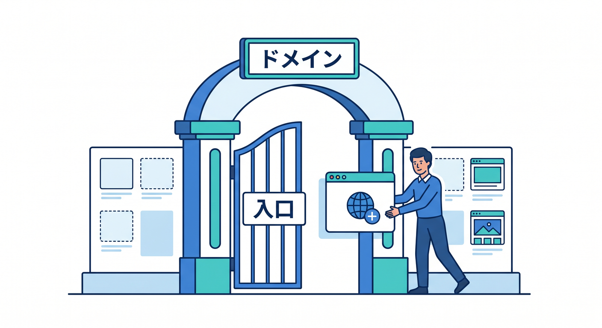
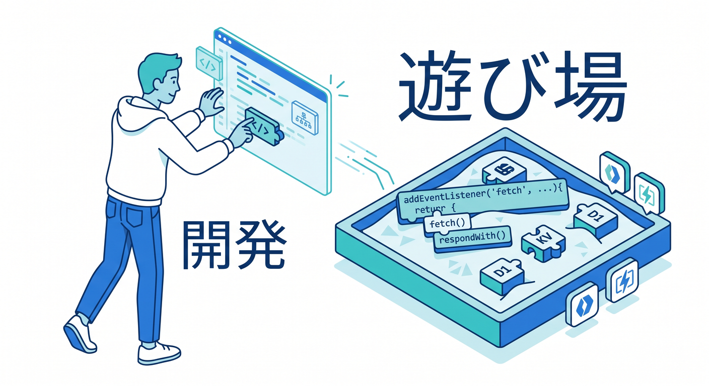
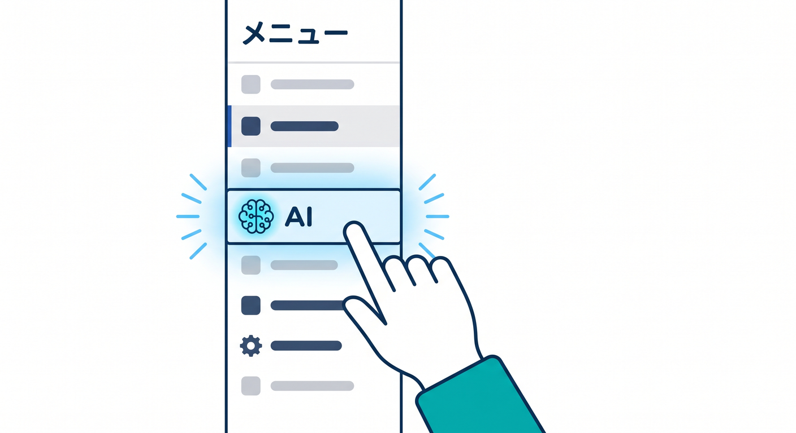
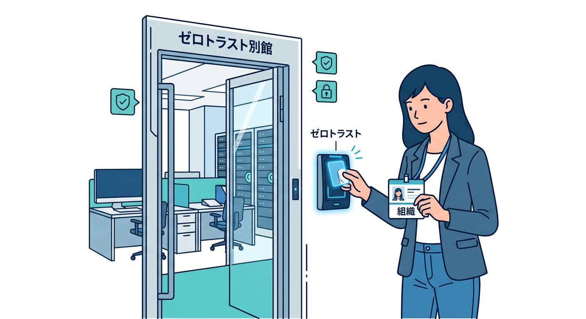
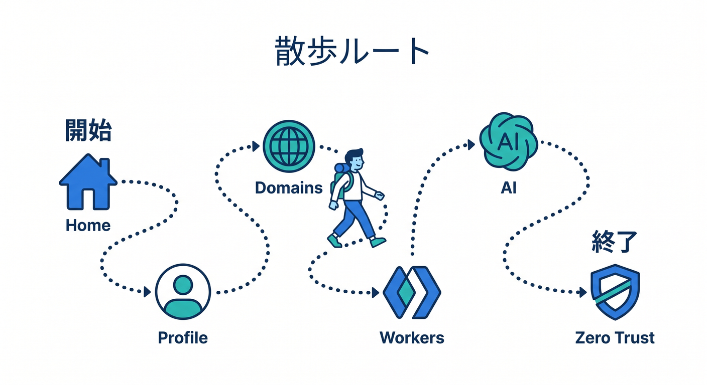

# 第02章：ログインして最初に見る場所を覚えよう 🚪☁️🧭

Cloudflare は、はじめて開くと「メニューが多い…！😳」となりやすいです。
でも大丈夫です 🙆‍♂️✨ この章でやることは、全部の機能を理解することではありません。
**ログインしたあと、どこを見れば落ち着けるか**を覚えることです。ここが分かるだけで、管理画面へのこわさがかなり減ります 🌱

Cloudflare の公式導線でも、ログイン後の基準点として **Account home** が使われています。プロフィール設定、2FA、Account ID 確認なども、ここを起点にたどる形が多いです。つまり、**Account home は「とりあえずここへ戻ればいい場所」**だと思っておくと、とても楽です。 ([Cloudflare Docs][1])

---

## この章のゴール 🎯

この章のゴールは、次の3つです 😊

1. ログイン後のホームポジションが **Account home** だと分かる
2. 最初に見るべきメニューがだいたい分かる
3. 「今はまだ触らなくていい場所」も分かる

Cloudflare の管理画面は、最初から全部を触る前提では作られていません。まずは**入口の地図**を頭に入れて、迷子にならないことが最優先です 🗺️✨

---

## 1. まず覚えるべき場所は Account home です 🏠

Cloudflare にログインしたら、最初の基準点は **Account home** です。
ここは「サイト1個の設定画面」ではなく、**アカウント全体の入口**です。プロフィールまわり、アカウント単位の管理、ドメイン一覧への入口、開発系メニューへの移動など、かなり多くの導線がここから始まります。 ([Cloudflare Docs][1])

感覚としては、Account home は「建物のロビー」みたいなものです 🏢
そこから、各ドメインの部屋に入ったり、Workers & Pages の開発フロアへ行ったり、AI のエリアへ進んだりします。だから、画面内で迷ったら、**いったん Account home に戻る**だけでかなり落ち着けます。これは初心者にかなり効くコツです 💡

---

## 2. ログイン直後に“最初に見る場所”はこの6つでOKです 👀✨

最初のうちは、画面全体を見渡しても情報量が多すぎます。
なので、最初は次の6か所だけを覚えれば十分です 🙌

### ① Account home 🏠

ここがホームです。
アカウント一覧や、そこから先の入口を確認する場所です。Account ID をコピーしたいときも、公式ドキュメントではまず Account home に行く流れになっています。 ([Cloudflare Docs][2])

### ② Profile / My Profile 👤

見た目設定、言語、通知、タイムゾーン、認証まわりはプロフィール系メニューに集まっています。
Cloudflare の公式手順でも、表示テーマ変更や通知設定、2FA 管理は Account home から Profile / My Profile へ進む流れです。つまりここは、**自分の作業環境を整える場所**です。 ([Cloudflare Docs][3])

### ③ Domains 🌐

ドメインを Cloudflare に追加するときは、**Domains** から始めます。
公式ドキュメントでも、ドメイン追加は「Domains → Onboard a domain」の流れです。まだドメインを載せていない段階なら、このメニューは「これからサイトを入れる入口」だと思えばOKです。 ([Cloudflare Docs][4])

### ④ Workers & Pages 🧑‍💻

ここは Cloudflare の開発系の中心地です。
Workers を試したり、Pages プロジェクトを見たり、Workers AI のアプリをテンプレートから作る導線もここにあります。しかも公式には、**Workers Playground ならセットアップ不要でブラウザ上ですぐ試せる**と案内されています。怖がらずに見に行ってよい場所です ✨ ([Cloudflare Docs][5])

### ⑤ AI 🤖✨

2026年の公式変更で、**AI はダッシュボードのサイドバーで独立したトップレベル項目**として見つけやすくなりました。AI Gateway は「AI > AI Gateway」から作成できます。

ただし、AI 関連は少しだけ導線が分かれています。たとえば **Workers AI アプリの作成は Workers & Pages 側から始まる**一方で、AI Gateway は AI 側から入ります。さらに AI Search のドキュメントでは「Compute & AI > AI Search」という表記も残っています。つまり現時点では、**AI は見つけやすくなったけれど、実際の入口は製品によって少し違う**と理解しておくと混乱しにくいです。 ([Cloudflare Docs][6])

### ⑥ Zero Trust 🔐

Zero Trust は、通常の Web 配信や Workers の導線とは少し雰囲気が違います。
公式のセットアップでも、Zero Trust に入ると **組織を作成し、team name を決める**流れになります。なので初心者の最初の感覚としては、**「普通のサイト管理とは別の入口」**くらいに捉えるのがちょうどよいです。 ([Cloudflare Docs][7])

---

## 3. はじめての日のおすすめ散歩ルート 🚶‍♂️☁️

最初の学習日は、次の順番で見ていくのがおすすめです 😊

**Account home → Profile → Domains → Workers & Pages → AI → Zero Trust**

この順番がいい理由は、
「自分の基準点を見る」→「見やすさを整える」→「サイト管理の入口を見る」→「開発の入口を見る」→「AI の入口を見る」→「別館っぽい Zero Trust を見て終わる」
という流れになるからです。頭の中に建物の見取り図ができやすいんです 🗺️✨

Cloudflare の公式導線でも、Profile は Account home 起点、Domains はドメイン追加の入口、Workers & Pages は開発導線、AI は最近トップレベル化、Zero Trust は専用オンボーディングという構造になっています。なので、この散歩順はかなり自然です。 ([Cloudflare Docs][3])

---

## 4. この段階では“まだ触らなくていい”もの 😌🫶

最初のうちは、次のものは「場所だけ見ればOK」です。

* API Tokens / API Keys
* DNS レコードの細かい編集
* SSL/TLS の細かい設定
* ルール類の細かい条件設定
* Zero Trust の本格的なポリシー設計

なぜなら、これらは**入口を覚える段階**ではなく、**実際に何かを動かす段階**で効いてくるものだからです。たとえば DNS はドメインを載せてから本格的に意味が出ますし、Zero Trust は組織の前提が入ります。最初に全部触ると、理解が深まる前に疲れます 😵‍💫
この章では、**「どこにあるか」だけ知れば満点**です。 ([Cloudflare Docs][4])

---

## 5. まず最初に確認したい“小さな3つ” 🧩

ログインしたら、まずこの3つだけ見てみましょう 👀

**1つ目：自分のアカウント名が見えるか**
Account home で、自分が今どのアカウントにいるかを確認します。複数アカウントを持つ場合、この感覚は特に大事です。Account ID のコピー手順もアカウント行を起点に案内されています。 ([Cloudflare Docs][2])

**2つ目：ドメインを追加する入口が分かるか**
まだ追加しなくてよいので、Domains の入口だけ見ます。「ここからサイトが入るんだな」と分かれば十分です。 ([Cloudflare Docs][4])

**3つ目：Workers & Pages と AI の場所が見分けられるか**
ここが分かると、Cloudflare を「サイト管理だけのサービス」ではなく、**開発と AI も同じ建物の中にあるサービス**として見られるようになります。Workers のブラウザ試用導線や、AI のトップレベル導線は、その感覚づくりにかなり役立ちます。 ([Cloudflare Docs][5])

---

## 6. よくある混乱ポイントを先にほぐしておきます 🧠✨

### 「Account home」と「サイトの設定画面」は同じではありません 🙅‍♂️

ここは初心者がかなり混乱しやすいです。
**Account home はアカウント全体の入口**で、**サイトの設定画面は特定のドメインを選んだあと**の世界です。
たとえば Zone ID はサイトの Overview 側で見る流れになり、Account ID は Account home や Workers & Pages 側でも確認できます。つまり、**“アカウント単位”と“サイト単位”が混ざって見えるのが普通**です。最初から完璧に区別できなくても心配いりません。 ([Cloudflare Docs][2])

### AI は1か所に全部まとまっているわけではありません 🤖

最近の改善で AI は見つけやすくなりましたが、実際には **AI Gateway**, **Workers AI**, **AI Search** で入口が少し違います。
これは失敗ではなく、Cloudflare が AI を「単体機能」ではなく、**開発・推論・検索・制御をまたいで使うもの**として持っているからです。AI Search も R2、Workers AI、AI Gateway などと統合される前提で設計されています。 ([Cloudflare Docs][6])

### Zero Trust は別館だと思って大丈夫です 🏢🔐

Zero Trust を開くと、いきなり team name や組織の話が出るので、最初は「急に企業向け感が強いな…」と感じやすいです。
その感覚は正しいです。Zero Trust は Web サイト公開や Workers 開発とは役割が違うので、最初は**別館を見る感覚**で大丈夫です。 ([Cloudflare Docs][7])

---

## 7. VS Code と Copilot をどう横に置くと学びやすい？ 💻🤝✨

GitHub Copilot Chat は、VS Code の中で**コードの提案、説明、修正提案、単体テスト生成**などを行えるよう公式に案内されています。
なので、Cloudflare の管理画面を学ぶときも、Copilot を「コード専用」だと思わず、**用語の噛み砕き役**として使うのがおすすめです。 ([GitHub Docs][8])

たとえば、こんな聞き方が使いやすいです 😊

* 「Cloudflare の Account home って、初心者向けに言うと何の場所？」
* 「Cloudflare の Workers & Pages と AI の違いを、大学1年生向けに説明して」
* 「Cloudflare の Zero Trust は普通のサイト管理と何が違うの？」
* 「Zone と Account の違いを図なしでやさしく説明して」

こういう質問を横で回しながらダッシュボードを見ると、理解がかなり早くなります 🚀

---

## 8. MCP まわりはどう考えればいい？ 🧠🔌

Cloudflare はいま、**Cloudflare Docs 用や Observability 用の managed remote MCP server** を用意しています。Workers の公式ドキュメントには、`docs.mcp.cloudflare.com/mcp` や `observability.mcp.cloudflare.com/mcp` をエージェント設定に入れて、ドキュメント理解やログ確認に使う案内もあります。 ([Cloudflare Docs][9])

ただし、ここは大事な注意があります ⚠️
Cloudflare 自身も、**remote MCP connections はまだ発展中で、すべての MCP クライアントが対応しているわけではない**と案内しています。つまり現時点では、
**Copilot Chat は普通の質問相手としてとても便利**、
**MCP は対応クライアントで使えるとさらに強い**、
という2段構えで考えるのが安全です。変に「全部つながるはず」と思い込まないほうが、むしろ学習がスムーズです。 ([Cloudflare Docs][10])

---

## 9. 手を動かすミニ課題 ✍️🌟

ここでは設定変更はしません。
**見るだけ課題**です 👀

**ミニ課題A**
Cloudflare にログインして、Account home を開く。
そして「ここが自分のホームポジションだな」と意識してみましょう。 ([Cloudflare Docs][1])

**ミニ課題B**
Profile の場所だけ開いて、「見た目や通知はここなんだな」と確認する。変更はまだ不要です。 ([Cloudflare Docs][3])

**ミニ課題C**
Domains、Workers & Pages、AI、Zero Trust を1回ずつクリックして、「あ、ここがそれぞれの入口なんだ」と体感する。理解しようとしすぎなくてOKです。 ([Cloudflare Docs][4])

**ミニ課題D**
VS Code の Copilot Chat に「Cloudflare の Account home は何をする場所？」と聞いてみる。
“自分で画面を見る” と “AI に言い換えてもらう” をセットにすると、定着がかなり良くなります。 ([GitHub Docs][8])

---

## 10. この章のまとめ 🎉

この章でいちばん大事なのは、次の3つです 🌈

* **ログイン後の基準点は Account home**
* **最初は Domains / Workers & Pages / AI / Zero Trust の入口だけ見分けられればOK**
* **全部を理解する必要はなく、まずは“戻る場所”を持つことが大事**

Cloudflare は、最初は大きな建物に見えます 🏢☁️
でも、入口の位置さえ分かれば、急に歩きやすくなります。
この章を終えたら、次は「プロフィール設定で見やすい画面に整える」に進むと、学習しやすさがさらに上がります 😊✨

必要なら続けて、この流れのまま **第2章用の「理解度チェック問題つき完全版」** にして、章末問題や小テストも追加できます。

[1]: https://developers.cloudflare.com/fundamentals/user-profiles/login/ "Log in to Cloudflare · Cloudflare Fundamentals docs"
[2]: https://developers.cloudflare.com/fundamentals/account/find-account-and-zone-ids/ "Find account and zone IDs · Cloudflare Fundamentals docs"
[3]: https://developers.cloudflare.com/fundamentals/user-profiles/customize-account/ "Profile settings · Cloudflare Fundamentals docs"
[4]: https://developers.cloudflare.com/fundamentals/manage-domains/add-site/ "Onboard a domain · Cloudflare Fundamentals docs"
[5]: https://developers.cloudflare.com/workers/get-started/dashboard/ "Get started - Dashboard · Cloudflare Workers docs"
[6]: https://developers.cloudflare.com/changelog/post/2026-02-19-ai-dashboard-experience-improvements/ "AI dashboard experience improvements · Changelog"
[7]: https://developers.cloudflare.com/cloudflare-one/setup/ "Get started · Cloudflare One docs"
[8]: https://docs.github.com/ja/copilot/how-tos/chat-with-copilot/chat-in-ide "GitHub CopilotにIDEで質問を行う - GitHubドキュメント"
[9]: https://developers.cloudflare.com/agents/model-context-protocol/mcp-servers-for-cloudflare/ "Cloudflare's own MCP servers · Cloudflare Agents docs"
[10]: https://developers.cloudflare.com/agents/guides/test-remote-mcp-server/ "Test a Remote MCP Server · Cloudflare Agents docs"

