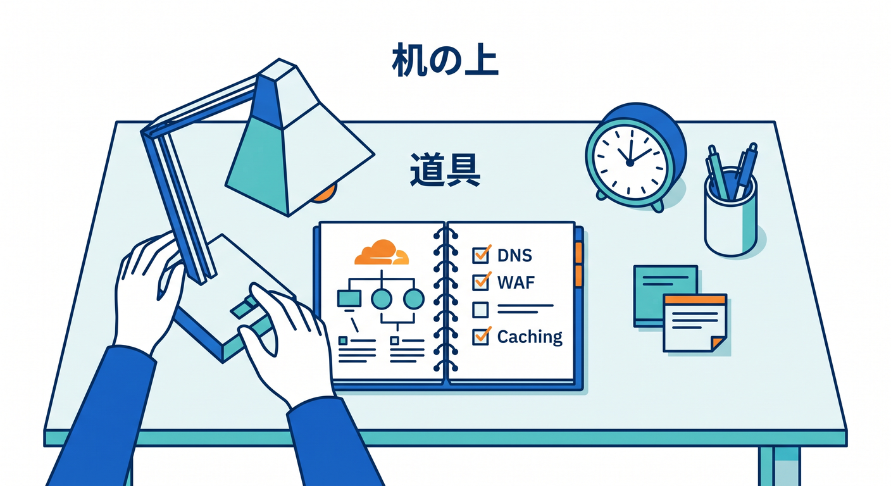
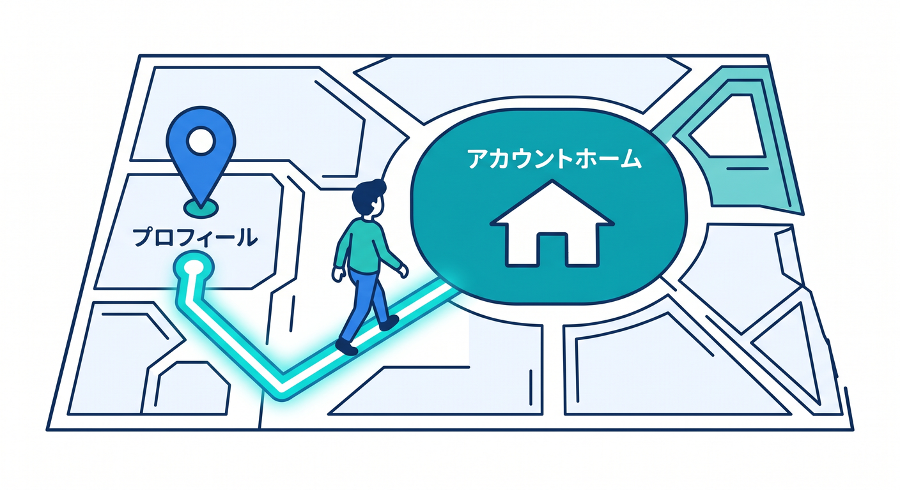
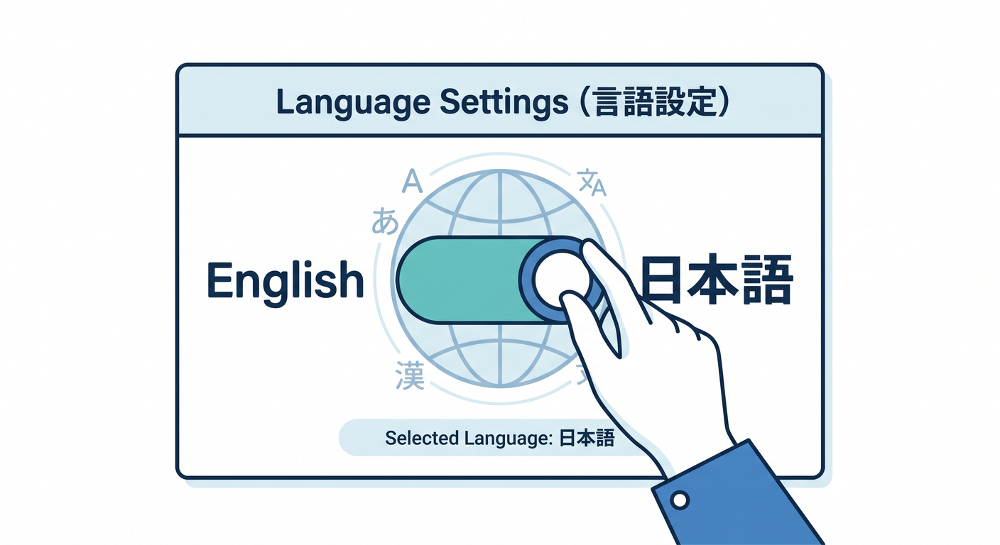
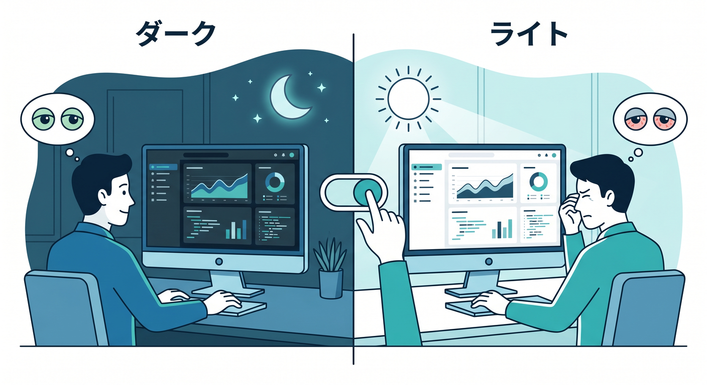
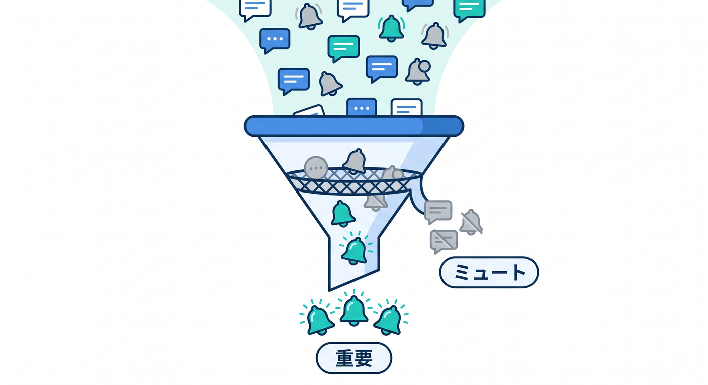
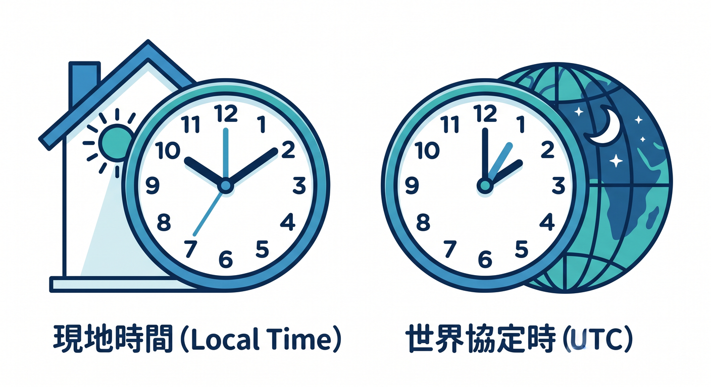

# 第03章：プロフィール設定で“見やすい画面”に整えよう ⚙️🌙✨

この章は、Cloudflareの管理画面を**勉強しやすい机の上**みたいに整える章です 🪴

本日時点の公式情報では、プロフィールまわりで主に **Language / Dashboard appearance / Notifications / Timezone** を調整できます。しかも2026年1月にはタイムゾーン設定が追加され、特に指定がない画面ではダッシュボード内の日時表示が選んだタイムゾーンに合わせて出るようになりました。学習の最初にここを整えておく価値はかなり大きいです。 ([Cloudflare Docs][1])

---

## この章のゴール 🎯

この章のゴールは、次の4つです 😊

1. 画面の文字や色で疲れにくくする
2. 通知をうるさすぎず、でも見逃しにくくする
3. 時刻表示のズレで混乱しにくくする
4. あとで Workers・R2・AI Gateway・Workers AI を見るときに、管理画面を読みやすくする

特にCloudflareのAIまわりは、2026年2月にサイドバー上で **AI がトップレベルの独立した項目**として見つけやすくなっています。さらに AI Gateway の画面では、リクエスト数、トークン使用量、コスト、エラー、ログの時刻などを見ていくので、プロフィール側の表示設定を先に整えておくと、後の理解がぐっと楽になります。 ([Cloudflare Docs][2])

---

## まず知っておきたいこと 👀

Cloudflare公式ドキュメントでは、プロフィールへの入口が **Profile** と書かれている箇所と **My Profile** と書かれている箇所があります。なので、画面上で少し表記が違って見えても焦らなくて大丈夫です 🙆‍♂️
基本の動きはかなり共通で、まず **Account home** に入り、そこからプロフィール関連の設定へ進む流れです。 ([Cloudflare Docs][1])

---

## 1. まずはプロフィール画面へ行こう 🚪

Cloudflareでは、ログイン後に **Account home** がひとつの基準地点になります。プロフィール設定もそこから入る導線が基本です。公式のプロフィール設定ページでも、Language、Dashboard appearance、Notifications、Timezone の変更手順はどれも「Cloudflare dashboard → Account home → Profile」の流れで案内されています。 ([Cloudflare Docs][1])

ここでは、細かい機能名を覚えるより、

**「困ったら Account home に戻る」**
**「個人の見た目や通知は Profile 側」**

この2つを体で覚えれば十分です 🌟

---

## 2. 言語設定を整えよう 🌍🈯

Cloudflare公式では、プロフィールの **Settings > Language** から、ダッシュボード全体で使う言語を変更できます。変更は自動で反映されます。 ([Cloudflare Docs][1])

## ここでの考え方 🧠

最初のうちは、

* 英語UIで用語に慣れたい
* 日本語寄りでまず全体像をつかみたい

このどちらでもOKです 👍

ただし学習の観点では、CloudflareやGitHub Copilot、公式Docs、エラーメッセージは英語寄りの情報が多いので、**無理のない範囲で英語の機能名にも目を慣らしていく**と後で強いです。
とはいえ、最初から背伸びして疲れる必要はありません。「今日は読む日だから楽な表示」「後でDocsと照らすから英語寄り」というように、学習モードに合わせて切り替える感覚で十分です 😊

## 学習のコツ ✍️

画面上のメニュー名で迷ったら、VS Code の Copilot Chat で
「Cloudflare dashboard の Zone と Account の違いを初心者向けに説明して」
のように聞く使い方がかなり相性いいです。GitHub公式では、VS Code のチャットビューから質問でき、Ask モードは技術概念の理解やコードベース理解向けと案内されています。 ([GitHub Docs][3])

---

## 3. ダークモードかライトモードかを決めよう 🌙☀️

Cloudflare公式では、**Dashboard appearance** に

* Dark
* Light
* Use system setting

の3つがあります。変更は自動反映です。 ([Cloudflare Docs][1])

## おすすめの考え方 🎨

## Dark が向いている人

夜に触ることが多い人 🌙
複数モニタで開発画面も暗色中心の人 🖥️
目のまぶしさを減らしたい人 👀

## Light が向いている人

昼間に触ることが多い人 ☀️
紙の教材や明るいWebページと並べて見たい人 📄
表や設定値をくっきり見たい人 🔍

## Use system setting が向いている人

Windows 側のテーマに合わせて自然に切り替えたい人 ⚙️
「UIの色を自分で毎回考えたくない」人 😌

## 学習教材としてのおすすめ 🌱

最初は **Use system setting** がかなり無難です。
Windows 側の雰囲気とそろうので、Cloudflareだけが急に別世界っぽく見えにくくなります。

ただし、長時間学習で「白すぎてつらい」「暗すぎて読みにくい」が出たら、遠慮なく固定しましょう。
見た目は好みではなく、**集中力の装備**です 🛡️✨

---

## 4. 通知は“全部ON”にしないのがコツ 📣🔔

Cloudflare公式では、プロフィールの **Notifications** から受け取りたい通知カテゴリを選べます。ここは ** verified email address が必要**です。設定は自動保存されます。 ([Cloudflare Docs][1])

また、Cloudflare Notifications 自体は全プランで使えますが、通知方法にはプラン差があります。
Free プランではメール通知、Professional 以上では webhook、Business 以上では PagerDuty も使えます。 ([Cloudflare Docs][4])

## 学習初期のおすすめ方針 📚

最初は「全部受け取る」より、**本当に学習や運用理解に役立つ通知だけ見る**ほうがいいです。

たとえば初心者目線では、

* ドメインやサーバーの異常に関わるもの
* ビルドや公開の成否に関わるもの
* セキュリティやアカウントの重要なもの

を優先し、宣伝系や今すぐ不要なものは絞るほうが、通知疲れしにくいです 🌿

## この章で伝えたい本音 😄

通知設定は地味ですが、かなり大事です。
CloudflareはDNS、Workers、R2、AI、Zero Trust まで領域が広いので、通知を整理しないと「なんかいっぱい来るサービス」に見えてしまいます。

逆にここを整えると、
**「自分に関係ある変化だけ届く」**
という気持ちよい状態に近づけます ✨

---

## 5. タイムゾーンはかなり大事 ⏰🌏

Cloudflare公式では、プロフィールからタイムゾーンを **UTC** または **ローカル（ブラウザ/システム側）** で選べます。2026年1月の更新で、特に明示がない限り、ダッシュボード上の日時表示は選択したタイムゾーンに合わせて出るようになりました。 ([Cloudflare Docs][1])

## なぜ大事なの？ 🤔

Cloudflareでは、あとでこんな情報を見るようになります。

* Workers の実行やエラーの時刻
* AI Gateway の分析画面の時系列
* AI Gateway の個別ログの timestamp
* セキュリティイベントや通知の発生時刻

AI Gateway のダッシュボードでは、リクエスト、トークン、コスト、エラーなどを時間軸で見られ、ログにも timestamp が含まれます。だから、時刻の基準が自分の感覚とズレていると、**「さっきのテスト結果どれ？」問題**が起きやすいです。 ([Cloudflare Docs][5])

## 初学者におすすめの選び方 🌸

## Local を選ぶとよい場面

「今この操作をした」「さっきエラーが出た」を直感で追いたいとき
学習ノートやスクリーンショットの時刻と合わせたいとき
普段の生活感覚の時間で見たいとき

## UTC を選ぶとよい場面

ログやドキュメントを世界標準時で見たいとき
チームや外部資料と時刻基準をそろえたいとき
開発・運用の学習を少し本格寄りにしたいとき

## まずはどっちがいい？ 🎯

最初の学習段階では、**Local のほうが混乱しにくい**です。
ただし、請求や一部の情報では UTC/GMT 基準が明記されることもあります。実際、Cloudflare Billing では請求期間の日付は UTC/GMT と案内されています。
なので、「普段の観察は Local、厳密な運用確認では UTC も意識する」という理解がちょうどいいです。 ([Cloudflare Docs][6])

---

## 6. この章がAI学習にどうつながるの？ 🤖✨

この章は見た目設定の話に見えますが、実は **AI学習の土台章**でもあります。

Cloudflareは2026年2月時点で、AIがサイドバーのトップレベル項目として見つけやすくなっています。さらに AI Gateway では、使用量・コスト・エラー・ログをダッシュボードで確認できます。 ([Cloudflare Docs][2])

つまり、この章で整える

* 読みやすいテーマ 🌙
* 理解しやすい言語 🌍
* 邪魔されにくい通知 🔔
* 混乱しにくい時刻設定 ⏰

は、そのまま後の

* Workers AI を試す
* AI Gateway で使用量を眺める
* ログを時系列で読む
* AI Search や RAG 系の構成を追う

ときの**見やすさ・判断しやすさ**に直結します 🚀

要するに、ここは「ただの好み設定」ではなく、**AI時代のCloudflareダッシュボードを読む準備章**です。

---

## 7. 余裕があれば一緒に見ておきたい安全設定 🔐

この章の主役ではありませんが、プロフィール周辺には学習初期から知っておくと安心な項目もあります。

Cloudflare公式では、

* 2FA はプロフィールの Authentication から設定できる
* 複数の2FA要素を持つことを推奨している
* セッション一覧で、IP、場所、端末種別、ブラウザ種別、最後のログイン状況などを確認できる
* 非アクティブ時のダッシュボードセッションタイムアウトはデフォルト72時間
  と案内されています。 ([Cloudflare Docs][7])

## ここでの学び方 🛡️

今すぐ全部設定しなくても大丈夫です。
ただ、プロフィールは「見た目」だけでなく「本人確認」「ログイン安全性」「今どの端末が入っているか」にもつながる場所だと分かっていると、Cloudflareをただの設定画面ではなく、**運用するサービス**として見られるようになります。

---

## 8. 実際のおすすめ手順 🚶‍♂️✨

この章では、次の順で触るのがおすすめです。

## ステップ1　Account home に行く

まずは「ここがホーム」と覚えます。 ([Cloudflare Docs][8])

## ステップ2　Profile / My Profile を開く

表記が少し違っても同系統の場所です。 ([Cloudflare Docs][1])

## ステップ3　Language を決める

迷うなら、読みやすさ優先でOKです。 ([Cloudflare Docs][1])

## ステップ4　Dashboard appearance を決める

Dark / Light / Use system setting から選びます。 ([Cloudflare Docs][1])

## ステップ5　Timezone を決める

最初は Local 寄りがおすすめです。UTC は後で理解が深まってからでも十分です。 ([Cloudflare Docs][1])

## ステップ6　Notifications を見直す

verified email が済んでいるか確認しつつ、必要な通知だけ残します。 ([Cloudflare Docs][1])

## ステップ7　余裕があれば Authentication と Sessions も見る

安全性の入口として位置だけ覚えれば十分です。 ([Cloudflare Docs][7])

---

## 9. Copilotを学習の相棒にする使い方 💬🧑‍💻

GitHub公式では、VS Code のチャットビューから Copilot Chat を開けて、Ask モードで質問できます。VS Code での初回セットアップ時には必要な拡張機能が自動で入る案内もあります。 ([GitHub Docs][3])

この章だと、たとえばこんな聞き方が便利です ✨

* 「Cloudflareの Profile と Account settings の違いを初心者向けに説明して」
* 「UTC と Local timezone をログ観察の視点で比較して」
* 「Cloudflare の通知設定を学習者向けに最小構成で考えて」
* 「AI Gateway の analytics をあとで読む前提で、今やっておくべき設定を整理して」

こういう使い方をすると、Copilotはコード生成だけでなく、**管理画面の理解補助AI**としてかなり役立ちます 🤝

---

## 10. この章のミニ演習 📝🌟

## 演習1

Language を確認して、今の自分に読みやすい表示か考える

## 演習2

Dashboard appearance を 1 回切り替えて、どちらが見やすいか体感する

## 演習3

Timezone を見つけて、UTC と Local の意味を言葉で説明してみる

## 演習4

Notifications を開いて、「今の自分に不要そうな通知」を1つ考える

## 演習5

余裕があれば Authentication と Sessions の場所だけ確認する

---

## 11. この章のまとめ 🍀

この章でいちばん大事なのは、
**Cloudflareの管理画面を“自分が読める画面”に変えること**です。

* 言語で理解しやすくする 🌍
* テーマで目を疲れにくくする 🌙
* 通知で情報を整理する 🔔
* タイムゾーンで時刻の混乱を減らす ⏰

この4つを先に整えるだけで、後の DNS、Workers、R2、AI、Zero Trust の章がかなり入りやすくなります。特に今のCloudflareはAIセクションが見つけやすく整理され、AI Gateway 側でも分析やログを見る導線がしっかりしているので、プロフィール設定の恩恵が思った以上に大きいです。 ([Cloudflare Docs][2])

---

## 章末チェックリスト ✅✨

* Account home に戻れる
* Profile / My Profile の位置がわかる
* Language を変えられる
* Dark / Light / Use system setting の違いがわかる
* Timezone を UTC / Local のどちらかで説明できる
* Notifications が verified email と関係することを知っている
* 後でAI GatewayやWorkersの時系列を見るとき、Timezone が効いてくると分かる

---

必要ならこの次に、そのまま流れをそろえて **第4章** も同じテンションで詳しく作れます。

[1]: https://developers.cloudflare.com/fundamentals/user-profiles/customize-account/ "Profile settings · Cloudflare Fundamentals docs"
[2]: https://developers.cloudflare.com/changelog/post/2026-02-19-ai-dashboard-experience-improvements/ "AI dashboard experience improvements · Changelog"
[3]: https://docs.github.com/copilot/using-github-copilot/asking-github-copilot-questions-in-your-ide "Asking GitHub Copilot questions in your IDE - GitHub Docs"
[4]: https://developers.cloudflare.com/notifications/ "Notifications · Cloudflare Notifications docs"
[5]: https://developers.cloudflare.com/ai-gateway/observability/analytics/ "Analytics · Cloudflare AI Gateway docs"
[6]: https://developers.cloudflare.com/fundamentals/account/account-security/manage-active-sessions/?utm_source=chatgpt.com "Manage active sessions - Cloudflare Fundamentals"
[7]: https://developers.cloudflare.com/fundamentals/user-profiles/2fa/ "Two-factor authentication · Cloudflare Fundamentals docs"
[8]: https://developers.cloudflare.com/fundamentals/user-profiles/login/ "Log in to Cloudflare · Cloudflare Fundamentals docs"

