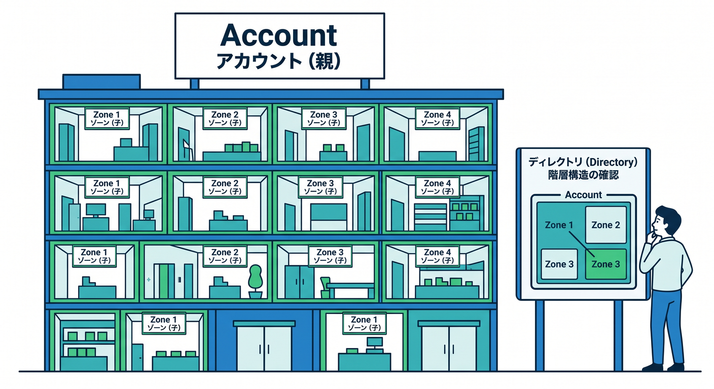
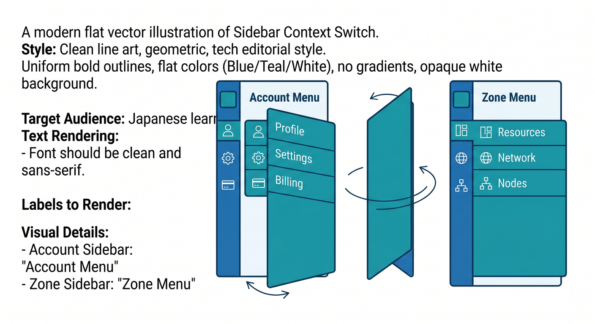
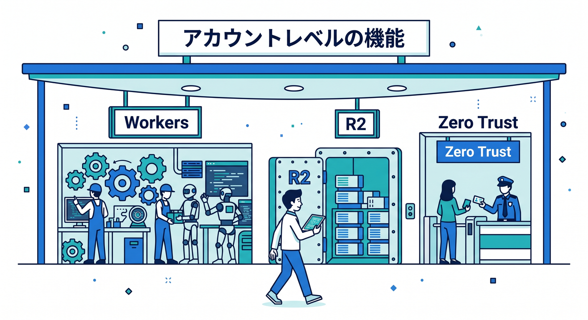
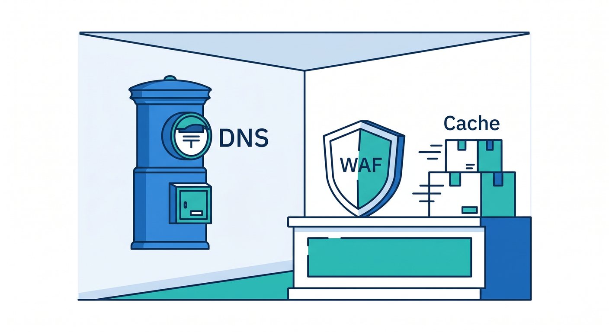
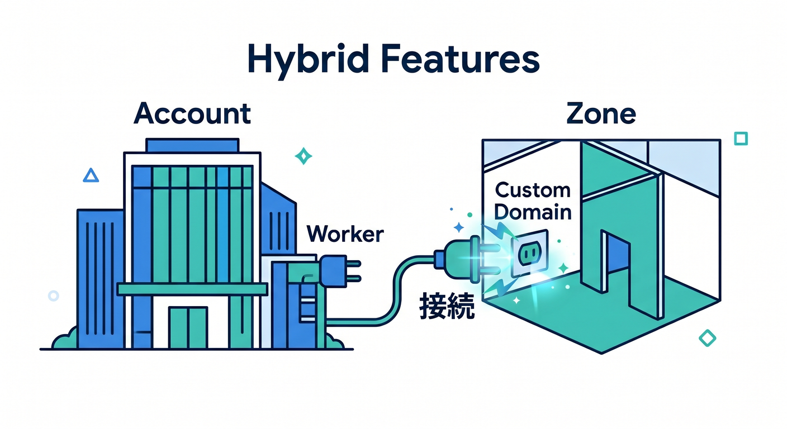
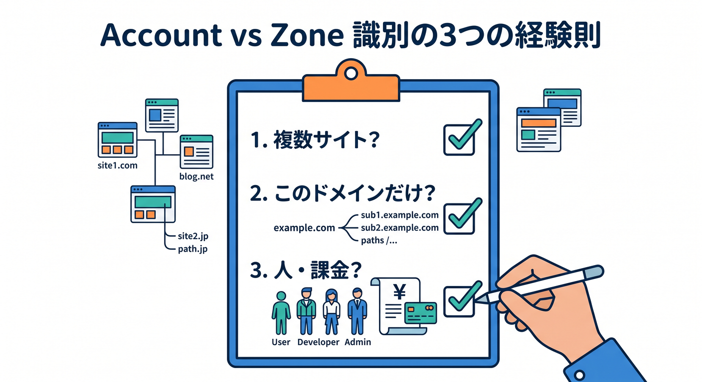
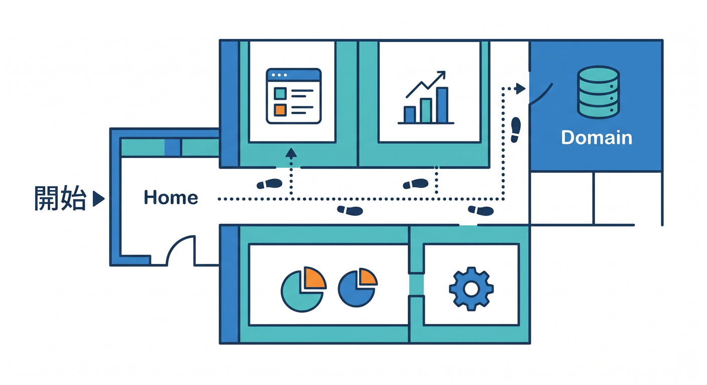

# 第04章：AccountとZoneの違いをふんわり理解しよう 🏷️☁️🧭

この章のゴールはひとつです 😊
Cloudflare の管理画面を見たときに、「これはアカウント側の話かな？ それともドメイン側の話かな？」と、ざっくり判別できるようになることです。Cloudflare 公式は、管理画面の整理軸として「User profile」「Account」「Zone」の3つを挙げていて、Account には users と zones が入り、Zone は Cloudflare に追加した domain や subdomain の単位として扱われます。 ([Cloudflare Docs][1])

## まずは一言でつかもう 🌟

いちばんやさしく言うと、

* Account ＝ 管理の箱・チームの箱 📦
* Zone ＝ その箱の中に入っている「サイトやドメインごとの現場」 🌐

です。Cloudflare 公式でも、Account は 1つ以上の user と zone を含む組織アカウントで、課金、メンバー、各種設定を持つ場所とされ、Zone は追加した domain または subdomain に対して security や performance の設定を行う場所とされています。 ([Cloudflare Docs][1])

## たとえ話でイメージしよう 🏢✨

Cloudflare を「建物」にたとえると分かりやすいです。

* User profile は、自分の名札や見た目設定 👤
* Account は、建物の管理事務所 🏢
* Zone は、その建物の中にある各テナントや各店舗 🏬

という感じです。プロフィールには言語設定や通知設定が入り、Account にはメンバーや課金などの共通管理が入り、Zone には DNS や WAF やキャッシュのような「そのサイトだけに効く設定」が入ります。 ([Cloudflare Docs][1])

## 管理画面ではどう見えるの？ 👀

ここが超大事です 🔑
Cloudflare 公式では、ログインして Account を選んだ直後、まだ Zone を選ぶ前のサイドバーには account-level products が並ぶと説明されています。そして Zone に入ると、サイドバーの中身は zone-related products に切り替わります。さらに、Zone の中からでもサイドバーの Accounts を使って account settings や account-level products に戻れます。 ([Cloudflare Docs][1])

つまり、画面を見ていて
「いま自分は Account を見ているのか、Zone を見ているのか」
これだけ意識できると、かなり迷子になりにくくなります 😊 ([Cloudflare Docs][1])

## Account 側にあるものの感覚をつかもう 📦🧑‍💼

Cloudflare 公式は、account-level products の例として Workers、Pages、Security Center、Bulk Redirects を挙げています。特に Bulk Redirects は「account level で定義し、account 内の複数 domain に適用できる」と明記されています。つまり、「サイトをまたいで効くもの」「組織でまとめて持つもの」は Account 側にいることが多いです。 ([Cloudflare Docs][1])

この感覚で見ると、R2 もかなり Account 寄りです。R2 のドキュメントでは、ブラウザから bucket や object を管理でき、S3 互換 endpoint にも Account ID が入ります。つまり R2 は「特定の1ドメインの設定」というより、「そのアカウントが持つ保存庫」に近いです。 ([Cloudflare Docs][2])

AI まわりも Account 側の感覚で見ると整理しやすいです。AI Gateway は公式手順で「Cloudflare dashboard にログイン → account を選ぶ → AI > AI Gateway」と進みますし、AI Gateway の analytics も account を選んで閲覧します。さらに 2026年2月の公式 changelog では、AI は Cloudflare dashboard のサイドバーで独立した top-level section になり、見つけやすくなったと案内されています。 ([Cloudflare Docs][3])

Zero Trust も、最初の感覚としては Zone というより「組織側の別フロア」です。公式の開始手順でも、dashboard から Zero Trust を選び、まず team name を決めて organization を作る流れになっています。これは DNS レコードを1個いじる感覚というより、組織単位の入口を作る感じです。 ([Cloudflare Docs][4])

## Zone 側にあるものの感覚をつかもう 🌐🛡️

一方で Zone は、「このドメインだけに効く設定」の場所です。Cloudflare 公式では、Zone は website・application・API の security や performance に直接影響し、zone-level services は同じ account 内のほかの zone には影響しないと説明されています。 ([Cloudflare Docs][1])

なので、たとえば DNS、Cache Rules、SSL/TLS、WAF の細かなドメイン設定、Under Attack mode のような「このサイトを今どう守るか」という話は Zone 側の感覚で見るとスッと整理できます。Under Attack mode も公式では、Account home から account と zone を選び、zone overview page で有効化する流れです。 ([Cloudflare Docs][1])

分析画面もこの考え方で見やすくなります。Zone Analytics は公式で「website または domain level で collected された metrics」と説明されています。つまり、アクセス傾向や保護状況を「このサイト単位」で見る代表例です。 ([Cloudflare Docs][5])

## ここで初心者が混乱しやすい理由 😵‍💫

ややこしいのは、Account 側の機能が Zone とつながることがあるからです。
いちばん分かりやすいのが Workers です。Workers 自体は account-level product として扱われますが、Worker に custom domain を付けるには「active Cloudflare zone」と「Worker」の両方が必要だと公式に書かれています。 ([Cloudflare Docs][1])

つまり、

* Worker 本体は Account 側 🧩
* その Worker を 「api.example.com」 みたいな公開ドメインに結びつける部分は Zone 側 🌐

という “またがる構造” があるんです。ここで混乱する人は多いですが、むしろ
「Cloudflare って、Account の機能を Zone に接続して使うことがあるんだな」
と分かれば大きな前進です 🙌 ([Cloudflare Docs][6])

## 迷わないための見分け方 3本ルール 🧭

困ったら、次の3つで考えるとかなり当たりやすいです。

1. 「複数サイトにまたがるか？」
   またがるなら Account 側の可能性が高いです。Bulk Redirects は account level で複数 domain に適用できます。 ([Cloudflare Docs][7])

2. 「このドメインだけの設定か？」
   その場合は Zone 側の可能性が高いです。Zone-level services はその zone にしか効きません。 ([Cloudflare Docs][1])

3. 「人・課金・権限・保存庫・共通基盤の話か？」
   メンバー管理、課金、Account ID、R2、AI Gateway、Zero Trust のようなものは Account 側の感覚で見ると整理しやすいです。公式でも account members は account 単位で管理され、R2 は Account ID ベースの endpoint を使い、AI Gateway は account を選んで操作します。 ([Cloudflare Docs][8])

## 画面散歩のしかた 🚶‍♂️☁️

おすすめの見方はこんな順番です。

まず Account home に入り、自分の account を選びます。ここでは「組織の箱」を見ている意識を持ってください。Account ID の確認もここでできます。 ([Cloudflare Docs][9])

次に、サイドバーを見て「Workers & Pages」「R2」「AI」「Zero Trust」など、アカウント寄りの入口をざっと眺めます。Workers & Pages からアプリ作成に入れ、AI Gateway は AI メニューから account を選んで管理します。 ([Cloudflare Docs][10])

そのあと、ひとつの domain をクリックして Zone に入ります。ここからは「このサイト専用の現場」に切り替わります。DNS、セキュリティ、キャッシュ、分析などを “そのサイト単位” で見る意識にすると整理しやすいです。 ([Cloudflare Docs][1])

## この章で覚えておくと強いこと 💪✨

覚えるのは細かいメニュー名じゃなくて大丈夫です。
この章では次の3つだけ残れば十分です。

* Account は「管理の箱」📦
* Zone は「ドメインごとの現場」🌐
* Account の機能が Zone に接続されることもある 🔌

この3つが入ると、今後 DNS、Workers、R2、AI、Zero Trust を学ぶときの迷子率がかなり下がります。Cloudflare 公式の構造も、この整理とだいたい同じ考え方で作られています。 ([Cloudflare Docs][1])

## ミニ確認テスト 📝🎉

次のうち、どっち寄りか考えてみましょう。

* 「team メンバーを追加したい」→ Account 寄り 👥 ([Cloudflare Docs][8])
* 「example.com の DNS を直したい」→ Zone 寄り 📬 ([Cloudflare Docs][1])
* 「画像保存用の bucket を作りたい」→ Account 寄り 🪣 ([Cloudflare Docs][2])
* 「このサイトだけ Under Attack mode を入れたい」→ Zone 寄り 🛡️ ([Cloudflare Docs][11])
* 「複数ドメインまとめて redirect を持ちたい」→ Account 寄り ↪️ ([Cloudflare Docs][7])

## Copilot を相棒にする小ワザ 🤖💬

VS Code で GitHub Copilot Chat を使うと、コード提案だけでなく、コード説明や修正提案も頼めます。GitHub 公式は MCP によって Copilot Chat を既存のツールやサービスと統合して機能拡張できるとも案内しています。なので、Cloudflare を学ぶときも「この画面は Account 側？ Zone 側？」と自然文で聞く学び方がかなり相性いいです。 ([GitHub Docs][12])

たとえば、こんな聞き方が使いやすいです 😊
「Cloudflare の Workers と DNS の違いを、Account と Zone の観点で初心者向けに説明して」
「R2 と DNS は、どちらが account-level でどちらが zone-level っぽい？」
「Worker に custom domain を付けるとき、どこから zone が関わるの？」
こういう問いを投げると、頭の中の地図がかなり育ちます。Workers の custom domain には active zone が必要、という公式仕様ともちゃんとつながります。 ([Cloudflare Docs][6])

## まとめ 🎀

この章は、設定を覚える章ではなく、場所の意味を覚える章です。
Cloudflare の管理画面で迷ったら、

「いま見ているのは組織の箱かな？ それとも特定ドメインの現場かな？」

と自分に聞いてみてください。
それだけで、管理画面の怖さがかなり減ります ☁️😊
そして次の章で Zone 側のメニューを見に行くと、「あ、これはドメインの現場だからここにあるのか！」と、かなり納得しやすくなります。 ([Cloudflare Docs][1])

次はこのまま、第5章用にそのままつながる形で「ドメイン追加後に何がどこに出るのか」の詳細教材も続けて作れます。

[1]: https://developers.cloudflare.com/fundamentals/concepts/accounts-and-zones/ "Accounts, zones, and profiles · Cloudflare Fundamentals docs"
[2]: https://developers.cloudflare.com/r2/get-started/ "Get started · Cloudflare R2 docs"
[3]: https://developers.cloudflare.com/ai-gateway/configuration/manage-gateway/ "Manage gateways · Cloudflare AI Gateway docs"
[4]: https://developers.cloudflare.com/cloudflare-one/setup/ "Get started · Cloudflare One docs"
[5]: https://developers.cloudflare.com/analytics/account-and-zone-analytics/zone-analytics/ "Zone Analytics · Cloudflare Analytics docs"
[6]: https://developers.cloudflare.com/workers/configuration/routing/custom-domains/ "Custom Domains · Cloudflare Workers docs"
[7]: https://developers.cloudflare.com/rules/url-forwarding/bulk-redirects/ "Bulk Redirects · Cloudflare Rules docs"
[8]: https://developers.cloudflare.com/fundamentals/manage-members/manage/ "Manage account members · Cloudflare Fundamentals docs"
[9]: https://developers.cloudflare.com/fundamentals/account/find-account-and-zone-ids/ "Find account and zone IDs · Cloudflare Fundamentals docs"
[10]: https://developers.cloudflare.com/workers/get-started/dashboard/ "Get started - Dashboard · Cloudflare Workers docs"
[11]: https://developers.cloudflare.com/fundamentals/reference/under-attack-mode/ "Under Attack mode · Cloudflare Fundamentals docs"
[12]: https://docs.github.com/ja/copilot/how-tos/chat-with-copilot/chat-in-ide "GitHub CopilotにIDEで質問を行う - GitHubドキュメント"

