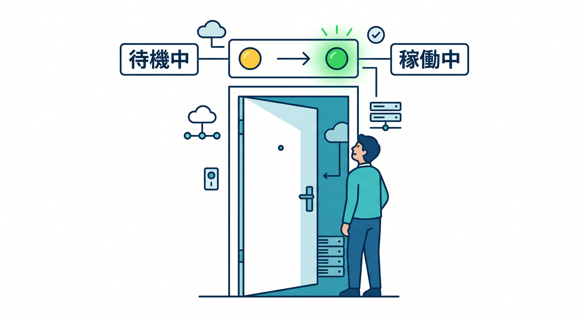
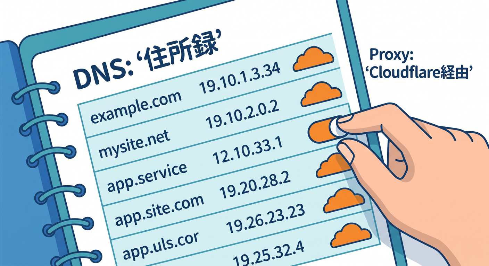
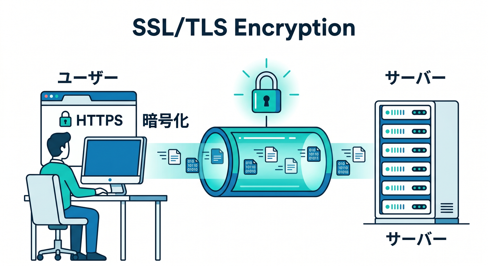
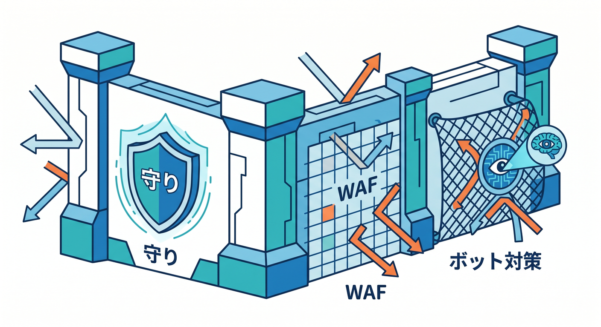
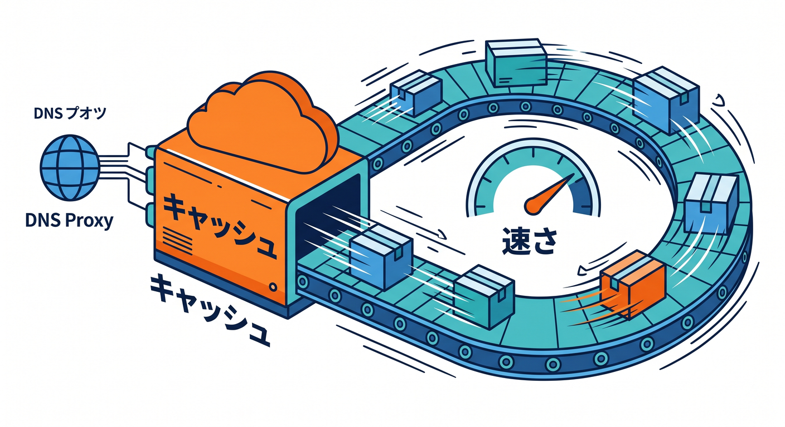
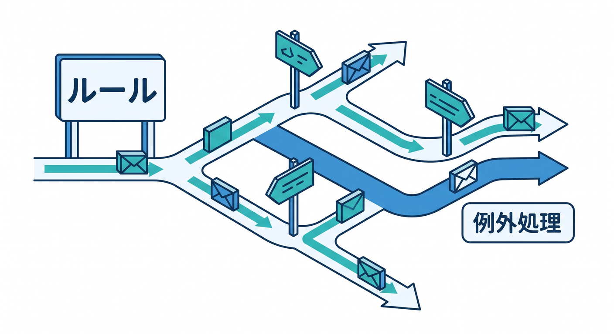
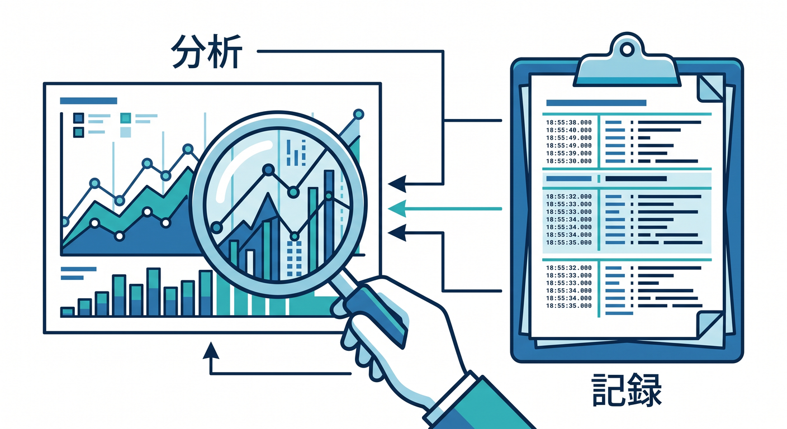

# 第05章：ドメインを追加したあと、何がどこに出るのか見てみよう 🌐🚶‍♀️✨

この章は、**設定をがっつり変更する章**ではありません 😊
目的はただひとつ、**「ドメインをCloudflareに追加したあと、Zone側に何のメニューが出て、どの系統の仕事がどこに置かれているか」**を体で覚えることです。Cloudflareでは、アカウントを選んだ段階ではアカウント単位の製品が並び、ドメインを選んでZoneの中に入ると、そのドメイン専用の管理メニューが並ぶようになります。つまり、**ドメインを追加すると“そのドメイン専用のコックピット”が出てくる**感じです ✈️☁️ ([Cloudflare Docs][1])

まず最初に、すごく大事な感覚を1つだけ持ってください 🌱
**Zone = そのドメインの運用エリア**です。ここでは、そのドメインに対して DNS、SSL/TLS、キャッシュ、セキュリティ、ルール、解析などをまとめて見ます。なので第5章では、「設定の意味を完璧に理解する」よりも、**“このメニューは通信の住所まわりだな”“これは守りだな”“これは速さだな”**と分類できれば大成功です 🎉 ([Cloudflare Docs][1])

## この章のゴール 🎯

この章を読み終えたら、次の状態になっていれば十分です 😊

1. ドメイン追加後に、Zone側の画面へ入る意味がわかる。 ([Cloudflare Docs][1])
2. DNS、SSL/TLS、Security、Cache、Rules、Analytics & Logs、Settings の役割をざっくり言える。 ([Cloudflare Docs][2])
3. AI系は「ドメインの中に全部ある」のではなく、最近は独立した上位導線もあるとわかる。 ([Cloudflare Docs][3])

---

## 1. まずは Overview を“玄関”として見る 🚪🏠

ドメインを追加した直後に、最初の基準点として見やすいのが **Overview** です。ここは「このZoneはいま有効なのか」「Nameserverの切り替えは済んだのか」みたいな、**ドメイン全体の状態を見る玄関**だと思ってください。Cloudflare公式でも、Nameserver名の確認や Pending 状態の再確認導線として Overview が使われています。 ([Cloudflare Docs][4])

特に初心者のうちは、**Active か Pending か**だけ見られればかなり安心です 😊
Zone status は、ざっくりいうと Setup → Pending → Active の流れで進み、**Active になってはじめて Cloudflare のアプリケーション向け設定が効く**と考えるとわかりやすいです。Pending の間は Cloudflare 側のNameserverが割り当てられていても、まだ本番運用として使う段階ではありません。 ([Cloudflare Docs][5])

**この章の散歩ポイントその1**は、まず Overview を開いて「このドメインはいま生きているか？」を見ることです 👀✨
まだ設定を触らなくて大丈夫です。**“ここが入口”**と覚えるだけで十分です。 ([Cloudflare Docs][4])

---

## 2. DNS は“住所録”のフロア 📬🗂️

次に見るのが **DNS** です。ここは、そのドメインがどこを向くかを決める場所です。Cloudflareでドメインを追加すると、オンボード時に自動スキャンされたレコードや、手動で追加したレコードが **DNS Records** ページに並びます。A、AAAA、CNAME、MX、TXT などがここに集まります。 ([Cloudflare Docs][6])

DNS画面で初心者がまず見るべき列は、**Type / Name / Content / Proxy status / TTL** です 😊
Cloudflare公式でも、A・AAAA・CNAME では Proxy status を決めること、TTL はレコード更新が利用者へ届く速さに関わることが説明されています。つまりDNS画面は、**「名前」「行き先」「Cloudflareを通すか」「どれくらいで反映が広がるか」**を見る場所です。 ([Cloudflare Docs][2])

特に大事なのが **Proxy status** です ☁️🟧
Cloudflareでは、A / AAAA / CNAME のようなIP解決系レコードだけがプロキシ対象で、**Web配信に使うレコードは Proxied にするのが基本**です。オンボード時には、対象レコードのプロキシがデフォルトでオンになる案内もあります。逆に、第三者サービスのドメイン確認用CNAMEなどは、一般にプロキシしないほうがよいとされています。 ([Cloudflare Docs][7])

ここでの学び方はシンプルです 🌟
DNSは「難しいレコード暗記の場所」ではなく、**“このドメインの名前解決と行き先を管理する棚”**として見るだけでOKです。第6章でDNS自体はもっとやさしく整理するので、この章では**“DNSは左メニューのかなり重要な場所にある”**と覚えておけば十分です。 ([Cloudflare Docs][2])

---

## 3. SSL/TLS は“通信の鍵と通り道”のフロア 🔐🌍

その次に見てほしいのが **SSL/TLS** です。ここは「HTTPSに関係する場所」という理解で大丈夫です。Cloudflare公式では、SSL/TLS の Encryption Mode は、**利用者 ↔ Cloudflare** と **Cloudflare ↔ オリジンサーバー** の2本の接続をどう扱うかを決める設定として説明されています。 ([Cloudflare Docs][8])

初心者がまず覚えたいのは、**ここは“HTTPSをちゃんと成立させるための部屋”**だということです 😊
しかも今のCloudflareでは、**Automatic SSL/TLS** が既定の考え方として案内されており、より安全なモードを自動的に選べる仕組みが段階的に展開されています。ただし、この機能はまだ段階的ロールアウト中で、Zoneによっては従来どおり Custom SSL/TLS のみが見える場合があります。だから、教材を見ながら画面が少し違っても慌てなくて大丈夫です。 ([Cloudflare Docs][8])

また、Cloudflareは可能なら **Full** または **Full (strict)** を推奨しています。これは「Cloudflareの手前だけ暗号化」ではなく、**Cloudflareからオリジンまでの区間もちゃんと守ろう**という考え方です。 ([Cloudflare Docs][8])

SSL/TLS まわりでよく見る項目のひとつが **Always Use HTTPS** です 🔁✨
これは、HTTPで来たアクセスをHTTPSへまとめてリダイレクトする機能で、Edge Certificates側で有効化します。Cloudflare公式では、Encryption Mode が Off のときはこの項目が見えないことも明記されています。つまり、**SSL/TLS の中でも Overview と Edge Certificates の2か所を行き来することがある**、という感覚を持っておくと迷いにくいです。 ([Cloudflare Docs][9])

---

## 4. Security は“守り”のフロア 🛡️🚨

**Security** は、そのドメインを守る場所です。以前よりも整理が進んでいて、今のCloudflare公式では新しいセキュリティダッシュボード上で、**Web application exploits / DDoS attacks / Bot traffic / API abuse / Client-side abuse** といったカテゴリに分けて案内されています。 ([Cloudflare Docs][10])

ここで大事なのは、**Security = 1個の機能ではない**ということです。
WAF、Bot系、AI Bot対策、Under Attack mode、ブラウザ整合性チェックなど、いろいろな防御機能がここに集まっています。なので初心者のうちは、細かい用語よりも、**「攻撃っぽいものを防ぐ部屋がここ」**と覚えるのがいちばん実用的です 😊 ([Cloudflare Docs][10])

しかも最近のCloudflareは、Securityの中にも **AI Security for Apps** や **Block AI Bots**、**AI Labyrinth** など、AI時代っぽい名前の機能が見えるようになっています。ここは「AIそのものを動かす場所」ではなく、**AI時代の攻撃・クローラ・API利用を守る側の場所**だと理解すると整理しやすいです 🤖🛡️ ([Cloudflare Docs][10])

---

## 5. Cache は“速さ”のフロア ⚡📦

**Cache** は、Cloudflareが速いと言われる体感に直結しやすい場所です。ここでは、**何をキャッシュ対象にするか、どれくらいキャッシュするか、どこでキャッシュするか**などを調整します。今のCloudflare公式では、中心になる考え方は **Cache Rules** です。 ([Cloudflare Docs][11])

Cache Rules は、キャッシュの可否や時間を細かく変えられる仕組みで、ダッシュボード、API、Terraformから作成できます。ただし公式にもある通り、**Cache Rules はそのホスト名が Cloudflare でプロキシされていることが前提**です。つまり、DNSで灰色雲のままだと、Cacheでできることはかなり減ります。 ([Cloudflare Docs][11])

この章では設定値の深掘りは不要です 😊
それよりも、**Cache は“速さの棚”で、DNSのProxy statusとつながっている**とわかれば十分です。DNSで通し、Cacheで効かせる。そういう並びで見ると、Cloudflareの画面が急に立体的に見えてきます。 ([Cloudflare Docs][11])

---

## 6. Rules は“例外処理のフロア” 🎛️🧠

**Rules** は最初ちょっと抽象的に見えますが、実はかなり大事です。Cloudflare公式では、Rulesは**アクセスの扱い方を条件付きで変える仕組み**として説明されています。たとえば、リダイレクト、URL書き換え、転送先の上書き、個別設定の切り替えなどを行えます。 ([Cloudflare Docs][12])

今のRules系には、**Configuration Rules / Transform Rules / Redirects / Origin Rules / Compression Rules / Page Rules** などがあります。初心者向けには、**“特定の条件にだけ特別ルールを当てる場所”**と覚えるとかなりわかりやすいです。 ([Cloudflare Docs][12])

ここでひとつ最新UIの大事なポイントがあります 📌
Cloudflareは新しい実装では **modern Rules features** を推奨しており、Page Rules はまだ使えるものの、新規構成ではより柔軟な Rules 製品群を使う流れです。公式の移行ガイドでも、Rules > Overview のテンプレート利用や、Page Rules から新しい Rules への置き換えが強く案内されています。なので今の管理画面では、**Page Rulesがあっても“主役はRules Overview側”**と見ておくとよいです。 ([Cloudflare Docs][13])

---

## 7. Analytics & Logs は“観察のフロア” 📊🔍

設定を変える場所だけではなく、**今どうなっているかを見る場所**もあります。それが **Analytics & Logs** です。Cloudflare公式では、Zoneの分析画面で **Traffic / Security / Performance / DNS / Workers / Logs** といったタブを見られると案内されています。 ([Cloudflare Docs][14])

ここは初心者ほど大切です 😊
なぜかというと、Cloudflareは設定項目が多いので、いじる前に「何が起きているか」を見る習慣があるだけで、かなり強くなれるからです。DNS側にも独立したAnalyticsがあり、DNSクエリの傾向をダッシュボードで確認できます。つまり、**Cloudflareは“設定の箱”であると同時に“観察の箱”でもある**わけです。 ([Cloudflare Docs][14])

---

## 8. Settings は“Zoneの裏方”のフロア 🧰⚙️

最後に見ておきたいのが **Settings** です。ここは派手ではありませんが、**地味に大事な裏方メニュー**です。たとえば DNS の Settings には DNSSEC の有効化があり、CloudflareでDNSSECを有効にすると、DSレコード作成に必要な情報を確認できます。 ([Cloudflare Docs][15])

DNSSEC は初心者が今すぐ使いこなす必要はありませんが、**「設定の本丸じゃないけど、後で効いてくるインフラ系の項目が Settings にいる」**と知っておくのはとても大事です。OverviewやDNSが表玄関なら、Settingsは**機械室**みたいな感じです 🏭✨ ([Cloudflare Docs][15])

---

## 9. じゃあ AI はどこにあるの？ 🤖☁️

ここ、かなり混乱しやすいポイントです 😵‍💫
ドメインを追加すると Zone 側メニューが増えるので、「AI系もこのドメインの中に全部ぶら下がるのかな？」と思いがちですが、最近のCloudflareでは **AI がダッシュボード左側のトップレベル項目として独立**しました。2026年2月の公式Changelogでも、**AI now has its own top-level section in the Cloudflare dashboard sidebar** と案内されています。 ([Cloudflare Docs][3])

つまり整理するとこうです ✨
**DNS・SSL/TLS・Security・Cache・Rules などはZone中心の話**。一方で、**Workers AI や AI Gateway などは、最近かなり見つけやすくなった独立AI導線でも触る**、という感覚です。だから第5章では、「ドメインを追加したから全部がそのドメイン配下に見えるわけではない」と知るだけで十分です。これがわかると、第10章や第11章のAI章がかなり理解しやすくなります。 ([Cloudflare Docs][3])

---

## 10. この章のおすすめ散歩ルート 🚶‍♂️🌈

実際に画面を開いたら、次の順で1周してみてください。

まず **Overview** を開いて、Zone status と Nameserver の存在を確認します。 ([Cloudflare Docs][5])
次に **DNS** へ行き、A / CNAME / MX / TXT と Proxy status を眺めます。 ([Cloudflare Docs][2])
そのあと **SSL/TLS** へ行き、「HTTPSの部屋なんだな」とだけ理解します。 ([Cloudflare Docs][8])
続いて **Security** を開き、「守りのカテゴリがたくさん入っている」と眺めます。 ([Cloudflare Docs][10])
次に **Cache** と **Rules** を見て、「速さ」「条件付きの例外処理」の棚だと整理します。 ([Cloudflare Docs][11])
最後に **Analytics & Logs** と **Settings** を見て、「観察」と「裏方」があることを確認します。 ([Cloudflare Docs][14])

この順番で眺めるだけで、CloudflareのZone画面はかなり怖くなくなります 😊
最初は意味を全部理解しなくて大丈夫です。**“置き場所がわかる”こと自体が、もうかなり大きな前進**です。 🌟

---

## 11. VS Code + Copilot を使った学び方のコツ 💻🤝

この章ではコードを書く必要はありませんが、学習効率を上げるなら **VS Code の Copilot Chat** を横に置くのはかなり相性がいいです。GitHub公式でも、Copilot Chat は IDE 内でコード提案、説明、テスト生成、修正提案などに使えると案内されています。 ([GitHub Docs][16])

たとえば、Cloudflareの画面を見ながらこんな感じで質問すると便利です 😊
「CloudflareのProxy statusって初心者向けに言うと何？」
「Always Use HTTPS と Redirect Rules の違いを短く教えて」
「Page Rules と modern Rules の違いをやさしく整理して」
こういう聞き方をすると、**管理画面のラベルを“自分の言葉”に変換しやすくなる**ので、暗記よりずっとラクです。 ([GitHub Docs][16])

---

## 12. この章のまとめ 🧡

ドメインをCloudflareへ追加すると、そのドメイン専用の **Zoneメニュー** が増えます。そこでは、**DNS が住所録、SSL/TLS が通信の鍵、Security が守り、Cache が速さ、Rules が条件付き制御、Analytics & Logs が観察、Settings が裏方**、という並びで見るととても理解しやすいです。 ([Cloudflare Docs][1])

そして2026年時点では、AI系はさらに見つけやすく整理され、**AI専用のトップレベル導線**も強くなっています。なので、**Zoneの中を散歩して覚えるもの**と、**アカウント側・AI側で見るもの**を分けて考えると、Cloudflare全体の地図がかなりスッキリします 🤖🗺️✨ ([Cloudflare Docs][3])

次の第6章では、この中でも特に緊張しやすい **DNS画面** を、もっとやさしく「住所録」として見ていきます 📬☁️
ここまで来たら、もうかなりいい感じです 🎉

必要なら続けて、この第5章に対応する
**「章末クイズ」版** か **「実際にクリックする手順書」版** にして整えられます。

[1]: https://developers.cloudflare.com/fundamentals/concepts/accounts-and-zones/ "Accounts, zones, and profiles · Cloudflare Fundamentals docs"
[2]: https://developers.cloudflare.com/dns/manage-dns-records/how-to/create-dns-records/ "Manage DNS records · Cloudflare DNS docs"
[3]: https://developers.cloudflare.com/changelog/post/2026-02-19-ai-dashboard-experience-improvements/ "AI dashboard experience improvements · Changelog"
[4]: https://developers.cloudflare.com/dns/zone-setups/full-setup/setup/ "Change your nameservers (Full setup) · Cloudflare DNS docs"
[5]: https://developers.cloudflare.com/dns/zone-setups/reference/domain-status/ "Zone status · Cloudflare DNS docs"
[6]: https://developers.cloudflare.com/fundamentals/manage-domains/add-site/ "Onboard a domain · Cloudflare Fundamentals docs"
[7]: https://developers.cloudflare.com/dns/proxy-status/ "Proxy status · Cloudflare DNS docs"
[8]: https://developers.cloudflare.com/ssl/origin-configuration/ssl-modes/ "Encryption modes · Cloudflare SSL/TLS docs"
[9]: https://developers.cloudflare.com/ssl/edge-certificates/additional-options/always-use-https/ "Always Use HTTPS · Cloudflare SSL/TLS docs"
[10]: https://developers.cloudflare.com/security/settings/ "Security settings · Security dashboard docs"
[11]: https://developers.cloudflare.com/cache/how-to/cache-rules/ "Cache Rules · Cloudflare Cache (CDN) docs"
[12]: https://developers.cloudflare.com/rules/ "Overview · Cloudflare Rules docs"
[13]: https://developers.cloudflare.com/rules/reference/page-rules-migration/ "Page Rules migration guide · Cloudflare Rules docs"
[14]: https://developers.cloudflare.com/analytics/account-and-zone-analytics/zone-analytics/ "Zone Analytics · Cloudflare Analytics docs"
[15]: https://developers.cloudflare.com/dns/dnssec/ "DNSSEC · Cloudflare DNS docs"
[16]: https://docs.github.com/en/copilot/how-tos/chat-with-copilot "GitHub Copilot Chat - GitHub Docs"

