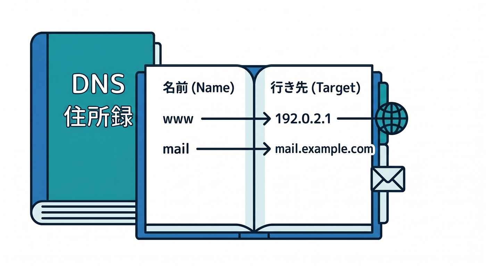
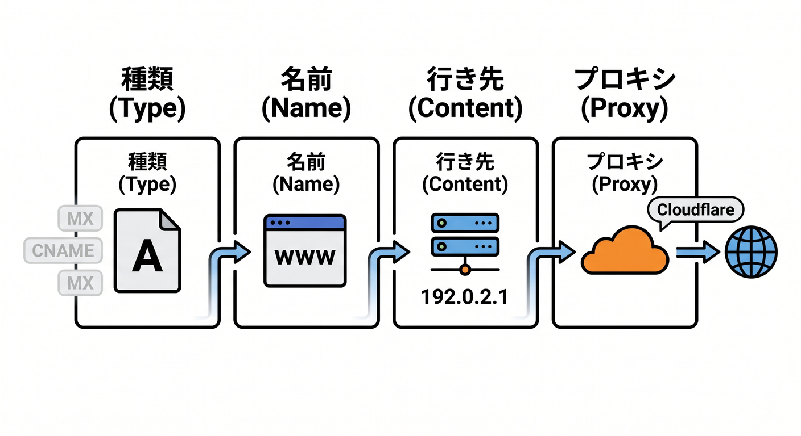
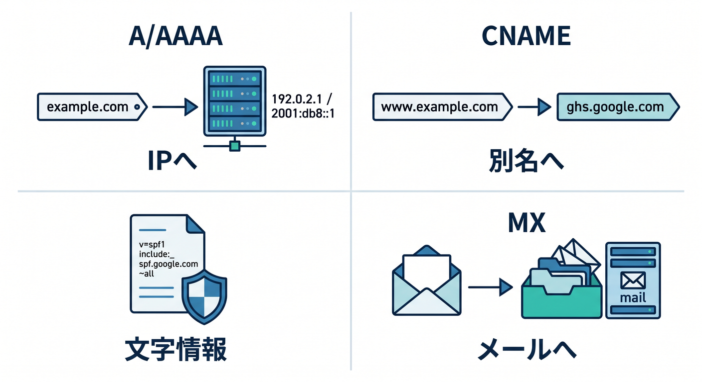
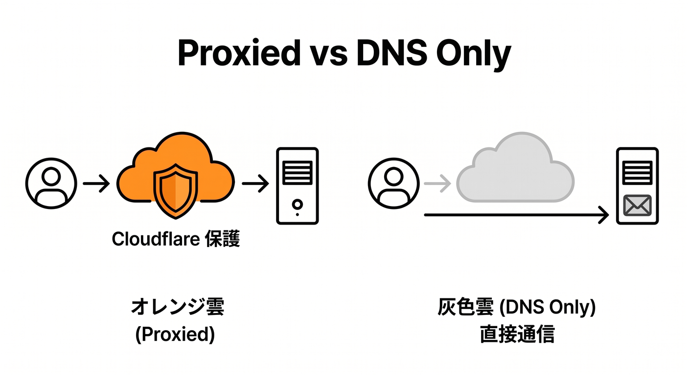
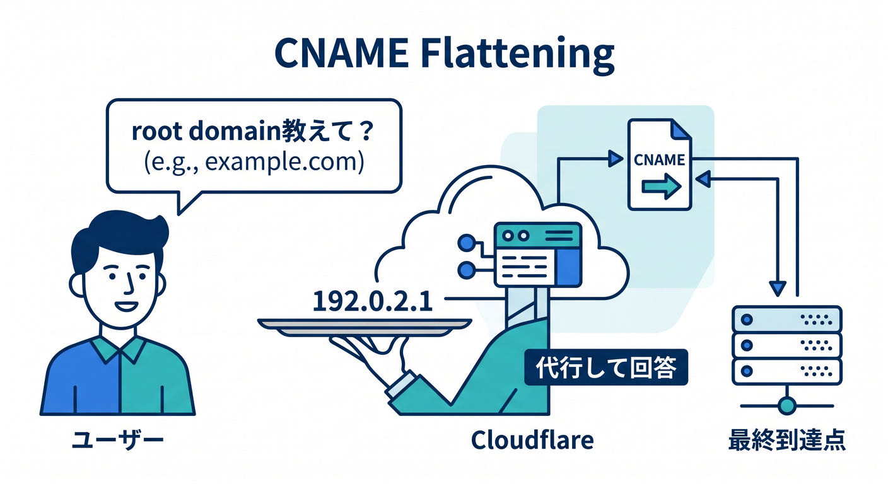
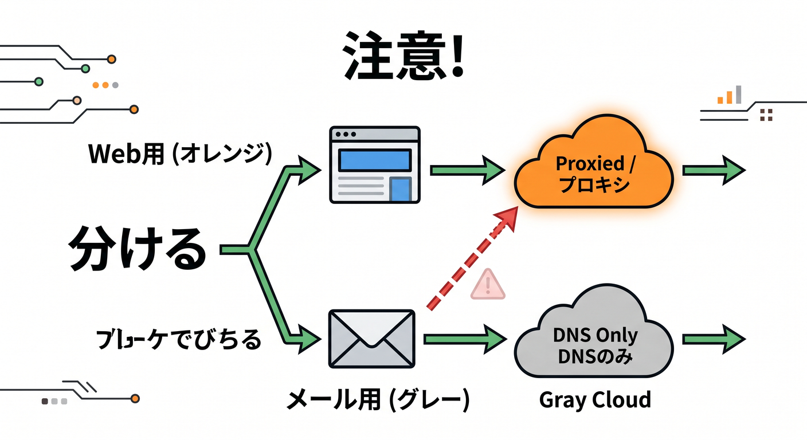

# 第06章：DNSまわりは“住所録”だと思って見よう 📬☁️

この章は、Cloudflare の DNS 画面を見て「うっ…難しそう…😵」となる気持ちを、かなり軽くするための章です。
DNS は、ざっくり言うと「この名前を、どこへ向けるか」を決める住所録です。

Cloudflare 公式でも、DNS レコードはドメインの情報を持ち、Web サイトやアプリを訪問者や他のサービスから利用可能にするためのものだと説明されています。([Cloudflare Docs][1])

この章で目指すのは、DNS を完璧に設定できることではありません 😊
まずは「Records 画面の1行1行が、何となく読める」「A と CNAME と TXT と MX の違いがざっくり分かる」「オレンジ雲と灰色雲でビビらなくなる」ここまで行ければ大成功です。Cloudflare にドメインを追加したあと、レコードは DNS Records ページに並び、自動スキャンで拾われることもありますが、前の DNS プロバイダの内容と見比べて不足がないか確認するのが大事です。しかも quick scan は Type と Name のよくある組み合わせを元にしているため、特殊なホスト名やカスタム名の DKIM などは拾い漏れることがあります。([Cloudflare Docs][2])

## 1. DNS は「名前」と「行き先」をつなぐ仕組み 📮

人は `example.com` や `www.example.com` のような名前でサイトに行きますが、実際の通信では IP アドレスや別名のホスト名にたどり着く必要があります。DNS レコードは、その対応表を持っているイメージです。Cloudflare のレコード種別の説明でも、A / AAAA は名前を IP アドレスへ、CNAME は名前を別のホスト名へ向ける役割として整理されています。([Cloudflare Docs][3])

ここで大事なのは、「DNS はページ本文そのものを置く場所ではない」という点です 📦
DNS はあくまで入口案内係です。「このサイト本体はこのサーバーへ」「このメールはこのメールサーバーへ」「この確認用文字列はここにありますよ」という札を並べる場所、と思うとかなり分かりやすいです。Cloudflare の DNS 画面も、まさにその札を一覧で管理する場所です。([Cloudflare Docs][1])

## 2. まず見るのは DNS Records 画面だけで OK 👀

初心者のうちは、DNS まわりで最初に見る場所を 1 か所に絞るのがおすすめです。
対象ドメインを開いて、DNS Records ページを見る。まずはこれだけで十分です。Cloudflare 公式の作成・編集手順も、この DNS Records ページを起点に案内されています。([Cloudflare Docs][4])

この画面では、1行が1枚の住所カードです 🗂️
見方はだいたい次の感覚で OK です。

* **Type**
  レコードの種類です。A、AAAA、CNAME、MX、TXT などが並びます。([Cloudflare Docs][3])
* **Name**
  どの名前に対する設定かです。`@` はルートドメイン、`www` や `api` はサブドメインです。A / AAAA / CNAME では zone apex の `@` も使えます。([Cloudflare Docs][3])
* **Content / Target**
  どこへ向けるかです。A なら IP、CNAME なら別名のホスト名、MX ならメール配送先が入ります。([Cloudflare Docs][3])
* **Proxy status**
  Cloudflare を経由させるかどうかです。ここが Cloudflare らしい重要ポイントです。([Cloudflare Docs][5])
* **TTL**
  変更がどれくらいキャッシュされるかの時間です。早く変わってほしいか、安定重視か、の感覚に関わります。([Cloudflare Docs][6])

## 3. 最初に覚えるのは 4 種類だけで十分 🌱

DNS にはいろいろな種類がありますが、最初はこの 4 つが読めればかなり戦えます。

**A / AAAA** は「この名前はこの IP アドレスへ行ってね」です。
A は IPv4、AAAA は IPv6 です。Web サイト本体や mail サブドメインの向き先を指定するときによく出ます。Cloudflare では A / AAAA / CNAME が IP 解決系の中心で、これらだけが Cloudflare プロキシの対象になります。([Cloudflare Docs][3])

**CNAME** は「この名前は、別の名前の別名です」です。
`www` を本体に向けたり、SaaS や別サービスにつないだりするときに頻出です。Cloudflare では CNAME も proxy 対象にできますし、あとで出てくる CNAME flattening とも関係が深いです。([Cloudflare Docs][3])

**TXT** は「文字情報を置く札」です。
ドメイン所有確認、SPF、DMARC など、見た目のサイト表示ではなく“確認・認証・ポリシー”系でよく使います。Cloudflare の record types でも TXT は特殊用途の代表格として整理され、メールなりすまし防止の説明でも TXT の重要性が出てきます。([Cloudflare Docs][3])

**MX** は「メールはこのサーバーへ」です。
サイト表示ではなくメール配送先の設定です。Cloudflare のメール設定ガイドでも、送受信用には A/AAAA の mail 用レコードを作り、その先を MX で指す流れになっています。([Cloudflare Docs][7])

## 4. Cloudflare っぽさの本丸は「オレンジ雲」と「灰色雲」☁️🟧⚪

Cloudflare の DNS 画面で最重要なのが Proxy status です。
Cloudflare 公式では、A / AAAA / CNAME のような IP 解決系レコードだけがプロキシ可能で、Web トラフィックを配信する A / AAAA / CNAME は proxied を推奨しています。一方で、サードパーティのドメイン確認用 CNAME のようなレコードは proxied にしないほうがよいと明記されています。さらに、ダッシュボードでドメインを追加したときは proxying がデフォルトでオンです。([Cloudflare Docs][5])

これを感覚で言うと、こうです 😊

* **オレンジ雲（Proxied）**
  Web の入口を Cloudflare に通すモード。DNS 応答では Cloudflare の anycast IP が返り、HTTP/HTTPS リクエストは Cloudflare ネットワークを通ります。DDoS 防御、最適化、キャッシュ、各種 Cloudflare 機能の適用対象になりやすいです。([Cloudflare Docs][5])
* **灰色雲（DNS only）**
  単純に「名前を答えるだけ」のモード。実際の origin IP がそのまま返り、Cloudflare は HTTP/HTTPS の中継には入りません。Cloudflare の HTTP/HTTPS analytics も付きません。([Cloudflare Docs][5])

初心者向けの超ざっくり判断はこれで十分です ✨
**“人がブラウザで見るサイト”はオレンジ雲寄り、メール・所有確認・一部の外部サービス連携は灰色雲寄り**です。もちろん例外はありますが、最初はこの感覚がかなり役立ちます。Cloudflare 公式のメール設定でも `mail` 用 A レコードは DNS only の例になっています。([Cloudflare Docs][5])

## 5. TTL は「反映の速さ」と「落ち着き」のバランス時計 ⏱️

TTL は、DNS の答えをどれくらいキャッシュしてよいかの目安です。長いほどキャッシュが効きやすく、短いほど変更は伝わりやすくなります。Cloudflare 公式では、proxied レコードの TTL は Auto 固定で 300 秒、編集できません。DNS only レコードは、非 Enterprise なら 60 秒から 1 日の範囲で選べます。([Cloudflare Docs][6])

ただし、ここでありがちな誤解があります 🙃
「TTL が 300 秒だから、5 分ぴったりで全世界必ず切り替わる」とは限りません。Cloudflare 公式も、実際にはローカル DNS キャッシュなどでもっと時間がかかることがあると案内しています。なので、変更後に少し様子を見るのは普通です。([Cloudflare Docs][5])

## 6. CNAME flattening は「ちょっと賢い別名処理」くらいで OK 🪄

CNAME flattening は、Cloudflare の DNS でよく見る少し上級っぽい言葉ですが、最初は深追いしなくて大丈夫です。
公式には、CNAME flattening は CNAME 解決を速くし、さらに zone apex、つまり `example.com` のようなルートでも CNAME を使えるようにする仕組みです。Cloudflare Pages のルートカスタムドメインでも、この仕組みが効いています。([Cloudflare Docs][8])

初心者向けには、こう覚えると十分です 🌸

**「CNAME は別名だけど、Cloudflare はかなり気を利かせて扱ってくれる」**。だから `www` だけでなく、ルートドメインまわりでも Cloudflare なら扱いやすい場面があります。([Cloudflare Docs][8])

## 7. メールと確認用レコードは、うっかりオレンジ雲にしない 📧⚠️

DNS 初学者がいちばんやりがちなのがここです。
メール系は Web ページ表示のための通信ではないので、Cloudflare のメール設定例でも `mail` 用 A レコードは DNS only、そこへ MX を向ける流れです。つまり、**メール用の入口は“Web を守る雲”に通す感覚ではない**、と考えると理解しやすいです。

([Cloudflare Docs][7])

また、所有確認や接続確認で使う CNAME/TXT も注意です。Cloudflare 公式は、サードパーティのドメイン確認に使う CNAME は proxied にしないよう案内しています。さらに quick scan はカスタム名の DKIM などを取りこぼすことがあるので、メール系や検証系のレコードは「自動で入ってるはず」と思い込まず、自分で確認する癖が大事です。([Cloudflare Docs][5])

## 8. DNS 画面は「設定する場所」でもあり「観察する場所」でもある 🔍

Cloudflare の DNS は、ただレコードを書くだけの場所ではありません。
公式には DNS analytics も用意されていて、ダッシュボードからゾーンに対する DNS クエリのデータを確認できます。つまり DNS は、設定だけでなく「ちゃんと見られているか」「変な問い合わせが増えていないか」を観察する入口でもあります。([Cloudflare Docs][9])

また、レコードにコメントやタグを付けられるのも地味に便利です 🏷️
公式では、comments / tags はレコードの目的整理やフィルタに役立ち、公開の DNS 応答には影響しない“自分たち用のメモ”だと説明されています。運用が増えてくると、「これは本番 API 用」「これは検証用」「これはメール用」と書き残せるのがかなり効きます。([Cloudflare Docs][10])

## 9. AIアプリ時代でも、DNS はちゃんと入口になる 🤖🚪

Cloudflare の AI 系機能と DNS は、別の話に見えて実はちゃんとつながっています。
Workers AI は Workers・Pages・Cloudflare API から使える AI 実行基盤で、AI Gateway は AI アプリに対して analytics、logging、caching、rate limiting、retry、model fallback などを与える管理レイヤーです。しかも Workers AI は AI Gateway と素直に連携できます。([Cloudflare Docs][11])

つまり、将来 `chat.example.com` や `api.example.com` のような AI アプリの入口を作るときも、最終的には「どの名前をどこへ向けるか」という DNS の発想が効いてきます。Workers の custom domain 設定でも DNS Records ページと行き来する流れがあるので、DNS を怖がらなくしておくことは、AI 学習の前準備としてもかなり大事です。

([Cloudflare Docs][12])

## 10. VS Code と Copilot を使うと、DNS 学習がかなり楽になる 💻✨

GitHub Copilot Chat は、IDE の中で一般的なソフトウェア質問、プロジェクトについての質問、コードの作成や修正、ファイルの説明などに使えます。公式ドキュメントでも、VS Code で開いているファイルや添付したファイルを参照しつつ、`@workspace` や `#file` などで文脈を与えて質問する使い方が案内されています。([GitHub Docs][13])

この章では、たとえばこんな聞き方が相性抜群です 😊

* 「この DNS レコード一覧を初心者向けに説明して」
* 「A / CNAME / MX / TXT の役割を、この zone の実例で整理して」
* 「このレコードのうち、Web 用とメール用を分けて」
* 「この設定で proxied にしてよい候補と、DNS only にすべき候補を教えて」

Cloudflare の公式画面を見ながら、Copilot に“翻訳役”をしてもらう感じです。DNS は専門用語が先に立ちやすいので、AI を先生役にすると理解がかなり滑らかになります。GitHub 公式が示すように、関連ファイルを開く・添付する・`@workspace` を使う、の3つを意識すると精度が上がりやすいです。([GitHub Docs][13])

## 11. この章のミニ散歩コース 🚶‍♂️☁️

この章の実践は、設定変更より「読む練習」が中心で OK です。

1. Cloudflare で対象ドメインを開く。
2. DNS Records 画面を開く。
3. 1行ずつ「Type」「Name」「Content」「Proxy status」を声に出して読む。
4. そのレコードが「サイト表示用」「メール用」「確認用」のどれっぽいか分類する。
5. オレンジ雲の行だけ見て、「これは人がブラウザで触る入口かな？」と考える。
6. 灰色雲の行だけ見て、「これは確認用かな？メール用かな？」と考える。
7. 分からない行は Copilot に貼って意味を聞く。([Cloudflare Docs][4])

これだけでも、DNS 画面の怖さはかなり減ります 🌼
DNS 学習の最初の勝ち筋は、「全部設定できる」ではなく「見ても逃げたくならない」です。

## 12. この章のまとめ 🎉

この章で持ち帰ってほしい感覚は 4 つです。

* DNS は「名前」と「行き先」をつなぐ住所録。([Cloudflare Docs][1])
* 最初に読むべきは A / CNAME / TXT / MX。([Cloudflare Docs][3])
* Cloudflare では Proxy status が超重要。Web は proxied 寄り、メールや確認用は DNS only 寄り。([Cloudflare Docs][5])
* DNS は古い基盤技術に見えて、Workers、Pages、AI Gateway、Workers AI へ進むときの入口整理にも直結する。([Cloudflare Docs][11])

この第6章は、DNS を“設定の暗記科目”ではなく、**Cloudflare 全体に入るための入口地図**として見る章です 🗺️☁️
ここがふんわり見えてくると、次の開発系メニューや AI 系メニューもかなり怖くなくなってきます 🌟

必要なら続けて、この流れのまま **第7章「Workers & Pages を見て、開発系の中心地を覚えよう 🧑‍💻」** も同じトーンで詳しく作れます。

[1]: https://developers.cloudflare.com/dns/manage-dns-records/ "DNS records · Cloudflare DNS docs"
[2]: https://developers.cloudflare.com/fundamentals/manage-domains/add-site/ "Onboard a domain · Cloudflare Fundamentals docs"
[3]: https://developers.cloudflare.com/dns/manage-dns-records/reference/dns-record-types/ "DNS record types · Cloudflare DNS docs"
[4]: https://developers.cloudflare.com/dns/manage-dns-records/how-to/create-dns-records/?utm_source=chatgpt.com "Manage DNS records"
[5]: https://developers.cloudflare.com/dns/proxy-status/ "Proxy status · Cloudflare DNS docs"
[6]: https://developers.cloudflare.com/dns/manage-dns-records/reference/ttl/ "Time to Live (TTL) · Cloudflare DNS docs"
[7]: https://developers.cloudflare.com/dns/manage-dns-records/how-to/email-records/ "Set up email records · Cloudflare DNS docs"
[8]: https://developers.cloudflare.com/dns/cname-flattening/ "CNAME flattening · Cloudflare DNS docs"
[9]: https://developers.cloudflare.com/dns/additional-options/analytics/ "Analytics and logs · Cloudflare DNS docs"
[10]: https://developers.cloudflare.com/dns/manage-dns-records/reference/record-attributes/ "DNS record comments and tags · Cloudflare DNS docs"
[11]: https://developers.cloudflare.com/workers-ai/ "Overview · Cloudflare Workers AI docs"
[12]: https://developers.cloudflare.com/workers/configuration/routing/custom-domains/ "Custom Domains · Cloudflare Workers docs"
[13]: https://docs.github.com/ja/copilot/how-tos/chat-with-copilot/get-started-with-chat "GitHub Copilot ChatのプロンプトをIDEで開始する方法 - GitHubドキュメント"

