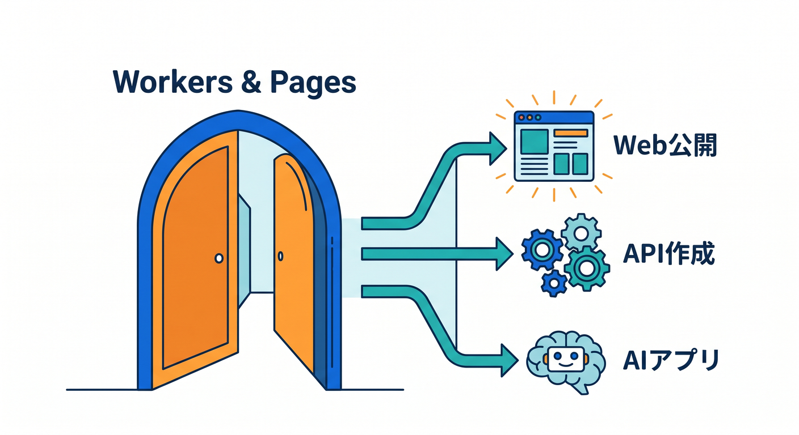
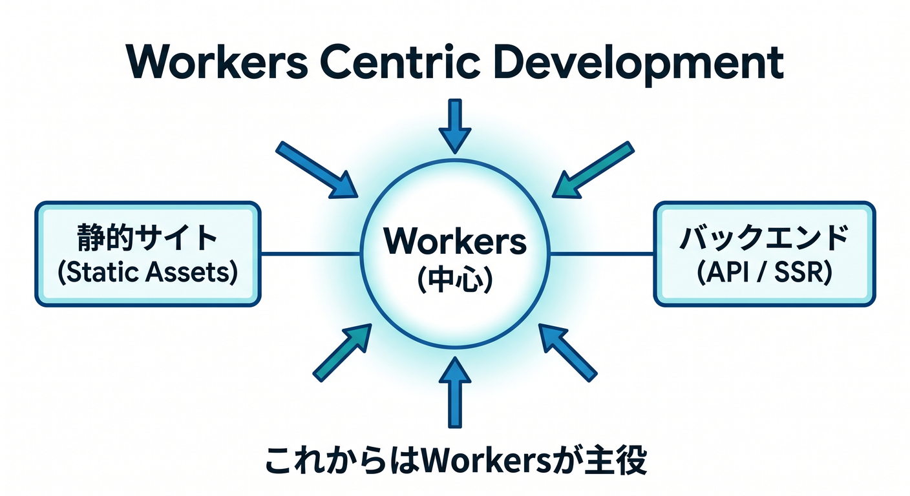
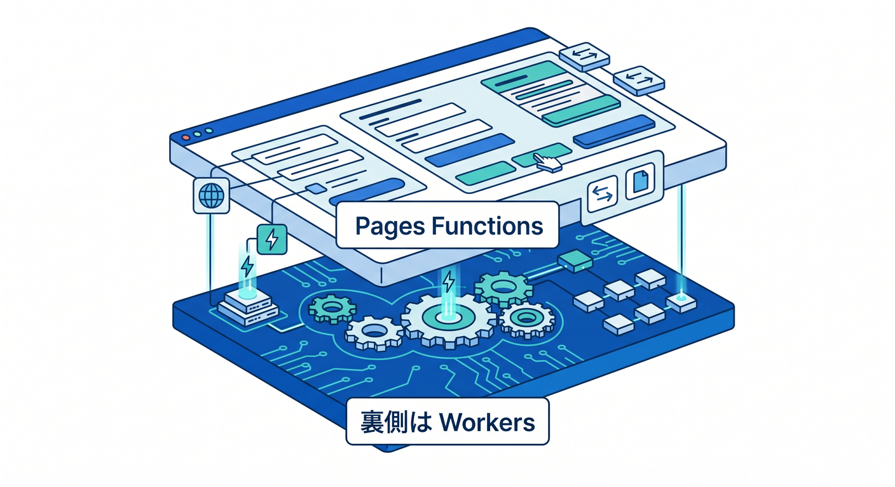
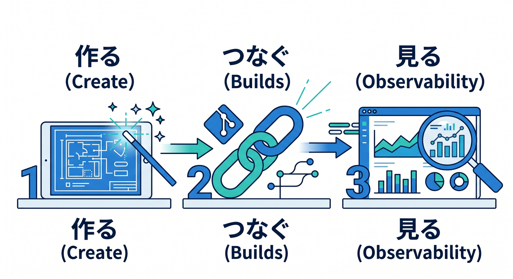
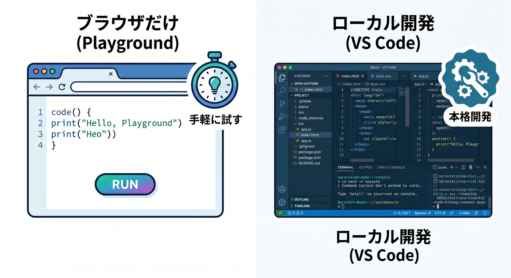
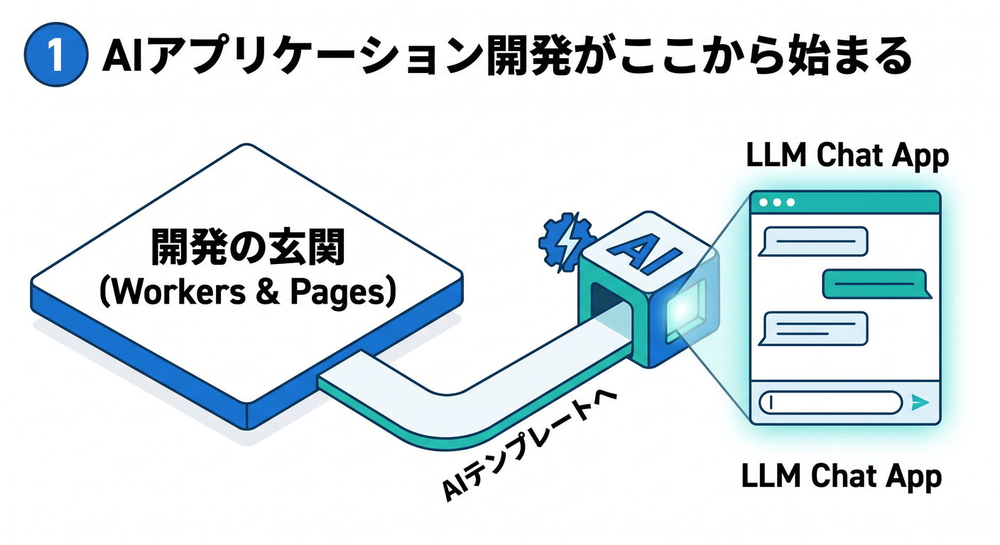
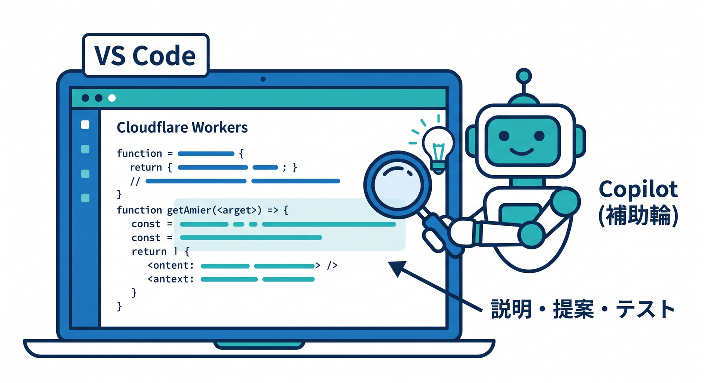

# 第07章：Workers & Pages を見て、開発系の中心地を覚えよう 🧑‍💻☁️🚪

この章では、Cloudflare の管理画面の中で「開発するならまずここを見る」という場所を、やさしく地図化していきます 😊
2026年4月14日時点の公式情報で見ると、アプリ開発の入口は今でも **Workers & Pages** で、ここから Worker の作成、Git 連携、静的サイト公開、AIアプリのテンプレート作成までかなり広く始められます。さらに新規プロジェクトでは **Workers Static Assets** が推奨されていて、Pages は引き続き使えるけれど、新機能や最適化の主戦場は Workers 側、という整理が分かりやすいです。 ([Cloudflare Docs][1])

---

## この章のゴール 🎯🌈

この章が終わるころには、次の感覚がつかめていれば大成功です ✨

* **Workers & Pages は「開発の玄関」なんだな**と分かること。 ([Cloudflare Docs][1])
* **Worker / Pages / Pages Functions / Static Assets** の違いを、厳密でなくてもふんわり説明できること。 ([Cloudflare Docs][2])
* **ブラウザだけで触れる入口** と、**VS Code で育てる入口** の両方を見分けられること。 ([Cloudflare Docs][3])
* **AIアプリもこのへんから始めるんだな**と分かること。 ([Cloudflare Docs][4])

---

## 1. まずは一言で覚えよう 🗺️

Cloudflare で「コードを書くもの」「アプリを置くもの」を探すときは、まず **Workers & Pages** を見る、これでOKです 👍
Worker を新規作成する手順も、Workers AI のテンプレートを使う手順も、GitHub/GitLab のリポジトリをつないで自動デプロイする手順も、この入口から始まります。 ([Cloudflare Docs][5])

つまり、この画面はただのメニューではなく、**「Cloudflare でアプリを作る人の発着所」** なんです 🚉☁️

最初は細かい設定を覚えなくて大丈夫で、「開発っぽいことはだいたいここから入る」と覚えるだけでかなり楽になります。 ([Cloudflare Docs][1])

---

## 2. 今のCloudflareでは、Workersがかなり中心です ☁️⚙️

ここ、2026年の学習でかなり大事です 👀
公式の Best Practices では、**新しい静的サイト、SPA、フルスタックアプリには Workers Static Assets を使うのが推奨** されています。Pages は今も使えますが、**新機能や最適化は Workers に寄っている** と明記されています。 ([Cloudflare Docs][6])

さらに Cloudflare は、Workers で **静的アセット、API、SSR ページまでまとめて出せる** と案内していて、Pages から Workers への移行ガイドも用意しています。なので今の感覚としては、
**「Pages も知っておくと便利。でも新しく覚える中心は Workers」**
と考えるとかなりスッキリします 😊

([Cloudflare Docs][7])

---

## 3. Worker と Pages の違いを、やさしく整理しよう 🧠📦

まず **Worker** は、Cloudflare のネットワーク上で動くサーバーレスなコード実行の単位です。
「リクエストを受けたら返事を返す」「API を作る」「HTML を返す」「他の Cloudflare サービスとつなぐ」みたいな役を担当します。管理画面からは `Create application` → `Create Worker` で始められます。 ([Cloudflare Docs][5])

一方で **Workers Static Assets** は、HTML・CSS・画像などの静的ファイルを Worker の一部として持たせて、Cloudflare 側が配信とキャッシュをうまく処理してくれる仕組みです。
つまり、昔ながらの「静的サイト置き場」と「サーバーコード」が別々という感覚より、**フロントもバックも Workers 側に寄せやすい** 形になっています。 ([Cloudflare Docs][2])

**Pages** は、静的サイト公開や Git ベースの公開フローを分かりやすく扱える場所として今も有効です。GitHub や GitLab と接続すると、ブランチごとの preview deployment や PR 上の preview URL も使えます。なので、**見た目中心のサイトをチームで回す** ときはまだかなり使いやすいです。 ([Cloudflare Docs][8])

そして **Pages Functions** は、Pages の中で動くサーバーサイド処理です。ここが大事で、公式にも **“Functions are Workers under the hood”** とあり、裏側では Workers が動いています。つまり、名前は違っても、Cloudflare の実行基盤としてはかなり近い仲間なんです 🤝

([Cloudflare Docs][9])

---

## 4. 管理画面で、どこを見ればいいの？ 👀🧭

Workers & Pages に入ったら、初心者のうちは次の3本だけ見れば十分です 🌱

**① Create application**
ここが新規作成の入口です。普通の Worker を作るときも、AI テンプレートを使うときも、Git リポジトリをつないで始めるときも、まずここです。 ([Cloudflare Docs][5])

**② Import a repository / Builds**
2026年の Workers は GitHub / GitLab とのビルド連携を持っていて、Workers 側でも push ベースの自動ビルドとデプロイができます。既存 Worker に対しても `Settings > Builds` から接続できます。 ([Cloudflare Docs][10])

**③ 既存アプリを開いて Overview / Deployments / Settings / Observability を眺める**
作ったあとに見る場所としてはこの流れが大事です。とくに Observability まわりは 2026年に更新されて、可視化・JSON/CSV export・共有リンクなどが強化されています。 ([Cloudflare Docs][11])

この段階では、まだ全部触らなくて大丈夫です 🙆
「作る」「つなぐ」「様子を見る」の3つの棚がある、と見えれば十分です。

([Cloudflare Docs][10])

---

## 5. ブラウザだけでも、かなり試せます 🌐✨

Cloudflare のいいところのひとつが、**いきなりローカル環境を完璧に整えなくても試せる** ところです。
Workers の **Playground** はセットアップ不要で、ブラウザ上ですぐ preview と test ができます。右側で結果を見ながら編集できて、HTTP タブで POST などの生リクエストも試せます。Windows ならまず Chrome デスクトップで触ると入りやすいです。 ([Cloudflare Docs][1])

しかも Playground とダッシュボードのクイックエディタには、下部に **ログビューア** があり、`console.log()` の出力も確認できます。さらに DevTools も UI に含まれているので、「ちょっと試す」「何が返っているか見る」くらいならかなり戦えます 🔍 ([Cloudflare Docs][3])

ただし、テスト・分割ファイル構成・本格的なデバッグまで行くなら、やはり VS Code + ローカル開発へ進むのがおすすめです。Cloudflare の Vite plugin は Worker コードを **workerd** 上で動かし、本番にかなり近い挙動で開発できます。 ([Cloudflare Docs][12])

---

## 6. React / TypeScript 目線だと、どう見ればいい？ ⚛️📘

React 系の学習者なら、今の Cloudflare はかなり相性が良いです 😊
公式には **React + Vite + Cloudflare Workers API** を組み合わせる流れがあり、フルスタックアプリを作る入口として案内されています。つまり、「React の画面」と「Worker の API」をひとつの流れで考えやすいです。 ([Cloudflare Docs][13])

ローカルで始めるときは、たとえばこんな感じです。
`npm create cloudflare@latest -- my-react-app --framework=react`
これは React 系のスターターとして公式に案内されています。 ([Cloudflare Docs][2])

逆に、**Pages として作りたい** ときは少し注意で、2026年の C3 では `--platform=pages` を明示しないと既定で Workers プロジェクトになります。
つまり、今の時代感としては **「まず Workers が標準、Pages は明示して選ぶ」** に近いです。

([Cloudflare Docs][14])

---

## 7. AIアプリも、ここから始まります 🤖💬✨

この章でぜひ覚えておきたいのが、**AIも別世界じゃない** ということです。
Workers AI のダッシュボード手順では、Cloudflare Dashboard から **Workers & Pages** に行き、`Create application` を押して、テンプレートで **LLM Chat App** を選び、デプロイして `workers.dev` で preview できます。つまり、AIアプリも「AI専用の遠い場所」ではなく、**開発の玄関の延長線上** にあります。 ([Cloudflare Docs][4])

さらに、Pages Functions から Workers AI binding を使う設定もダッシュボード経由で行います。
なので、静的サイト、フルスタック、API、AI 推論が、Cloudflare の中ではかなり自然につながっています。ここが Cloudflare らしい面白さです 🌟

([Cloudflare Docs][9])

---

## 8. 「Pages はもう使わないの？」という疑問への答え 🙋‍♂️

答えは、**まだ使う。でも新規学習の主軸は Workers 側に置くと分かりやすい** です。
Pages には Git 連携、preview deployment、PR preview URL、ロールバックなど、Web公開の気持ちよさが残っています。特に「見た目中心のサイトをチームで更新する」流れではまだ十分魅力があります。 ([Cloudflare Docs][8])

ただし、Pages には注意点もあります。
Git integration で作った Pages プロジェクトは後から Direct Upload に切り替えられませんし、Pages Functions はダッシュボードからの Direct Upload をサポートしていません。こういう細かい差があるので、学習初期は「何でも Pages」と決め打ちせず、**Worker が本体、Pages は公開スタイルの一つ** くらいで見るのが安全です。 ([Cloudflare Docs][8])

---

## 9. まずはこの最短ルートで散歩してみよう 🚶‍♂️☁️

最初の実習は、たったこれだけで十分です ✨

1. Cloudflare ダッシュボードで **Workers & Pages** を開く。 ([Cloudflare Docs][5])
2. **Create application** を押す。 ([Cloudflare Docs][5])
3. まずは **Create Worker > Deploy** で 1 本作る。 ([Cloudflare Docs][5])
4. 作ったらアプリを開いて **Edit Code** を押し、画面内で少し文字を変えてみる。 ([Cloudflare Docs][4])
5. 余裕があれば Playground でも同じように試して、右側 preview とログビューアを見る。 ([Cloudflare Docs][3])
6. そのあとで「AI も気になるな」と思ったら、同じ `Create application` から **LLM Chat App** テンプレートを眺める。 ([Cloudflare Docs][4])

この順番がいいのは、**“Cloudflare は開発画面が怖くない”** と体で覚えやすいからです 😊
最初から D1 や R2 や認証まで全部広げる必要はありません。まずは「作れる」「見える」「直せる」を掴めば勝ちです。 ([Cloudflare Docs][1])

---

## 10. Worker って結局どんなコード？ ✍️☁️

感覚だけつかむなら、Worker はこんなイメージです。

```ts
export default {
  async fetch(): Promise<Response> {
    return new Response("Hello from Cloudflare Workers! ☁️");
  },
};
```

ものすごく雑に言うと、**「リクエストが来たら返事を返す関数を置く場所」** です 😊
ここに API の処理を書いたり、HTML を返したり、AI を呼んだり、R2 や D1 をつないだりしていきます。実際の本格開発では Vite plugin や Wrangler を使って VS Code 側で育てると、とてもやりやすくなります。 ([Cloudflare Docs][12])

---

## 11. VS Code と GitHub Copilot は、こう使うと相性がいい 💡🤝

Cloudflare の開発では、VS Code 上で Copilot を **説明役 + 補助輪** として使うのがかなり相性いいです。
GitHub Docs では、Copilot Chat は IDE 内で **コード提案、コード説明、修正提案、テスト生成** を行えると案内されています。さらに、開いているファイルや選択範囲、`#file` や `#solution`、`@project` などで文脈を与えられます。 ([GitHub Docs][15])

たとえば、Workers の学習中ならこんな聞き方がかなり便利です 👇

* `この Worker は何を返しているの？`
* `#file:src/index.ts Cloudflare Workers 初心者向けに説明して`
* `/fix`
* `/tests`
* `@project このアプリの API の入口はどこ？` ([GitHub Docs][16])

しかも最新の機能マトリクスでは、VS Code 版 Copilot は **Chat、Code completion、MCP、Agent mode、Workspace indexing** などをサポートしています。
なので、Cloudflare 学習で「画面を見て分からない → VS Code で開く → Copilot に聞く」の流れはかなり実戦的です 🚀

([GitHub Docs][17])

---

## 12. この章での“理解の合格ライン” ✅🎉

この章では、次の3つが言えれば十分です。

**「Cloudflare で開発するなら、まず Workers & Pages を見る」**。 ([Cloudflare Docs][1])
**「今は新規なら Workers が中心。Pages はまだ便利だけど、主軸は Workers 側」**。 ([Cloudflare Docs][6])
**「AIアプリもこの入口から始められる」**。 ([Cloudflare Docs][4])

ここまで掴めれば、もう「Workers & Pages って何の場所？」ではなく、
**「ああ、ここが Cloudflare の開発エリアね 😎☁️」**
という目で見られるようになります。

---

## 章末ミニまとめ 📝✨

* **Workers & Pages = Cloudflare の開発玄関**。 ([Cloudflare Docs][1])
* **新規学習の主軸は Workers**。静的サイトも SPA もフルスタックも寄せやすい。 ([Cloudflare Docs][6])
* **Pages Functions は Workers の仲間**。裏側は同じ実行基盤。 ([Cloudflare Docs][9])
* **Playground とダッシュボード編集で、ブラウザだけでもかなり試せる**。 ([Cloudflare Docs][3])
* **AI もここから始まる**。Workers AI のテンプレート導線がある。 ([Cloudflare Docs][4])
* **VS Code + Copilot を添えると、学習速度がかなり上がる**。 ([GitHub Docs][16])

次の章では、この開発エリアの中でも **「Worker詳細画面をどう読むか」** に進むと、とても流れがきれいです 🔭✨

必要ならこのまま続けて、同じ文体・同じ粒度で **第8章** も作れます。

[1]: https://developers.cloudflare.com/workers/get-started/dashboard/ "Get started - Dashboard · Cloudflare Workers docs"
[2]: https://developers.cloudflare.com/workers/static-assets/ "Static Assets · Cloudflare Workers docs"
[3]: https://developers.cloudflare.com/workers/playground/ "Playground · Cloudflare Workers docs"
[4]: https://developers.cloudflare.com/workers-ai/get-started/dashboard/ "Get started - Dashboard · Cloudflare Workers AI docs"
[5]: https://developers.cloudflare.com/learning-paths/workers/get-started/first-worker/ "First Worker · Cloudflare Learning Paths"
[6]: https://developers.cloudflare.com/workers/best-practices/workers-best-practices/ "Workers Best Practices · Cloudflare Workers docs"
[7]: https://developers.cloudflare.com/workers/static-assets/migration-guides/migrate-from-pages/ "Migrate from Pages to Workers · Cloudflare Workers docs"
[8]: https://developers.cloudflare.com/pages/configuration/git-integration/ "Git integration · Cloudflare Pages docs"
[9]: https://developers.cloudflare.com/workers-ai/configuration/bindings/ "Workers Bindings · Cloudflare Workers AI docs"
[10]: https://developers.cloudflare.com/workers/ci-cd/builds/ "Builds · Cloudflare Workers docs"
[11]: https://developers.cloudflare.com/changelog/post/2026-02-06-observability-ui-refresh/ "Visualize data, share links, and create exports with the new Workers Observability dashboard · Changelog"
[12]: https://developers.cloudflare.com/workers/vite-plugin/ "Vite plugin · Cloudflare Workers docs"
[13]: https://developers.cloudflare.com/workers/framework-guides/web-apps/react/ "React + Vite · Cloudflare Workers docs"
[14]: https://developers.cloudflare.com/pages/get-started/c3/ "Create projects with C3 CLI · Cloudflare Pages docs"
[15]: https://docs.github.com/ja/copilot/how-tos/chat-with-copilot/chat-in-ide "GitHub CopilotにIDEで質問を行う - GitHubドキュメント"
[16]: https://docs.github.com/en/copilot/how-tos/chat-with-copilot/get-started-with-chat-in-your-ide "Getting started with prompts for GitHub Copilot Chat in your IDE - GitHub Docs"
[17]: https://docs.github.com/ja/enterprise-cloud%40latest/copilot/reference/copilot-feature-matrix?tool=vscode "Copilot 機能マトリックス - GitHub Enterprise Cloud Docs"


