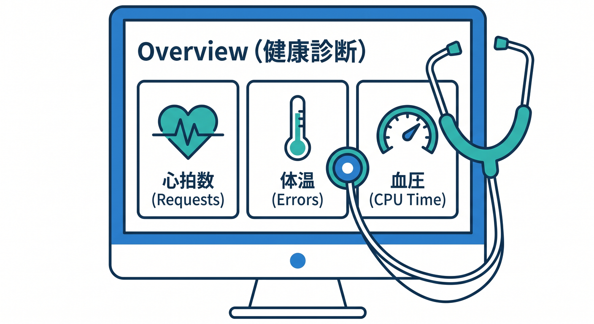
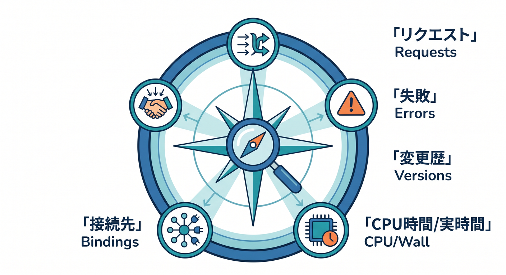
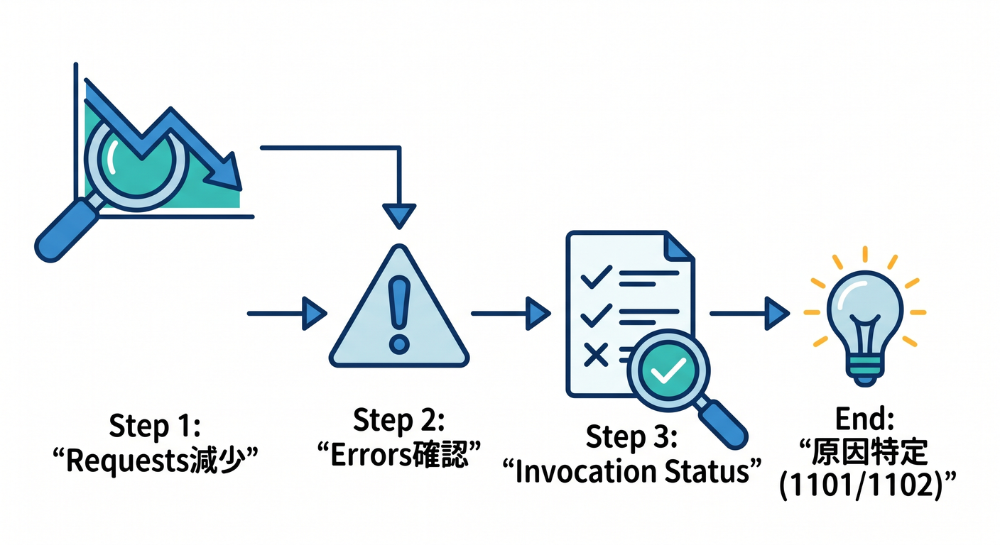
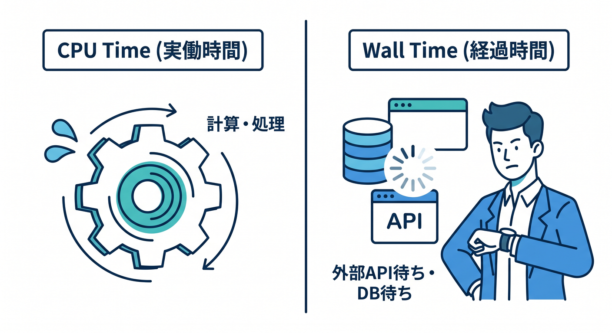
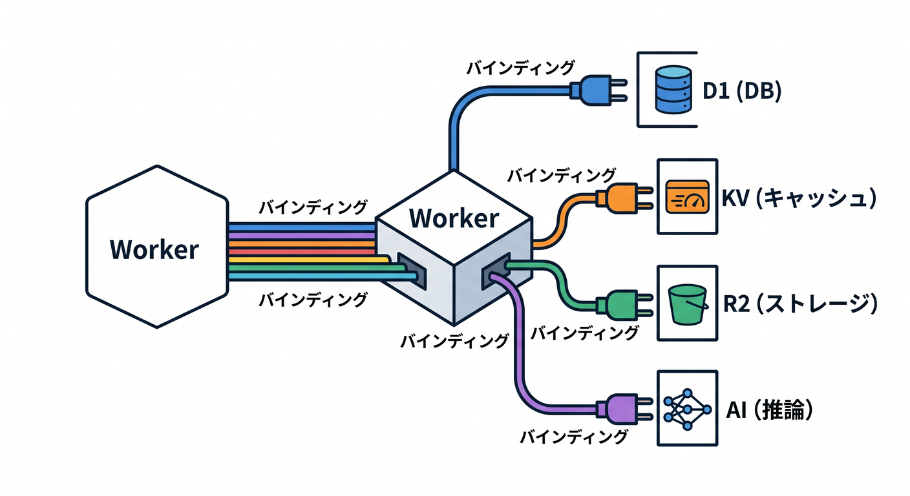
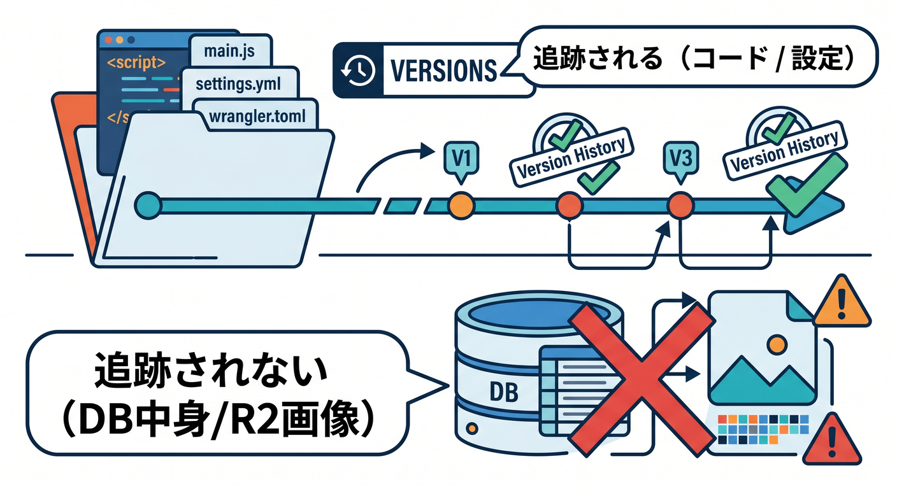
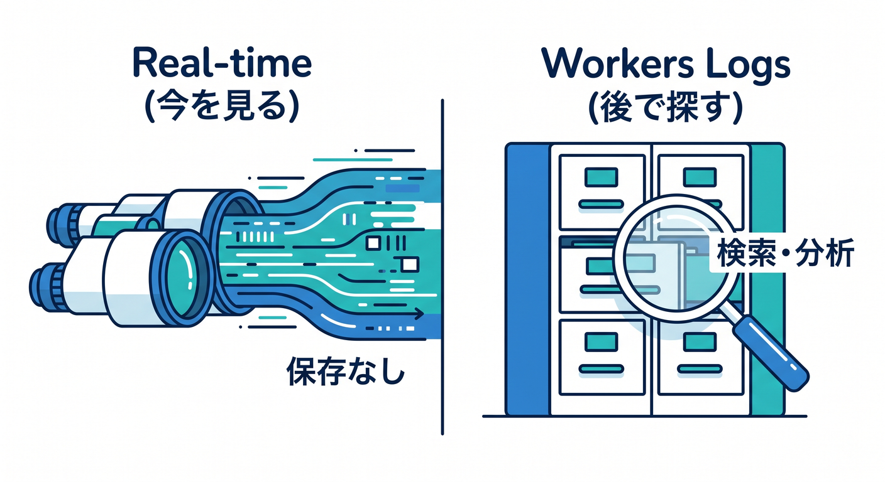

# 第08章：Worker詳細画面を読めるようになろう 📊🔍☁️

この章では、CloudflareのWorkerを開いたときに出てくる詳細画面を、「なんとなく怖い画面」から「健康診断の画面」に変えていきます 😊
最近のCloudflareでは、各Workerを開くと **Overview が“ホーム画面”** になっていて、ここからリクエスト数、エラー、CPU time、bindings、最近のバージョンなどをかなり見渡しやすくなっています。2025年10月にはこのOverviewページが刷新され、さらに2026年2月にはObservability側で構造化クエリ検索も強化されました。つまり今のWorker詳細画面は、昔よりずっと「読む」ための画面になっています。 ([Cloudflare Docs][1])

この章のゴールは3つです 🌱
1つ目は、**開いた直後にどこを見ればいいか分かること**。
2つ目は、**Requests / Errors / CPU time / Wall time の意味をざっくり読めること**。

3つ目は、**Bindings・Versions・Logs を見て「このWorkerは何者か」を説明できること**です。これができるようになると、設定をいじる前に観察するクセがつきます。 ([Cloudflare Docs][1])

---

## 1. Worker詳細画面は「設定画面」ではなく「観察画面」でもある 👀

Worker詳細画面を開いたら、まず「編集する場所を探す」のではなく、**いまこのWorkerが元気かどうかを見る場所**だと思ってください 😊
Cloudflare自身も、新しいOverviewページを「複数タブを掘らなくても、高レベルで状態をつかめるホームベース」と位置づけています。ここでは requests・errors・CPU time を一目で見られ、bindings の追加や recent versions の確認もできます。 ([Cloudflare Docs][1])

つまり、最初の見方はこうです。
**「コードを書く前に、まず脈拍を見る」** です 💓

表示された数字やグラフは、単なる飾りではなく、「このWorkerがどのくらい呼ばれているか」「失敗していないか」「重くなっていないか」を教えてくれるヒントです。 ([Cloudflare Docs][2])

---

## 2. 最初の30秒で見る順番を決めよう 🧭

Workerを開いたら、まず次の順番で眺めるのがおすすめです ✨

**① Requests**
どれくらい呼ばれているかを見る場所です。Total はWorkerに入ってきた全リクエスト数、Success は正常系、Errors は失敗系です。ただしここで大事なのは、**WAFなどのセキュリティ機能にブロックされたリクエストはTotalに入らない**ことです。「アクセスは多いはずなのに思ったより少ない」と感じたら、この点を思い出してください。 ([Cloudflare Docs][3])

**② Errors / Invocation statuses**
エラーを見るときは、HTTPの 404 や 500 だけでなく、**Worker実行そのものがどう終わったか**を見るのがコツです。Cloudflareの docs でも、Invocation status は HTTP status code とは別物だとはっきり書かれています。たとえば Worker 自体は正常終了しても、その外側で別の要因があって最終HTTP結果がうまくいかないことがあります。 ([Cloudflare Docs][3])

**③ CPU time と Wall time**
重さを見る場所です。CPU time は「実際に計算していた時間」、Wall time は「待ち時間も含めた経過時間」に近いイメージです。ここを見分けられると、「コードが重い」のか「外部I/O待ちが長い」のかがかなり見えやすくなります。 ([Cloudflare Docs][3])

**④ Bindings**
このWorkerが何とつながっているかを見る場所です。D1、KV、R2、Durable Objects、Queues、AI などが見えれば、「このWorkerはただのAPIなのか」「DBつきなのか」「AI実行つきなのか」が分かります。 ([Cloudflare Docs][4])

**⑤ Versions / Deployments**
最近だれが何を出したかを見る場所です。トラブルが出たときに、「直前で新しい版が出ていないか」を確認するだけでもかなり役立ちます。 ([Cloudflare Docs][5])

---

## 3. Requests と Errors の読み方を、やさしく整理しよう 📈

Requests の最初のグラフは、Cloudflare公式では **successful requests / errored requests / subrequests** に分けて見せる説明になっています。
ここでの Success は「HTTP 200 だけ」ではありません。`Success` と `Client Disconnected` の invocation status が含まれます。一方、Errors は `Script Threw Exception`、`Exceeded Resources`、`Internal Error` などがまとめられます。 ([Cloudflare Docs][3])

ここで覚えたいのは、**Errors が増えたら、次に Invocation statuses を見る**という流れです 🔁
Cloudflare公式の分類では、代表的な失敗はこんな感じです。
`1101` は JavaScript例外、`1102` は CPU time limit 超過、`1027` は free tier request limit 超過などです。ダッシュボードの Errors by invocation status では、`Uncaught Exception`、`Exceeded CPU Time Limits`、`Exceeded Memory`、`Internal` のような分類で見えてきます。 ([Cloudflare Docs][6])

つまり、画面を読むときの頭の中はこうです 🧠

**Requests が落ちた → Errors を見る → Invocation status を見る → 1101なのか1102なのかを切り分ける**。
この順番で見るだけで、「なんか失敗してる」から一歩進んで、「例外なのか、重すぎるのか」まで見えるようになります。 ([Cloudflare Docs][3])

---

## 4. CPU time と Wall time を見分けよう ⏱️⚡

CloudflareのObservabilityでは、**request counts、error rates、CPU time、wall time、execution duration** などを built-in metrics として見られます。ここで初心者がいちばん混乱しやすいのが CPU time と Wall time の違いです。 ([Cloudflare Docs][2])

**CPU time** は、Workerが実際にCPUを使って処理していた時間です。
だから CPU time が高いなら、「計算が重い」「ループが重い」「JSON処理が多い」「AI前処理をやりすぎている」みたいな疑いが出ます。なおCloudflareの説明では、CPU Time per execution の高い分位点が制限を超えて見えることがあっても、runtime側の rollover の仕組みで、必ずしも invocation error になるとは限りません。 ([Cloudflare Docs][3])

**Wall time** は、開始から「もうJavaScriptは走らなくてよい」と runtime が判断するまでの経過時間です。ここには I/O待ちや `waitUntil()` の処理時間も含まれます。しかも Wall time は「レスポンスの最後の1バイトを返し終わるまでの時間」と同じではありません。つまり Wall time が高いときは、CPUが重いというより **待ち** が多い可能性があります。 ([Cloudflare Docs][3])

ざっくりいうと、こう考えると分かりやすいです 💡
**CPU time が高い → コードそのものが重いかも。**
**Wall time だけ高い → 外部API待ち、DB待ち、R2待ち、`waitUntil()` 後処理かも。**

この切り分けができるだけで、デバッグの方向がかなり変わります。 ([Cloudflare Docs][3])

---

## 5. Bindings を見れば、そのWorkerの仕事が見えてくる 🔌🪄

Bindings は、WorkerがCloudflare Developer Platform上の各種リソースとつながるための仕組みです。Cloudflare公式は、Bindings は REST API より **高性能で制約が少ない** 形で Worker から各リソースを扱える仕組みだと説明しています。 ([Cloudflare Docs][4])

利用できる binding には、AI、Analytics Engine、Assets、Browser Rendering、D1、Durable Objects、Environment Variables、Hyperdrive、KV、Queues、R2、Secrets、Service bindings などがあります。なので Bindings を見ると、そのWorkerが「ただの1本の関数」ではなく、**Cloudflareのどの部品を使っているか** が分かります。 ([Cloudflare Docs][4])

たとえば AI binding が見えたら、そのWorkerは Workers AI を直接たたける可能性があります 🤖
Workers AI の公式docsでは、AI binding を作ると Worker から `env.AI.run()` でモデルを呼べます。つまり Worker詳細画面に AI 系 binding があるだけで、「このWorkerはAIアプリの入口かもしれない」と推測できます。 ([Cloudflare Docs][7])

ここで1つ画面上の実務感も覚えておきましょう。
新しいOverviewページでは bindings を見たり追加したりしやすくなっていますが、個別チュートリアルでは今でも **Bindings タブから Add binding** と案内されることがあります。KVやD1の公式チュートリアルでもこの導線が案内されています。なので UI を見て「Overviewにあるときもあるし、Bindingsタブで作るときもあるんだな」くらいで大丈夫です。 ([Cloudflare Docs][1])

---

## 6. Versions / Deployments は「何が変わったか」を追うための場所 📦🚀

Versions は、Workerの変更履歴を見るための大事な考え方です。
Cloudflare公式では、**Version はコードだけでなく、static assets や bindings、compatibility date / flags を含む構成の状態**を追跡すると説明しています。つまり「ソースだけ」ではなく「そのWorkerの構成込みの版」です。 ([Cloudflare Docs][5])

ただし大事な注意があります ⚠️
D1・R2・KV・Durable Objects などの **ストレージの中身そのものの変化は Version では追跡されません**。たとえばDBのレコードが変わっても、それだけでは Worker の version 履歴には出てきません。ここ、かなり実務でハマりやすいです。 ([Cloudflare Docs][5])

Deployments は、「どの version がいま実トラフィックを受けているか」を示します。Deployment は1つまたは2つの version で構成でき、Cloudflareは gradual deployments による段階的リリースもサポートしています。なので Worker詳細画面の recent versions や deployments を見ると、「いま障害が出ているのは新しい版か、前の版か」を追いやすくなります。 ([Cloudflare Docs][5])

---

## 7. Settings では「変数」「秘密」「上限」を見る 🔐⚙️

Worker詳細画面の Settings は、単なる細かい設定置き場ではありません。
実務ではまず **Variables and Secrets** と **CPU Limits** を意識すると読みやすいです。 environment variables は Settings から追加でき、`Variables and Secrets` で Add を押して名前と値を入れ、Deploy で反映します。 ([Cloudflare Docs][8])

ここでの大原則はシンプルです。
**平文でよい設定値は environment variable、秘密情報は secret。**
Cloudflare公式でも、平文の environment variables は暗号化されないので、パスワードやAPI tokenのような sensitive information は secrets か Secrets Store を使うよう案内しています。 secret の値は定義後にダッシュボードや Wrangler から見えなくなります。 ([Cloudflare Docs][8])

もう1つ大事なのが CPU Limits です。
Cloudflare公式の pricing/docs では、 accidental runaway bills や denial-of-wallet を防ぐために、Wranglerファイルまたはダッシュボードの **Settings > CPU Limits** で1 invocation あたりの最大 CPU time を設定できると案内しています。つまり「重くなりすぎる前に柵を作る」場所でもあります。 ([Cloudflare Docs][9])

---

## 8. Logs と Observability を見れば、ただの“勘”から卒業できる 📜🧪

Workers Logs は、Cloudflare dashboard 上でログを自動収集・保存・検索・分析する仕組みです。Cloudflare公式では、**新しく作ったWorkerは observability setting がデフォルトで有効**とされています。ログには invocation logs、custom logs、errors、uncaught exceptions が含まれます。 ([Cloudflare Docs][10])

一方で **Real-time logs は保存用ではありません。**
near real-time で様子を見るには便利ですが、保存はしません。しかも高トラフィック時は sampling mode に入って一部メッセージが落ちることがあり、同時閲覧は dashboard session と `wrangler tail` を合わせて最大10クライアントです。 ([Cloudflare Docs][11])

なので使い分けはこうです ✨
**いま何が起きているかを見る → Real-time logs**
**あとで調べる・比較する・絞り込む → Workers Logs / Query Builder**
この2段構えで考えると分かりやすいです。 ([Cloudflare Docs][10])

さらに2026年2月からは、Workers Observability の検索バーで構造化クエリを直接書けるようになりました。Query Builder と同期するので、検索バーに `status = 500` や `$workers.wallTimeMs > 100` のような条件を書いてから、横のビジュアルUIで整える流れもできます。 ([Cloudflare Docs][12])

---

## 9. 画面だけで詰まったら、VS Code と Copilot を相棒にしよう 🤝💬

Cloudflare公式の Workers Prompting ガイドでは、GitHub Copilot を使う場合、リポジトリ直下に `.github/copilot-instructions.md` を置く方法が案内されています。さらに、Workers用 docs をエディタ側に取り込みやすいよう、Workers専用の `llms-full.txt` / `llms.txt` も用意されています。つまり公式としても、**AI対応エディタとCloudflare docsをつないで学ぶ**方向をかなり後押ししています。 ([Cloudflare Docs][13])

GitHub公式でも、VS Codeの Copilot Chat ではリポジトリの custom instructions が自動で参照され、コードベースに関する質問を投げられると案内されています。だから Worker詳細画面を見ながら、VS Code 側で「このWorkerが 1102 を出しそうな箇所を探して」「この binding 構成から依存先を説明して」みたいに聞く学び方はかなり相性がいいです。 ([GitHub Docs][14])

なお、Cloudflareは自社の managed MCP servers も提供していますが、今回確認した公式ページでは接続例として Claude、Windsurf、AI Playground、SDK対応クライアント、そして Skills plugin の対応先として Claude Code / OpenAI Codex / Pi などが明記されていました。**Copilot向けのCloudflare MCP直結セットアップは、少なくとも今回確認した公式ページでは明記されていません**。なので現時点では、Copilotは「リポジトリ文脈＋Cloudflare docs文脈」で使うのが素直です。 ([Cloudflare Docs][15])

---

## 10. この章の散歩ミッション 🚶‍♂️☁️

実際に1つWorkerを開いて、次の5問に答えてみてください 😊

**Q1.** Requests は増えている？ それとも静か？
**Q2.** Errors は出ている？ 出ているなら Invocation status は何系？
**Q3.** CPU time と Wall time はどちらが気になる？
**Q4.** Bindings を見て、このWorkerは何とつながっている？
**Q5.** Recent versions を見て、最近だれかが更新していそう？

この5問に答えられたら、もう「詳細画面を開いて固まる人」ではありません 🎉
**画面から状況を読む人** になれています。 ([Cloudflare Docs][1])

---

## 11. この章のまとめ 📝✨

Worker詳細画面で大事なのは、全部の設定名を覚えることではありません。
**Overviewで全体を見る → Metricsで健康状態を見る → Bindingsで役割を見る → Versionsで履歴を見る → Logsで事実を確認する。**
この流れが身につけば十分です。 ([Cloudflare Docs][1])

とくに覚えておきたいのはこの3つです 🌟
**HTTP status と Invocation status は別物。**
**CPU time と Wall time も別物。**
**Version とストレージ中身の変更も別物。**
この3つを区別できるだけで、Worker詳細画面の見え方はかなり変わります。 ([Cloudflare Docs][3])

次の章では、ここで見えた「つながり先」の代表として、R2 などの保存先をのぞいていくと理解がさらに立体的になります 🪣🖼️☁️

[1]: https://developers.cloudflare.com/changelog/post/2025-10-06-new-worker-overview-page/ "New Overview Page for Cloudflare Workers · Changelog"
[2]: https://developers.cloudflare.com/workers/observability/ "Observability · Cloudflare Workers docs"
[3]: https://developers.cloudflare.com/workers/observability/metrics-and-analytics/ "Metrics and analytics · Cloudflare Workers docs"
[4]: https://developers.cloudflare.com/workers/runtime-apis/bindings/ "Bindings (env) · Cloudflare Workers docs"
[5]: https://developers.cloudflare.com/workers/configuration/versions-and-deployments/ "Versions & Deployments · Cloudflare Workers docs"
[6]: https://developers.cloudflare.com/workers/observability/errors/ "Errors and exceptions · Cloudflare Workers docs"
[7]: https://developers.cloudflare.com/workers-ai/configuration/bindings/ "Workers Bindings · Cloudflare Workers AI docs"
[8]: https://developers.cloudflare.com/workers/configuration/environment-variables/ "Environment variables · Cloudflare Workers docs"
[9]: https://developers.cloudflare.com/workers/platform/pricing/ "Pricing · Cloudflare Workers docs"
[10]: https://developers.cloudflare.com/workers/observability/logs/workers-logs/ "Workers Logs · Cloudflare Workers docs"
[11]: https://developers.cloudflare.com/workers/observability/logs/ "Logs · Cloudflare Workers docs"
[12]: https://developers.cloudflare.com/changelog/post/2026-02-24-observability-query-language/ "Write structured queries to filter and search your Workers logs and traces · Changelog"
[13]: https://developers.cloudflare.com/workers/get-started/prompting/ "Prompting · Cloudflare Workers docs"
[14]: https://docs.github.com/ja/copilot/how-tos/configure-custom-instructions/add-repository-instructions "GitHub Copilot用のリポジトリカスタム命令の追加 - GitHubドキュメント"
[15]: https://developers.cloudflare.com/agents/model-context-protocol/mcp-servers-for-cloudflare/ "Cloudflare's own MCP servers · Cloudflare Agents docs"

