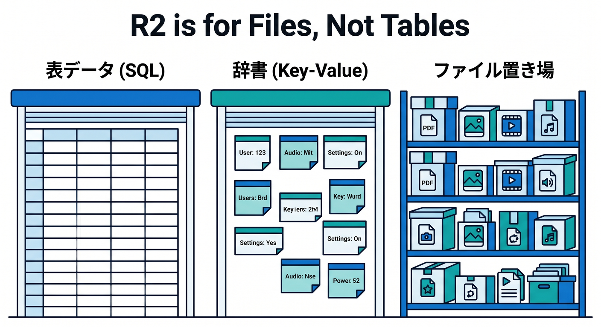
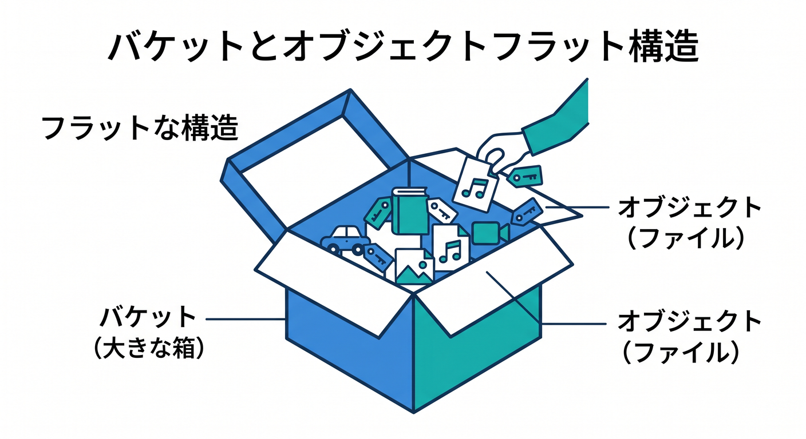
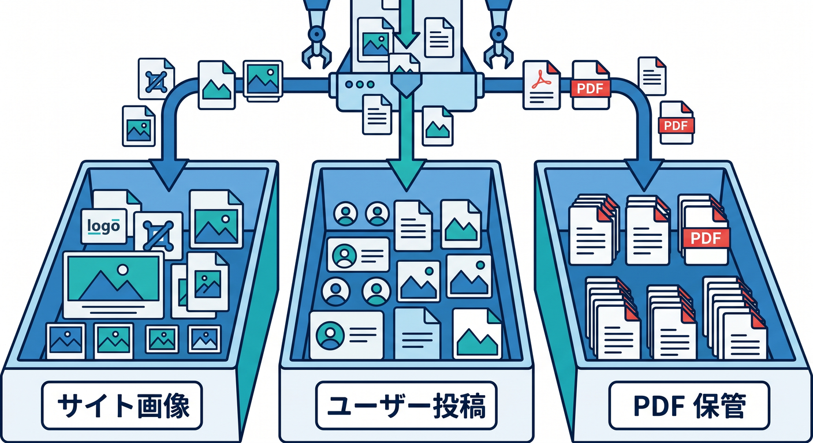
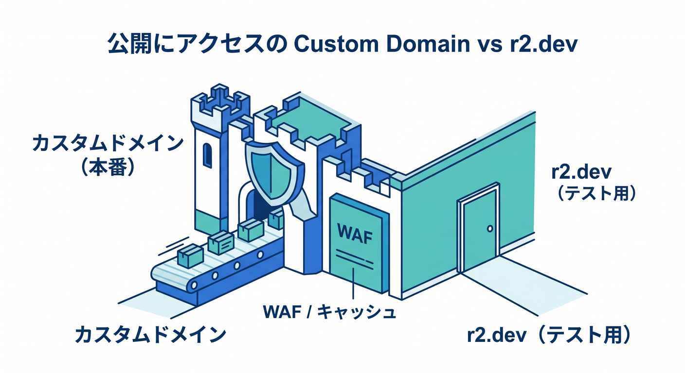
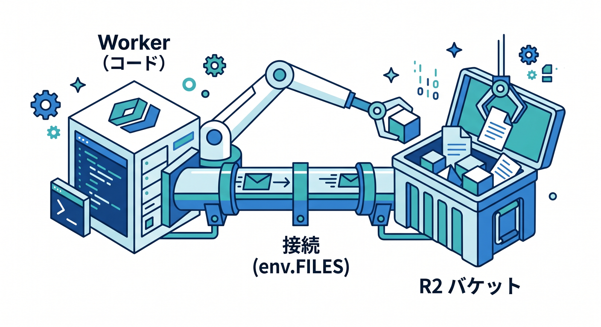
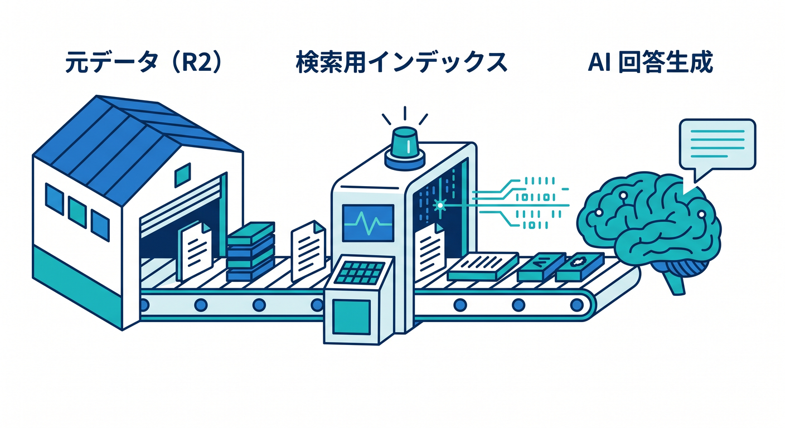
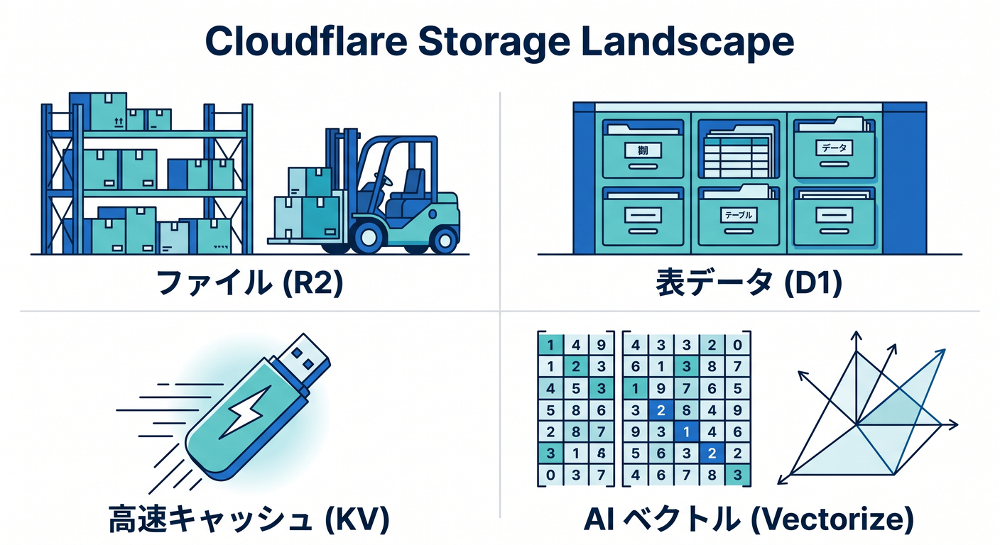

# 第09章：R2をのぞいて、ファイル置き場の感覚をつかもう 🪣🖼️☁️

この章では、Cloudflare の **R2** を「画像・PDF・アップロードファイルなどを置く場所」として、管理画面からやさしく読めるようになるのが目標です 😊
R2 は Cloudflare の **オブジェクトストレージ** で、Web コンテンツやユーザー投稿ファイル、データセット、機械学習の成果物の保存先として案内されています。さらに、R2 は **egress fee なし** を大きな特徴としていて、Cloudflare のグローバルネットワーク上で動く仕組みです。 ([Cloudflare Docs][1])

まず大事なのは、**R2 はデータベースではない**、という感覚です 🙌
D1 のように SQL で表を引く場所でもなく、KV のように「小さめの値をキーで引く」ための場所でもありません。R2 は **“ファイル置き場” の主役** で、画像、音声、動画、PDF、ZIP、バックアップ、AI 用の元データなど、形がバラバラなデータをそのまま置くのが得意です。Cloudflare 公式も、R2 を「大量の非構造データの保存先」と説明しています。 ([Cloudflare Docs][1])



## まず覚えたい言葉は 3 つだけ 🧠✨

**Bucket（バケット）** は、大きな箱です 📦
**Object（オブジェクト）** は、その箱の中に入る 1 個 1 個のファイルです 📄🖼️
そして、R2 の中身は見た目にフォルダっぽく並んでいても、考え方としては **平たい構造** です。Cloudflare 公式でも、バケットは「フォルダを入れ子に持つのではなく、フラット構造」と説明されています。なので、最初は「フォルダ階層のクラウドドライブ」というより、**“キー名で整理されたファイル置き場”** と考えると飲み込みやすいです。 ([Cloudflare Docs][2])



## 管理画面では、どこを散歩すればいいの？ 👀🧭

散歩ルートはとてもシンプルです。
Cloudflare ダッシュボードで **R2 object storage** を開き、まず **Overview** を見ます。ここからバケットを作成でき、既存バケットを開くとファイルのアップロードやダウンロード、メトリクス確認へ進めます。公式ドキュメントでも、バケット作成は `R2 object storage > Overview > Create bucket`、アップロードは `bucket を選択 > Upload`、分析は `bucket を選択 > Metrics` という流れで案内されています。 ([Cloudflare Docs][3])

## バケット作成画面では、何を見ればいいの？ 🪣➕📝

バケット作成でまず見るのは、**名前**、**Location**、そして **default storage class** です。さらに、必要があれば **jurisdiction** を指定して保存先の扱いを分けることもできます。Cloudflare の R2 ドキュメントでは、作成時に location を自動選択または明示選択でき、jurisdiction もダッシュボードから指定できると案内されています。初心者の最初の学習では、ここを「保存場所の性格を決める入口」くらいに理解できれば十分です 😊 ([Cloudflare Docs][4])

ここでのコツは、**バケット名を用途で分ける** ことです ✨
たとえば、`site-images`、`user-uploads`、`pdf-archive`、`ai-source-docs` のように、用途ごとにバケットを分けると管理画面がかなり見やすくなります。R2 はバケット単位で公開設定や API 権限、メトリクス確認を進める場面が多いので、「あとで人が見ても分かる名前」にしておくと運用がすごくラクになります。これは公式の設計思想と矛盾しない、実務的な整理法です。 ([Cloudflare Docs][3])



## 1 個アップロードしてみると、R2 の正体がかなり見える 📤🖼️

教材としては、最初に **小さめの画像 1 枚** か **PDF 1 個** を入れるのがおすすめです 👍
公式では、バケットを開いて **Upload** を押し、ドラッグ＆ドロップかファイル選択でアップロードできると案内されています。これを 1 回やるだけで、「R2 はコードを書かなくてもファイル置き場として見えるんだな」という感覚がかなりつかめます。 ([Cloudflare Docs][5])

そのあとに **Metrics** タブを見ると、さらに理解が進みます 📊
R2 では、ダッシュボードからバケットごとの分析を見られ、リクエストや保存量の確認ができます。公式ドキュメントでは、バケット単位の分析がダッシュボードで見られ、保持期間は **過去 31 日** と説明されています。つまり R2 は「置いたら終わり」ではなく、**どれくらい使われているかを観察できる保存先** です。 ([Cloudflare Docs][6])

## 公開まわりは「最初は非公開」が基本 🔐➡️🌍

ここはとても大事です ❗
R2 のバケットは **デフォルトでは公開されません**。公開したいときは、**自分のカスタムドメイン** で見せる方法か、Cloudflare 管理の **`r2.dev` サブドメイン** を使う方法があります。しかも公式では、`r2.dev` は **non-production use cases** 向けとされていて、本番運用寄りならカスタムドメイン側が基本です。 ([Cloudflare Docs][7])

さらに、カスタムドメインで出すと **WAF、キャッシュ、Access 制御、Bot Management** などの Cloudflare 機能を組み合わせやすくなります。逆に `r2.dev` 側ではその手の機能は使えません。また、公開バケットでも **ルートで中身一覧を出せない** という仕様があります。つまり R2 公開は「Web サーバーのディレクトリ一覧」感覚ではなく、**必要なオブジェクトを必要な URL で見せる** 感覚で考えるのがコツです。 ([Cloudflare Docs][7])



もう一つだけ、実務っぽい注意です 🧯
カスタムドメインの前段に Cloudflare Cache を置くと、読み取り性能は上げやすいですが、キャッシュされた内容が **最新と即時一致しない** 場面があります。公式も、カスタムドメイン＋キャッシュ時は読み取り最適化ができる一方で、最新内容がすぐ反映されない場合があると説明しています。初心者のうちは、**「公開 URL で見ているものはキャッシュの影響を受けるかも」** とだけ覚えておけば十分です。 ([Cloudflare Docs][8])

## API トークンは「外から R2 を触るための鍵」だと思えば OK 🔑

R2 には専用の API トークン導線があり、これは一般的な Cloudflare API トークンとは少し扱いが違います。公式では、R2 の API トークンは **S3 互換 SDK や XML API 用の Access Key** として使え、`R2 object storage > Overview > Account Details > API Tokens の Manage` から作成できます。また、**Secret Access Key は後で再表示できない** ので、作成時に必ず控える必要があります。 ([Cloudflare Docs][9])

ただし、最初から API トークンに飛びつかなくても大丈夫です 😌
Cloudflare の公式 CLI 案内では、**Wrangler を使うなら S3 用の資格情報は不要** で、逆に **rclone や AWS CLI** のような S3 API 系ツールを使うときに Access Key / Secret Access Key が必要になります。なので学習順としては、**最初はダッシュボードと Wrangler**、次に **rclone や AWS CLI**、の順が分かりやすいです。 ([Cloudflare Docs][10])

## TypeScript / Workers / Pages とはどうつながるの？ 🧑‍💻⚙️

R2 が急に面白くなるのは、**Workers や Pages から直接読める** と分かった瞬間です ✨
Cloudflare 公式では、R2 バケットを Worker に **binding** すると、その Worker から直接読み書きできます。また Pages でも、`Workers & Pages > project > Settings > Bindings > Add > R2 bucket` で R2 をつなげられ、`context.env` 経由で使えます。つまり、R2 は単なる保存箱ではなく、**Cloudflare 上のアプリからすぐ触れる保存箱** です。 ([Cloudflare Docs][4])

たとえば、TypeScript の感覚ではこんなイメージです 👇

```ts
interface Env {
  FILES: R2Bucket;
}

export default {
  async fetch(_request: Request, env: Env) {
    await env.FILES.put("hello.txt", "こんにちは、R2!");
    const file = await env.FILES.get("hello.txt");
    return new Response(file ? file.body : "not found");
  },
};
```

こういう形で、Worker の中から `put()` で保存し、`get()` で取り出せます。Cloudflare 公式でも、R2 binding を使った Worker / Pages からの読み書き例が案内されています。 ([Cloudflare Docs][4])



## AI とどうつながるの？ ここが今の Cloudflare らしいところ 🤖🪣🔎

R2 は AI 時代の Cloudflare ではかなり重要な土台です。
**AI Search** は、Web サイトや R2 バケットのようなデータソースをつなぐと、継続更新されるインデックスを作って自然言語で検索できる managed search service として案内されています。しかも AI Search は **R2、Vectorize、AI Gateway、Workers AI** とネイティブ連携します。さらに、AI Search の初回作成には **active R2 subscription** が前提です。つまり R2 は、AI アプリの「元データ置き場」としてかなり中心にいます。 ([Cloudflare Docs][11])

一方の **Workers AI** は、Cloudflare 上でサーバーレスに AI モデルを動かす仕組みで、**Workers、Pages、Cloudflare API** から呼び出せます。なので、たとえば
「R2 に PDF を置く 📄 → Worker で読む ⚙️ → AI Search / Vectorize に索引を作る 🔎 → Workers AI で回答を作る 🤖」
という流れが、Cloudflare の中だけでかなり自然につながります。これが第10章・第11章の AI 導線にもきれいに続いていきます。 ([Cloudflare Docs][11])



## R2 と D1 と KV と Vectorize、どう住み分ける？ 🧩

ここは初心者がかなり迷いやすいので、ざっくり整理しておきます 🌱
**R2** はファイル置き場。**D1** は SQL で扱うサーバーレス DB。**KV** はグローバル低遅延の key-value ストア。**Vectorize** は AI 検索向けのベクトル DB、という分け方でまず十分です。Cloudflare 公式でも、D1 は SQLite 系のサーバーレス SQL DB、KV は高読込向けのグローバル key-value ストア、Vectorize は Workers と組み合わせるベクトル DB と説明されています。 ([Cloudflare Docs][12])

もう少しだけ踏み込むと、**R2 は strongly consistent**、**KV は eventually consistent** です。
なので、「画像や PDF の実体をちゃんと置きたい」なら R2、「設定値やキャッシュ寄りのデータを世界中で速く読みたい」なら KV、という切り分けが見えやすくなります。AI 検索では、**実ファイルは R2、検索用の意味ベクトルは Vectorize**、という組み合わせもとても相性がいいです。 ([Cloudflare Docs][8])



## この章のおすすめミニ実習 🧪✨

実習はこれくらいで十分です 😊

1. R2 object storage を開く
2. `study-r2-sample` のような名前でバケットを 1 個作る
3. PNG 画像 1 枚と PDF 1 個をアップロードする
4. Metrics を開いて、保存量やリクエスト観察の場所を確認する
5. 公開設定画面を見て、**まだ公開しないまま** カスタムドメインと `r2.dev` の違いだけ読む
6. 「このファイルは将来 Worker から読むのか、公開 URL で見せるのか、AI Search の材料にするのか」を自分でメモする

この実習だけで、R2 が「ただの倉庫」ではなく、**Cloudflare アプリ全体の保存レイヤー** だとかなり実感できます。 ([Cloudflare Docs][3])

## VS Code + Copilot をどう使う？ 💬🧠

GitHub Copilot Chat は **VS Code でも使える** AI チャットで、コード説明や提案、バグ修正支援などができます。なので、この章では「R2 の概念を質問する」「binding 設定を説明してもらう」「自分の TypeScript を読んでもらう」という使い方がかなり相性いいです。 ([GitHub Docs][13])

たとえば、VS Code の Copilot Chat にはこんな聞き方がしやすいです ✨

* 「Cloudflare R2 と D1 と KV の違いを初心者向けに説明して」
* 「この `wrangler.jsonc` の `r2_buckets` 設定を1行ずつ説明して」
* 「R2 に画像を保存して返す Worker を TypeScript で最小構成で作って」
* 「R2 を AI Search の元データ置き場として使うときの構成を図なしで説明して」

## この章の着地点 🏁

この章が終わった時点で目指したいのは、
**「R2 は Cloudflare のファイル置き場で、バケットの中にオブジェクトを入れ、必要なら公開し、Workers や Pages や AI Search につなげられる」**
と自然に言えることです 😊☁️🪣

完璧に設定できなくて大丈夫です。
でも、管理画面で R2 を開いたときに
**「ここは画像や PDF やアップロードデータの保存先だな」**
**「公開は慎重にやるんだな」**
**「AI や Worker と後でつながるんだな」**
と見えるようになったら、この章は大成功です 🎉✨

必要ならこのまま続けて、同じトーンで **「第10章　AIまわりの入口を散歩しよう 🤖✨」** も書けます。

[1]: https://developers.cloudflare.com/r2/ "Overview · Cloudflare R2 docs"
[2]: https://developers.cloudflare.com/r2/buckets/ "Buckets · Cloudflare R2 docs"
[3]: https://developers.cloudflare.com/r2/buckets/create-buckets/ "Create new buckets · Cloudflare R2 docs"
[4]: https://developers.cloudflare.com/r2/get-started/workers-api/ "Workers API · Cloudflare R2 docs"
[5]: https://developers.cloudflare.com/r2/objects/upload-objects/ "Upload objects · Cloudflare R2 docs"
[6]: https://developers.cloudflare.com/r2/platform/metrics-analytics/ "Metrics and analytics · Cloudflare R2 docs"
[7]: https://developers.cloudflare.com/r2/buckets/public-buckets/ "Public buckets · Cloudflare R2 docs"
[8]: https://developers.cloudflare.com/r2/how-r2-works/ "How R2 works · Cloudflare R2 docs"
[9]: https://developers.cloudflare.com/r2/api/tokens/ "Authentication · Cloudflare R2 docs"
[10]: https://developers.cloudflare.com/r2/get-started/cli/ "CLI · Cloudflare R2 docs"
[11]: https://developers.cloudflare.com/ai-search/ "Cloudflare AI Search · Cloudflare AI Search docs"
[12]: https://developers.cloudflare.com/d1/ "Overview · Cloudflare D1 docs"
[13]: https://docs.github.com/en/enterprise-cloud%40latest/copilot/concepts/chat "About GitHub Copilot Chat - GitHub Enterprise Cloud Docs"


