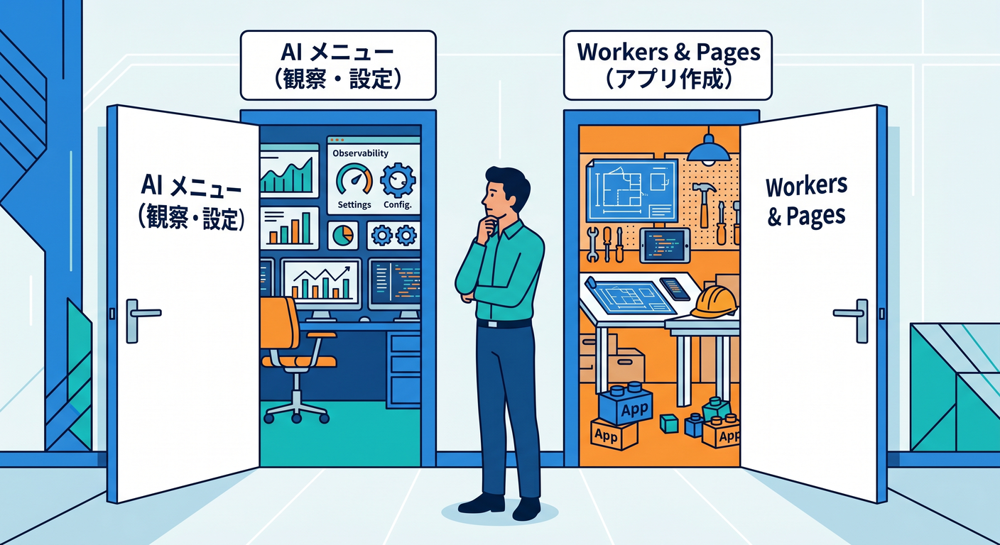
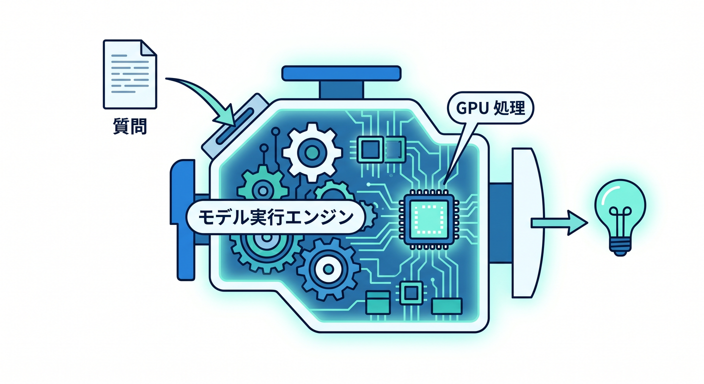
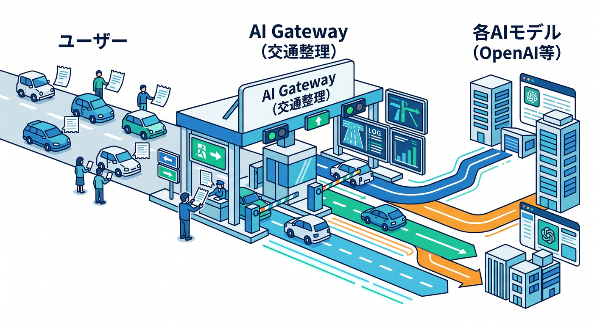
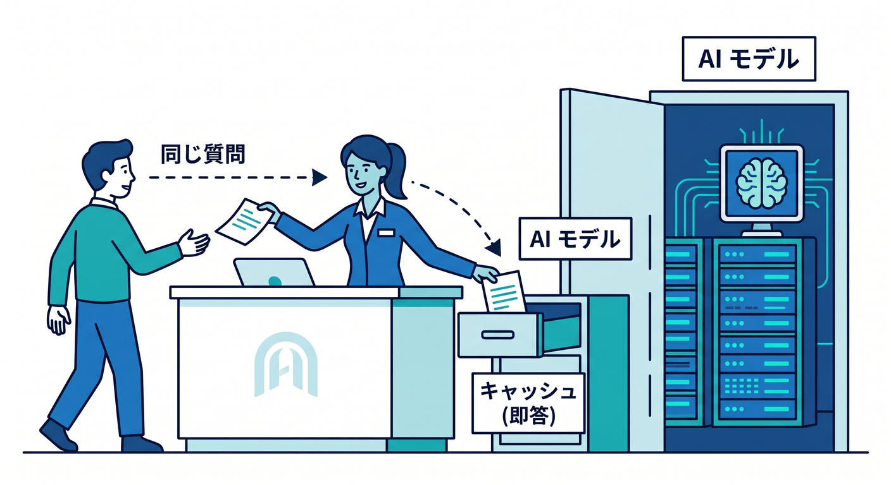
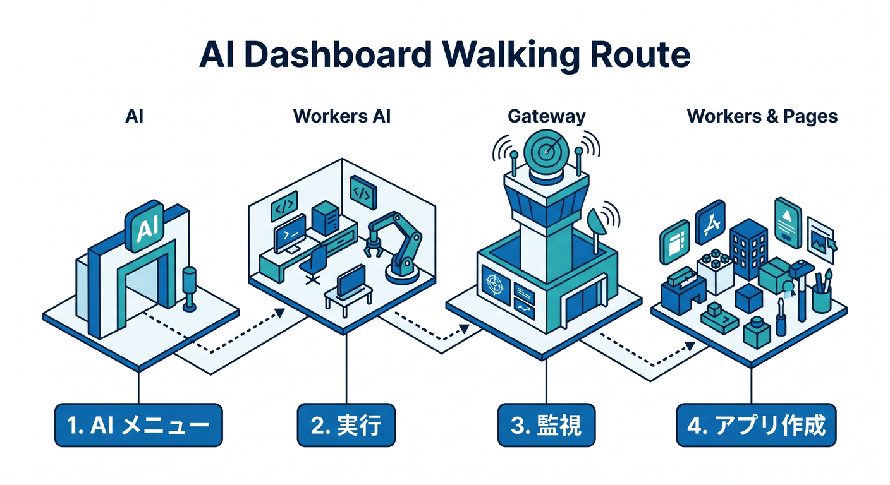
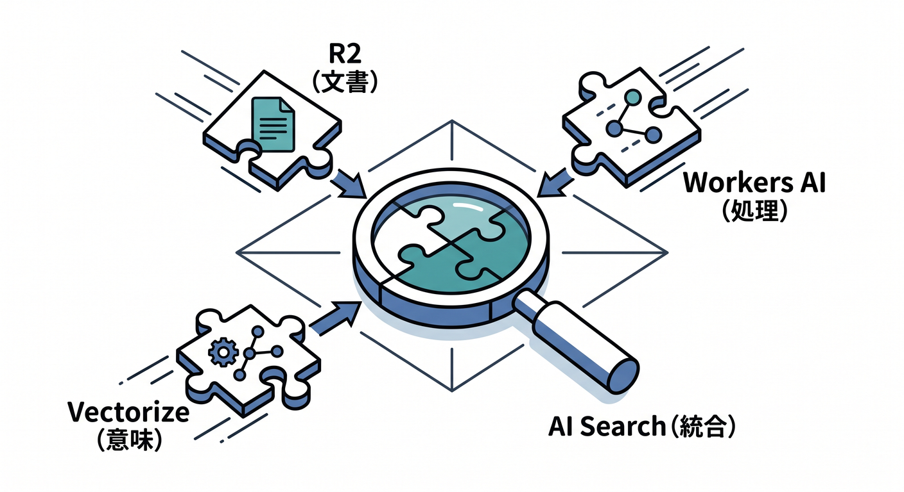

# 第10章：AIまわりの入口を散歩しよう 🤖✨

ここからは、Cloudflare の中でもちょっとワクワクする AI エリアを歩いてみます 🚶‍♀️☁️
とはいえ、この章でいきなり「モデル性能」や「RAG の実装」を覚える必要はありません 🙆‍♂️
まず大事なのは、**AI の機能が管理画面のどこにあって、何が“実行する役”、何が“見張る役”なのか**を、ふんわり区別できるようになることです。2026年2月の公式改善で、Cloudflare ダッシュボードの左サイドバーに **AI が独立したトップレベル項目**として置かれるようになり、以前よりかなり見つけやすくなっています。 ([Cloudflare Docs][1])

## この章のゴール 🎯

この章のゴールは、次の3つです 😊

1つ目は、**Workers AI** が「AIモデルを実行する場所」だと分かること。
2つ目は、**AI Gateway** が「AIの通信を観察・制御する場所」だと分かること。
3つ目は、Cloudflare の AI まわりが単独機能ではなく、あとで **Workers / R2 / Vectorize / AI Search** につながっていく入口だと感じられることです。Cloudflare の公式 docs でも、Workers AI はモデル実行、AI Gateway は可視化や制御、AI Search はそれらを含む複数製品とつながる実用導線として整理されています。 ([Cloudflare Docs][2])

## まず覚える地図 🗺️

**AI には2つの入口がある**と思うと、かなり迷いにくくなります。

1つは、左サイドバーの **AI**。
ここには、AI 機能そのものを見に行く感覚があります。たとえば Workers AI や AI Gateway は、この AI セクションから見つけやすくなりました。 ([Cloudflare Docs][1])

もう1つは、**Workers & Pages**。
こちらは「アプリを作る・編集する・デプロイする」入口です。Cloudflare の公式ガイドでは、Workers AI アプリをダッシュボードから作るとき、**Workers & Pages → Create application → LLM Chat App** という導線が案内されています。また、作成後のコード編集も Workers & Pages から行います。つまり今の Cloudflare では、**AI は AI メニューで見つけやすくなったけれど、実際のアプリ作成は Workers & Pages 側の導線も大事**、という理解がちょうどいいです。 ([Cloudflare Docs][1])

## 主役その1：Workers AI は「モデルを動かす場所」🧠⚡

Workers AI は、Cloudflare 上で AI モデルをサーバーレスに実行するサービスです。公式 docs では、Cloudflare のネットワーク上で GPU を使った推論を、**Workers / Pages / API** などから呼び出せる形で提供していると説明されています。 ([Cloudflare Docs][2])

管理画面で Workers AI を見たとき、初心者がまず注目すべきなのは次の3点です 👀

**① モデルを試す場所があること**
モデルごとのページには **Playground** への導線があり、公式には「セットアップや認証なしでブラウザ上で即テストできる」ものがあります。最初に「AI を触る」だけなら、ここがいちばん心理的に軽いです。 ([Cloudflare Docs][3])

**② API で使うための情報を取れること**
Workers AI の REST API 入門では、ダッシュボードの **Workers AI ページ → Use REST API** から、API トークンと Account ID を取得する流れが案内されています。最初は難しく見えますが、ここは「AI を外から呼ぶための鍵をもらう窓口」くらいの理解で十分です。必要な権限として `Workers AI - Read` と `Workers AI - Edit` も明記されています。 ([Cloudflare Docs][4])

**③ 利用量の見方があること**
2026年4月時点の公式料金ページでは、Workers AI は Free / Paid の両プランに含まれ、**1日 10,000 Neurons の無料枠**があり、超過分は **$0.011 / 1,000 Neurons** です。しかも、Neuron 使用量は Workers AI ダッシュボードで確認できます。ここは「AI はブラックボックスではなく、ちゃんと使用量が見える」という安心ポイントです。 ([Cloudflare Docs][5])

## 主役その2：AI Gateway は「AIの出入りを管理する場所」🚦🛡️

次に AI Gateway です。
これは AI モデルそのものではなく、**AI へのリクエストを観察・制御するレイヤー**です。

Cloudflare の公式では、AI Gateway は AI アプリに対して **visibility and control** を与えるものとして説明されています。具体的には、**analytics、logging、caching、rate limiting、request retries、model fallback** などが用意されています。つまり、Workers AI が「頭脳」なら、AI Gateway は「交通整理と監視カメラ」に近い役です。 ([Cloudflare Docs][6])

ここで超大事なのは、**Workers AI と AI Gateway を別物として見られること**です ✨

* Workers AI：モデルを実行する
* AI Gateway：その実行リクエストを見守る・制御する

この役割分担が分かるだけで、AI画面の見え方がかなりスッキリします。Cloudflare の docs でも、AI Gateway は Workers AI だけでなく、Anthropic、Google Gemini、OpenAI、Replicate など複数プロバイダと組み合わせられると案内されています。つまり AI Gateway は「Cloudflare製モデル専用の画面」ではなく、**AI全体の管制塔っぽい場所**です。 ([Cloudflare Docs][7])

## AI Gateway の画面で、まずどこを見る？ 👣

最初の散歩では、全部を触る必要はありません。
次の順で見ると、かなり理解しやすいです 😊

**1. Analytics 📊**
AI Gateway の Analytics では、**requests、tokens、caching、errors、cost** が時系列で見られます。初心者のうちは「いまどれくらい呼ばれてる？」「エラー出てる？」「無駄打ちしてない？」を見る場所だと思えば OK です。 ([Cloudflare Docs][8])

**2. Logging 🧾**
Logging では、個々のリクエストについて **user prompt、model response、provider、timestamp、request status、token usage、cost、duration** などを見られます。これはかなり強力ですが、逆にいうと**入力内容や応答内容が残る**ので、学習中でも個人情報や秘密情報をむやみに入れない意識が大事です。 ([Cloudflare Docs][9])

**3. Settings ⚙️**
たとえばキャッシュ設定は、公式 docs で **AI > AI Gateway → Settings → Cache Responses** という導線が案内されています。「同じ問い合わせを毎回ゼロから実行しない」考え方に触れる最初の場所として、とても分かりやすいです。 ([Cloudflare Docs][10])

## つまり、どう使い分けるの？ 🤔

すごく雑にいうと、こんな感じです。

* **Workers AI**
  「このモデルに質問したい」「画像生成したい」「埋め込みを作りたい」など、AI に何か処理させたいときの本体

* **AI Gateway**
  「どのくらい使われた？」「高くついてない？」「キャッシュしたい」「落ちたら別モデルへ逃がしたい」など、運用をラクにしたいときの管理役

この2つを一緒に使う考え方は、Cloudflare の公式チュートリアルでもかなりはっきりしています。Workers AI を AI Gateway の後ろに置けば、**分析・キャッシュ・セキュリティ・フォールバック**を足した形で扱えます。さらに OpenAI 互換エンドポイントも案内されているので、既存の AI SDK の考え方から入ってきた人にもなじみやすいです。 ([Cloudflare Docs][11])

## 初心者向けの“散歩ルート” 🚶‍♂️☁️🤖

この章では、実際には次の順番で画面を歩くのがおすすめです。

**Step 1：左の AI を開く**
まず「Cloudflare に AI 専用のフロアがあるんだな」と体感します。ここで場所に慣れるのが第一歩です。 ([Cloudflare Docs][1])

**Step 2：Workers AI を開く**
「ここがモデル本体の入口なんだな」と確認します。
Use REST API、モデル一覧、使用量の見え方、Playground の存在をざっと眺めましょう。 ([Cloudflare Docs][4])

**Step 3：AI Gateway を開く**
「ここは AI を実行する場所ではなく、見守る場所なんだな」と意識して Analytics と Logging を見ます。最初から全部設定しなくて大丈夫です。 ([Cloudflare Docs][8])

**Step 4：Workers & Pages へ戻る**
Cloudflare 公式のダッシュボード入門では、Workers AI アプリの作成やコード編集は Workers & Pages 側の導線です。つまり、**AIを理解するには AI メニューだけでなく、アプリ側の玄関も一緒に覚える**のがコツです。 ([Cloudflare Docs][12])

## ここで R2 や Vectorize とどうつながるの？ 🪣🧲

前章で見た R2 は「ファイル置き場」でした。
AI に近づくと、この R2 が急に意味を持ち始めます。

Cloudflare AI Search の docs では、AI Search は **R2、Vectorize、Workers AI、AI Gateway、Workers、Browser Rendering** などと統合されると説明されています。つまり、今見ている AI 画面は単なるおまけではなく、あとで **R2 に置いた文書を検索したり、ベクトル検索したり、AIアプリに組み込んだりする入口**になります。第10章ではここを「予告編」として感じられれば十分です。第11章でその地図がもっと立体的になります。 ([Cloudflare Docs][13])

## VS Code と Copilot を横に置くと、学習がかなりラクになるよ 💻✨

Cloudflare は 2026年時点で、Workers アプリを **VS Code などのエディタやエージェントへのプロンプト**から作る流れもかなり意識しています。公式 docs には、Workers アプリを VS Code や各種 AI エディタから簡単なプロンプトで作る案内や、**cloudflare-docs MCP** と **cloudflare-observability MCP** をつないで、docs やログを AI に参照させる流れまで載っています。 ([Cloudflare Docs][14])

GitHub の公式 docs でも、Copilot Chat は IDE の中で **コード提案、コード説明、単体テスト生成、コード修正提案**ができ、さらに **MCP サーバーで外部ツールやサービスと統合できる**と説明されています。Cloudflare 学習との相性はかなり良いです。 ([GitHub Docs][15])

この章の内容なら、Copilot にはこんな感じで聞くと相性がいいです ✍️

* 「Cloudflare Workers AI と AI Gateway の違いを、図なしでやさしく説明して」
* 「Workers AI を使う最小の TypeScript Worker を 1ファイルで作って」
* 「この Worker に AI Gateway を足して、キャッシュとログ確認の考え方も説明して」
* 「Cloudflare の管理画面で Workers AI と Workers & Pages の役割分担を初心者向けに整理して」

こうすると、**管理画面で見たもの → VS Code でコード化 → Cloudflare に戻って確認**という往復がしやすくなります 🔁✨

## この章では、まだ覚えなくていいこと 🙅‍♂️

ここで無理に覚えなくていいものもあります。

* すべてのモデル名
* すべての料金細目
* Guardrails や DLP の細かな運用設定
* AI Search の本格構成
* フレームワーク連携の細部

この章は、あくまで **「AI の玄関で靴を脱げるようになる章」** です 👟
入室前に家の設計図を丸暗記する必要はありません。

## つまずきやすい勘違いポイント ⚠️

**勘違い1：AI Gateway がモデルを実行している**
ちがいます。モデルの実行本体は Workers AI 側です。AI Gateway は、その前後の交通整理や監視の役です。 ([Cloudflare Docs][11])

**勘違い2：AI は AI メニューだけで完結する**
これも半分ちがいます。AI は見つけやすくなりましたが、Workers AI アプリの作成やコード編集は Workers & Pages 経由の導線が公式に残っています。 ([Cloudflare Docs][1])

**勘違い3：ログはただの件数しか見えない**
AI Gateway の logging では、プロンプトやレスポンス、コスト、duration などかなり細かく見えます。便利ですが、扱う内容には気をつけましょう。 ([Cloudflare Docs][9])

## まとめ 🌈

この章でいちばん大事なのは、たったこれだけです 😊

* **Workers AI は、AIを動かす場所** 🧠
* **AI Gateway は、AIを見守って整える場所** 🚦
* **Workers & Pages は、AIアプリを作る玄関** 🛠️
* **R2 や Vectorize や AI Search につながる前室が、いま見ている AI 画面** 🪄

ここまで見えたら、第10章は大成功です 🎉
「AI機能がどこにあるか分かる」「何となく役割を言い分けられる」――それだけで、Cloudflare の AI はもう“怖い謎メニュー”ではなくなっています。 ([Cloudflare Docs][1])

必要なら次に続けて、このトーンのまま **第11章「AI Searchまで見て、“AIアプリの地図”を作ろう 🧠🔎」** も同じ粒度で書けます。

[1]: https://developers.cloudflare.com/changelog/post/2026-02-19-ai-dashboard-experience-improvements/ "AI dashboard experience improvements · Changelog"
[2]: https://developers.cloudflare.com/workers-ai/?utm_source=chatgpt.com "Overview · Cloudflare Workers AI docs"
[3]: https://developers.cloudflare.com/workers-ai/models/llama-3.1-70b-instruct/?utm_source=chatgpt.com "llama-3.1-70b-instruct - Workers AI"
[4]: https://developers.cloudflare.com/workers-ai/get-started/rest-api/ "Get started - REST API · Cloudflare Workers AI docs"
[5]: https://developers.cloudflare.com/workers-ai/platform/pricing/ "Pricing · Cloudflare Workers AI docs"
[6]: https://developers.cloudflare.com/ai-gateway/?utm_source=chatgpt.com "Overview · Cloudflare AI Gateway docs"
[7]: https://developers.cloudflare.com/ai-gateway/ "Overview · Cloudflare AI Gateway docs"
[8]: https://developers.cloudflare.com/ai-gateway/observability/analytics/ "Analytics · Cloudflare AI Gateway docs"
[9]: https://developers.cloudflare.com/ai-gateway/observability/logging/?utm_source=chatgpt.com "Logging - AI Gateway"
[10]: https://developers.cloudflare.com/ai-gateway/features/caching/ "Caching · Cloudflare AI Gateway docs"
[11]: https://developers.cloudflare.com/ai-gateway/usage/providers/workersai/ "Workers AI · Cloudflare AI Gateway docs"
[12]: https://developers.cloudflare.com/workers-ai/get-started/dashboard/ "Get started - Dashboard · Cloudflare Workers AI docs"
[13]: https://developers.cloudflare.com/ai-search/?utm_source=chatgpt.com "Cloudflare AI Search"
[14]: https://developers.cloudflare.com/workers/get-started/prompting/ "Prompting · Cloudflare Workers docs"
[15]: https://docs.github.com/ja/copilot/how-tos/chat-with-copilot/chat-in-ide "GitHub CopilotにIDEで質問を行う - GitHubドキュメント"

