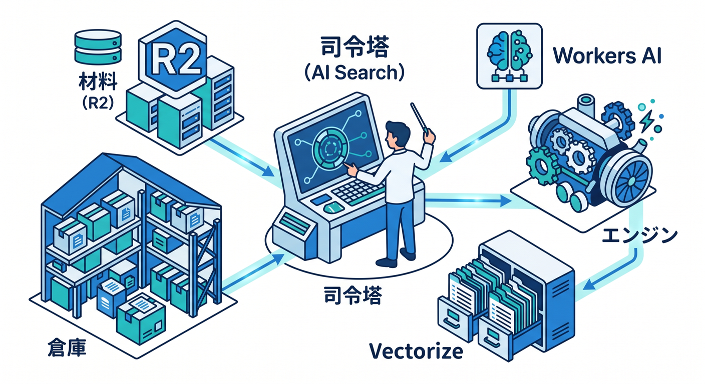
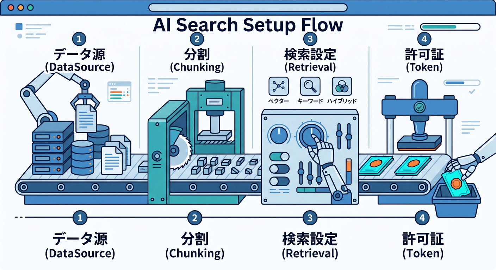
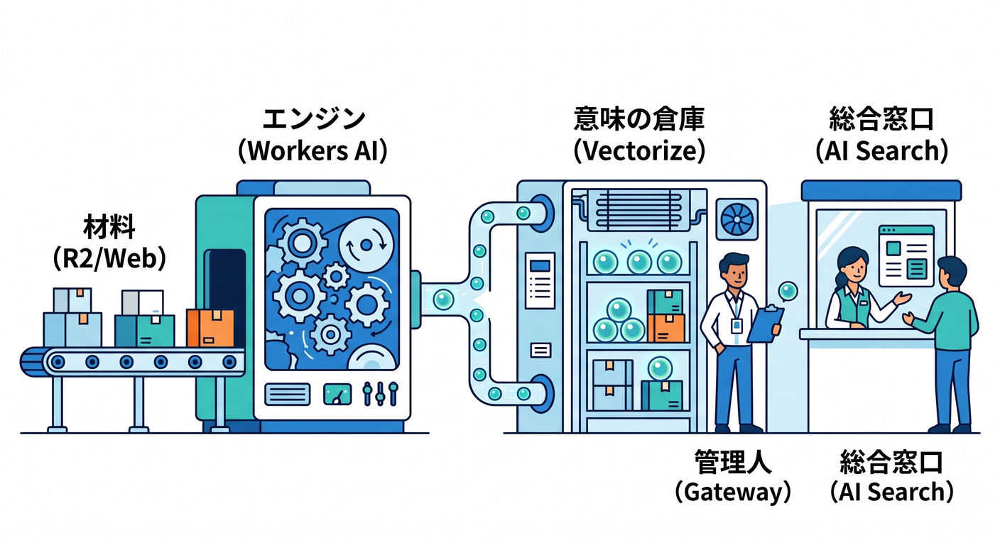
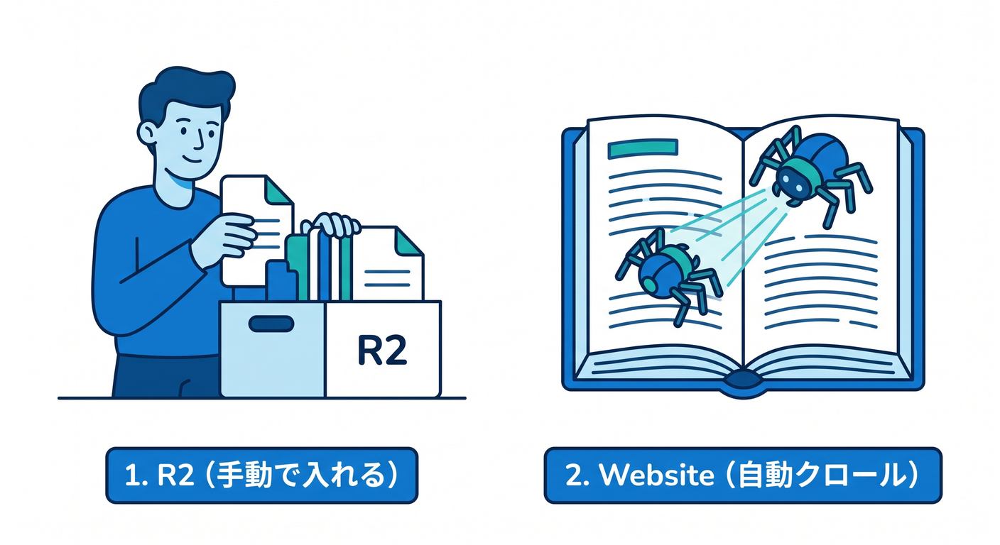
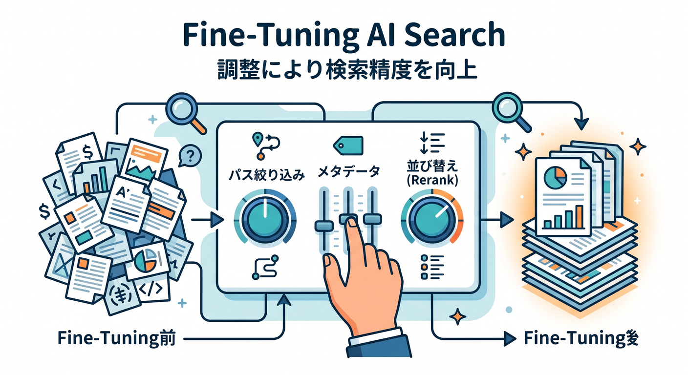
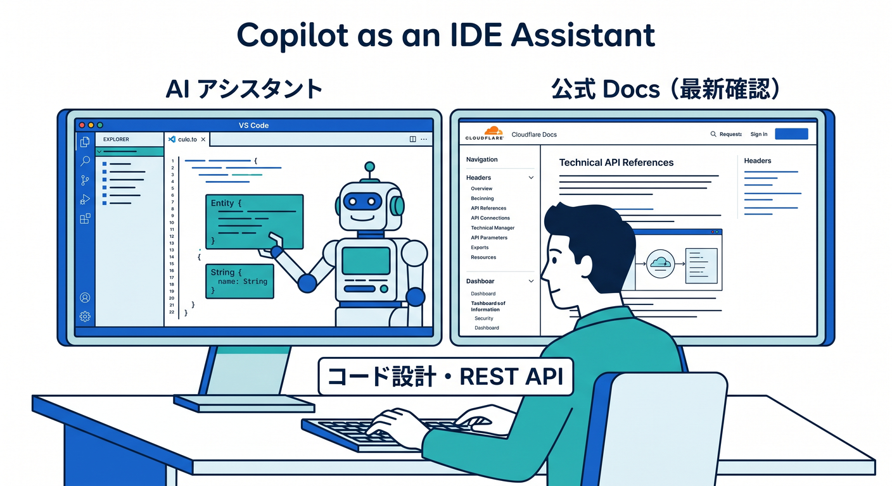

# 第11章：AI Searchまで見て、“AIアプリの地図”を作ろう 🧠🔎☁️✨

この章では、Cloudflare の AI 機能を「点」ではなく「線」で見られるようになるのが目標です 😊
AI Search は単なる検索箱ではなく、R2・Vectorize・Workers AI・AI Gateway などをまとめて、**自分のデータを AI で探しやすくするための実用導線**です。Cloudflare の公式説明でも、AI Search は Web サイトや非構造データをつなぐ managed search service で、自然言語で検索でき、Cloudflare 内の複数 AI サービスとネイティブ連携する位置づけです。 ([Cloudflare Docs][1])

---

## この章でつかみたいこと 🌱

前の章までで「AI の入口」が見えてきたら、この章では一歩進んで、**Cloudflare で AI アプリを作るときの部品配置**を頭の中に作ります。
ざっくり言うと、こんな役割分担です。

R2 は、PDF・画像・HTML・Office 文書などを置く**材料置き場**です。AI Search は R2 バケット内の対応ファイルを自動で読み取り、対応外ファイルやサイズ上限を超えたものはスキップします。R2 は AI Search の初回作成時にも前提になっています。 ([Cloudflare Docs][2])

Workers AI は、**モデルを動かすエンジン**です。Cloudflare 公式では serverless GPU 上で AI モデルを実行できるサービスとされていて、AI Search の内部でも Markdown conversion、embedding、query rewrite、response generation などに使われます。 ([Cloudflare Docs][3])

Vectorize は、**ベクトルを保存して意味検索するための倉庫**です。Cloudflare は Vectorize を globally distributed な vector database と説明しており、AI Search で作られたベクトルもここに保存されます。 ([Cloudflare Docs][4])

AI Gateway は、**AI 通信の交通整理と見張り役**です。分析、ログ、キャッシュ、レート制限、リトライ、fallback などを持ち、Cloudflare 公式でも「Observe and control your AI applications」と案内されています。AI Search は Workers AI だけでなく、AI Gateway 経由で OpenAI や Anthropic など他社モデルともつなげられます。 ([Cloudflare Docs][5])

そして AI Search は、その全部を束ねて、**検索 API やチャット UI、MCP 接続まで見通しよくしてくれる司令塔**です。ここが見えると、Cloudflare の AI が急に立体的に見えてきます。 ([Cloudflare Docs][1])

---

## まずは管理画面で、どこを見ればいいの？ 👀🧭

最近の Cloudflare では AI 系のダッシュボード導線が改善され、見つけやすさが上がっています。Workers AI と AI Gateway については、2026年2月の公式 changelog で「AI がサイドバーの top-level section になった」と案内されています。AI Search の作成ガイド自体もダッシュボード導線を前提に整理されています。 ([Cloudflare Docs][6])

この章で散歩するときは、次の流れで見ると分かりやすいです 🚶‍♂️☁️

1. **AI Search の画面へ行く**
   公式の Dashboard ガイドでは、AI Search 画面から「Create」を押して作成を始めます。初回は R2 が前提です。 ([Cloudflare Docs][7])

2. **データソースを選ぶ**
   AI Search の直接データソースは、現時点では **Website** と **R2 Bucket** の2系統です。Website は自分の Cloudflare アカウントに載っているドメインだけをクロールできます。 ([Cloudflare Docs][8])

3. **Chunking と Embedding を決める**
   作成時に chunking と embedding を設定します。ここは「文章をどれくらいのかたまりで意味ベクトル化するか」を決める場所です。あとから変えられる項目と、作成時に固定される項目があるので、ここが AI Search の“設計ポイント”になります。 ([Cloudflare Docs][7])

4. **Retrieval を決める**
   どのくらい近い内容を拾うか、何件返すか、reranking を使うか、query rewrite を使うか、という“検索の性格”をここで調整します。Cloudflare の設定表でも、match threshold、max results、reranking、query rewrite、generation model などが並んでいます。 ([Cloudflare Docs][9])

5. **Service API token を作る**
   ここは初心者が「なんで必要なの？」となりやすい場所です 😵
   でも意味は単純で、AI Search が裏側で R2・Vectorize・Workers AI・Browser Rendering などを触るための“作業許可証”です。ダッシュボード作成時には自動作成フローがあります。 ([Cloudflare Docs][10])

6. **作成後は Overview / Playground / Jobs を見る**
   作成後は Overview で indexing 状態を見て、Playground で Search または Search with AI を試し、Jobs で同期やエラーを確認するのが定番です。 ([Cloudflare Docs][7])

---

## AI Search の中で、実際には何が起きているの？ ⚙️🧠

ここは、ふんわりでもいいので流れを知っておくと強いです 💪

AI Search は、まずデータソースから内容を読み込みます。次に Workers AI の Markdown Conversion で文書や画像を扱いやすい形に変換し、細かい単位に chunking して、embedding モデルでベクトル化し、その結果を Vectorize に保存します。Cloudflare 公式では、その後もデータソースの更新を定期的に見て、インデックスを新しい状態に保つ仕組みが説明されています。 ([Cloudflare Docs][11])

しかも、これは一回きりではありません。AI Search は indexing を継続的に行い、公式 docs では **6時間ごとに再チェック**して、追加・更新・削除を反映すると案内されています。必要なら Dashboard から Sync Index を手動実行することもできます。 ([Cloudflare Docs][12])

つまり、初心者向けに超やさしく言うと、

**R2 / Website = 材料** 📦
**Workers AI = 読む・考えるエンジン** 🤖
**Vectorize = 意味の倉庫** 🧊
**AI Gateway = 出入りの管理人** 🚦
**AI Search = それらをつないで使いやすくした総合窓口** 🪄

…という理解でかなり十分です。 ([Cloudflare Docs][13])

---

## Website と R2、どっちから始めるのがいい？ 🪣🌐

学習用としては、最初は **R2 から**のほうが安心です 😊
理由は、自分で入れた PDF や画像や文書を材料にできて、「何を食べさせたか」が分かりやすいからです。AI Search の R2 データソースは、対応ファイルを自動スキャンし、PDF・画像・HTML・XML・CSV・docx・xlsx など幅広い形式を扱えます。 ([Cloudflare Docs][2])

一方、Website ソースは「自分のサイトを AI 検索化したい」ときに便利です。こちらは同じ Cloudflare アカウント上のドメインが対象で、クロール時は sitemap を優先してたどります。robots.txt に sitemap 記載があるか、/sitemap.xml があるかも関係してきます。つまり、**Web 側の整理ができているほど素直に動く**タイプです。 ([Cloudflare Docs][14])

なので、最初の教材としては、

「R2 に教材ファイルを入れる → AI Search で試す」📄
その次に
「自分の docs サイトやブログを Website ソースで食わせる」🌐

という順番が、かなりきれいです。

---

## この章で必ず見ておきたい設定ポイント 🔍✨

AI Search は作って終わりではなく、**設定の意味を少し読めるようになること**が大事です。

まず見たいのは **Path filtering** です。2026年1月には Website と R2 の両方で path filtering が入って、include / exclude で索引対象を絞れるようになりました。たとえば docs だけ入れて drafts を除外する、といった使い分けができます。これだけでも検索品質がかなり変わります。 ([Cloudflare Docs][15])

次に見たいのは **Custom metadata** です。2026年3月には custom metadata filtering が入って、カテゴリやバージョンなどの自前属性で絞り込みやすくなりました。設定一覧にも custom metadata schema や metadata filtering が入っています。R2 側では custom metadata を object metadata として持たせる導線もあります。 ([Cloudflare Docs][16])

さらに **Reranking / Query rewrite / Similarity cache** も、AI Search を“ただの検索”から一段上げるポイントです。Cloudflare の設定一覧では、これらが AI Search インスタンスごとに調整可能な要素として並んでいます。検索結果が「まあまあ」から「かなり自然」に変わるのは、このへんの効きが大きいです。 ([Cloudflare Docs][9])

---

## 2026年4月14日時点の“最新メモ” 🗓️🆕✨

この章を書いている本日時点では、AI Search まわりはかなり育っています。

2026年3月23日には、**public endpoints・UI snippets・MCP support** が追加され、AI Search をそのまま Web サイトへ埋め込んだり、AI agent から MCP で検索させたりしやすくなりました。MCP endpoint は AI Search コンテンツに対して `search` ツールを公開する仕組みです。 ([Cloudflare Docs][17])

2026年4月8日には、Website ソース向けに **CSS content selectors** が追加され、ページ全体ではなく「本文だけ」「特定エリアだけ」を抽出しやすくなりました。同日、AI Search で使える Workers AI の text generation / embedding モデルも追加されています。 ([Cloudflare Docs][18])

また、Cloudflare の Pricing ページでは、**AI Search 自体は open beta 中は free to enable** とされつつ、実際には R2・Vectorize・Workers AI・AI Gateway・Browser Rendering などの利用がアカウント課金に乗ると説明されています。つまり「スイッチは無料でも、下の部品は使った分だけ意識する」が今の感覚です。 ([Cloudflare Docs][13])

---

## VSCode と GitHub Copilot を、この章でどう使う？ 💻🤝✨

この章は管理画面中心ですが、VSCode と Copilot を横に置くと理解がかなり進みます。GitHub 公式では、Copilot Chat は IDE 内でコード提案、コード説明、単体テスト生成、コード修正提案などに向いているとされています。一方で、一般情報の最終ソースとして使う前提ではないので、**画面ラベルや最新仕様は Cloudflare 公式 docs で確認し、Copilot は“実装補助”に使う**のがきれいです。 ([GitHub Docs][19])

この章と相性がいい使い方は、たとえばこんな感じです 😊

「AI Search に入れる R2 データの設計を相談する」
「Workers から AI Search を呼ぶ TypeScript の雛形を作ってもらう」
「検索結果に metadata filtering を足したいので、REST API 呼び出し例を書いてもらう」
「Search API と Chat Completions API の違いを、今開いている Worker コード前提で説明してもらう」

Cloudflare 公式でも、AI Search をアプリにつなぐ方法として **Workers Binding** と **REST API** が用意されています。IDE 側ではその接着部分を Copilot に手伝ってもらう、という考え方がかなり相性いいです。 ([Cloudflare Docs][7])

---

## この章のおすすめ進行 🎓🍰

この章では、知識を全部覚えようとしなくて大丈夫です。
むしろ、次の3つができれば大成功です 🎉

ひとつ目。**AI Search は単独機能ではなく、Cloudflare AI の合流地点だと分かること。** ([Cloudflare Docs][1])

ふたつ目。**Overview・Playground・Jobs・Settings を見て、何を観察すればいいか分かること。** ([Cloudflare Docs][7])

みっつ目。**R2・Website・Vectorize・Workers AI・AI Gateway の役割を、ざっくり言葉で説明できること。** ([Cloudflare Docs][2])

---

## 章の締めくくり 🌈

この章を終えるころには、Cloudflare の AI まわりが「たくさん並んだ機能名」ではなく、**材料を入れる場所・意味を作る場所・検索する場所・公開する場所**として見えてきます ✨

AI Search は、まさにその中心です。
ここが見えるようになると、次に Workers から呼ぶ話へ進んでも、MCP や UI snippets を触る話へ進んでも、かなり迷いにくくなります。さらに、古い記事で AutoRAG という名前を見かけても、公式 docs 上では **旧 AutoRAG API endpoints は推奨されず、AI Search の導線を使う**流れになっているので、今は AI Search を基準に追えば大丈夫です。 ([Cloudflare Docs][20])

必要なら次に、この第11章をそのまま教材本文として使いやすいように、
「学習目標」「本文」「ミニ課題」「確認テスト」つきの完成版へ整えてお渡しできます。

[1]: https://developers.cloudflare.com/ai-search/ "Cloudflare AI Search · Cloudflare AI Search docs"
[2]: https://developers.cloudflare.com/ai-search/configuration/data-source/r2/ "R2 · Cloudflare AI Search docs"
[3]: https://developers.cloudflare.com/workers-ai/ "Overview · Cloudflare Workers AI docs"
[4]: https://developers.cloudflare.com/vectorize/ "Overview · Cloudflare Vectorize docs"
[5]: https://developers.cloudflare.com/ai-gateway/ "Overview · Cloudflare AI Gateway docs"
[6]: https://developers.cloudflare.com/changelog/post/2026-02-19-ai-dashboard-experience-improvements/ "AI dashboard experience improvements · Changelog"
[7]: https://developers.cloudflare.com/ai-search/get-started/dashboard/ "Dashboard · Cloudflare AI Search docs"
[8]: https://developers.cloudflare.com/ai-search/configuration/data-source/?utm_source=chatgpt.com "Data source - AI Search"
[9]: https://developers.cloudflare.com/ai-search/configuration/ "Configuration · Cloudflare AI Search docs"
[10]: https://developers.cloudflare.com/ai-search/configuration/service-api-token/ "Service API token · Cloudflare AI Search docs"
[11]: https://developers.cloudflare.com/ai-search/concepts/how-ai-search-works/ "How AI Search works · Cloudflare AI Search docs"
[12]: https://developers.cloudflare.com/ai-search/configuration/indexing/ "Indexing · Cloudflare AI Search docs"
[13]: https://developers.cloudflare.com/ai-search/platform/limits-pricing/ "Limits & pricing · Cloudflare AI Search docs"
[14]: https://developers.cloudflare.com/ai-search/configuration/data-source/website/ "Website · Cloudflare AI Search docs"
[15]: https://developers.cloudflare.com/changelog/product-group/ai/2/ "AI Changelog | Cloudflare Docs"
[16]: https://developers.cloudflare.com/changelog/post/2026-03-23-custom-metadata-filtering/?utm_source=chatgpt.com "Custom metadata filtering for AI Search · Changelog"
[17]: https://developers.cloudflare.com/changelog/post/2026-03-23-ai-search-public-endpoint-and-snippets/ "AI Search UI snippets and MCP support · Changelog"
[18]: https://developers.cloudflare.com/changelog/product/ai-search/ "AI Search Changelog | Cloudflare Docs"
[19]: https://docs.github.com/ja/copilot/how-tos/chat-with-copilot/chat-in-ide "GitHub CopilotにIDEで質問を行う - GitHubドキュメント"
[20]: https://developers.cloudflare.com/ai-search/usage/rest-api/ "REST API · Cloudflare AI Search docs"

