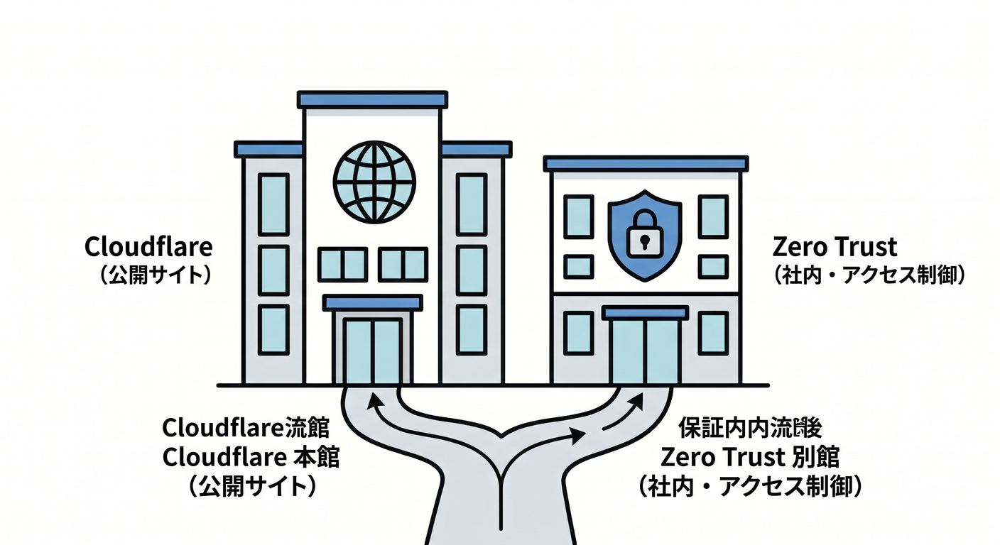
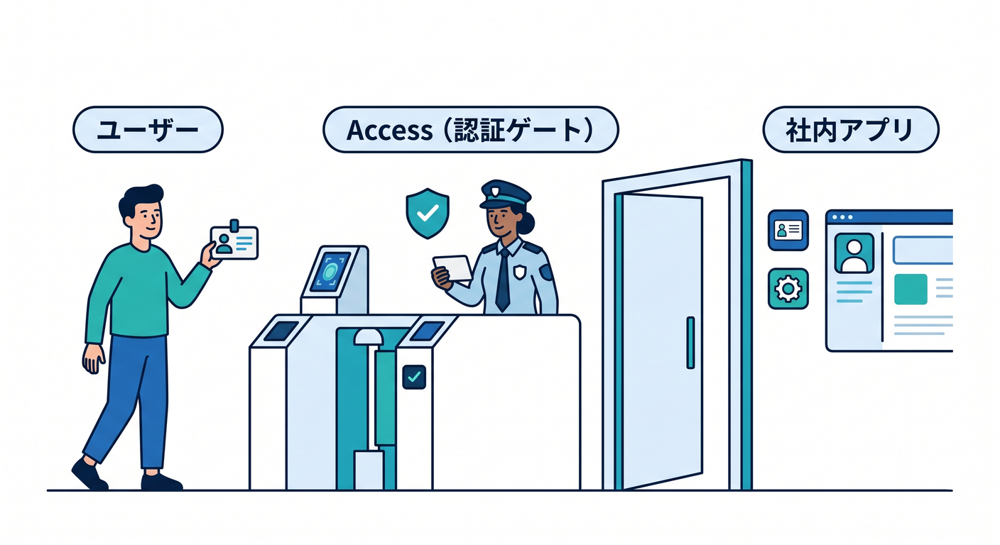
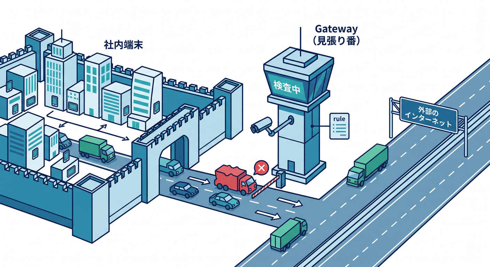
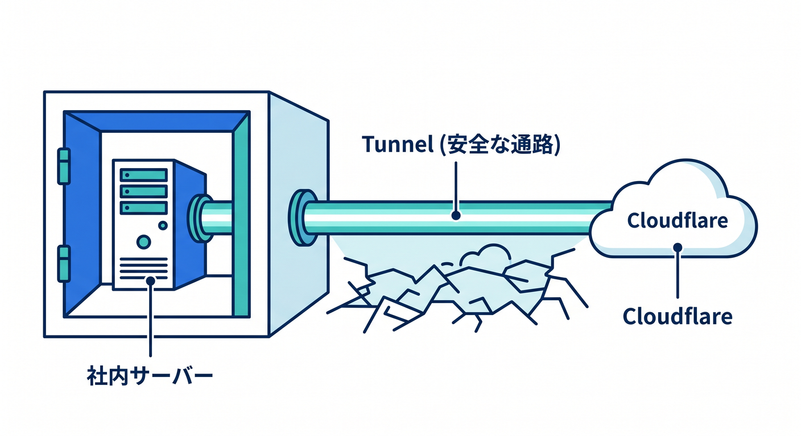
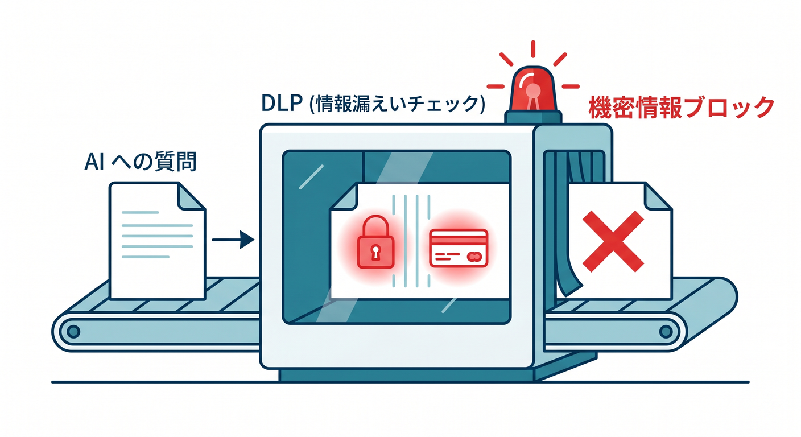
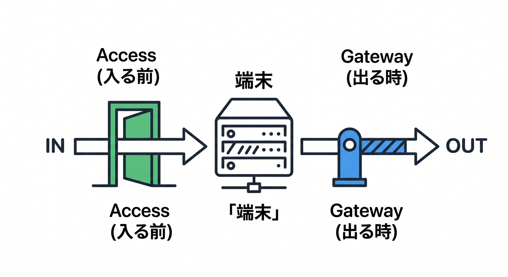

# 第12章：Zero Trustは“別館”として見よう 🏢🔐

Cloudflareの管理画面を歩いていると、DNS・SSL/TLS・Workers とはちょっと空気の違うエリアがあります。それが Zero Trust です ☁️
ここは「公開中のWebサイトを速く安全にする場所」というより、**人・端末・社内アプリ・社内ネットワークをどう安全につなぐか**を扱う場所です。Cloudflare 公式でも、Cloudflare One は Access、Secure Web Gateway、Cloudflare Tunnel、DLP、Browser Isolation、CASB、Email Security、DEX などをまとめた統合コントロールプレーンとして案内されています。だからこの章では、Zero Trust を「本館の横にある別館」として切り分けて見るのがコツです 😊🔐 ([Cloudflare Docs][1])

この章のゴールは3つです 🌟
**① Zero Trust が何を守る場所か分かること、② Access / Gateway / Tunnel / DLP の役割を言い分けられること、③ 管理画面の中で“どこを散歩すれば全体像が見えるか”をつかむこと**です。Zero Trust の初期セットアップでは、Cloudflare ダッシュボードから Zero Trust に入り、組織用の **team name** を決めます。この team name は端末登録にも使われ、App Launcher のサブドメインにも関わる大事な名前です。 ([Cloudflare Docs][2])

まず、主役たちを超ざっくり覚えましょう 🧭

**Access** は「この人を入れてよい？」を決める関所です。Cloudflare Access はアプリの前に立つ **identity-aware proxy** として動き、リクエストごとに Access policy を見て通すか止めるかを判断します。ポリシーは「Action」「Rule type」「Selector」「Value」の4つの部品で考えると分かりやすく、条件にはメールドメイン、IdP グループ、OIDC Claim、端末状態、Gateway 接続状態などを使えます。つまり Access は、**URL を守る認証ゲート**だと思えばOKです 🚪✨ ([Cloudflare Docs][3])

**Gateway** は「外へ出ていく通信をどう扱う？」を見る見張り番です。DNS policy は名前解決の段階で止める仕組み、HTTP policy は URL やメソッドやファイル種別まで見る仕組み、Network policy は SSH・RDP・DB 接続のような非HTTP通信を扱う仕組みです。HTTP policy を本格的に使うには証明書の導入が必要で、Identity ベースの Gateway 制御をやるときは Cloudflare One Client を **Traffic and DNS mode** で使う流れになります。初心者目線では、**DNS → HTTP → Network の順で見る**と理解しやすいです 🌐🛡️ ([Cloudflare Docs][4])

**Tunnel** は「社内や自宅の中にあるものを、穴を開けずに Cloudflare とつなぐ通路」です。Cloudflare Tunnel は `cloudflared` による **outbound-only 接続**で、公開IPをさらさずに Cloudflare 側へつなげる設計です。Zero Trust ダッシュボードでは **Networks > Connectors > Cloudflare Tunnels** から作成でき、そこから公開アプリの接続にも、プライベートIP/CIDRの接続にも進めます。公開アプリを出したあとに Access を重ねれば、「見せるけれど誰でもは入れない」構成にできます 🔌🚇 ([Cloudflare Docs][1])

**Cloudflare One Client** は端末側の窓口です。旧 WARP の流れを引き継ぐクライアントで、端末からの通信を Cloudflare に送り、同時に OS バージョン、ディスク暗号化、特定アプリの有無などの端末状態も報告できます。だから Access や Gateway で「会社PCだけ通す」「暗号化された端末だけ通す」といった条件が作れます。Windows 向けの GA リリースも継続して更新されていて、2026年4月7日時点では Cloudflare One Client for Windows 2026.3.851.0 が案内されています。💻🪪 ([Cloudflare Docs][5])

**DLP** は「大事なデータが外へ漏れそうか」を見る担当です。Cloudflare DLP は Web 通信、SaaS アプリのファイル、さらに **AI prompt** まで検査対象にできます。しかも AI Gateway と連携すると、AI へのリクエストやレスポンス本文を DLP で見られます。最近の DLP は AI prompt topics も扱え、PII、資格情報、ソースコード、顧客データ、金融情報、Jailbreak などの分類に対応しています。つまり Zero Trust はもう“普通の社内ネット対策”だけではなく、**AI利用の出口管理**まで守る場所になっています 🤖🔒 ([Cloudflare Docs][6])

ここで、AI時代の Zero Trust の見方を入れておきましょう 🧠✨
Cloudflare One には **Access controls > AI controls** があり、MCP server portals もここから扱えます。さらに 2026年3月には、MCP server portal の通信を Gateway に流して HTTP ログや DLP スキャンを強化できる更新も入りました。加えて Gateway の **Application Granular Controls** では ChatGPT・Gemini・Claude・Perplexity などに対して細かな操作単位で制御でき、公式ドキュメントには「ChatGPT へのファイルアップロードだけをブロックする」例まで載っています。AIアプリを使う時代は、**Access で入口を守り、Gateway と DLP で出口も守る**、この2段構えで覚えるとかなり整理しやすいです 🚪➡️🧱 ([Cloudflare Docs][7])

では、実際の“散歩コース”です 🚶‍♂️☁️
最初は次の順で見ると迷いにくいです。

1. **Overview**
   ここは Zero Trust 全体の状況を眺めるホームです。Cloudflare One Analytics overview では、組織やネットワークの保護状況をまとめて確認できます。 ([Cloudflare Docs][8])

2. **Settings / Team name and domain**
   team name は Zero Trust の土台です。App Launcher や端末登録に関わるので、まずここを意識しておくと後で混乱しません。 ([Cloudflare Docs][2])

3. **Integrations > Identity providers**
   ここは「誰としてログインさせるか」の設定場所です。Google、GitHub、Entra ID、Okta などの IdP をつなげられ、OIDC や SAML にも対応しています。IdP がつながると、Access や Gateway のポリシーが“人ベース”で書きやすくなります。 🔑 ([Cloudflare Docs][9])

4. **Access controls > Applications / Policies / Access settings / AI controls**
   アプリ保護の中心地です。Applications で守る対象を作り、Policies で誰を通すか決め、Access settings で App Launcher を整え、AI controls で MCP 系も見ます。App Launcher は team domain 上に出て、許可されたアプリだけがタイル表示されます。 🪪📦 ([Cloudflare Docs][10])

5. **Traffic policies > DNS / HTTP / Network**
   ここが Gateway の本丸です。DNS は軽く、HTTP は深く、Network は非HTTP向け。超初心者は、まず「どの棚がどの層の通信を見ているか」だけ理解できれば十分です。 🛣️ ([Cloudflare Docs][4])

6. **Networks > Connectors > Cloudflare Tunnels**
   ここで private resource をつなぐ感覚を覚えます。サーバーに穴を開けずに Cloudflare とつなぐ、という Tunnel の価値がここで見えてきます。 🚇 ([Cloudflare Docs][11])

7. **Insights > Logs**
   最後に見る場所です。Zero Trust は“設定したら終わり”ではなく、“何が起きたか見る”のが超大事です。Gateway activity logs や posture logs を眺めると、管理画面がただの設定画面ではなく、運用画面でもあると分かります。 🔍 ([Cloudflare Docs][12])

初心者が特につまずきやすいのは、「Access と Gateway の違い」です 😵‍💫
ここは **Access = そのアプリへ入る前の認証**、**Gateway = 端末から外へ出る通信の制御** と分けるとかなりスッキリします。たとえば社内の管理画面を守るなら Access、社員が ChatGPT や Dropbox へ何を送るかを見るなら Gateway/DLP、社内サーバーそのものを安全に Cloudflare 側へつなぐなら Tunnel、という分担です。 ([Cloudflare Docs][3])

Windows を使う人向けの小ネタも入れておきます 🪟✨
Cloudflare Access の browser-based terminal では SSH・RDP・VNC をブラウザから扱える導線があり、RDP では Windows の資格情報で追加認証します。さらに 2026年3月には browser-based RDP の **clipboard controls** も追加され、ローカルPCとリモート Windows 間のコピペ方向を制限できるようになりました。BYOD や外部委託の端末を混ぜる場面ではかなり実用的です。 ([Cloudflare Docs][13])

最後に、この章の覚え方を一行でまとめます 🎯
**Zero Trust は「公開サイトの設定室」ではなく、「人・端末・社内アプリ・AI利用・通信の出口をまとめて守る別館」**です。
そして地図はこうです。**Access が入口、Gateway が出口、Tunnel が通路、One Client が端末窓口、DLP が情報漏えいチェック**。この5つが頭に入れば、第12章は大成功です 🎉🔐☁️

次の第13章につなぐなら、自然な流れは **「じゃあ、この別館を誰が触れて、どこまで触れてよいの？」＝ 権限・メンバー・APIトークン** です。

[1]: https://developers.cloudflare.com/cloudflare-one/ "https://developers.cloudflare.com/cloudflare-one/"
[2]: https://developers.cloudflare.com/cloudflare-one/setup/ "https://developers.cloudflare.com/cloudflare-one/setup/"
[3]: https://developers.cloudflare.com/cloudflare-one/access-controls/applications/http-apps/ "https://developers.cloudflare.com/cloudflare-one/access-controls/applications/http-apps/"
[4]: https://developers.cloudflare.com/cloudflare-one/traffic-policies/dns-policies/ "https://developers.cloudflare.com/cloudflare-one/traffic-policies/dns-policies/"
[5]: https://developers.cloudflare.com/cloudflare-one/team-and-resources/devices/cloudflare-one-client/ "https://developers.cloudflare.com/cloudflare-one/team-and-resources/devices/cloudflare-one-client/"
[6]: https://developers.cloudflare.com/cloudflare-one/data-loss-prevention/ "https://developers.cloudflare.com/cloudflare-one/data-loss-prevention/"
[7]: https://developers.cloudflare.com/cloudflare-one/access-controls/ai-controls/mcp-portals/ "https://developers.cloudflare.com/cloudflare-one/access-controls/ai-controls/mcp-portals/"
[8]: https://developers.cloudflare.com/cloudflare-one/insights/analytics-overview/ "https://developers.cloudflare.com/cloudflare-one/insights/analytics-overview/"
[9]: https://developers.cloudflare.com/cloudflare-one/integrations/identity-providers/ "https://developers.cloudflare.com/cloudflare-one/integrations/identity-providers/"
[10]: https://developers.cloudflare.com/cloudflare-one/access-controls/access-settings/app-launcher/ "https://developers.cloudflare.com/cloudflare-one/access-controls/access-settings/app-launcher/"
[11]: https://developers.cloudflare.com/cloudflare-one/networks/connectors/cloudflare-tunnel/get-started/create-remote-tunnel/ "https://developers.cloudflare.com/cloudflare-one/networks/connectors/cloudflare-tunnel/get-started/create-remote-tunnel/"
[12]: https://developers.cloudflare.com/cloudflare-one/insights/logs/dashboard-logs/gateway-logs/?utm_source=chatgpt.com "Gateway activity logs - Cloudflare One"
[13]: https://developers.cloudflare.com/cloudflare-one/access-controls/applications/non-http/ "https://developers.cloudflare.com/cloudflare-one/access-controls/applications/non-http/"

