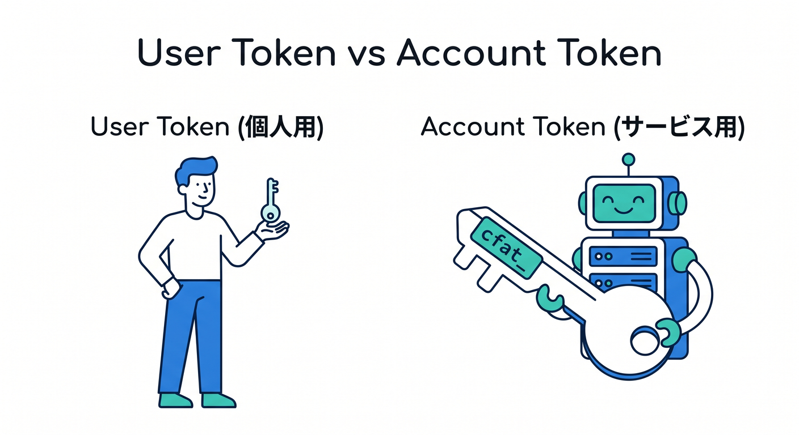
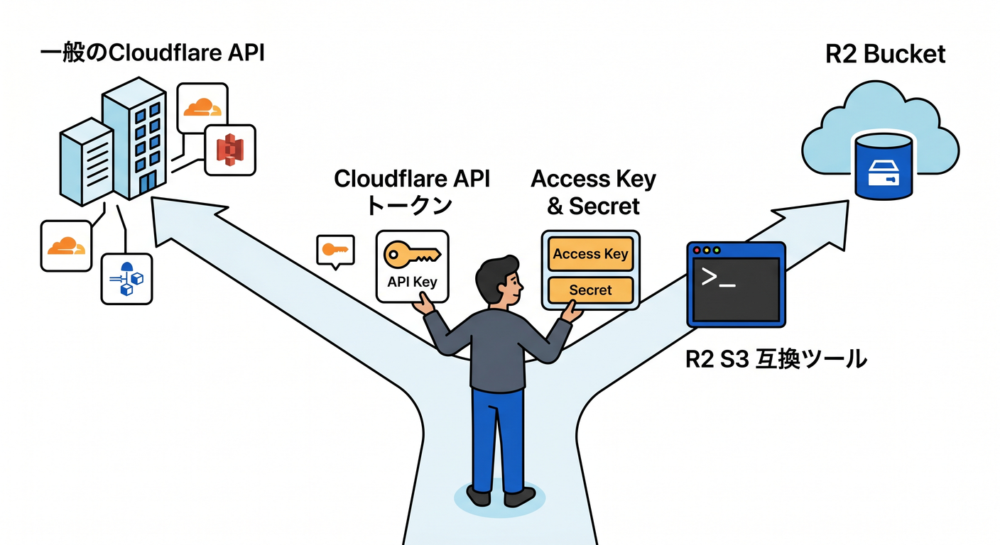
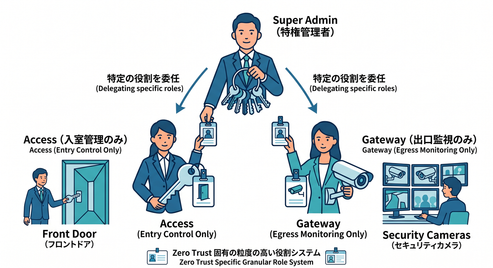
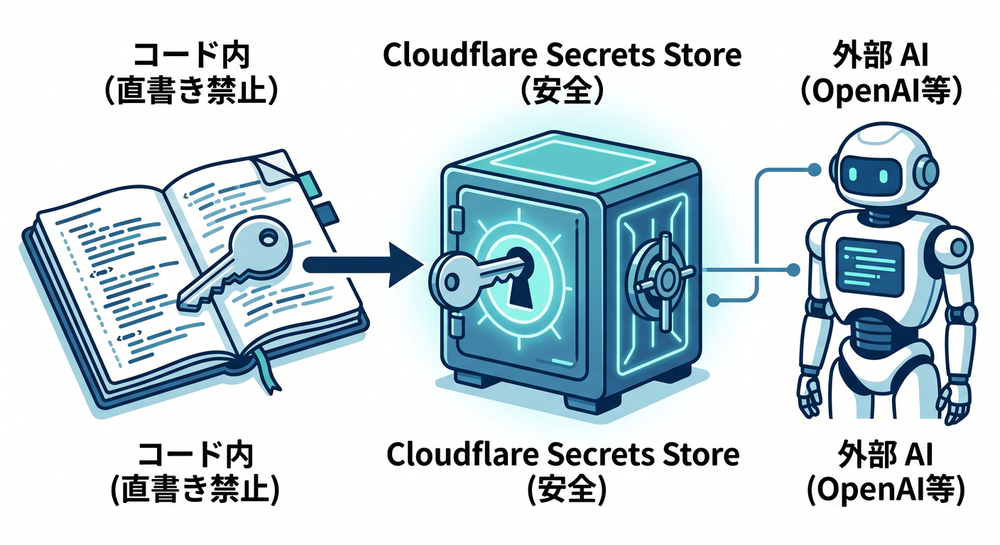
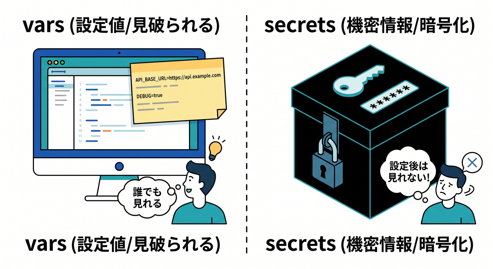
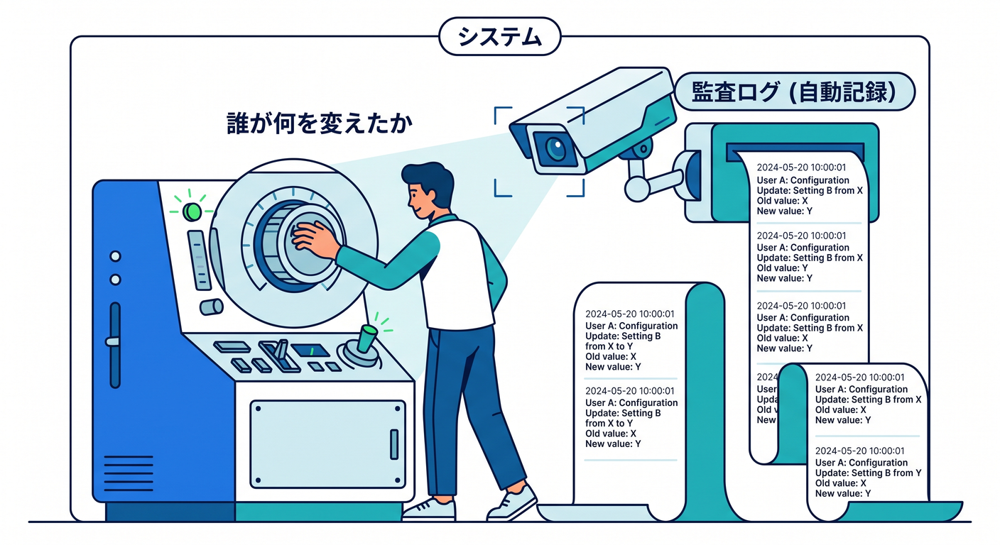

# 第13章：権限・メンバー・APIトークンの基本を知ろう 🪪👥🔑☁️

この章では、Cloudflareを「自分ひとりの作業場」ではなく、**チームで触る本番の管理画面**として見られるようになるのがゴールです 😊
ここまでで「どこに何があるか」が見えてきたので、次は「**誰が触れるのか**」「**プログラムには何を持たせるのか**」を整理します。2026年4月14日時点の公式情報では、Cloudflareの権限設計はかなり細かくなっていて、メンバーにはロールとスコープを与え、APIには専用トークンを与える形が基本です。Zero Trust 側には別系統のロールもあり、AI Search や AI Gateway ではサービス用トークンや秘密情報の扱いも重要になります。 ([Cloudflare Docs][1])

---

## 1. まずは「3つのカギ」に分けて考えよう 🗝️🗝️🗝️

Cloudflareの権限は、最初から全部まとめて理解しようとすると少し苦しいです 😵
なので、まずは次の3つに分けると頭がかなりスッキリします。

**1つ目は、人に渡すカギ**です。
これは Cloudflare ダッシュボードに入るメンバー権限で、「誰が」「どの範囲を」「どの程度触れるか」を決めます。Cloudflareのメンバー権限は、基本的に **actor・role・scope** の3要素で組み立てられ、最小権限で付与するのが推奨です。 ([Cloudflare Docs][1])

**2つ目は、プログラムに渡すカギ**です。
これは API トークンで、スクリプト、CI/CD、デプロイ、自動化ツールなどが Cloudflare API を使うために持つものです。トークン権限は User・Account・Zone の3カテゴリに分かれ、Read と Edit/Write を組み合わせてかなり細かく絞れます。 ([Cloudflare Docs][2])

**3つ目は、Zero Trust や AI 用の特別なカギ**です。
Zero Trust には専用ロールや Service Token があり、AI Search にはサービス API トークン、AI Gateway には専用権限や Secrets Store 連携があります。つまり Cloudflare では、「人のログイン」と「自動処理の認証」と「AI/Zero Trust の内部連携」を分けて考えるのがコツです。 ([Cloudflare Docs][3])

---

## 2. メンバー権限は「誰がどこまで入れるか」を決める仕組み 👥🏢

Cloudflareのアカウントでは、ほかの人をメンバーとして招待して共同作業できます。
そのとき大事なのは、「その人が何を触れるか」をざっくりではなく、**役割ごとに細かく切る**ことです。Cloudflare公式でも、たとえば staging だけ触れる人を作って、本番にうっかり変更しないようにする、といった最小権限の考え方が案内されています。 ([Cloudflare Docs][1])

メンバーを管理できるのは、**Super Administrator かつメール確認済みのユーザー**です。
ダッシュボードでは Manage Account → Members から招待し、メールアドレス、Scope、Roles を指定して追加します。あとから権限を編集したり、不要になったら Revoke したりもできます。 ([Cloudflare Docs][4])

ここでの大事な感覚は、**「メンバー＝人」ではなく「メンバーに対して複数のポリシーを足していく」**という見方です。
Cloudflareでは User Groups 経由でも権限を付けられ、最終的な有効権限は **加算式** になります。つまり、直接付けた権限とグループ経由の権限が合体するので、「なんでこの人ここ触れるの？」となったら、Members 画面だけでなく User Groups 側も確認する必要があります。 ([Cloudflare Docs][5])

---

## 3. まず覚えたい代表ロールたち 🧭✨

全部のロール名を暗記する必要はありません 🙆
最初は「よく出る顔ぶれ」だけ覚えれば十分です。

**Super Administrator** は最強権限です。
あらゆる設定変更、購入、請求、メンバー管理、さらに account-owned API token の作成までできます。他の Super Administrator のアクセスを revoke できるのもこのロールです。逆に言うと、人数を増やしすぎない方が安全です。 ([Cloudflare Docs][6])

**Administrator** は広い権限を持ちますが、**メンバー管理と billing profile 管理はできません**。
なので「ほぼ全部触ってよいが、組織管理までは任せない人」に向いています。閲覧だけでよければ **Administrator Read Only** があります。 ([Cloudflare Docs][6])

**Audit Logs Viewer** は地味ですがかなり実務的です 👀
「変更はさせたくないけれど、何が起きたかは見せたい」という人向けです。複数人運用では、トラブル時に“犯人捜し”ではなく“変更履歴を見る”ためにとても便利です。 ([Cloudflare Docs][7])

開発系では **Workers Platform Admin** と **Workers Platform (Read-only)** が分かりやすいです。
このロールは Workers、Pages、Durable Objects、KV、R2、Zones、Zone Analytics、Page Rules など、Developer Platform まわりをまとめて扱えるロールです。Cloudflareの開発基盤を丸ごと見せたいなら便利ですが、範囲はかなり広めです。 ([Cloudflare Docs][6])

R2を担当させたいだけなら、**Cloudflare R2 Admin** や **Cloudflare R2 Read** が素直です。
Workers まで広く触らせる必要がないなら、こちらの方が安全です。 ([Cloudflare Docs][6])

ドメイン単位で権限を切りたいときは、**Domain Administrator** や **Domain DNS** が役立ちます。
特定ドメインだけ DNS を触らせたい、あるいは特定サイトだけ担当してもらいたい、という場面で使いやすいです。さらに 2026年時点では **resource-scoped roles** も Beta として用意されていて、今後さらに細かい切り分けがしやすくなる流れです。 ([Cloudflare Docs][6])

Zero Trust 側では **Cloudflare Zero Trust**、**Cloudflare Zero Trust Read Only**、**Cloudflare Zero Trust Reporting**、そして必要に応じて **Cloudflare Zero Trust PII** を分けて考えます。
特に PII は別ロールで、Gateway の活動ログにある Device ID、送信元 IP、メールアドレスのような個人情報を見せるかどうかを追加で制御できます。ここはかなり“本番運用らしい”ところです。 ([Cloudflare Docs][6])

---

## 4. 初心者向けの権限の渡し方は「広く渡さない」が正解 🙅‍♂️🔒

Cloudflareを触り始めたばかりの頃は、つい Administrator や Super Administrator を渡したくなります。
でも実務では、**必要な画面だけ見せる**のが基本です。Cloudflare自身も、最低限必要な権限だけを与えるよう案内しています。 ([Cloudflare Docs][1])

たとえば、こんな切り方が分かりやすいです 😊

* DNSだけ担当する人 → Domain DNS
* R2のバケットやオブジェクトだけ触る人 → Cloudflare R2 Admin か Cloudflare R2 Read
* Workers と Pages を中心に触る開発者 → Workers Platform Admin または Read-only
* Zero Trust の閲覧担当 → Cloudflare Zero Trust Read Only
* 全体の変更履歴だけ見たい人 → Audit Logs Viewer  ([Cloudflare Docs][6])

この章ではまだ組織設計を深掘りしませんが、感覚としては
**「何でもできる人を増やす」より「役割ごとに分ける」**
これだけ覚えておけば十分です 🌱

---

## 5. APIトークンは「人の代わりにプログラムが持つ社員証」🤖🪪

次は API トークンです。
これは Cloudflare API をたたくための認証情報で、ダッシュボードでクリックしていた操作を、スクリプトや CI/CD、外部サービス連携から実行できるようにするものです。Cloudflareのトークン権限は User・Account・Zone の3カテゴリに整理されていて、DNS は Zone、Billing は Account のように対象ごとに分かれています。 ([Cloudflare Docs][2])

トークン作成時には、まずテンプレートから始めることもできます。
たとえば公式のテンプレートには Edit Zone DNS、Read billing info、Read All Resources、そして Workers 用のテンプレートもあり、Workers 系テンプレートには Workers Scripts、Workers KV Storage、Workers Tail、Workers R2 Storage などが最初から入っています。初心者のうちは、ゼロから組み立てるよりテンプレートをベースに削る方が安全です。 ([Cloudflare Docs][8])

さらに、トークンは**対象リソースを絞る**ことができます。
たとえば Zone DNS Read を特定の zone だけに絞れば、その zone の DNS だけ読めて、他の zone や別種操作はエラーになります。加えて、Client IP Address Filtering や TTL で、使える IP や有効期限も制限できます。 ([Cloudflare Docs][9])

---

## 6. いちばん大事な違い：User Token と Account API Token 🔑🏢

ここはかなり大事です。
Cloudflareでは、**User Token** と **Account API Token** を分けて考えるようになっています。Create API token の最新ガイドでも、最初に「user token にするか account token にするか」を選ぶ流れです。 ([Cloudflare Docs][9])

**User Token** は、そのユーザー本人にひもづくトークンです。
個人の権限の一部を引き継いで動くので、ちょっとしたスクリプトや手元の自動化には向いています。Cloudflareも、ad hoc な作業には user token が向くと案内しています。 ([Cloudflare Docs][10])

**Account API Token** は、アカウントそのものに属する、長く使う前提のトークンです。
Cloudflare公式では、CI/CD や SIEM 連携のように、設定した人が退職しても動き続けてほしいケースに向くと説明しています。つまり「人の代理」ではなく「サービスアカウントっぽい存在」と考えると分かりやすいです。しかも新しい account token は **cfat_ で始まるスキャンしやすい形式**です。 ([Cloudflare Docs][10])

ただし、Account API Token を作れるのは **Super Administrator** です。
また、かなり多くの製品で使えますが、製品ごとの compatibility matrix を確認するのが安心です。2026年4月時点の公式表では、Access、AI Gateway、D1、DNS、Durable Objects、Hyperdrive、Images など多くの製品が対応しています。 ([Cloudflare Docs][10])

初心者向けに雑にまとめると、こんな感じです ✨

* 手元で少し試す → User Token
* GitHub Actions や長期運用の自動化 → Account API Token
* 「退職やアカウント変更の影響を受けたくない」 → Account API Token  ([Cloudflare Docs][9])

---

## 7. Workers・R2・AI では、必要な権限がかなり具体的に分かれる 🧩

API トークンの権限一覧を見ると、Cloudflareはかなり細かく切れるようになっています。
2026年時点では、Workers AI Read/Write、Workers Scripts Read/Write、Workers KV Storage Read/Write、Workers R2 Storage Read/Write、AI Gateway Read/Edit/Run、Zero Trust Read/Write などが並んでいます。つまり「Cloudflareを触るトークン」ではなく、「**何を触るトークンか**」までちゃんと決められる設計です。 ([Cloudflare Docs][2])

これは初心者にも実はうれしい仕組みです 😊
なぜなら、「この自動化は DNS だけ」「この CI は Workers のデプロイだけ」「この AI アプリは AI Gateway だけ」というふうに、役割ごとにトークンを分離しやすいからです。1本の巨大トークンを使い回すより、あとで事故原因も追いやすくなります。 ([Cloudflare Docs][2])

---

## 8. R2 はちょっとだけ“別の顔”を持つ 📦🪣

R2 はオブジェクトストレージなので、APIトークンの感覚が少しだけ違います。
R2 の認証ドキュメントでは、**Account API token** と **User API token** の両方が作れ、Object Read や Object Read & Write の場合は **特定バケットに絞る**こともできます。しかも、Account API token は Super Administrator だけが作成・閲覧できます。 ([Cloudflare Docs][11])

さらに、S3 API を使う CLI ツールでは **Access Key ID と Secret Access Key** 形式の資格情報が必要になります。
R2 のダッシュボードから Manage R2 API tokens → Create API token で作成し、Secret は **その場で一度しか見られません**。一方で、Wrangler は Cloudflare アカウントで直接認証するので、R2 を Wrangler で扱うだけならこの S3 用資格情報を省ける場面があります。 ([Cloudflare Docs][12])

ここは初心者が混乱しやすいポイントです 😌
「Cloudflare API 用トークン」と「R2 の S3 互換接続用資格情報」は、似ているけれど使い道が少し違います。**ブラウザや Wrangler で扱うのか、S3 ツールで扱うのか**で見分けると整理しやすいです。 ([Cloudflare Docs][11])

---

## 9. Zero Trust は“別館の権限体系”として扱おう 🏢🔐

第12章でも見たように、Zero Trust は普通の Web 配信や開発メニューとはかなり雰囲気が違います。
権限も同じで、Zero Trust 側には **Super Administrator / Cloudflare Zero Trust / Cloudflare Access / Cloudflare Gateway / Read Only / Reporting / PII** などの専用ロールがあります。しかも、これらを付け外しできるのは Super Administrator です。 ([Cloudflare Docs][3])

たとえば、Access だけ任せたい人に Access 系だけを与え、Gateway だけ見せたい人には Gateway 系だけを与える、という考え方ができます。
また、2026年1月には Access 向け API token permissions に、Organizations Revoke、Population Read、Population Write のような、より細かい権限も追加されています。Zero Trust はとくに「大きく渡さない」が効く世界です。 ([Cloudflare Docs][3])

Zero Trust で自動化をするなら、**Service Token** も覚えておくと便利です。
これは Cloudflare One の Access ポリシーに対して、自動化システムが認証するための Client ID と Client Secret です。ダッシュボードでは Access controls → Service credentials → Service Tokens から作成でき、期限を決められ、期限前のアラートも設定できます。削除すると、そのサービスはアプリに到達できなくなります。 ([Cloudflare Docs][13])

つまり Zero Trust では、
**人にはロール**、**自動化には Service Token**、**管理 API には API Token**
という三段構えで見るとかなり分かりやすいです。 ([Cloudflare Docs][3])

---

## 10. AI時代の Cloudflare では「秘密情報の置き場所」まで考える 🤖🔑✨

CloudflareのAIまわりは、ただモデルを呼ぶだけではなく、**どの鍵をどこに置くか**まで設計に入ってきます。
API token permissions には Workers AI や AI Gateway の権限があり、AI Search では専用の service API token も登場しています。つまり AI 機能も、もう完全に“本番運用の世界”です。 ([Cloudflare Docs][2])

特に **AI Search** は、2026年4月時点では Beta で、**service API token が必要**です。
このトークンは、AI Search が R2、Vectorize、Workers AI、Browser Rendering などにアクセスするための内部用トークンで、ダッシュボードからインスタンスを作るとセットアップの流れで自動作成されます。これは、外から AI Search REST API を呼ぶための普通の API token とは別物です。うっかり消すと AI Search インスタンスが動かなくなるので注意です。 ([Cloudflare Docs][14])

**AI Gateway** では、Secrets Store と組み合わせるとかなり安全にできます。
Cloudflare Secrets Store は open beta のアカウント単位の秘密情報保管庫で、秘密は暗号化されて Cloudflare のデータセンター全体に安全に保管されます。2026年時点では Workers と AI Gateway に対応していて、AI Gateway では BYOK のプロバイダーキーを平文ヘッダーではなく参照で扱えるようになっています。 ([Cloudflare Docs][15])

このへんは AI アプリづくりでかなり大事です 💡
「Anthropic や OpenAI など外部AIの鍵をコードに直書きする」のではなく、Cloudflare 側の Secrets Store や Worker の Secret に逃がす方がずっと安全です。Cloudflare 公式でも、平文の environment variables ではなく Secret や Secrets Store を使うよう案内しています。 ([Cloudflare Docs][16])

---

## 11. Worker では「vars」と「secrets」を混ぜない感覚が大事 🧪🔒

Workers には environment variables がありますが、**text や JSON の vars は暗号化されません**。
公式ドキュメントでも、vars はアプリ設定向けで、パスワードや API token のような機密情報には使わず、Secrets または Secrets Store bindings を使うよう明記されています。 ([Cloudflare Docs][17])

Secret は、設定後に Wrangler やダッシュボードから値を見られないのがポイントです。
Worker からは env 経由で使えますが、人間の画面には再表示されません。Pages Functions の secrets も同じく、設定後に値は見えません。 ([Cloudflare Docs][16])

ローカル開発では、.dev.vars か .env のどちらか一方を使います。
両方を混ぜず、Git にコミットしないよう .gitignore に .dev.vars* と .env* を入れるのが公式の案内です。さらに 2025年4月以降の互換日付では、Node.js compatibility と nodejs_compat_populate_process_env を有効にすると process.env 側でも見える仕組みがあるので、便利さが増したぶん、なおさら秘密情報の扱いに気をつけたいところです。 ([Cloudflare Docs][17])

---

## 12. VS Code と Copilot を使うなら「便利さ」と「秘密保持」を両立しよう 💻🤝🔐

VS Code と Copilot を使う学習スタイルは、Cloudflare とかなり相性がいいです。
ただし、トークンやシークレットを AI に雑に見せない、という意識は大事です。GitHub Docs では、リポジトリや組織単位で **Copilot content exclusion** を設定でき、特定ファイルやパスを Copilot が無視するようにできます。 ([GitHub Docs][18])

でも、ここにひとつ注意があります ⚠️
公式では、**GitHub Copilot CLI、Copilot cloud agent、IDE の Agent mode は content exclusion をサポートしない**と案内されています。つまり、「除外設定したから完全安心」とは言い切れません。秘密情報の入ったファイルをむやみに開いたり、チャットに貼ったりしないのが基本です。 ([GitHub Docs][18])

VS Code 側では、MCP サーバー用の認証情報などの機密値は **secure credentials store** に保存され、MCP の認証仕様にも対応しています。
さらに Cloudflare は自前の managed remote MCP servers を OAuth で接続できる形で提供しており、Cloudflare Access を使って MCP サーバーを OAuth SSO で保護する案内もあります。つまり、2026年の開発環境では「AI を使う」こと自体は普通になってきましたが、**認証まわりはちゃんと安全側に寄せる**流れになっています。 ([Visual Studio Code][19])

---

## 13. 「誰が何を変えたか」はログで追えるようにしておこう 🕵️📜

複数人で触るなら、権限設定と同じくらい大事なのが **監査ログ** です。
Cloudflare Audit Logs v2 はアカウント単位で、ダッシュボードや API のユーザー操作が自動記録され、Cloudflare 側の自動処理も system-initiated logs として記録されます。保持期間は 18か月で、UI では最近 90日が中心、より長く見たい場合は API や Logpush を使います。 ([Cloudflare Docs][20])

Zero Trust 側にも **Admin activity logs** があり、メンバーが Zero Trust 組織で作成・更新・削除した変更を追えます。場所は Cloudflare One → Insights → Logs → Admin activity logs です。Cloudflareの権限は細かいので、困ったときは「設定を見直す」だけでなく「ログを見る」までセットで覚えておくと安心です。 ([Cloudflare Docs][21])

---

## 14. この章で持ち帰りたい実務感覚 🎒✨

この章でいちばん大事なのは、
**Cloudflare は “ログインできれば全部触れる” サービスではない**
と分かることです。

人にはメンバー権限を渡す。
プログラムには API トークンを渡す。
Zero Trust の自動化には Service Token を使う。
AI の秘密鍵は Secrets Store や Worker Secret に逃がす。
そして、あとで必ずログで見返せるようにする。 ([Cloudflare Docs][1])

これができると、Cloudflareの管理画面が「ただの設定画面」から、**本番を回すための運用画面**に見えてきます 💼☁️
この感覚が出てくると、次の VS Code・Copilot・MCP の章にもすごくつながりやすくなります。なぜなら、そこで扱う開発フローも結局は「どの認証情報をどこに置くか」の話につながるからです。 ([Visual Studio Code][19])

---

## 15. ミニ演習 ✍️🌟

最後に、画面を見ながらこんな問いに答えられたら、この章はかなり成功です 😊

**演習1**
「DNSだけ触れる人」と「Workers と R2 を触る人」では、どのロールを分けたいですか？
ヒントは Domain DNS、Cloudflare R2 Admin、Workers Platform Admin です。 ([Cloudflare Docs][6])

**演習2**
GitHub Actions から Cloudflare にデプロイするとき、User Token と Account API Token のどちらが向いていそうですか？
“その人がいなくなっても動いてほしいかどうか”で考えると答えやすいです。 ([Cloudflare Docs][10])

**演習3**
AI Gateway や Worker で使う外部 API キーを、vars に置くべきか Secret に置くべきか考えてみましょう。
公式ドキュメントの答えはかなりはっきりしています。 ([Cloudflare Docs][16])

---

必要なら次に、この第13章を教材フォーマット向けにさらに整えて、
「学習目標」「用語ミニ辞典」「確認テスト5問」「講師用ノート付き」版にできます。

[1]: https://developers.cloudflare.com/fundamentals/manage-members/ "Members and permissions · Cloudflare Fundamentals docs"
[2]: https://developers.cloudflare.com/fundamentals/api/reference/permissions/ "API token permissions · Cloudflare Fundamentals docs"
[3]: https://developers.cloudflare.com/cloudflare-one/roles-permissions/ "Roles and permissions · Cloudflare One docs"
[4]: https://developers.cloudflare.com/fundamentals/manage-members/manage/ "Manage account members · Cloudflare Fundamentals docs"
[5]: https://developers.cloudflare.com/fundamentals/manage-members/policies/ "Policies · Cloudflare Fundamentals docs"
[6]: https://developers.cloudflare.com/fundamentals/manage-members/roles/ "Account roles · Cloudflare Fundamentals docs"
[7]: https://developers.cloudflare.com/fundamentals/manage-members/roles/?utm_source=chatgpt.com "Account roles - Cloudflare Fundamentals"
[8]: https://developers.cloudflare.com/fundamentals/api/reference/template/ "API token templates · Cloudflare Fundamentals docs"
[9]: https://developers.cloudflare.com/fundamentals/api/get-started/create-token/ "Create API token · Cloudflare Fundamentals docs"
[10]: https://developers.cloudflare.com/fundamentals/api/get-started/account-owned-tokens/ "Account API tokens · Cloudflare Fundamentals docs"
[11]: https://developers.cloudflare.com/r2/api/tokens/ "Authentication · Cloudflare R2 docs"
[12]: https://developers.cloudflare.com/r2/get-started/cli/ "CLI · Cloudflare R2 docs"
[13]: https://developers.cloudflare.com/cloudflare-one/access-controls/service-credentials/service-tokens/ "Service tokens · Cloudflare One docs"
[14]: https://developers.cloudflare.com/ai-search/configuration/service-api-token/ "Service API token · Cloudflare AI Search docs"
[15]: https://developers.cloudflare.com/secrets-store/ "Overview · Cloudflare Secrets Store docs"
[16]: https://developers.cloudflare.com/workers/configuration/secrets/ "Secrets · Cloudflare Workers docs"
[17]: https://developers.cloudflare.com/workers/configuration/environment-variables/ "Environment variables · Cloudflare Workers docs"
[18]: https://docs.github.com/en/copilot/how-tos/configure-content-exclusion/exclude-content-from-copilot "Excluding content from GitHub Copilot - GitHub Docs"
[19]: https://code.visualstudio.com/docs/copilot/security "Security"
[20]: https://developers.cloudflare.com/fundamentals/account/account-security/audit-logs/ "Audit Logs - version 2 · Cloudflare Fundamentals docs"
[21]: https://developers.cloudflare.com/cloudflare-one/insights/logs/dashboard-logs/admin-activity-logs/ "Admin activity logs · Cloudflare One docs"

