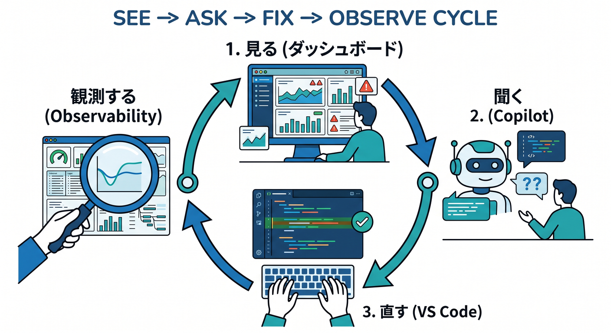
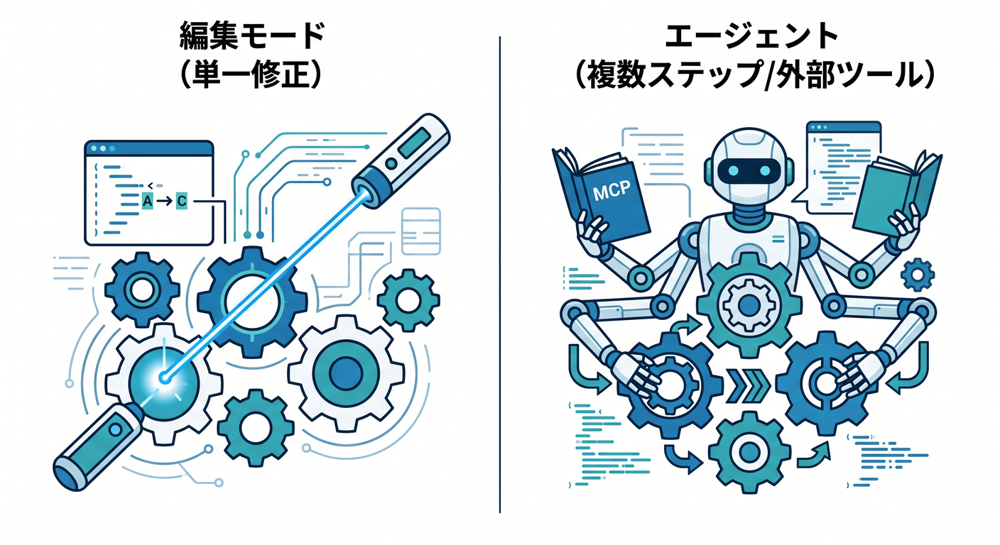
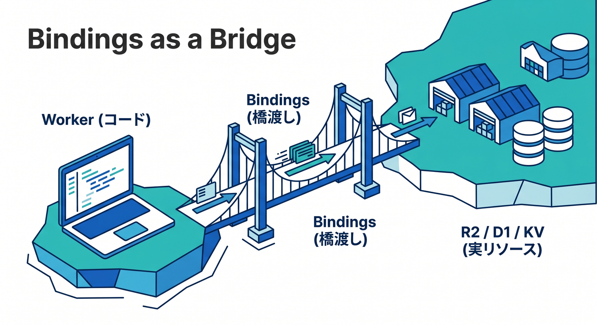
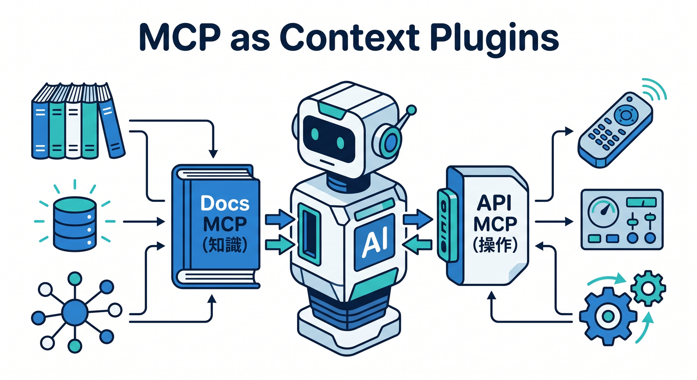
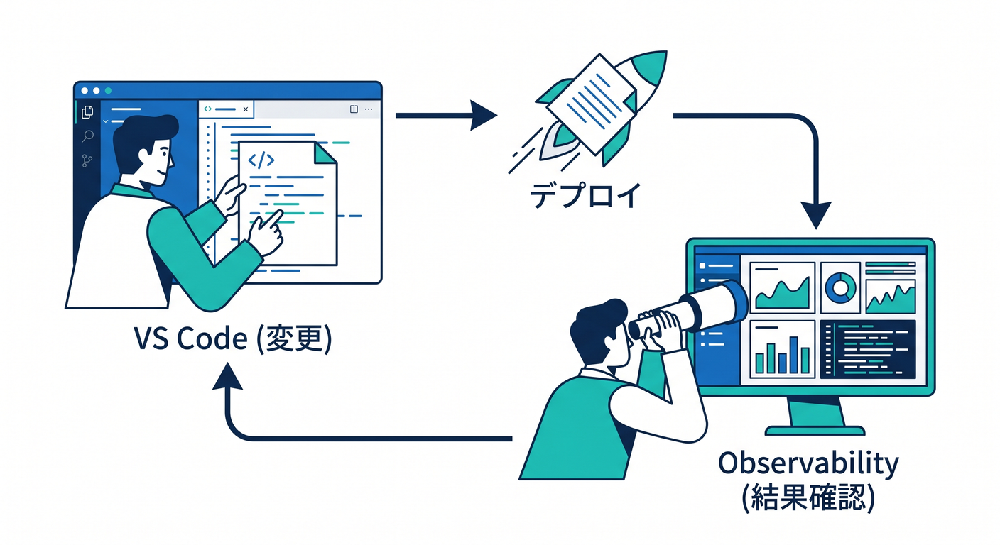
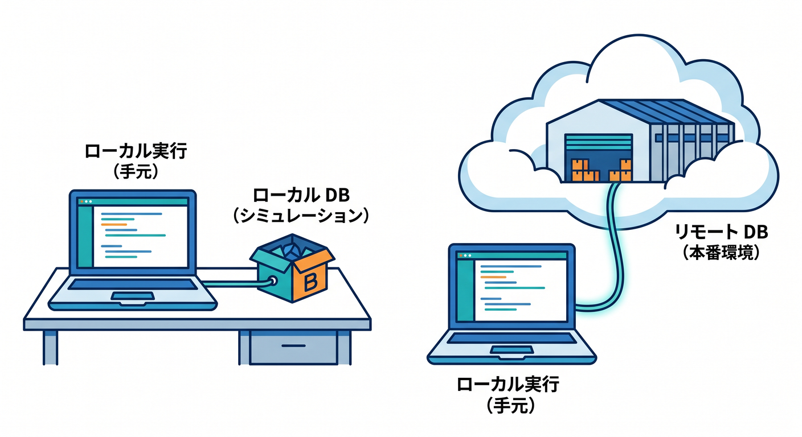

# 第14章：VS Code・Copilot・MCPと管理画面をつなげよう 🧩☁️💻✨

ここまでで、Cloudflare の管理画面が「どこに何がある場所か」はだいぶ見えてきましたね 😊
この章では、そこからもう一歩進んで、**管理画面で見つけたものを VS Code と GitHub Copilot につなぎ、必要に応じて MCP で文脈を増やし、最後に Observability で結果を見返す**流れを身につけます。本日時点では、Cloudflare は Workers を VS Code などのエディタからプロンプトで作る流れや、Cloudflare Docs MCP・Cloudflare Observability MCP を使う流れを公式に案内しています。GitHub Copilot / VS Code 側も、MCP サーバーの追加やエージェント利用を公式にサポートしています。 ([Cloudflare Docs][1])

## この章のゴール 🎯

この章で目指すのは、次の 4 つです。

* 管理画面で見つけた設定や状態を、VS Code 側の作業と結びつけて考えられること
* Copilot を「丸投げ機械」ではなく、**説明役・整理役・修正補助役**として使えること
* MCP を「AI に外部の文脈を渡すための差し込み口」として理解すること
* 変更したあと、Observability で **ちゃんと動いたかを見に戻る習慣**を作ること

## まず覚えたい一言 🗺️

この章の合言葉は、**「見る → 聞く → 直す → 観測する」**です。
Cloudflare の管理画面は「現場を見る場所」、VS Code は「手を動かす場所」、Copilot は「相談相手」、Wrangler は「ローカルと Cloudflare をつなぐ橋」、MCP は「AI に追加の文脈を渡す仕組み」、Observability は「答え合わせをする場所」と考えると、全体がすごく整理しやすくなります。Cloudflare 側でも Workers の開発、Bindings、Observability、AI 系の管理導線がはっきり分かれており、GitHub Copilot 側でもチャット・編集・エージェント・MCP という役割分担が進んでいます。 ([Cloudflare Docs][2])

## 今の Cloudflare 学習は「管理画面だけ」ではもったいない 🌈

Cloudflare の公式ドキュメントでは、Workers アプリを **VS Code を含む好みのエディタやエージェントから、プロンプトで作る流れ**が案内されています。さらに、Cloudflare Docs MCP をつなぐと Workers まわりの知識を AI に渡しやすくなり、Cloudflare Observability MCP をつなぐと、ログや例外を見て修正の手がかりをつかみやすくなります。つまり今の学び方は、「ドキュメントを読む」だけでなく、**AI に正しい文脈を持たせて、管理画面の意味をその場で解説させる**方向に進んでいます。 ([Cloudflare Docs][1])

## いちばん自然な学習ルート 🚶‍♂️☁️

おすすめは、次の順番です。

1. **Cloudflare の管理画面で気になる場所を見つける**
   たとえば Workers & Pages、Bindings、AI、Observability などです。最近は AI がダッシュボードのトップレベルに独立して見つけやすくなっており、Workers AI や AI Gateway へ入りやすくなっています。 ([Cloudflare Docs][3])

2. **VS Code で Copilot に意味を聞く**
   Copilot Chat は、コード提案、コード説明、単体テスト生成、修正案の提案などを IDE 内で行えます。VS Code 関連は `@vscode`、ターミナル関連は `@terminal` のような参加者を使って質問もできます。 ([GitHub Docs][4])

3. **軽い修正は編集モード、重い作業はエージェントモードに分ける**
   Copilot の編集モードは「このファイル群だけ直したい」ときに向いていて、エージェントモードは「複数ステップの作業をまとめて進めたい」「MCP サーバーのような外部ツールも使いたい」ときに向いています。初心者のうちは、まず編集モード寄りで使い、慣れてからエージェントモードを増やすのがおすすめです。 ([GitHub Docs][5])

4. **必要なら MCP を足す**
   GitHub Copilot における MCP は、外部ツールやサービスを Copilot につなぐための標準的な仕組みです。VS Code では MCP サーバーをレジストリ経由でも手動でも追加でき、`@mcp` で探せます。追加後は `MCP: List Servers` で確認でき、初回起動時には信頼確認も出ます。なお、GitHub Docs では VS Code 1.99 以降が前提として案内されています。 ([GitHub Docs][6])

5. **ローカルで試す**
   Cloudflare の CLI である Wrangler は、Node.js と npm を使って導入します。新規プロジェクトでは `wrangler.jsonc` が推奨されており、既存のフレームワークプロジェクトを Cloudflare に載せるときは、Wrangler がフレームワークを検出して設定やアダプタ導入を助けてくれる流れもあります。Pages なら `wrangler pages dev` でローカル確認できます。 ([Cloudflare Docs][7])

6. **管理画面に戻って観測する**
   Workers Observability では、ログ、トレース、メトリクス、Query Builder などで動作確認ができます。2026年2月の更新で、可視化、JSON/CSV エクスポート、共有リンク、列カスタマイズ、イベント詳細展開などが強化され、さらに検索バーで構造化クエリも書けるようになりました。 ([Cloudflare Docs][8])

## VS Code と管理画面がつながる瞬間はここ 👀💡

初心者がいちばん「あっ、つながった」と感じやすいのは、**Bindings** と **Observability** です。
Bindings は、Worker から R2・KV・D1・AI Search などの Cloudflare リソースを扱うための橋で、REST API を直にたたくより自然に使えるのが特徴です。ローカル開発では通常ローカル側のシミュレーションにつながりますが、`remote: true` を使うと、**コードはローカルで動かしたまま、R2 や D1 など実際の Cloudflare 上のリソースにつなぐ**ことができます。さらに AI bindings は例外で、モデル実行は常にリモートです。 ([Cloudflare Docs][9])

つまり、管理画面で見ていた R2 バケットや AI Search を、VS Code 側のコードから本当に触れるようになるわけです ✨
このとき大事なのは、「管理画面にある名前」と「コード側の binding 名」を頭の中で対応づけることです。ここが見えると、Cloudflare の管理画面が単なる設定集ではなく、**コードの外側にある実物の部品棚**に見えてきます。 ([Cloudflare Docs][10])

## Copilot はどう使うと気持ちよくハマるの？ 🤝

Copilot は、最初から「全部作って」で使うより、**管理画面で見つけたわからないものを解説させる**ところから始めるとかなり相性がいいです。GitHub の公式案内でも、Copilot Chat はコード説明、提案、修正、テスト生成に向いており、エージェントモードは複数ステップや外部アプリ連携が絡むタスクに向いています。 ([GitHub Docs][4])

たとえば、こんな聞き方が実用的です ✍️

* 「Cloudflare の `Observability` タブで見るべき順番を初心者向けに教えて」
* 「この `wrangler.jsonc` の binding 設定を、R2 と AI Search の役割ごとに説明して」
* 「この Worker で例外が出たとき、管理画面のどこを見るべき？」
* 「`@terminal` いまの `wrangler dev` エラーを要約して、次の一手を教えて」
* 「`@vscode` このプロジェクトでデバッグしやすいファイル構成に整えて」

こういう使い方だと、Copilot が**先生っぽく働く**ので、学習の手応えが出やすいです 😊

## MCP は“盛りすぎない”のがコツ 🔌

MCP は便利ですが、最初から何でもつなげばいいわけではありません。
まずは **Cloudflare Docs MCP** と **Cloudflare Observability MCP** のように、「答えの質が上がりやすいもの」から足すのがちょうどいいです。Cloudflare 公式もこの 2 つを、Workers 学習やログ確認に役立つものとして案内しています。 ([Cloudflare Docs][1])

そのうえで、「Cloudflare の設定そのものを AI に読ませたり提案させたりしたい」という段階に来たら、Cloudflare 公式の **Cloudflare API MCP server** を見ると世界が広がります。Cloudflare は managed remote MCP servers のカタログを用意しており、その中の Cloudflare API MCP server は DNS、Workers、R2、Zero Trust などを含む広い Cloudflare API 群を `search()` と `execute()` の 2 つの道具で扱う設計です。かなり強力なので、最初は“管理画面の意味を理解する補助”として使い、いきなり自動変更の主役にしないのが安全です。 ([Cloudflare Docs][11])

## ここで一回、学習メニューを作ろう 🍱

この章では、次の 3 本立てで練習するときれいにつながります。

**練習1：読む練習**
管理画面で Worker の Overview や Observability を開いて、Copilot に「この画面の各項目を初心者向けに説明して」と聞きます。ここではまだコードを触らず、**言葉の意味を整理すること**に集中します。Cloudflare 側では Observability にログ・トレース・メトリクスの入口があり、最近は可視化やイベント共有もやりやすくなっています。 ([Cloudflare Docs][8])

**練習2：つなぐ練習**
`wrangler.jsonc` を見ながら、R2 や AI Search の binding を Copilot に説明させます。ローカルで実行しつつ、必要な binding だけ `remote: true` にして「ローカルコード ↔ 実リソース」の感覚をつかみます。 ([Cloudflare Docs][2])

**練習3：戻る練習**
変更したあとに必ず管理画面へ戻り、Observability でログやトレースを確認します。2026年2月時点では、Observability の検索バーで構造化クエリも使えるので、`status = 500` のような絞り込み発想を持つと、一気に本番っぽくなります。 ([Cloudflare Docs][12])

## React / Next.js とどう付き合う？ ⚛️

この章の主役は Cloudflare なので、React や Next.js は「Cloudflare に乗るアプリの入り口」くらいの位置づけで十分です。
良いニュースとして、Cloudflare の公式案内では Wrangler が既存プロジェクトのフレームワークを検出し、必要な設定やアダプタ、`wrangler.jsonc` 生成、`package.json` のスクリプト追加まで助けてくれます。なので最初は、React / Next.js を深掘りするより、**Cloudflare 側へ持っていく導線が用意されている**と知っておけば大丈夫です。 ([Cloudflare Docs][13])

## つまずきやすいポイント 😵‍💫➡️🙂

初心者がハマりやすいのは、だいたいこの 4 つです。

* **Copilot に丸投げしすぎる**
  まずは説明させる、次に小さく直させる、最後に自分で管理画面を見に戻る。この順が安定です。 ([GitHub Docs][4])

* **MCP を信用しすぎる**
  VS Code は初回起動時に MCP サーバーの信頼確認を出します。ここを流さず、「何を読めるか・何を実行できるか」を意識するのが大切です。 ([Visual Studio Code][14])

* **ローカルとリモートがごっちゃになる**
  Cloudflare では、ローカルコードのままリモート資源につなぐ remote bindings があります。一方で AI bindings は常にリモート実行です。この違いを知らないと、「ローカルで試したつもりなのに本物に触っていた」が起きやすいです。 ([Cloudflare Docs][15])

* **Observability を見ずに終わる**
  変更して終わりではなく、ログ・トレース・メトリクスまで見て初めて一周です。Cloudflare 側の Observability は、この“答え合わせ”のためにかなり強化されています。 ([Cloudflare Docs][8])

## 発展メモ：MCP は個人学習の先にも続いている 🚀

少し先の世界として、Cloudflare では **Access for SaaS** を使って MCP サーバーを OAuth SSO で保護でき、さらに **MCP server portal** で複数の MCP サーバーを 1 つのエンドポイントにまとめる仕組みも用意されています。組織で AI ツール利用を整理したいときにかなり強い発想です。 ([Cloudflare Docs][16])

さらに Browser Rendering まわりでは、Cloudflare の **Playwright MCP** や CDP 用の MCP 接続も公式に案内されていて、AI エージェントがブラウザ操作や検証を行う流れも見えてきています。ただし、Cloudflare 自身も remote MCP の authorized 接続は発展途上で、**クライアントによって対応状況が違う**と案内しています。ここは「すぐ全部やる」より、「Cloudflare は AI エージェント時代の入口まで作り始めているんだな」と感じれば十分です。 ([Cloudflare Docs][17])

## この章のまとめ 🏁

第14章でいちばん大事なのは、**Cloudflare の管理画面と VS Code を別世界にしないこと**です。
管理画面で場所を知る → Copilot に意味を聞く → Wrangler で試す → MCP で文脈を足す → Observability で確かめる。
この流れができると、Cloudflare 学習は「画面を眺めて終わり」から、「ちゃんと使って理解する」へ変わります。しかも今の公式導線は、そのやり方にかなり寄せて整ってきています。 ([Cloudflare Docs][1])

次の章では、この章で作った流れを使って、**自分なりの“迷わない散歩コース”**にまとめていきます 🌟

[1]: https://developers.cloudflare.com/workers/get-started/prompting/ "Prompting · Cloudflare Workers docs"
[2]: https://developers.cloudflare.com/workers/wrangler/configuration/ "Configuration - Wrangler · Cloudflare Workers docs"
[3]: https://developers.cloudflare.com/changelog/post/2026-02-19-ai-dashboard-experience-improvements/ "AI dashboard experience improvements · Changelog"
[4]: https://docs.github.com/ja/copilot/how-tos/chat-with-copilot/chat-in-ide "GitHub CopilotにIDEで質問を行う - GitHubドキュメント"
[5]: https://docs.github.com/ja/enterprise-cloud%40latest/copilot/get-started/features "GitHub Copilot機能 - GitHub Enterprise Cloud Docs"
[6]: https://docs.github.com/en/copilot/concepts/context/mcp "About Model Context Protocol (MCP) - GitHub Docs"
[7]: https://developers.cloudflare.com/workers/wrangler/install-and-update/ "Install/Update Wrangler · Cloudflare Workers docs"
[8]: https://developers.cloudflare.com/workers/observability/ "Observability · Cloudflare Workers docs"
[9]: https://developers.cloudflare.com/workers/runtime-apis/bindings/ "Bindings (env) · Cloudflare Workers docs"
[10]: https://developers.cloudflare.com/ai-search/usage/workers-binding/ "Workers Binding · Cloudflare AI Search docs"
[11]: https://developers.cloudflare.com/agents/model-context-protocol/mcp-servers-for-cloudflare/ "Cloudflare's own MCP servers · Cloudflare Agents docs"
[12]: https://developers.cloudflare.com/changelog/post/2026-02-06-observability-ui-refresh/ "Visualize data, share links, and create exports with the new Workers Observability dashboard · Changelog"
[13]: https://developers.cloudflare.com/workers/framework-guides/automatic-configuration/ "Deploy an existing project · Cloudflare Workers docs"
[14]: https://code.visualstudio.com/docs/copilot/customization/mcp-servers "Add and manage MCP servers in VS Code"
[15]: https://developers.cloudflare.com/workers/development-testing/ "Development & testing · Cloudflare Workers docs"
[16]: https://developers.cloudflare.com/cloudflare-one/access-controls/ai-controls/saas-mcp/ "Secure MCP servers with Access for SaaS · Cloudflare One docs"
[17]: https://developers.cloudflare.com/browser-rendering/playwright/playwright-mcp/ "Playwright MCP · Cloudflare Browser Rendering docs"

