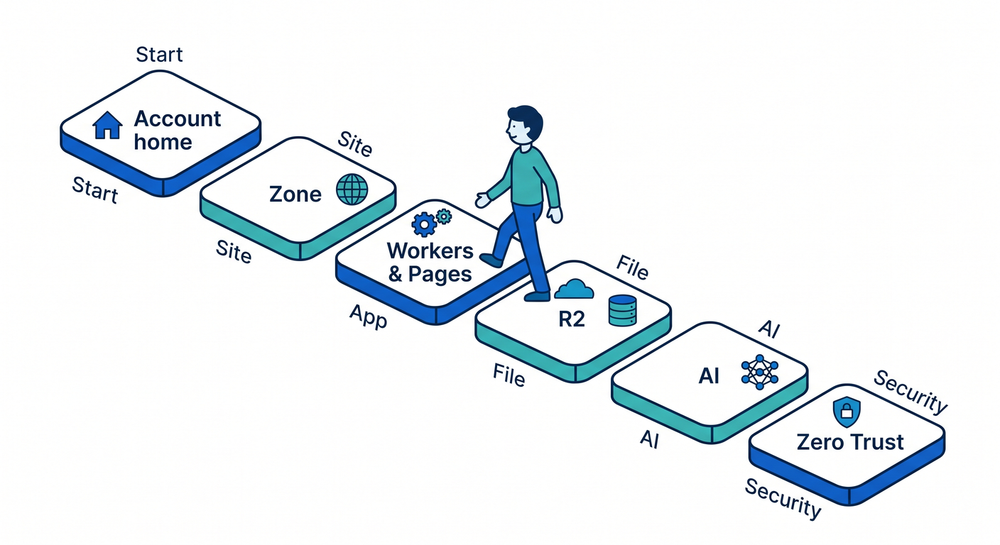
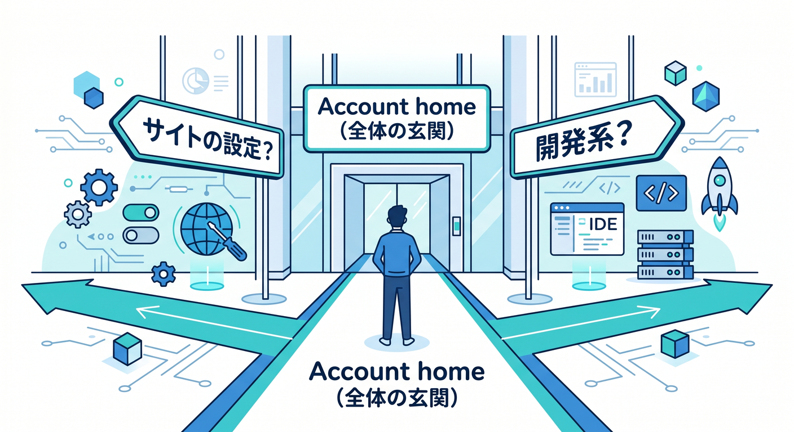
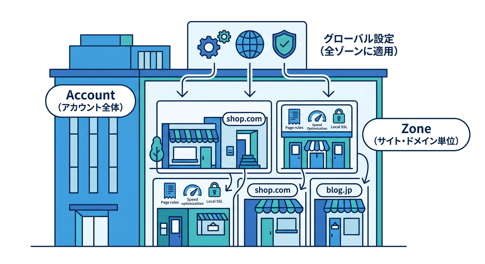
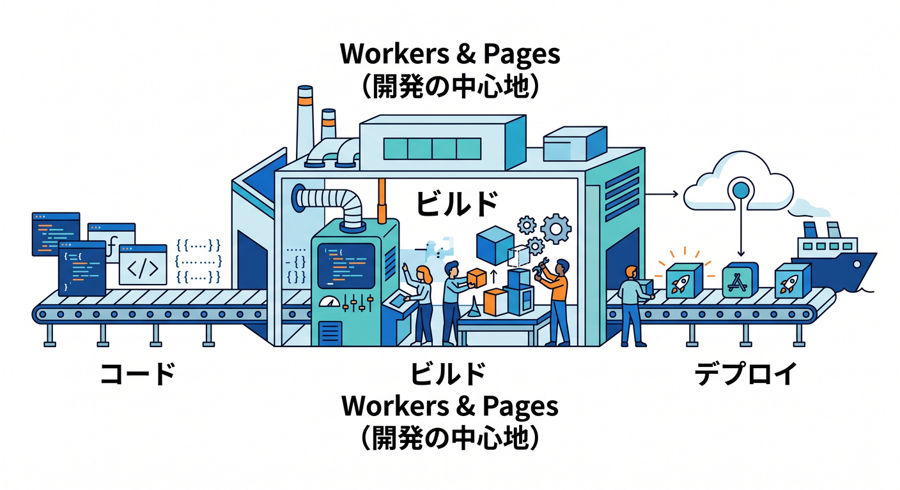
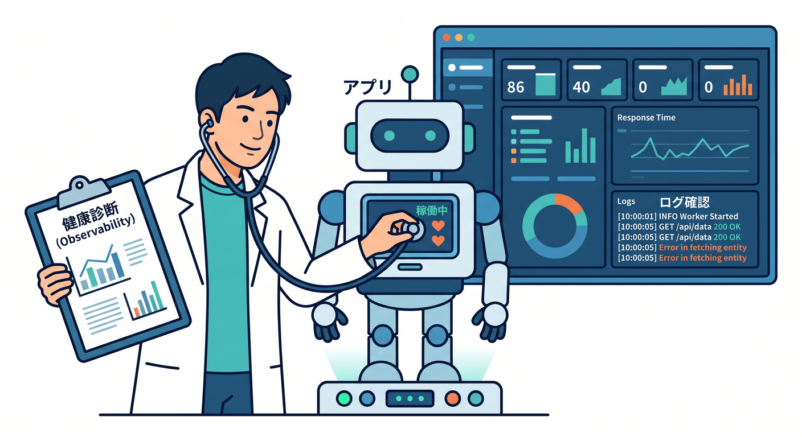
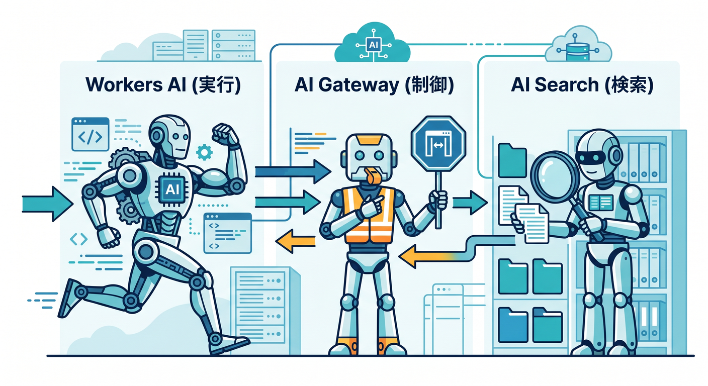
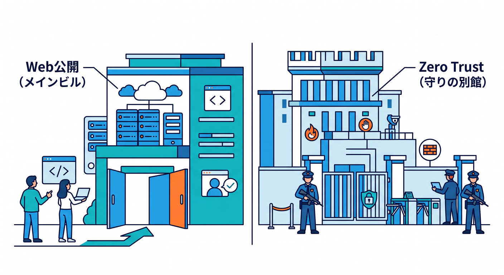

# 第15章：最後に“迷わない散歩コース”を完成させよう 🏁☁️🧭

ここまで来たら、もう細かい設定を全部覚える必要はありません 😊
この章のゴールはただ1つです。**Cloudflareの管理画面を開いたときに、どこへ行けば何があるかを、自分の言葉でたどれるようになること**です。
本日時点の公式情報では、Cloudflare には **Account home**、**Workers & Pages**、**R2**、**AI**、**Zero Trust** といった入口があり、AI まわりは最近さらに見つけやすく整理されています。([Cloudflare Docs][1])

---

## この章でできるようになりたいこと 🎯

この章を読み終えたら、次の6つができれば大成功です 🌸

1. **Account home** に戻れば落ち着ける
2. **Zone はサイト単位の場所**だと説明できる
3. **Workers & Pages は開発の入口**だと分かる
4. **R2 はファイル置き場**だと区別できる
5. **AI は「実行」「制御」「検索」で見分けられる**
6. **Zero Trust は別館のセキュリティ管理エリア**だと整理できる

この理解は、Cloudflare公式の現在の導線ともかなり相性が良いです。Account home からアカウントや Zone を見に行けて、Workers & Pages ではアプリ作成、R2 ではバケット管理、Zero Trust は専用導線から入る形になっています。([Cloudflare Docs][1])

---

## まず覚える、完成版の散歩ルート 🚶‍♂️✨

最後に身につけたい散歩コースはこれです。

**Account home → Zone → Workers & Pages → WorkerのOverview / Observability → R2 → AI → Zero Trust**

この順番がよい理由は、**「全体」→「サイト」→「アプリ」→「保存先」→「AI」→「組織セキュリティ」** と、役割の粒度が自然に下りていくからです。Workers の Observability はアプリの状態確認に向いていて、AI Search は R2 や Workers AI、AI Gateway などとつながるため、R2 の後に見ると理解しやすいです。([Cloudflare Docs][2])

---

## 1. Account home で「全体の玄関」を確認しよう 🚪

Cloudflareで迷ったら、まず **Account home** に戻るクセをつけましょう。
公式ドキュメントでも、Account ID や Zone ID を確認する起点として **Account home** が案内されています。さらに、Workers & Pages 側から Account ID を確認する導線もあります。つまり、ここは単なるトップページではなく、**「今どのアカウントを見ているか」を意識する場所**です。([Cloudflare Docs][1])

ここで自分に問いかけたいのは、たった2つです 😊

* いま見ているのは**どのアカウント**？
* これから入りたいのは**サイトの設定**？ それとも **開発系**？

この2問だけで、かなり迷子が減ります。

**Copilotに聞く例 🤖**

> 「CloudflareのAccount homeとZoneの違いを、初心者向けに3行で説明して」
> 「Account IDとZone IDは何に使うの？」

---

## 2. Zone で「この設定はサイト単位なんだな」と整理しよう 🌐

Zone は、ざっくり言うと **そのドメインやサイト単位の箱**です。
Account home から Zone に入り、そこで DNS や SSL/TLS や Security などを見る流れは、Cloudflareの基本的な見方の土台です。Zone ID も Account home 側の Overview で確認できます。([Cloudflare Docs][1])

ここでは細かい設定値を覚えるより、次の感覚が大事です 🌱

* **アカウント全体に関わる話**は Account 側
* **1つのサイトに関わる話**は Zone 側

この区別がつくと、管理画面が急に“建物のフロアマップ”っぽく見えてきます。

**Copilotに聞く例 🤖**

> 「CloudflareでAccount配下とZone配下の設定の違いを、サイト運営者向けに整理して」
> 「DNSやSSL/TLSがZone側にある理由をやさしく説明して」

---

## 3. Workers & Pages で「開発の中心地」を一周しよう 🧑‍💻⚡

今のCloudflareで開発系の中心を見るなら、まず **Workers & Pages** です。
公式ドキュメントでも、新しい Workers アプリを作るときは **Workers & Pages → Create application** から始める案内になっています。既存のGitHub / GitLabリポジトリをダッシュボードから取り込む導線もあり、自動構成まで用意されています。([Cloudflare Docs][3])

React 系なら、Cloudflare公式は **React + Vite** の導線をかなり強く整えています。
`npm create cloudflare@latest -- my-react-app --framework=react` の形で始められ、React SPA・Workers API・Cloudflare Vite plugin を組み合わせる流れが案内されています。Vite plugin は Vite と Workers runtime をしっかりつなぎ、ローカル開発時の挙動を本番に近づける設計です。([Cloudflare Docs][4])

Next.js も Cloudflare Workers 側のガイドが用意されています。
公式には `npm create cloudflare@latest -- my-next-app --framework=next` で始める案内があり、**静的エクスポートの特殊ケースを除けば、Next.js は Pages より Workers ガイドを見てね** という整理がはっきり書かれています。だから、この教材でも Next.js は「Cloudflareの主役ではなく、Cloudflare上で扱えるReact系の1つ」として軽めに押さえるのがちょうどいいです。([Cloudflare Docs][5])

**ここで見るべき場所 👀**

* Overview
* Create application
* Imports / Builds
* バインディングや環境変数まわり
* デプロイ後の状態確認

ここでの目標は、**「ここがコードを置いて動かす中心だな」** と感じられることです。

**Copilotに聞く例 🤖**

> 「Cloudflare WorkersとPagesの違いを、React学習者向けに整理して」
> 「React + Vite で始めるなら、Cloudflareでは何を見るべき？」
> 「Next.js を軽く触る人向けに、Cloudflare上での立ち位置を説明して」

---

## 4. Worker の Overview / Observability で「健康診断」ができるようになろう 📊🔍

開発画面は、作って終わりではありません。
Cloudflare Workers には Observability があり、公式では **アプリの性能理解・問題診断・リクエストフローの把握** に使えると説明されています。さらに 2026年2月の更新で、Workers Observability ダッシュボードには **可視化・共有リンク・JSON/CSVエクスポート** などが追加され、チームで確認しやすくなっています。([Cloudflare Docs][2])

だから最後の散歩では、Workers & Pages でアプリを見つけたら、**ちゃんと Observability まで行く**のが大事です 😊
「動くかどうか」だけでなく、「最近エラーっぽいものはない？」「遅くなっていない？」と見るクセがつくと、急に“開発者の目”になります。

ログの確認もダッシュボードから入れます。公式では **Workers & Pages → 対象Worker → Observability** の流れでログを見る案内があります。([Cloudflare Docs][6])

**Copilotに聞く例 🤖**

> 「Cloudflare WorkersのObservabilityで最初に見るべき項目を、初心者向けに教えて」
> 「Cloudflareのログ画面で、どんな異常が見えたら注意？」

---

## 5. R2 で「ファイル置き場」の感覚を完成させよう 🪣🖼️📦

R2 は Cloudflare のオブジェクトストレージです。
公式では、クラウドネイティブアプリ用ストレージ、Webコンテンツ、データレイク、機械学習成果物やデータセットの保存先などに使えると説明されています。最初のバケット作成もダッシュボードから進められます。([Cloudflare Docs][7])

この章の締めでは、R2 を細かく操作できなくても大丈夫です。
大事なのは、**「これはDBではなく、画像・PDF・アップロードファイル・生成物を置く場所なんだな」** と分かることです。
しかも既存プロジェクトの自動構成では、R2 が有効ならキャッシュ用バケット作成まで進むケースがあります。Cloudflare の開発体験の中で、R2 はかなり自然につながる保存先になっています。([Cloudflare Docs][8])

**Copilotに聞く例 🤖**

> 「Cloudflare R2は、データベースと何が違うの？」
> 「画像アップロード先としてR2を使うときの考え方をやさしく説明して」

---

## 6. AI では「実行」「制御」「検索」を見分けよう 🤖✨🧠

ここが今のCloudflareでかなり面白いところです 🎉
2026年2月のCloudflare公式 changelog では、**AI がダッシュボードのトップレベル項目として見つけやすくなった**と案内されています。一方で、AI Search の作成手順ページでは **Compute & AI > AI Search** と書かれているので、アカウントやUIロールアウト状況によって少し見え方が違う可能性があります。**見た目が少し違っても焦らなくて大丈夫**です。([Cloudflare Docs][9])

AI エリアでは、次の3つに分けて見るとスッと入ります。

**Workers AI** は、モデルを実行する場所です。
Cloudflare公式では、サーバーレスにAIモデルを実行できる仕組みとして説明されています。Workers や Pages、API から利用できます。([Cloudflare Docs][10])

**AI Gateway** は、AIアプリの見える化と制御の場所です。
公式では、分析・ログ・キャッシュ・レート制限・リトライ・モデルフォールバックなどで、AIアプリの運用を助けると説明されています。([Cloudflare Docs][11])

**AI Search** は、検索体験を組み立てる場所です。
公式では、Webサイトや非構造データをつないで継続的にインデックスを作り、自然言語で問い合わせられる **managed search service** と説明されています。しかも R2、Vectorize、AI Gateway、Browser Rendering、Workers AI と統合しやすいので、CloudflareのAI地図をつなぐ中心としてかなり重要です。([Cloudflare Docs][12])

つまり、最後の散歩で AI を見るときはこう整理すればOKです 🌈

* **Workers AI** ＝ モデルを動かす
* **AI Gateway** ＝ 使い方を監視・制御する
* **AI Search** ＝ データを検索できる形にする

この3分割ができれば、AIメニューを見てもかなり落ち着いて歩けます。

**Copilotに聞く例 🤖**

> 「Workers AI / AI Gateway / AI Search の違いを、初心者向けに表なしでわかりやすく説明して」
> 「R2に置いた文書をAI Searchにつなぐと、何がうれしい？」
> 「AI Gatewayは、AIアプリ運用のどこを楽にするの？」

---

## 7. Zero Trust は「別館」だと割り切ろう 🏢🔐

Zero Trust は、普通のWebサイト公開やアプリ実行の延長というより、**組織のアクセス制御やネットワーク保護のための管理エリア**です。
公式の Cloudflare One ドキュメントでも、Cloudflare ダッシュボードから **Zero Trust** を選び、最初に組織名やチーム名を決めてセットアップする流れになっています。Insights では Analytics、Dashboards、Logs、DEX などの観測系も用意されています。([Cloudflare Docs][13])

だから最後の散歩で大切なのは、Zero Trust を「Webサイトの設定の続き」と思わないことです。
ここは **守りのフロア** です。Access、Gateway、Tunnel、DLP、CASB、DEX など、組織や社内利用の文脈が強いものが並びます。([Cloudflare Docs][14])

**Copilotに聞く例 🤖**

> 「Cloudflare Zero Trust は、個人のWebサイト運用と何が違うの？」
> 「Access と Gateway の役割の違いを超入門向けに教えて」

---

## VS Code・Copilot・MCP を“散歩の相棒”にしよう 🧩💬

最後の章では、管理画面をただ眺めて終わりにしないのが大切です。
GitHub公式では、**最新の安定版IDEとCopilot拡張機能の利用を推奨**しています。VS Code の最近の機能表では、**Chat、Agent mode、MCP、Workspace indexing、Copilot code review** などが並んでいます。([GitHub Docs][15])

VS Code では、タイトルバーのチャットアイコンから Copilot Chat を開けます。GitHub公式には、そこで **高レベルな依頼をAgentに投げて進められる**こと、そして MCP を設定すると **Agent モードで利用可能なMCPサーバーやツールを一覧できる**ことが書かれています。([GitHub Docs][16])

つまりこの教材の締めでは、こういう学び方ができます ✨

1. Cloudflare の画面を開く
2. 分からない場所を見つける
3. VS Code の Copilot Chat を開く
4. いま見ている画面名をそのまま質問する
5. 必要なら Agent / MCP で資料や外部文脈を広げる
6. 小さくコードや設定を試す

この流れができると、**「読む → 聞く → 試す → また戻る」** が1本につながります。
これが、2026年のかなり強い学び方です 🚀

---

## 仕上げの15分ミッション ⏱️🎓

最後に、こんなミニ課題をやってみてください。

**ミッションA：散歩を1周する**
Cloudflare を開いて、次の順番でクリックしてみましょう。
**Account home → どれか1つのZone → Workers & Pages → 任意のWorkerのOverview/Observability → R2 → AI → Zero Trust**

**ミッションB：各場所を一言で言う**
それぞれについて、1行だけメモを書きます。

* Account home：
* Zone：
* Workers & Pages：
* R2：
* AI：
* Zero Trust：

**ミッションC：Copilotに補助してもらう**
分からなかった場所を1つだけ選んで、VS Code の Copilot Chat で説明してもらいます。

この3つが終わったら、かなり立派です 🎉
もう“Cloudflareの管理画面が怖い人”ではなく、**「ざっくり歩ける人」** になっています。

---

## よくある迷子ポイントと、やさしい対処法 🆘

**AIのメニュー名が記事と少し違う 😵**
最近の changelog では AI がトップレベルに整理された一方、AI Search の作成ガイドでは Compute & AI 表記も見られます。UI移行の途中っぽく見えるので、少し違っても慌てなくて大丈夫です。([Cloudflare Docs][9])

**Next.js は Pages？ Workers？ 🤔**
Cloudflare公式では、静的エクスポートという特殊ケース以外は、Next.js は Workers ガイドを見るよう案内されています。迷ったらまず Workers 側で考えるのが無難です。([Cloudflare Docs][5])

**Zero Trust が急に別世界に見える 😅**
それは正常です。Zero Trust はサイト配信の続きではなく、組織アクセスや保護の世界だからです。別館として分けて考えるとラクです。([Cloudflare Docs][14])

---

## この章のまとめ 🌈

この教材のゴールは、Cloudflare の全機能を暗記することではありません。
**「どこへ行けば、何系の機能があるか分かる」** という地図感覚を持つことです。

最後にもう一度だけ言うと、完成版の散歩ルートはこれです 😊

**Account home → Zone → Workers & Pages → R2 → AI → Zero Trust**

そして、分からない場所があったら、VS Code の Copilot と MCP を使って、その場で聞いて、その場で整理する。
Cloudflare 公式の現在の導線は、この学び方とかなり相性がよく、Workers・R2・AI・Zero Trust をそれぞれ別の役割として見分けやすい形になっています。([Cloudflare Docs][1])

**これで第15章は完了です 🎊☁️**
“設定の森”に入る前に、まずは **迷わず歩けること**。
それができれば、もう十分に強いです 💪✨

必要なら次に、この第15章をそのまま教材ページに貼りやすいように、**「導入文・本文・演習・確認テスト」形式**へ整えて渡せます。

[1]: https://developers.cloudflare.com/fundamentals/account/find-account-and-zone-ids/ "Find account and zone IDs · Cloudflare Fundamentals docs"
[2]: https://developers.cloudflare.com/workers/observability/ "Observability · Cloudflare Workers docs"
[3]: https://developers.cloudflare.com/workers/get-started/dashboard/ "Get started - Dashboard · Cloudflare Workers docs"
[4]: https://developers.cloudflare.com/workers/framework-guides/web-apps/react/ "React + Vite · Cloudflare Workers docs"
[5]: https://developers.cloudflare.com/workers/framework-guides/web-apps/nextjs/ "Next.js · Cloudflare Workers docs"
[6]: https://developers.cloudflare.com/workers/observability/logs/workers-logs/?utm_source=chatgpt.com "Workers Logs"
[7]: https://developers.cloudflare.com/r2/ "Overview · Cloudflare R2 docs"
[8]: https://developers.cloudflare.com/workers/framework-guides/automatic-configuration/ "Deploy an existing project · Cloudflare Workers docs"
[9]: https://developers.cloudflare.com/changelog/post/2026-02-19-ai-dashboard-experience-improvements/ "AI dashboard experience improvements · Changelog"
[10]: https://developers.cloudflare.com/cloudflare-one/networks/connectors/cloudflare-tunnel/get-started/create-remote-tunnel/?utm_source=chatgpt.com "Create a tunnel (dashboard) · Cloudflare One docs"
[11]: https://developers.cloudflare.com/ai-gateway/ "Overview · Cloudflare AI Gateway docs"
[12]: https://developers.cloudflare.com/ai-search/ "Cloudflare AI Search · Cloudflare AI Search docs"
[13]: https://developers.cloudflare.com/cloudflare-one/setup/ "Get started · Cloudflare One docs"
[14]: https://developers.cloudflare.com/cloudflare-one/ "Overview · Cloudflare One docs"
[15]: https://docs.github.com/en/copilot/reference/copilot-feature-matrix "Copilot feature matrix - GitHub Docs"
[16]: https://docs.github.com/copilot/using-github-copilot/asking-github-copilot-questions-in-your-ide "Asking GitHub Copilot questions in your IDE - GitHub Docs"

