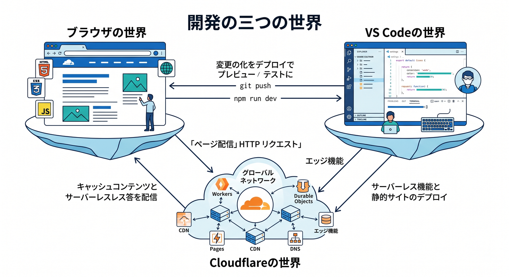
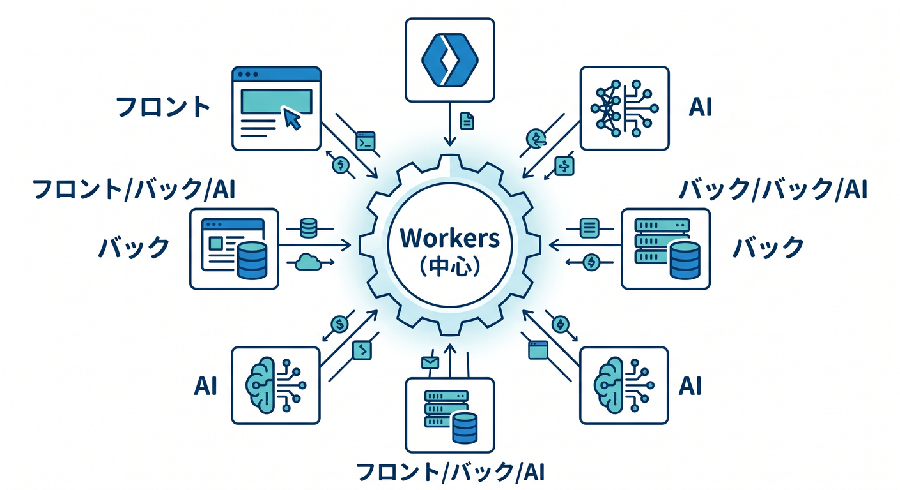
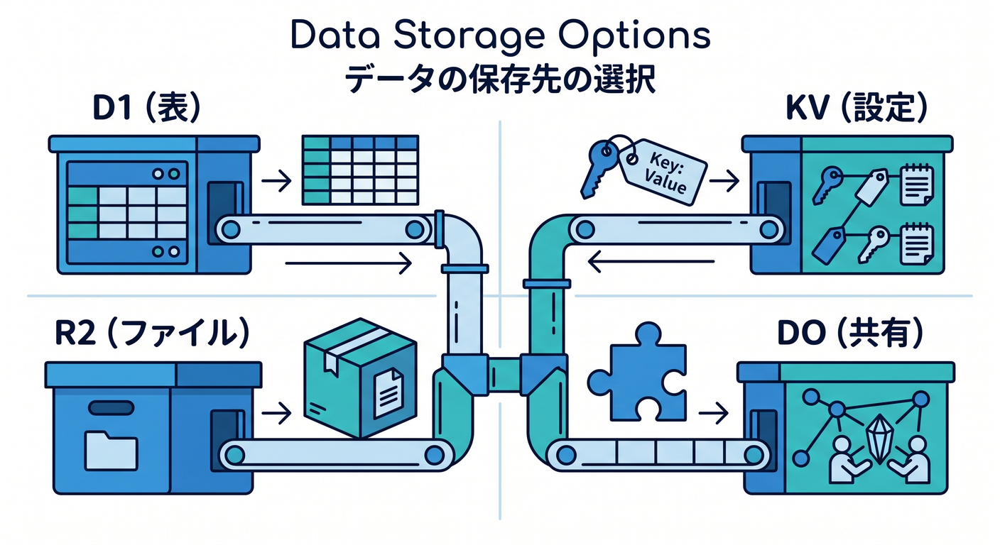
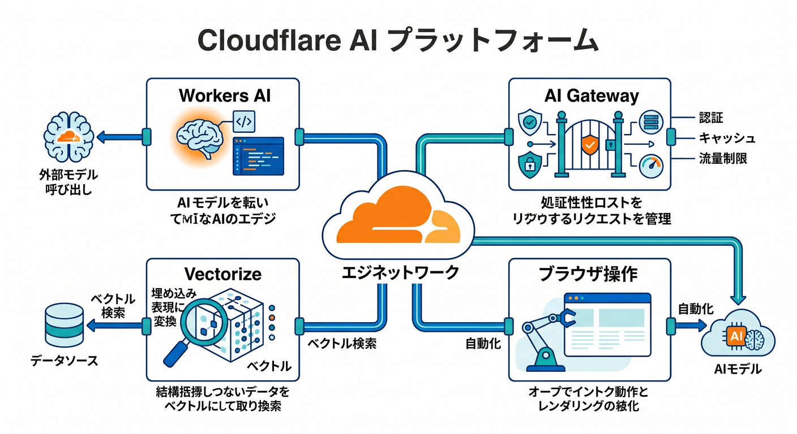
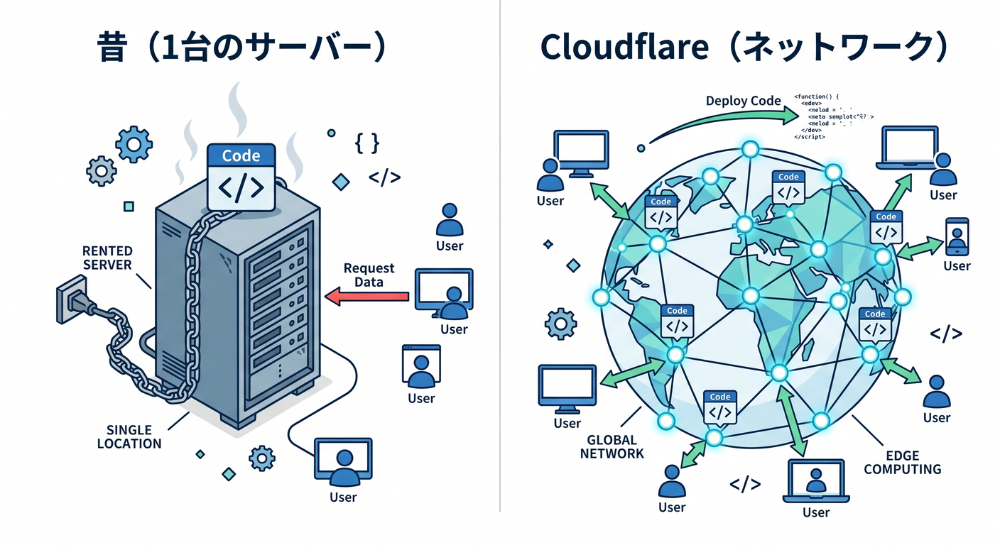
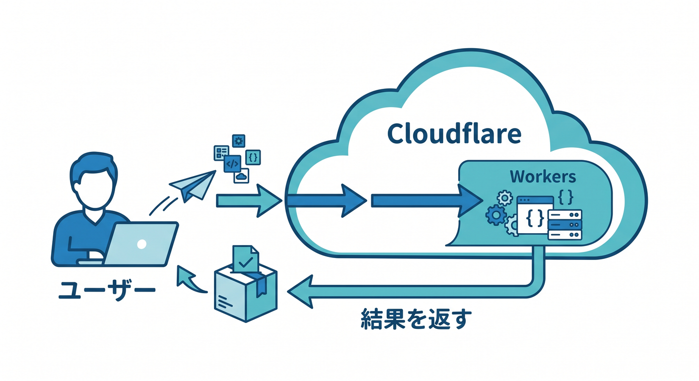

# 第01章：Cloudflare開発の全体地図を見よう 🌍☁️🗺️

この章では、Cloudflareを「CDNの会社」としてではなく、「アプリを動かす開発基盤」として見えるようにしていきます 😊
2026年4月15日時点の公式情報を見直すと、Cloudflareは Workers を中心に、フロントエンド、バックエンド、AI、ストレージ、バックグラウンド処理、監視までをまとめて扱える開発プラットフォームとして案内しています。さらに、今の入口は C3 と Vite plugin がかなり重要で、AI 連携では MCP まわりも強くなっています。 ([Cloudflare Docs][1])

---

## この章のゴール 🎯

この章で目指すのは、細かい設定を覚えることではありません 🙅‍♂️
まずは「Cloudflareの中で、どれが何の役目なのか」をざっくり言えるようになることです。

読み終わるころには、こんな状態になっていれば十分です ✨

1. Workers と Pages の違いがふんわり説明できる
2. D1、KV、R2、Queues、Workflows、Workers AI が「何の仲間か」わかる
3. VS Code で書いたコードが、どうやって Cloudflare 側で動くのか想像できる
4. 「サーバーを1台借りる」感覚との違いがつかめる
5. Copilot を“自動補完”ではなく“学習の相棒”として見る準備ができる

---

## 1. まず、Cloudflareをどう見るか 👀☁️

いちばん大事な見方はこれです。

**Cloudflareは、ただの配信高速化サービスではなく、コードを実行する場所でもある**、ということです。
本日時点の Workers 公式トップでは、Cloudflareは front-end applications、back-end applications、serverless AI inference、background jobs までまとめて扱う中心基盤として案内されています。つまり「静的ファイルを速く配るだけ」ではなく、「アプリ全体の土台」として考えるのが自然です。 ([Cloudflare Docs][1])

なので、この教材では最初から、

* 画面を見せる
* APIを返す
* データを保存する
* AIを呼ぶ
* ログを見る
* 必要なら裏で処理を続ける

……という一連の流れを、できるだけ **Cloudflareの中で一本の地図として** 見ていきます 🧭✨

---

## 2. Cloudflare開発は「3つの世界」に分けると迷いにくい 🪟🧑‍💻🌐

最初に、頭の中で世界を3つに分けましょう。

**① ブラウザの世界 🌍**
ここは、ユーザーが見る世界です。ページを開く、ボタンを押す、結果を見る。
React の画面も、普通のHTMLも、最終的にはここに届きます。

**② VS Code の世界 🧑‍💻**
ここは、あなたが書く世界です。
ファイルを編集して、保存して、ローカルで試して、エラーを読みます。いわば作業机です。

**③ Cloudflare の実行世界 ☁️⚡**
ここが今回の主役です。
Workers のコードは Cloudflare のグローバルネットワーク上で動きます。いまの開発導線では、ローカル開発でも Cloudflare Vite plugin によって Workers runtime とつながり、Worker code は workerd 内で動いて本番にかなり近い挙動を確認できます。 ([Cloudflare Docs][1])

この3つを混ぜないだけで、かなりスッキリします 😊

たとえば、こんな感じです。

* ブラウザで見えているもの → 画面側の出来事
* VS Codeで触っているもの → ソースコード側の出来事
* Cloudflareで実際に走るもの → 実行環境側の出来事

初心者のうちは、ここがごちゃっと混ざると一気に難しく見えます。
でも分けて考えると、「いま自分はどの話をしているのか」が見えやすくなります 🧠✨

---

## 3. Cloudflareの地図を、真ん中から描こう 🗺️☁️

では、Cloudflareの地図を真ん中から描きます。
**真ん中に置くのは Workers** です。

### Workers ＝ 実行の中心 ⚙️

Workers は、Cloudflare上でコードを動かす中心です。
公式では front-end、back-end、AI、background jobs をまとめて扱う基盤として案内されていて、さらに D1、KV、R2、Queues、Hyperdrive などを Bindings でつなぐ形が基本です。 ([Cloudflare Docs][1])

まずは雑に、

**Workers = Cloudflareの中でアプリの処理を書く場所**

と覚えてしまって大丈夫です 🙆‍♂️

---

### Pages ＝ 画面を届けるのが得意な入口 🎨📄

Pages は、フロント寄りの入口としてとても見やすい存在です。
公式では「Cloudflare global network に即時デプロイされる full-stack applications」を作れるものとして案内されていて、Git連携、Direct Upload、C3 からの作成に対応しています。さらに Pages Functions を使うと、専用サーバーなしでサーバー側の処理も足せます。 ([Cloudflare Docs][2])

初心者向けに言い換えると、

* Pages → 画面を公開しやすい入口 🌈
* Workers → 処理の本体や中核 ⚡

というイメージです。

きっちり分けすぎなくても大丈夫ですが、最初はこのくらいで十分です 😊

---

### データまわり ＝ 「何を保存したいか」で使い分ける 💾📦

Cloudflareには保存先がいくつもあります。
ここで大事なのは、**全部を同じ“データベース”と思わないこと** です。

**D1 🗃️**
SQLで扱うサーバーレスDBです。公式では SQLite の SQL semantics を持つ managed serverless database と案内されています。
「表っぽいデータ」「一覧」「検索条件つき取得」みたいな発想のときに候補になります。 ([Cloudflare Docs][3])

**KV 🔑**
グローバル低遅延の key-value ストレージです。公式でもキャッシュ、設定値、認証系の情報など、読み取りが多い用途が例として挙がっています。
「ちょっとした設定をすばやく引きたい」に向いています。 ([Cloudflare Docs][4])

**R2 📦**
画像、PDF、アップロードファイルのような“大きめの実体”を置く場所です。公式では object storage として案内され、Webコンテンツ、クラウドネイティブアプリ、データレイク、AIモデルの成果物やデータセットの保存先にも触れています。 ([Cloudflare Docs][1])

**Durable Objects 🧩**
複数ユーザーで共有する状態や、リアルタイムな調整役に強い仕組みです。公式では stateful applications や coordination のための building block とされています。
「部屋」「対戦卓」「1つの共有カウンタ」みたいなイメージで捉えると入りやすいです。 ([Cloudflare Docs][5])

**Queues と Workflows 📬🔁**
Queues は確実に届けたい処理の受け渡し、Workflows は複数段階の長めの処理に向いています。Workers overview では background jobs の文脈で cron・Workflows・Queues が並び、Workflows 公式では自動リトライや長時間にわたる状態保持が案内されています。 ([Cloudflare Docs][1])

ここは最初から完璧に区別しなくてOKです。
まずは、

* 表っぽいデータ → D1
* 設定や軽い読み取り → KV
* ファイル本体 → R2
* 共有状態 → Durable Objects
* 裏で流す処理 → Queues / Workflows

この6つの色分けができれば十分です 🎨

---

### AIまわり ＝ 「モデルを呼ぶ」だけで終わらない 🤖✨

CloudflareのAI系は、想像より広いです。

**Workers AI 🧠**
公式では serverless GPUs 上で動くAIモデル基盤で、Workers・Pages・Cloudflare API から呼べます。
つまり「AI機能をアプリに埋め込む入口」です。 ([Cloudflare Docs][6])

**AI Gateway 🚦**
AIアプリの可視化と制御をする場所です。公式では analytics、logging、caching、rate limiting、request retries、model fallback などが案内されています。
初心者向けに言うと、「AIを呼ぶ前後を整える管理レイヤー」です。 ([Cloudflare Docs][7])

**Vectorize 🧭**
ベクトルDBです。公式では AI-powered semantic search 向けの globally distributed vector database と説明されています。
「意味で近いものを探す検索」を作るときの重要パーツです。 ([Cloudflare Docs][8])

**AI Search 🔎**
Cloudflareの managed search service です。Webサイトや非構造データをつないで継続的に索引を作り、自然言語で問い合わせできます。しかも Vectorize、AI Gateway、R2、Browser Rendering、Workers AI とネイティブ統合されています。 ([Cloudflare Docs][9])

**Browser Rendering 🌐🧪**
Cloudflare上で headless Chrome を動かす仕組みです。テスト、自動操作、取得、コンテンツ生成に使えます。さらに 2026年4月10日には CDP と MCP client support が追加され、既存の自動化ツールやAIエージェントから直接つなぎやすくなりました。 ([Cloudflare Docs][10])

ここまで来ると、Cloudflareはもう「AIモデルを1回呼ぶ箱」ではなく、
**AIアプリを動かすための一式がそろっている場所** に見えてきます 🚀

---

### 監視まわり ＝ 動いたあとを見る場所 👀📈

初心者ほど「動かす前」ばかり気にしがちですが、実は「動いたあとを見る場所」も超大事です。

Workers には observability の仕組みがあり、性能の把握、問題診断、リクエストの流れの理解に使えます。さらに Cloudflareは Workers の dashboard overview を強化していて、今は Worker を開くと requests、errors、CPU time、bindings、recent versions などを見やすく確認できます。 ([Cloudflare Docs][11])

つまりダッシュボードは、
**「作ったものを公開したあとに、様子を見る地図」**
だと思うとわかりやすいです 📊

---

## 4. 「サーバーを借りる」と「Workersにコードを配る」は、感覚が違う 🏢➡️☁️

ここで、初心者がいちばん混乱しやすいところを整理します。

昔ながらの感覚だと、

* 1台のサーバーを借りる
* そこにアプリを置く
* その場所で動かす

という発想になりやすいです。

でも Workers は、Cloudflareのグローバルネットワーク上でコードを実行する考え方が強いです。公式トップでも Workers は Cloudflare network 上の front-end、back-end、AI、background jobs の中心として説明され、Pages も global network へのデプロイを前面に出しています。 ([Cloudflare Docs][1])

なので最初は、

**「どの1台で動くか」より、「Cloudflareの仕組みのどこに役目を置くか」**

で考えるほうが合っています 💡

この発想に慣れると、

* APIは Workers
* 画面公開は Pages や Workers の assets
* SQLは D1
* ファイルは R2
* AI推論は Workers AI
* 長い裏処理は Workflows

というふうに、部品を組み合わせて考えやすくなります。 ([Cloudflare Docs][1])

---

## 5. VS Code・Wrangler・C3・Copilot は、地図のどこにいるの？ 🧰🤖

ここも最初に位置関係をはっきりさせましょう。

**VS Code ✍️**
書く場所です。作業机です。

**C3 🚀**
Cloudflare向けの新規プロジェクトを作る入口です。公式では npm create cloudflare で Workers と Pages の新規作成に使い、フレームワーク利用時はその公式セットアップを内部で呼んで最新構成に寄せる流れになっています。 ([Cloudflare Docs][12])

**Wrangler 🛠️**
Cloudflare開発のCLIです。あとで詳しくやりますが、ローカル確認、設定、デプロイの橋渡し役です。Vite plugin 側でも wrangler.jsonc などの設定を読みにいきます。 ([Cloudflare Docs][13])

**Vite plugin ⚡**
いまのCloudflare開発でかなり重要です。公式では Vite と Workers runtime のフル機能連携を提供し、Worker code を workerd 内で動かして、本番に近い挙動で開発・プレビューできると説明されています。静的サイト、SPA、フルスタックアプリ、Standalone Workers まで守備範囲に入っています。 ([Cloudflare Docs][14])

**GitHub Copilot 🤝🤖**
いまは単なる補完ではなく、かなり“作業相棒”寄りです。GitHub公式では agent mode により、Copilot が変更対象ファイルを判断し、コード変更やターミナル操作の提案まで行う流れを案内しています。VS Code 側も plan agent や agent 実行を用意し、MCP など追加ツールの接続にも対応しています。 ([GitHub Docs][15])

そして Cloudflare 側も、AIエージェントとの相性をかなり意識しています。
Cloudflareは managed remote MCP servers を提供していて、Workers docs では cloudflare-docs MCP と cloudflare-observability MCP をエージェントに接続し、ドキュメント理解やログ・例外の確認に使う案内があります。 ([Cloudflare Docs][16])

つまり今どきの感覚では、

* VS Codeで書く
* C3で土台を作る
* Wrangler / Vite plugin で Cloudflare実行環境へ橋をかける
* Copilotで理解・調査・修正を加速する

という並びになります ✨

これは第1章の時点で、ぜひ頭に置いておきたい地図です 🗺️

---

## 6. リクエストは、だいたいこう流れる 🌊

では、1回アクセスが来たときの流れを超ざっくり見ます。

1. ユーザーがブラウザでページを開く 🌐
2. Cloudflareがそのリクエストを受ける ☁️
3. 必要なら Workers が動く ⚡
4. Workers が D1 / KV / R2 / Durable Objects / Queues などに binding 経由で触る 📦
5. 必要なら Workers AI や AI Gateway、Vectorize、AI Search、Browser Rendering なども組み合わさる 🤖
6. 結果が HTML / JSON / 画像 / テキストなどで返る 📬
7. そのあと dashboard や observability で様子を見られる 👀📈

この流れは、Workers を中心に各サービスが bindings や統合でつながるという公式の構成に沿っています。 ([Cloudflare Docs][1])

第1章では、これを **完全理解** する必要はありません。
「ああ、Cloudflareって、こういう部品がつながって1本のアプリになるんだな」と感じられれば合格です 💮

---

## 7. React や Next.js は、地図の中でどう見る？ ⚛️▲

この教材では、Cloudflareが主役です。
React は「画面を作る道具」として相性がよく、Cloudflare Vite plugin も React 系の導線をかなり押しています。 ([Cloudflare Docs][13])

Next.js についても Cloudflare公式ガイドはしっかり用意されていて、C3 からの新規作成や Workers への対応が進んでいます。とはいえ、Next.js は機能が多いので、最初から主役にすると Cloudflare の理解がぼやけやすいです。まずは Cloudflare の地図を見て、そのあと必要な範囲で Next.js を乗せる、という順番がかなり学びやすいです。 ([Cloudflare Docs][17])

ここでは、

**React / Next.js = Cloudflareを使うための道具のひとつ**

くらいの位置づけで十分です 😊

---

## 8. この章で、まだ覚えなくていいもの 🙅‍♂️📚

第1章の段階では、次のものは無理に覚えなくて大丈夫です。

* 細かなコマンド
* 設定ファイルの書き方
* compatibility date の意味
* Node互換の細部
* デプロイ手順の細部
* AIモデル名の一覧
* どのストレージが最適かの厳密な判断

いま大事なのは、
**Cloudflareの中で、どこに何がいるか**
この地図だけです 🧭

---

## ミニ演習 ✍️🌱

ノートかメモ帳に、次の3問だけ書いてみてください。

**問1**
Workers は、Cloudflareの中で何をする場所ですか？

**問2**
D1・KV・R2 の違いを、一言ずつで書くとしたらどう書きますか？

**問3**
VS Code、Cloudflare、ブラウザの3つを、矢印でつないで説明できますか？

答えは厳密でなくてOKです。
自分の言葉で言えたら、それだけでかなり前進です 👍✨

---

## この章のまとめ 🧾☁️

今日いちばん持って帰ってほしいのは、この1枚です。

* **Workers が中心** ⚡
* **Pages は画面公開の入口として見やすい** 🎨
* **D1 / KV / R2 / Durable Objects / Queues / Workflows が周辺部品** 📦
* **Workers AI / AI Gateway / Vectorize / AI Search / Browser Rendering がAI系の地図** 🤖
* **Dashboard と Observability は、公開後に様子を見る場所** 👀
* **VS Code・C3・Wrangler・Vite plugin・Copilot は、Cloudflareへ入るための道具** 🛠️

この地図が頭に入ると、次の章で VS Code や Node や Wrangler の話が出てきても、
「ああ、あれはこの地図のこの場所の話ね 😊」
と落ち着いて読めるようになります。

次の第2章では、この地図の上に **実際の作業机を作る** 感じで、Windows 上の開発環境を整えていきます。

[1]: https://developers.cloudflare.com/workers/ "Overview · Cloudflare Workers docs"
[2]: https://developers.cloudflare.com/pages/ "Overview · Cloudflare Pages docs"
[3]: https://developers.cloudflare.com/d1/ "Overview · Cloudflare D1 docs"
[4]: https://developers.cloudflare.com/kv/ "Cloudflare Workers KV · Cloudflare Workers KV docs"
[5]: https://developers.cloudflare.com/durable-objects/?utm_source=chatgpt.com "Overview · Cloudflare Durable Objects docs"
[6]: https://developers.cloudflare.com/workers-ai/ "Overview · Cloudflare Workers AI docs"
[7]: https://developers.cloudflare.com/ai-gateway/ "Overview · Cloudflare AI Gateway docs"
[8]: https://developers.cloudflare.com/vectorize/ "Overview · Cloudflare Vectorize docs"
[9]: https://developers.cloudflare.com/ai-search/ "Cloudflare AI Search · Cloudflare AI Search docs"
[10]: https://developers.cloudflare.com/browser-rendering/ "Browser Rendering · Cloudflare Browser Rendering docs"
[11]: https://developers.cloudflare.com/workers/observability/ "Observability · Cloudflare Workers docs"
[12]: https://developers.cloudflare.com/pages/get-started/c3/ "Create projects with C3 CLI · Cloudflare Pages docs"
[13]: https://developers.cloudflare.com/workers/vite-plugin/get-started/ "Get started · Cloudflare Workers docs"
[14]: https://developers.cloudflare.com/workers/vite-plugin/ "Vite plugin · Cloudflare Workers docs"
[15]: https://docs.github.com/en/copilot/get-started/features "GitHub Copilot features - GitHub Docs"
[16]: https://developers.cloudflare.com/agents/model-context-protocol/mcp-servers-for-cloudflare/ "Cloudflare's own MCP servers · Cloudflare Agents docs"
[17]: https://developers.cloudflare.com/workers/framework-guides/web-apps/nextjs/ "Next.js · Cloudflare Workers docs"
