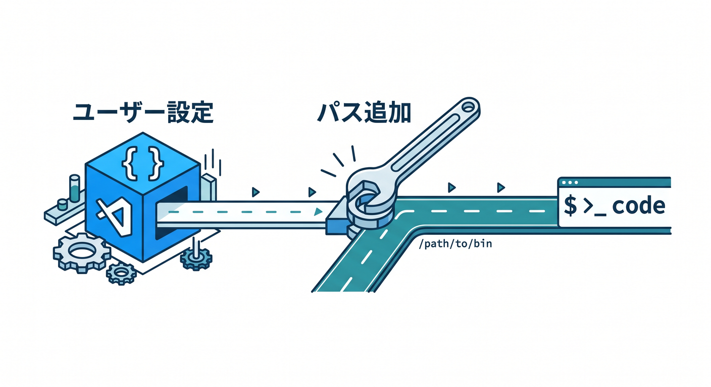
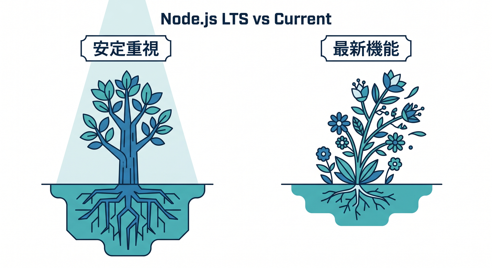
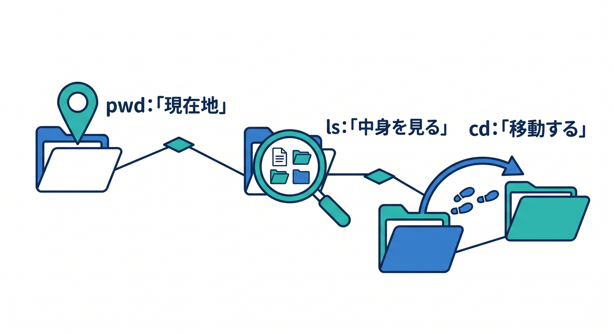
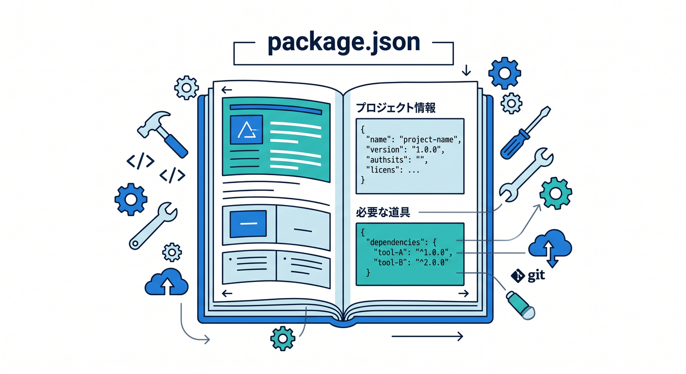

# 第02章：Windowsで開発の土台を整えよう 🪟💻☁️✨

この章では、Cloudflare 開発を始める前に、**「ちゃんと動く土台」**を作ります 😊
ここでやることは地味に見えますが、とても大事です。
土台が安定していると、あとで `wrangler` や Workers や AI を触り始めたときに、**「Cloudflare が難しい」のか「PC側の準備が崩れている」のか**を切り分けやすくなります 🙌

2026年4月15日時点では、Node.js は **v24 系が Active LTS**、**v25 系が Current** です。Cloudflare の Wrangler は **Current / Active LTS / Maintenance の Node.js をサポート**していますが、学習用の新規環境としては、安定重視で **v24 の LTS を軸**にするのがいちばん素直です。また、Wrangler の公式サポート OS は **Windows 11** です。VS Code 自体は Windows 10 / 11 をサポートしていますが、Cloudflare 開発の公式サポート線にきれいに乗るなら Windows 11 が安心です。 ([nodejs.org][1])

---

## この章のゴール 🎯

この章が終わるころには、次の状態になっていれば大成功です 🌟

1. VS Code を迷わず起動できる
2. Node.js と npm が動く
3. PowerShell で最低限の移動ができる
4. `package.json` が何者かをざっくり説明できる
5. GitHub Copilot を「コード自動生成機」ではなく「理解の相棒」として使い始められる
6. Cloudflare 開発では Wrangler を**グローバルではなく、プロジェクトごとにローカル導入する**のが今の流れだと分かる

---

## 1. まず、今日入れるものをシンプルに整理しよう 📦🧹

最初からツールを盛りすぎると、初心者ほど混乱します 😵‍💫
この章で主役にするのは、基本的にこの3つです。


* **VS Code**
* **Node.js（LTS）**
* **GitHub Copilot の有効化**

そして大事なのが、**Wrangler はこの段階で「全PC共通の道具」として無理にグローバル導入しない**ことです。Cloudflare 公式は、Wrangler を**各プロジェクトにローカル導入**する形を案内しています。チームで同じ版を使いやすく、戻しやすく、トラブルも減るからです。 ([Cloudflare Docs][2])

この考え方はかなり大事です ✨
昔の Node 学習では「とりあえずグローバル install」がよく出てきましたが、今の Cloudflare 学習では、**プロジェクト単位で依存関係を閉じ込める**ほうが自然です。

---

## 2. VS Code を入れよう 🧩💙

VS Code は、この教材全体の作業机です 🪑
コードを書く場所、ターミナルを開く場所、Copilot に質問する場所、後で Cloudflare プロジェクトを読む場所、全部ここに集まります。

VS Code の Windows セットアップでは、**User Setup が推奨**されています。管理者権限なしで入れやすく、更新もなめらかです。さらに Windows 版インストーラーでは、セットアップ時に **`code` コマンドが PATH に追加**されるので、あとで PowerShell から `code .` と打ってフォルダをそのまま開けます。VS Code は **週次リリース＋自動更新対応**でもあるので、学習用途では基本的に新しい更新を受け入れていく運用で大丈夫です。 ([code.visualstudio.com][3])



## 入れ方の流れ 🪜

1. VS Code の Windows 版インストーラーを入れる
2. User Setup を使う
3. インストール後に起動する
4. 一度閉じて、PowerShell も開き直す

PowerShell を開き直すのは、`PATH` の反映のためです。
VS Code 公式でも、`code .` を使うには**インストール後にコンソールの再起動が必要**と案内されています。 ([code.visualstudio.com][3])

動作確認はこれでOKです 👇

```powershell
code .
```

いま開いているフォルダが VS Code で開けば成功です 🎉

---

## 3. Node.js は「LTS」を入れよう 🟢📘

Cloudflare 開発では、`wrangler`、各種テンプレート、npm パッケージ、React / Vite 系の道具が Node.js を土台にして動きます。
なので Node.js は、この先ずっと使う「共通エンジン」です 🚗

2026年4月15日時点の Node.js 公式状況では、**v24 が Active LTS**、**v25 が Current** です。Node.js のダウンロードページでも、トップに **v24.14.1 (LTS)** が示されています。新しく学ぶ人は、最新機能を急いで追うより、まず **LTS を入れる**のが安全です。 ([nodejs.org][1])

## LTS と Current の感覚 🌱⚡



* **LTS**
  安定重視。学習・実務の土台向き。
* **Current**
  新機能が早く入る。追いかけたい人向き。

今回の教材では、LTS で十分です 😊
しかも Cloudflare の Wrangler 側も、LTS 系をちゃんとサポート範囲に含めています。 ([Cloudflare Docs][2])

## Windows でのおすすめ導入方法 🪟

初心者なら、まずは **Node.js 公式の Windows 用インストーラー**で入れるのがいちばん分かりやすいです。
Node.js の公開ページには、Windows 用の MSI 形式も用意されています。 ([nodejs.org][4])

入れたら、PowerShell で確認します 👇

```powershell
node -v
npm -v
```

`v24.x.x` のような表示と、npm の版が出れば成功です ✅

---

## 4. PowerShell は「3〜5個だけ」覚えれば十分 😌⌨️

ここで PowerShell を完璧にする必要はありません。
Cloudflare 学習の最初は、**移動できる・確認できる・実行できる**だけで十分です。

まず覚えるのはこのへんだけでOKです 👇



```powershell
pwd
ls
cd .
cd ..
mkdir sample-folder
```

意味はこうです 😊

* `pwd` → 今いる場所を見る
* `ls` → 今いる場所の中身を見る
* `cd` → フォルダを移動する
* `mkdir` → 新しいフォルダを作る

ここで大事なのは、**「自分はいまどのフォルダにいるのか」**を見失わないことです 🧭
Cloudflare に限らず、Node 系の開発で詰まる人のかなり多くは、実はコードではなく**場所違い**でつまずきます。

---

## 5. フォルダ、パス、プロジェクトの感覚をここで作ろう 🗂️🛣️

たとえば、こんな流れを自分でできるようになると強いです 💪

```powershell
mkdir cloudflare-study
cd cloudflare-study
code .
```

これはつまり、
「Cloudflare 学習用フォルダを作る」→「そこへ入る」→「その場所を VS Code で開く」
という意味です。

この一連の動作がスムーズになると、学習のテンポが一気によくなります 🚀
逆にここがあいまいだと、あとで `npm install` を変な場所で実行したり、別フォルダに `package.json` ができたりして混乱しやすいです 😵

---

## 6. `package.json` は「このプロジェクトの説明書」📘📦

Node 系の学習で最初に出てきて「うっ」となりやすいのが `package.json` です 😅
でも、怖がらなくて大丈夫です。

まずはこう理解すれば十分です。



* **このプロジェクトの名前**
* **どんなパッケージを使うか**
* **よく使うコマンド**
* **開発に必要な道具**

が書かれた説明書です。

試しに空フォルダでこれを実行すると、最小の `package.json` を作れます 👇

```powershell
npm init -y
```

この時点では、中身を全部理解する必要はありません。
まずは **「Node のプロジェクトには説明書がある」** と覚えればOKです 🌸

そして後で Cloudflare を始めると、Wrangler もこの説明書にぶら下がる形で入ってきます。Cloudflare 公式は **Wrangler を各プロジェクトへローカル導入**する方式を案内しているので、`package.json` はその入口にもなります。 ([Cloudflare Docs][2])

---

## 7. GitHub Copilot を「理解の相棒」として準備しよう 🤖💬✨

いまの VS Code では、GitHub Copilot はかなり強力です。
単なる補完だけでなく、**チャット**、**インライン提案**、**エージェントによる複数ファイル編集**まで扱えます。VS Code 公式では、Copilot のエージェントが**タスクを分解し、ファイルを編集し、コマンドを実行し、必要に応じて自己修正する**流れまで案内しています。さらに MCP 対応の IDE として VS Code が前提に置かれています。 ([code.visualstudio.com][5])

## セットアップの流れ 🔑

VS Code 公式の現行手順では、ステータスバーの Copilot アイコンから **Use AI Features** を選び、GitHub アカウントでサインインします。Copilot 契約がない場合でも、**Copilot Free** に登録して月間上限つきで使い始める導線があります。さらに VS Code では、チャットで **`/init`** を実行すると、コードベースを見て AI 用のカスタム指示を作る流れも案内されています。 ([code.visualstudio.com][6])

この教材では、Copilot をいきなり「全部書かせる道具」にしません 🙅
最初はこう使うのがおすすめです。

* 「この PowerShell コマンドの意味をやさしく説明して」
* 「`package.json` を高校生向けに説明して」
* 「このエラーは、Node が入っていないのか、パスが通っていないのか、どっちっぽい？」
* 「Cloudflare Workers 学習で、いま必要な Node ツールだけ整理して」

この使い方だと、**理解が深まりやすく、暴走もしにくい**です 🌼


---

## 8. Cloudflare を AI と一緒に学びやすい時代になっている ☁️🤝🤖

ここはかなり面白いポイントです ✨
Cloudflare 公式は、AI で docs を扱いやすくする仕組みをかなり整えています。

Cloudflare Docs には **`llms.txt` / `llms-full.txt`** があり、各ページを **Markdown 形式**で取得できます。さらに Cloudflare は **Documentation MCP Server** を公式に用意していて、VS Code などの AI ツールから最新ドキュメントへつなげる流れも案内しています。Workers の Prompting ガイドでは、**`https://docs.mcp.cloudflare.com/mcp`** の docs MCP や、**observability MCP** をエージェントへ接続して、Workers の知識やログ確認に使う流れも紹介されています。 ([Cloudflare Docs][7])

つまり今の Cloudflare 学習は、ただブラウザでドキュメントを読むだけではありません 📚
**VS Code + Copilot + MCP + Cloudflare docs** という組み合わせで、
「調べる → 理解する → 試す → 直す」
の回転がかなり速くできます ⚙️✨

この章ではまだ MCP を無理に設定しなくて大丈夫です。
ただ、**あとで Cloudflare を AI に“正しく教える”公式の道がある**ことだけ知っておくと、とても心強いです 😊

---

## 9. Cloudflare AI につながる土台でもある 🧠☁️🚀

この章は単なるエディタ準備ではありません。
このあと触っていく Cloudflare の AI 系サービスにもつながっています。

Cloudflare の **Workers AI** は、Cloudflare のグローバルネットワーク上で **サーバーレス GPU** を使ってモデル実行でき、**Workers / Pages / Cloudflare API** から呼び出せます。しかも **Free / Paid プランで利用可能**です。つまり、今日整えている Node・VS Code・Copilot の土台は、あとで AI アプリを作る準備にもそのままなります。 ([Cloudflare Docs][8])

ここでの感覚はこうです 🌱
**「いまは準備だけど、準備の先には AI アプリ実装がある」**
と思っておくと、モチベーションが上がります。


---

## 10. この章のおすすめ完成形 🧰✅

この章の終わりでは、次の状態を目指しましょう 🎯

* VS Code が起動する
* `code .` で今のフォルダを開ける
* `node -v` と `npm -v` が通る
* PowerShell で `cd` と `ls` が使える
* `npm init -y` で `package.json` を作れる
* Copilot にサインインできている
* Wrangler は**あとでプロジェクトごとに入れるもの**だと理解している

VS Code の `code .` は、Windows 版インストール時の PATH 設定で使えるようになります。Copilot も VS Code 側からそのまま有効化できます。Wrangler は Cloudflare 公式として**各プロジェクトへローカル導入**が基本です。 ([code.visualstudio.com][3])

---

## 11. ミニ演習をやってみよう ✍️🎓

学習用フォルダを1個作って、雰囲気をつかみましょう。

```powershell
mkdir cf-foundation
cd cf-foundation
npm init -y
code .
```

できたら、VS Code の Copilot Chat にこんなふうに聞いてみてください 💬

* 「この `package.json` の各項目をやさしく説明して」
* 「Cloudflare Workers 学習用に scripts をどう育てるとよい？」
* 「Node LTS を入れてある前提で、次に何を準備すると良い？」

この演習の目的は、**コードを書くことではなく、“道具に慣れること”**です 🧸
土台づくりの章では、それで十分です。

---

## 12. よくあるつまずきポイント ⚠️😵

## `code .` が動かない

インストール直後なら、**PowerShell を再起動**してみましょう。VS Code 公式でも、PATH 反映のためにコンソール再起動が必要と案内されています。 ([code.visualstudio.com][3])

## `node -v` が出ない

Node.js のインストールが通っていないか、ターミナル再起動前のことが多いです。まずは VS Code ではなく、PowerShell 単体で確認すると切り分けやすいです。

## Windows 10 で進めている

VS Code 自体は Windows 10/11 をサポートしていますが、Wrangler の公式サポートは **Windows 11** です。Cloudflare 開発を本格的に進めるなら、その差は知っておいたほうが安心です。 ([code.visualstudio.com][9])

## 先に Wrangler をグローバル導入したくなる

気持ちは分かります 😄
でも今の公式導線では、Wrangler は**各プロジェクトにローカル導入**する形が基本です。最初からその流れに乗るほうが、後で混乱しにくいです。 ([Cloudflare Docs][2])

---

## この章のまとめ 🌈

この章でやったことは、派手ではありません。
でも、Cloudflare 学習ではかなり重要です 💎

* VS Code を作業場にする
* Node.js LTS を土台にする
* PowerShell で迷子にならない
* `package.json` を怖がらない
* Copilot を理解の相棒にする
* Cloudflare はあとで **Wrangler をローカル導入**して進める

ここまでできていれば、次の章以降で Cloudflare のプロジェクトを作り始めても、かなり落ち着いて進められます 😊

次章では、**VS Code と GitHub Copilot を「理解の相棒」としてもっと使いこなす流れ**に入ると、とてもきれいにつながります。

[1]: https://nodejs.org/en/about/previous-releases "Node.js — Node.js Releases"
[2]: https://developers.cloudflare.com/workers/wrangler/install-and-update/ "Install/Update Wrangler · Cloudflare Workers docs"
[3]: https://code.visualstudio.com/docs/setup/windows "Visual Studio Code on Windows"
[4]: https://nodejs.org/en/download "Node.js — Download Node.js®"
[5]: https://code.visualstudio.com/docs/copilot/overview "GitHub Copilot in VS Code"
[6]: https://code.visualstudio.com/docs/copilot/setup "Set up GitHub Copilot in VS Code"
[7]: https://developers.cloudflare.com/style-guide/ai-tooling/ "AI tooling · Cloudflare Style Guide"
[8]: https://developers.cloudflare.com/workers-ai/ "Overview · Cloudflare Workers AI docs"
[9]: https://code.visualstudio.com/docs/supporting/requirements "Requirements for Visual Studio Code"
