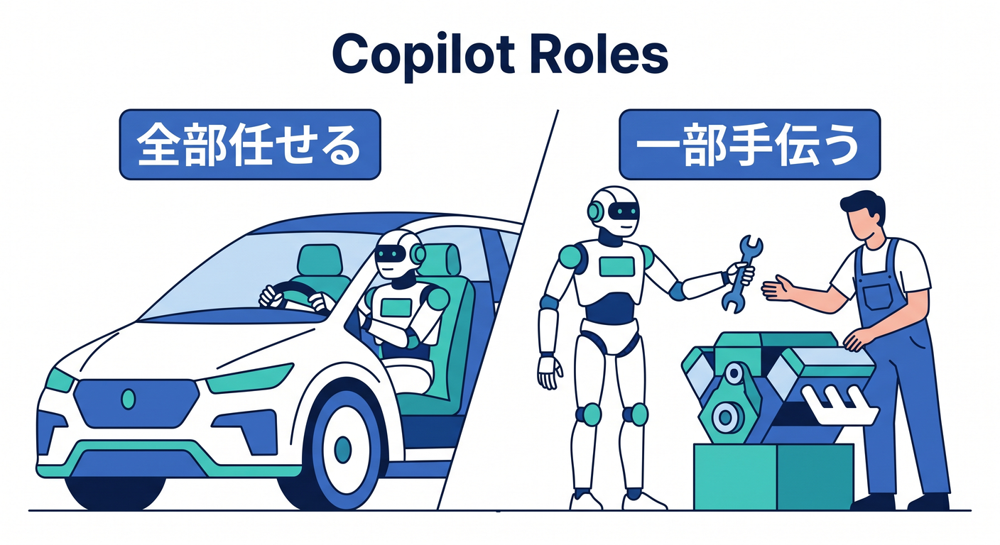
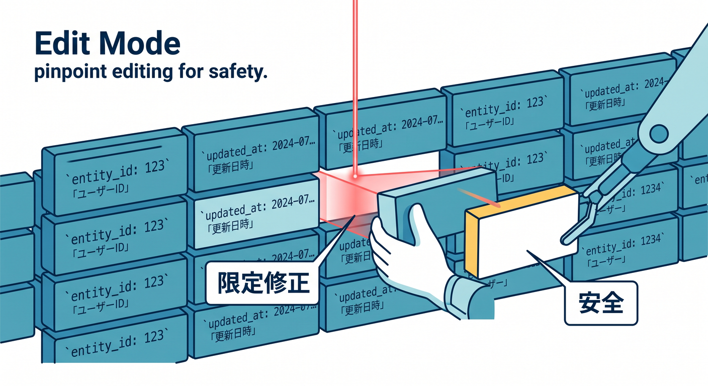
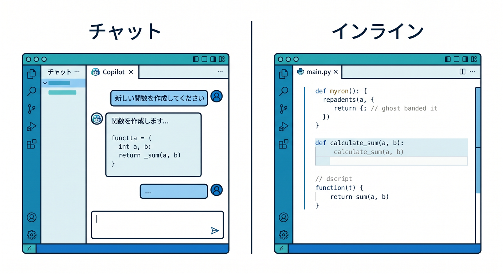
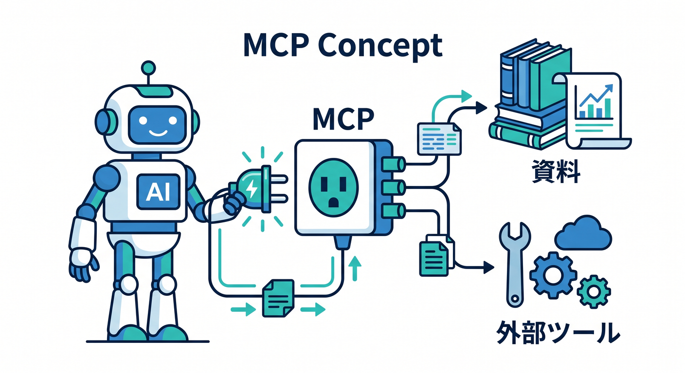

# 第03章：VS CodeとGitHub Copilotを“理解の相棒”にしよう 🤖🧠☁️

この章では、VS Code と GitHub Copilot を「コード自動生成マシン」としてではなく、Cloudflare を理解するための相棒として使えるようになるのが目標です ✨
本日時点の公式情報では、VS Code 上の Copilot は、インライン補完、インラインチャット、Chat の各モード、ローカル／クラウド系のエージェント、MCP 連携までかなり広く使える形に進化しています。しかも Cloudflare 側も、VS Code などのエディタからプロンプトで Workers アプリを作る流れや、Cloudflare Docs／Observability を MCP で AI につなぐ流れを公式に案内しています。つまり今は、「Cloudflare を学ぶ」と「AI を使って理解を深める」がかなり自然につながる時代です 🚀 ([Visual Studio Code][1])

---

## この章のゴール 🎯

この章で目指すのは、次の4つです 😊

1. VS Code の中で、Copilot の役割をちゃんと見分けられること。
2. 「質問する」「計画させる」「一部だけ直させる」「自動で進めさせる」を使い分けられること。
3. Cloudflare 用の知識を AI に渡して、答えの精度を上げること。
4. Workers AI や AI Gateway のような Cloudflare の AI 機能を、今後の学習に自然につなげられること。 ([GitHub Docs][2])

---

## 1. まず覚えたいのは「Copilotには役割がいくつもある」ということです 🧩

初心者さんが最初にハマりやすいのは、「Copilot って結局何ができるの？」がふわっとしたまま使い始めることです 😵

でも今の Copilot は、ひとつの機能ではありません。VS Code 公式では、エージェントがプロジェクト全体を見て計画・編集・検証まで進める流れが案内される一方、もっと細かく使いたい時は、インライン補完やチャットでピンポイントに操作する形も用意されています。つまり、「全部任せる」か「一部だけ助けてもらう」かを、その場で選べるのが今の標準です。 ([Visual Studio Code][1])

ここで大事なのは、「最初から Agent mode に全部やらせない」ことです 🙌
学習の初期は、まず Ask で意味を理解し、次に Plan で手順を見て、それから Edit や inline chat で小さく直し、最後に Agent を使う、という順番のほうが圧倒的に安定します。これは初心者にとってだけでなく、Cloudflare のように設定ファイル・実行環境・外部バインディングが絡む開発では特に大事です。Ask mode はコードベースや技術概念の理解向き、Plan mode は実装前の設計向き、Agent mode は自律的な変更向き、Edit mode は対象ファイルを絞って細かく修正したい時向きと、公式にもかなり役割が分かれて案内されています。 ([GitHub Docs][2])

---

## 2. それぞれのモードを、学習目線でやさしく整理しよう 🪄

### Ask mode 💬

Ask mode は、「これ何？」「なぜこうなるの？」を聞くためのモードです。
GitHub 公式でも、Ask mode はコードベースの理解、コーディングの質問、技術的な考え方の整理に向いていると説明されています。Cloudflare 学習では、まずここを主役にしてください。「この Worker は何を返してるの？」「Request と Response の流れを図解っぽく説明して」「wrangler.jsonc のこの項目は何のため？」みたいな聞き方がとても相性いいです 📘✨ ([GitHub Docs][2])

### Plan mode 🗺️

Plan mode は、いきなりコードを書かせる前に「どう進めるか」を考えさせるモードです。
GitHub 公式では、Plan mode は実装前の詳細計画を作るためのもので、ユーザーがレビューして承認するまではコード変更を行わないと案内されています。Cloudflare 学習でこれはすごく便利です。「Hello World の Worker を作る前に、必要なファイルと設定だけ洗い出して」「Workers AI をあとで足せる構成にしたいから、今の段階で何を意識する？」のように使うと、理解がすごく整います。なお Plan mode は公開プレビュー扱いです 🧠✨ ([GitHub Docs][2])

### Edit mode ✏️

Edit mode は、「このファイルとこのファイルだけ見て、ここだけ直して」が得意です。
GitHub 公式では、Edit mode は VS Code と JetBrains IDEs で使え、どのファイルを変更対象にするかを自分で選び、提案を見ながら反復できるとされています。Cloudflare 学習ではかなり安心なモードです。「src/index.ts だけ見て、返り値を JSON に変えて」「README は触らず、コメントだけやさしくして」のように範囲を狭くできます。初心者さんほど、このモードをよく使うと事故が減ります 👍 ([GitHub Docs][3])

### Agent mode 🤖

Agent mode は、「やってほしい作業」をある程度まとめて渡すモードです。
GitHub 公式では、Agent mode は必要なファイルを自分で判断し、コード変更やターミナルコマンドの提案を行い、問題が出れば反復して修正していく形で説明されています。かなり強いです。ただし強いぶん、Cloudflare 学習初期では「説明を聞く」用途より、「2〜3ファイルの整理」「依存関係の確認」「小さな修正の連続」のような範囲で使うほうが安全です。いきなり「Cloudflare アプリ全部作って」は、学習ではちょっと強すぎます ⚠️ ([GitHub Docs][2])

---

## 3. VS Codeの中で、どこを触ればいいかを先に覚えよう 🖥️✨

VS Code では、Copilot は「Chatビュー」と「エディタ内」の両方で使います。

公式では、Chat ビューを開いてエージェントを選び、そこからローカル、CLI、クラウドなどの実行先を使い分けられます。さらに、Windows では Chat ビューを開くショートカットとして Ctrl+Alt+I、エディタ内で inline chat を開くショートカットとして Ctrl+I が案内されています。インライン補完では入力中に候補が出て、Next edit suggestions によって「次に直しそうな場所」まで予測されます。つまり、調べ物は Chat、ピンポイント修正は Ctrl+I、軽い補完は入力中の提案、と分けると頭が整理しやすいです 💡 ([Visual Studio Code][1])

VS Code 公式は、初心者が最初に全部のエージェントを使い分けるより、まずは Local agent を中心にする流れがかなり自然です。
理由は単純で、ローカル実行のほうが「今開いているワークスペース」「いま見ているファイル」「直前の変更」を踏まえやすいからです。VS Code 公式でも、アイデアの検討、コードベースへの質問、計画作成、MCP サーバー利用などは Local agent 側に寄せて説明されています。第3章の段階では、まず Local を中心に覚えれば十分です 🌱 ([Visual Studio Code][4])

---

## 4. 「説明させる」ことを最優先にしよう 📚🤝

この教材では、Copilot に最初から大量のコードを書かせるより、「説明させる」「言い換えさせる」「比較させる」を優先します 😊
Cloudflare は、普通の Node.js アプリと少し感覚が違います。Worker の実行環境、Bindings、wrangler.jsonc、compatibility date、後々出てくる AI バインディングなど、覚える言葉がじわじわ増えます。だからこそ最初は、「このファイルの役割を中学生向けに説明して」「この設定がないと何に困る？」「Node.js の普通のサーバーと Workers の違いをたとえ話で説明して」と聞くのがすごく強いです。Ask mode はまさにその用途向けです 📖✨ ([GitHub Docs][2])

おすすめは、1つの答えをそのまま信じるのではなく、同じ内容を3通りで聞き直すことです。
たとえば「技術説明」「やさしい説明」「表にせず箇条書きで比較」の3通りです。AI の返答は言い方でかなり変わるので、理解のためには“聞き直し力”が大事です。これは Copilot を使いこなすというより、AI と一緒に学ぶ技術そのものです 🌟

---

## 5. 第3章でぜひ入れたいのが「custom instructions」です 📝🧠

Copilot は、プロジェクトの前提を知っているほど答えが安定します。
VS Code 公式では、custom instructions を使うと、コーディング規約やプロジェクト要件を継続的に AI に反映できます。また、ワークスペースを解析して「常時効く instructions」を生成する流れも案内されています。さらに、VS Code の Copilot overview では、/init を実行すると custom instructions を作ってエージェントがコードベースを理解しやすくなるとされています。Cloudflare 学習では、ここに「説明はやさしく」「TypeScript を優先」「Cloudflare Workers の文脈を優先」「不要にファイルを増やさない」などを入れておくとかなり安定します 🛠️✨ ([Visual Studio Code][5])

しかも今は、設定ベースよりファイルベースの instructions が自然です。
VS Code 公式では、設定ベースの code generation / test generation instructions は 1.102 以降 deprecated とされていて、ファイルベースの instructions を使う案内になっています。教材としても、その流れに乗ったほうがあとで古びにくいです 📂 ([Visual Studio Code][5])

---

## 6. Cloudflare学習では、MCPがかなり大事です 🔌☁️

MCP は、AI に外部の道具や文脈を渡す仕組みです。

GitHub 公式では、MCP は Copilot の能力を他システム連携で拡張するための仕組みとして説明されていて、IDE、Copilot CLI、GitHub.com 上のエージェントなど複数の Copilot 面で使えるとされています。VS Code で MCP サーバーを設定すると、Copilot Chat の Agent からそのツール群を使えるようになります。つまり、「ただの会話AI」から「外の知識や機能を持つAI」に変わるわけです 🔧✨ ([GitHub Docs][6])

Cloudflare 学習では、ここが特においしいです 😎
Cloudflare の Workers 公式は、VS Code などのエディタからプロンプトで Workers アプリを作れる流れを案内したうえで、AI に Workers を教えるための cloudflare-docs MCP と、ログや例外を見て自動修正しやすくする cloudflare-observability MCP を公式に勧めています。第3章の時点でこの存在を知っておくと、あとで「Copilot が Cloudflare をよく分かってくれない…」となりにくいです。AI に Cloudflare の教科書とログ窓口を渡しておくイメージです 📘📈 ([Cloudflare Docs][7])

GitHub 側の導線もかなり整っています。
GitHub Docs では、VS Code の .vscode/mcp.json から MCP サーバーを起動し、Copilot Chat で Agent を選び、ツール一覧から使えるサーバーを確認する流れが案内されています。さらに toolsets でツール群をまとめてオン／オフできるので、最初は「Cloudflare docs 系だけ」「Cloudflare docs + observability だけ」のように絞るのがおすすめです。ツールを増やしすぎないほうが、精度も安全性も上げやすいです 🎛️ ([GitHub Docs][8])

---

## 7. CloudflareのAI機能も、この章から“理解の題材”にしてしまおう 🤖☁️💙

Cloudflare の AI は、第15章まで待たなくても、第3章から「理解の材料」として使えます。
Cloudflare Workers AI は、Cloudflare のグローバルネットワーク上で serverless GPUs により AI モデルを実行でき、Workers、Pages、API から呼び出せる形で案内されています。つまり「Cloudflare って Web の配信だけ？」ではなく、「AI 実行も Cloudflare の文脈で扱えるんだ」と早めに知っておく価値があります。第3章ではまだ実装を深掘りしなくてよくて、「Copilot に Workers AI の役割を説明させる」「どんな場面で使うか整理させる」くらいで十分です 🌈 ([Cloudflare Docs][9])

AI Gateway も、理解補助にすごく向いています。
Cloudflare 公式では、AI Gateway は AI アプリの可視化と制御のための機能で、analytics、logging、caching、rate limiting、retries、model fallback などをまとめて扱え、しかも導入はかなり軽い形で案内されています。さらに Workers AI とも binding ベースで自然に組み合わせられます。第3章では、「AI を呼ぶ」だけでなく「AI の利用状況を見る・制御する」という考え方があることを Copilot に説明させると、かなり理解が深まります 📊✨ ([Cloudflare Docs][10])

---

## 8. さらに先の景色として、Browser Rendering と Playwright MCP も知っておこう 🌐🧪

これは少し先の話ですが、今の Cloudflare は「AI がブラウザを触る」世界ともかなりつながっています。
Cloudflare Browser Rendering は、Cloudflare のグローバルネットワーク上で headless browser を動かす仕組みです。さらに MCP クライアントと組み合わせると、AI コーディングエージェントがページ遷移、スクリーンショット取得、パフォーマンス監査、JavaScript デバッグなどを行えると案内されています。Playwright MCP では、視覚依存のスクリーンショット操作ではなく、構造化された accessibility snapshots を使う形も示されています。つまり将来的には、Copilot に「Cloudflare 上で動くブラウザ道具」を持たせて検証する流れまで見えてきます 👀✨ ([Cloudflare Docs][11])

第3章では、ここを実装する必要はありません。
でも、「AI は会話だけじゃなく、あとでブラウザ検証までつながる」という見取り図を先に持っておくと、Cloudflare 学習全体がすごくおもしろくなります 🎡

---

## 9. 第3章でのおすすめ実践フローはこれです 🪜

### ステップ1　まず Ask で理解する 💬

最初は、生成された Cloudflare プロジェクトの中身を Copilot に説明させます。
たとえばこんな聞き方が向いています。

> このプロジェクトのフォルダ構成を、初心者向けにやさしく説明して。
> src フォルダと設定ファイルの役割を分けて教えて。
> Cloudflare Workers の実行の流れを、Node.js の普通のサーバーと比べながら説明して。

### ステップ2　Plan で手順に分ける 🗺️

次に、「何をどう学ぶか」を段取り化させます。

> この最小 Worker を理解するために、30分でできる学習手順を作って。
> まだコード変更はしないで、見るべきファイルと確認ポイントだけ整理して。
> 後で Workers AI を追加しやすい設計観点があれば、それも1行ずつ添えて。

### ステップ3　Edit で小さく直す ✏️

理解できたら、1ファイルだけを対象にして小さな変更を入れます。

> src/index.ts だけ見て、レスポンスの意味が分かるコメントを初心者向けに追加して。
> ファイルは増やさず、動作は変えすぎないで。
> 変更点を3行で要約して。

### ステップ4　Agent は“小さな仕事”に限定する 🤖

慣れてきたら、Agent に少しだけ広い仕事を頼みます。

> 既存の Cloudflare Worker を壊さない範囲で、JSON を返す簡単な分岐を足して。
> 変更前にやることを短く整理してから進めて。
> 設定ファイルに触る場合は、理由を先に説明して。

この順番にすると、「AI に振り回される」より「AI を使って学びが速くなる」状態に入りやすいです 🌟

---

## 10. Cloudflare学習用のおすすめ質問テンプレート集 🧠☁️

Copilot への質問は、雑に投げるより、型を持っておくと強いです ✨
第3章では、次のテンプレートを何度も使うのがおすすめです。

### 理解テンプレ

> このファイルの役割を、初心者向けに3段階で説明して。
> まず一言、次にやさしい説明、最後に少し技術的な説明で。

### 比較テンプレ

> これは Node.js の普通のサーバーと何が違う？
> 実行場所、リクエスト処理、設定の考え方の3点で比較して。

### 安全テンプレ

> 変更前に、影響しそうなファイルを列挙して。
> 今回は1ファイルだけ変更する案を優先して。

### Cloudflare専用テンプレ

> この処理を Cloudflare Workers らしい書き方で考えるとどうなる？
> Node.js 前提の発想との差も教えて。

### AI機能の理解テンプレ

> Workers AI はこの教材の中でどの章で活きる？
> いまの段階では実装せず、学習上の意味だけ説明して。

### 監視の理解テンプレ

> AI Gateway は、ただモデルを呼ぶのと何が違う？
> ログ・制御・運用の観点で超初心者向けに説明して。

---

## 11. 第3章でのミニ演習案 🧪🎓

### 演習1　Copilotに先生役をやらせよう

目的は、Cloudflare プロジェクトを言葉で説明できるようになることです。
Ask mode を使い、生成済みプロジェクトの主要ファイルを1つずつ説明させます。
最後に自分の言葉で、「このファイルは何のため？」を3つ書ければOKです ✍️

### 演習2　Plan modeで“実装前の整理”を体験しよう

「Hello World を JSON レスポンス化する」程度の小さな課題を渡し、Plan mode で計画だけ作らせます。
ここでは、まだ実行しません。
“すぐ書かせない” こと自体が学習ポイントです 🧭

### 演習3　Edit modeで1ファイルだけ直そう

対象を src/index.ts のみに限定し、メッセージ文言変更かコメント追加だけをやらせます。
「変更範囲を狭くするほどレビューしやすい」を体感する演習です 🔍

### 演習4　Cloudflare AIの意味を説明させよう

Workers AI と AI Gateway の違いを、Copilot に説明させます。
実装はまだ不要です。
「AI を呼ぶ場所」と「AI 利用を観測・制御する場所」の違いが言えれば十分です 🤖📊

### 演習5　MCPの意味を説明させよう

MCP とは何か、Cloudflare docs MCP をつなぐと何が嬉しいか、Copilot に説明させます。
「AI に資料を持たせる」「AI にログ窓口を渡す」という比喩で理解できれば合格です 🔌📘

---

## 12. この章でやってはいけないこと ⚠️

初心者のうちは、次の使い方は避けたほうが安全です 🙅‍♂️

* いきなり Agent mode で「全部作って」と頼む。
* 読んでいない差分をそのまま全部 accept する。
* Cloudflare の設定変更を、理由を確認せずに飲み込む。
* API キーや secret を Copilot への質問文に貼る。
* MCP を大量につないで、どの道具が効いているのか分からなくする。

特に MCP は便利ですが、必要最小限から始めるのが大事です。GitHub 側でも toolsets による絞り込みが案内されていて、不要なツールを減らすことは性能面でも安全面でも有利だと説明されています。Cloudflare 学習では、最初は Docs 系、その次に Observability 系、くらいがちょうどいいです 🛡️ ([GitHub Docs][6])

---

## 13. この章のまとめ 🌈

第3章の本質は、「AIに書かせる」ではなく「AIと一緒に理解する」です 🤝
今の VS Code と GitHub Copilot は、Ask、Plan、Edit、Agent、inline chat、inline suggestions、MCP 連携まで揃っていて、かなり段階的に使えます。Cloudflare 側も、VS Code のようなエディタからの prompt-driven な開発、Docs MCP、Observability MCP、Workers AI、AI Gateway などを公式に整えてきています。だからこの章では、Copilot を“理解の相棒”として正しく育てることが、そのまま Cloudflare 学習の土台になります ✨☁️🤖 ([Visual Studio Code][1])

---

## この章を終えた時の到達目標 ✅

この章が終わったら、次の状態になっていれば成功です 🎉

* Copilot の Ask / Plan / Edit / Agent の違いを説明できる。
* VS Code で Chat と inline chat の使い分けができる。
* custom instructions の意味が分かる。
* Cloudflare docs MCP と observability MCP の役割を言える。
* Workers AI と AI Gateway の違いを、ふんわりでも説明できる。
* 「AIに全部やらせる」のではなく、「理解のために使う」姿勢が身についている。

必要なら続けて、このまま同じトーンで
「第3章の学習目標・演習課題・成果物・想定学習時間つき教材設計版」
まで一気に作れます。

[1]: https://code.visualstudio.com/docs/copilot/overview "GitHub Copilot in VS Code"
[2]: https://docs.github.com/copilot/using-github-copilot/asking-github-copilot-questions-in-your-ide "Asking GitHub Copilot questions in your IDE - GitHub Docs"
[3]: https://docs.github.com/en/copilot/get-started/features "GitHub Copilot features - GitHub Docs"
[4]: https://code.visualstudio.com/docs/copilot/agents/overview "Using agents in Visual Studio Code"
[5]: https://code.visualstudio.com/docs/copilot/customization/custom-instructions "Use custom instructions in VS Code"
[6]: https://docs.github.com/en/copilot/concepts/context/mcp "About Model Context Protocol (MCP) - GitHub Docs"
[7]: https://developers.cloudflare.com/workers/get-started/prompting/ "Prompting · Cloudflare Workers docs"
[8]: https://docs.github.com/copilot/customizing-copilot/using-model-context-protocol/extending-copilot-chat-with-mcp "Extending GitHub Copilot Chat with Model Context Protocol (MCP) servers - GitHub Docs"
[9]: https://developers.cloudflare.com/workers-ai/ "Overview · Cloudflare Workers AI docs"
[10]: https://developers.cloudflare.com/ai-gateway/ "Overview · Cloudflare AI Gateway docs"
[11]: https://developers.cloudflare.com/browser-rendering/cdp/mcp-clients/ "Using with MCP clients (CDP) · Cloudflare Browser Rendering docs"
