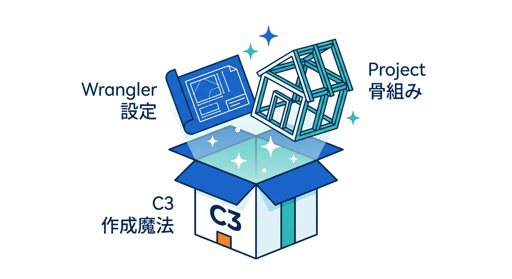
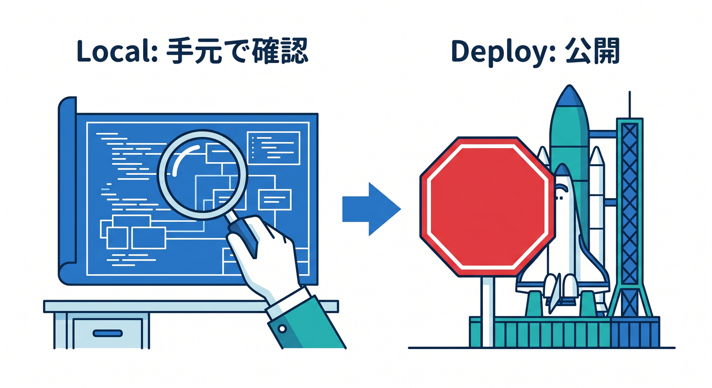
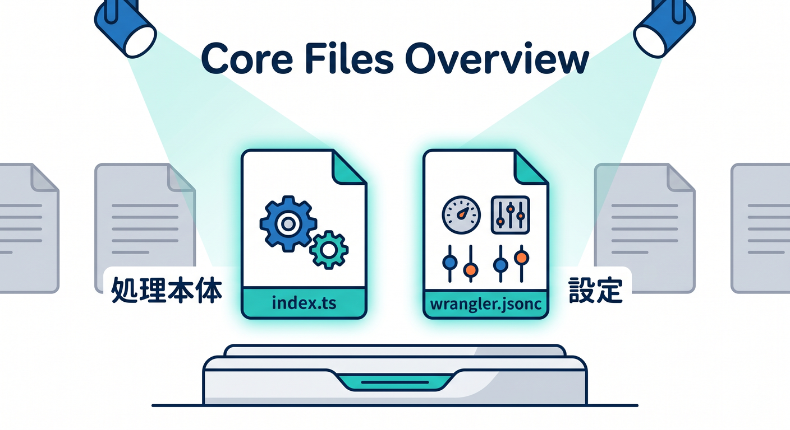
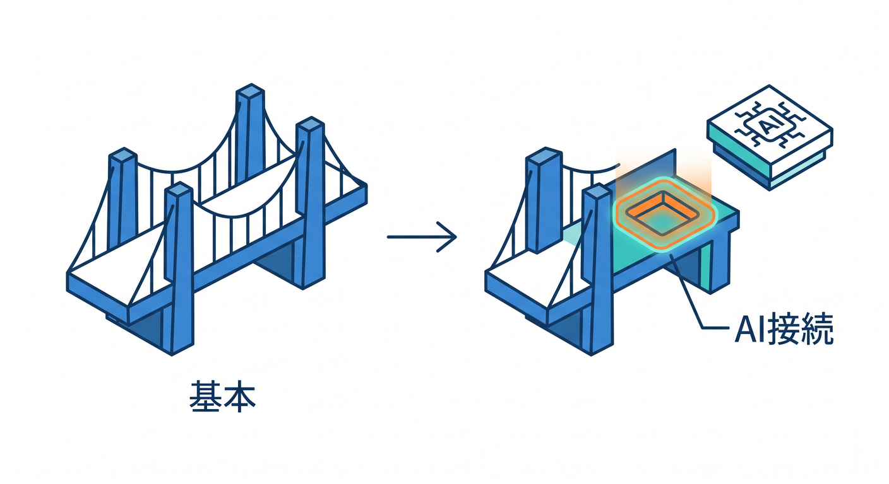
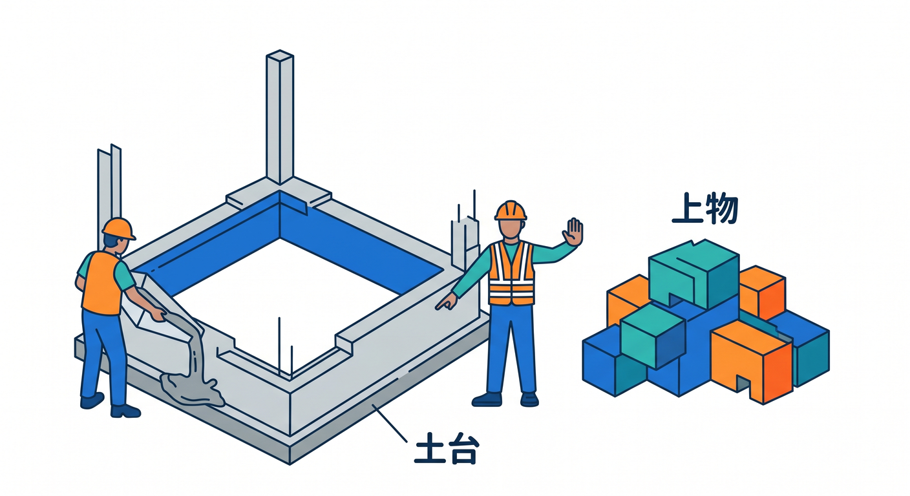

# 第04章：C3で最初のCloudflareプロジェクトを作ろう 🚀📦☁️

この章では、Cloudflare開発の正式な入口である C3 を使って、最初のプロジェクトを作ります。いまのCloudflareでは `npm create cloudflare@latest` が標準の作り始め方で、C3 は Workers や Pages の新規作成をまとめて案内してくれる CLI です。さらに、フレームワークを選んだときは、そのフレームワーク自身の生成コマンドを裏で使うので、作られる土台も比較的新しく保ちやすいです。 ([Cloudflare Docs][1])

この章で大事なのは、「コマンドを打てた」よりも、「作成した瞬間に何がそろうのか」を目で追えるようになることです 👀✨ C3 は単なるひな形生成ではなく、Cloudflare向けの設定、Wrangler、プロジェクトの基本構造までまとめて整えてくれます。Workers AI の最初の手順でも、C3 で作ったあとに `wrangler.jsonc` へ AI binding を足していく流れが公式の基本になっています。 ([Cloudflare Docs][2])

---

## この章のゴール 🎯

この章が終わるころには、次の状態を目指します。

1. C3でCloudflareプロジェクトを1つ作れる 😊
2. 生成されたフォルダや主要ファイルを見て、だいたいの役割を言える 🗂️
3. 「Hello Worldで始めるべきか」「React系テンプレートで始めるべきか」の違いがわかる ⚖️
4. Copilotに“丸投げ”ではなく、“理解の補助”として説明させながら進められる 🤖
5. この先 Workers AI を足す入口まで見えている 🧠☁️

---

## 1. そもそも C3 って何？ 🤔📦



C3 は `create-cloudflare` を土台にした Cloudflare公式のプロジェクト作成CLIです。Workers向けでも Pages向けでも使えますが、いまは Pages を明示したいときだけ `--platform=pages` を付け、それ以外は Workers を作る流れになっています。つまり、Cloudflare学習の中心である Workers を始めるなら、まず C3 を覚えるのがいちばん自然です。 ([Cloudflare Docs][1])

しかも C3 は、ただの「最小ひな形」だけではありません。CLI引数では `--category`、`--type`、`--framework`、`--template`、`--deploy`、`--lang`、`--git` などを指定でき、Hello World、Durable Objects、Queues、OpenAPI、React、Next.js、外部テンプレート取り込みまで幅広くカバーしています。つまり C3 は、Cloudflare学習の“最初の入口”であると同時に、“発展しても使い続ける入口”です。 ([Cloudflare Docs][1])

---

## 2. この章で作るのは何がいい？ 🧭


最初の1本は、**Hello World example × Worker only × TypeScript** がいちばんおすすめです 🙌
Cloudflareの Workers AI の入門でも、最初に C3 で `Hello World example`、`Worker only`、`TypeScript`、`git: Yes`、`deploy: No` を選ぶ流れが案内されています。ここではまず余計なものを減らして、Cloudflareの“芯”だけを見るのが正解です。 ([Cloudflare Docs][2])

React をすぐ触りたい気持ちはすごく自然ですが、この章ではまだ **「画面」より「Cloudflare土台」** を優先したほうが理解しやすいです。React で始める場合も C3 は使えますし、公式には React + Vite の full-stack テンプレートもあり、React SPA・Workers API・Cloudflare Vite plugin をまとめて足場にできます。ただし、それは“Cloudflareの土台を一度見たあと”のほうが混乱しにくいです。 ([Cloudflare Docs][3])

---

## 3. 実際に作ってみよう 💻✨

VS Code でフォルダを開く前でも後でもOKですが、まずは VS Code のターミナルを開いて、PowerShell で次のコマンドを実行します。

```
npm create cloudflare@latest -- my-first-worker
```

Cloudflare公式の Workers CLI ガイドでも、最初の Worker 作成はこの形で案内されています。C3 は対話形式で必要なことを順番に聞いてくれるので、最初は無理にオプションを全部覚えなくて大丈夫です。 ([Cloudflare Docs][4])

画面に質問が出たら、まずは次の選び方で進めるのがおすすめです 🌟

* What would you like to start with? → **Hello World example**
* Which template would you like to use? → **Worker only**
* Which language do you want to use? → **TypeScript**
* Do you want to use git for version control? → **Yes**
* Do you want to deploy your application? → **No**

この組み合わせは、Workers AI の公式入門でもそのまま近い形で使われています。特に最後の `deploy: No` は大事で、作った直後にすぐ公開するより、まず中身を見て理解してからのほうが学習としてはかなり安定します。 ([Cloudflare Docs][2])



---

## 4. C3 が裏でやってくれていること 🛠️

C3 は質問に答え終わると、プロジェクトの作成だけでなく、Wrangler の導入まで進めてくれます。Workers AI の公式ガイドでも、`npm create cloudflare@latest` を実行すると `create-cloudflare` パッケージを導入し、さらに Wrangler もインストールすると説明されています。つまり、C3 は「ひな形だけ作って終わり」ではなく、Cloudflare開発に必要なCLIの土台まで一緒に用意してくれるわけです。 ([Cloudflare Docs][2])

ここは初心者がかなり安心していいポイントです 😊
昔の学習だと、「まずこれを入れて、次にこれを別で入れて…」となりがちでした。でも C3 だと、Cloudflare向けの入り口が1本にまとまっています。だからこの章では、細かい手作業よりも、「Cloudflare公式の導線に乗る」ことを優先してOKです。 ([Cloudflare Docs][1])

---

## 5. 作成直後にどんなファイルができるの？ 🗂️🔍



Hello World の Worker を作ると、まず中心になるのは `src/index.ts` と `wrangler.jsonc` です。Workers AI の TypeScript 入門でも、この2つが最初にできる中心ファイルとして示されています。通常の初回 Worker 作成ガイドでは、これに加えて `package.json`、ロックファイル、依存関係フォルダなどが生成されると案内されています。 ([Cloudflare Docs][2])

ここでの見方はシンプルで大丈夫です ✨

* `src/index.ts`
  実際に Worker の処理を書く場所です。あとで `fetch()` が出てきます。
* `wrangler.jsonc`
  Cloudflare側の設定ファイルです。名前、互換設定、bindings などの中心になります。
* `package.json`
  Node系の依存関係や scripts の入口です。
* `.git`
  Git 管理の土台です。後で GitHub に載せるときに効いてきます。

この時点では全部を理解しなくてOKです。「Cloudflareのコード本体はどこ？」「Cloudflare設定はどこ？」の2本線だけ見えれば十分です。Workersの React + Vite ガイドでも、`wrangler.jsonc`、Worker 側ファイル、Vite設定、フロント側ファイルという見方で構造を整理しています。 ([Cloudflare Docs][3])

---

## 6. この時点ではまだ“公開”しなくていい理由 🚦

最初の章でいきなり公開まで行くと、理解が追いつく前に「動いた・動かない」だけの話になりやすいです。Cloudflareの最初の Worker ガイドでも、最初の作成では `deploy: No` を選び、あとで `wrangler dev` や `wrangler deploy` に進む流れが示されています。ログインも初回の `wrangler dev` 実行時にブラウザが開いて行う案内があるので、この章では「アカウント連携が必要になるんだな」くらいの理解で十分です。 ([Cloudflare Docs][4])

つまり今は、**公開の成功体験より、土台の読解** を取ります 📘
「作れた」「中を見た」「どれが設定ファイルかわかった」。この3つがそろえば、第5章・第6章でかなり楽になります。 ([Cloudflare Docs][4])

---

## 7. VS Code と Copilot はこの章でどう使う？ 🤖🧠


この章での Copilot の使い方は、「書かせる」より **「説明させる」** が主役です。GitHub公式でも、Copilot Chat は IDE 内でコード提案、コード説明、テスト生成、修正候補の提示に使えます。また Copilot Chat には Ask / Plan / Agent mode があり、質問、計画づくり、自律的な作業を切り替えながら使えます。さらに GitHub の機能マトリクスでは、最新の VS Code 系では Agent mode、MCP、workspace indexing がサポートされています。 ([GitHub Docs][5])

だから、この章ではこんな聞き方が向いています 😊

* 「この `wrangler.jsonc` は今は何を設定しているの？」
* 「`src/index.ts` の役割を初心者向けに説明して」
* 「このプロジェクトで次に読むべきファイルを3つに絞って」
* 「Cloudflare Worker の最小構成として、このファイルたちは何を担当しているの？」

こう聞くと、Copilot が“先生役”になりやすいです。反対に、「全部作って」で始めると、いま何が起きたのか置いていかれがちです。GitHub公式でも、Copilot Chat はファイル参照やコード参照を使いながら会話でき、返答に References が付くので、どのファイルを見て答えたか追いやすいです。 ([GitHub Docs][5])

---

## 8. Cloudflare を Copilot にもっと詳しくさせる方法 ☁️➕🤖

ここは2026年らしい大事なポイントです。Cloudflare公式は、Workers を AI エディタやエージェントから作る使い方をかなり意識していて、VS Code などのエディタから simple prompts で Workers アプリを作る案内まで出しています。さらに Cloudflare は `cloudflare-docs` MCP サーバーや `cloudflare-observability` MCP サーバーを案内していて、ドキュメント参照やログ確認を AI 側に渡しやすくしています。 ([Cloudflare Docs][6])

Cloudflare の docs 側には、VS Code 向けに Documentation MCP Server の direct install 導線もあり、手動設定なら `mcp-remote` で docs MCP をつなげる方法も公開されています。これがあると、Copilot や他のMCP対応AIが Cloudflare ドキュメントをより新しい形で参照しやすくなります。GitHub側でも Copilot Chat に MCP サーバーを接続して外部コンテキストを共有できると案内されています。 ([Cloudflare Docs][7])

この章では、まず「C3で作る」ことが主役ですが、補助線としてはかなり強いです 🌈
つまり今どきの学び方は、

**C3で土台を作る → VS Codeで開く → Copilotに説明させる → 必要ならCloudflare docs MCPで文脈を足す**

この流れがかなり自然です。Cloudflare公式自身も、Workers アプリを VS Code などから prompt で作る導線や、エディタに docs を食わせる方法を公開しています。 ([Cloudflare Docs][6])

---

## 9. AI を最初から少し意識しておこう 🧠✨



この章では Hello World から始めますが、Cloudflare AI への入口はかなり近いです。Workers AI の公式入門では、C3 で TypeScript の Worker を作ったあと、`wrangler.jsonc` に AI binding を追加して `env.AI` からモデルを呼ぶ流れが基本になっています。例としては `@cf/meta/llama-3.1-8b-instruct` を `env.AI.run(...)` で実行するサンプルが示されています。 ([Cloudflare Docs][2])

つまり、第4章の終わりでまだ AI コードを書かなくても大丈夫です 😊
でも頭の中では、「この `wrangler.jsonc` にあとで AI の接続設定を足すんだな」と思っておくと、第11章や第15章につながりやすくなります。Workers AI は “別世界” ではなく、いま作った Worker の延長にあります。 ([Cloudflare Docs][2])

試しに雰囲気だけ見たい人向けには、Cloudflare公式テンプレートにも AI 系があり、`llm-chat-app-template` は Workers AI を使ったシンプルなチャットアプリ、`text-to-image-template` はテキストから画像を生成するテンプレートです。将来「最初の1本目は普通のWorker、2本目はAI付きテンプレート」という進み方ができます。 ([Cloudflare Docs][8])

ただし注意もあります ⚠️
Workers AI の公式入門では、ローカル開発中でも Workers AI を使うと Cloudflare アカウントへアクセスし、利用料金が発生すると明記されています。なので AI を足すのは「ただのお試し」でもコスト感を意識して進めるのが大事です。 ([Cloudflare Docs][2])

---

## 10. フレームワークを選ぶのは、いつから？ ⚛️📚



C3 には `--framework` があり、React、Next.js、Hono などを指定してそのまま始められます。しかも、フレームワークを選ぶと C3 はそのフレームワーク自身の作成コマンドを使ってくれるので、最新の選択肢を保ちやすいです。React 向けでは、Cloudflare公式の React + Vite ガイドで React SPA、Worker API、Cloudflare Vite plugin を組み合わせた full-stack 構成が案内されています。 ([Cloudflare Docs][1])

でも、第4章の時点ではまだ **「Framework Starter を知る」だけでOK** です 👍
なぜなら、フロントの都合が増えるほど、Cloudflare固有の理解が薄まりやすいからです。まずは Worker only で「Cloudflareプロジェクトってこう生まれるんだ」をつかみ、その後に React や Next.js を乗せたほうが、土台と上物を分けて理解できます。 ([Cloudflare Docs][3])

---

## 11. この章でやりがちなミス 😵‍💫

## ありがちミス①

「とりあえず React を選んだら、Cloudflareがわからなくなった」

これはかなり起きやすいです。React で始めるのが悪いわけではありませんが、第4章では Cloudflare の骨組みを見るのが主目的です。だから最初は Worker only でOKです。 ([Cloudflare Docs][3])

## ありがちミス②

「C3 が何をしてくれたか見ないまま次へ進む」

作成直後の `src/index.ts` と `wrangler.jsonc` を見ないまま進むと、あとで設定やローカル実行が急に難しく感じやすいです。この章では“読む”ことが大事です。 ([Cloudflare Docs][2])

## ありがちミス③

「Copilot に全部任せて、自分は読まない」

GitHub Copilot はとても便利ですが、GitHub公式でも質問・説明・修正・計画などを使い分ける前提です。Cloudflare公式も AI が生成したコードはレビューとテストをしてから使うよう注意しています。 ([GitHub Docs][5])

---

## 12. この章のミニ演習 📝🎉

## 演習1

C3 で `my-first-worker` を作って、生成後に `src/index.ts` と `wrangler.jsonc` を開いてみましょう。
見てほしいのは「コード本体」と「設定ファイル」が分かれていることです。

## 演習2

Copilot Chat に次のどちらかを聞いてみましょう。

* 「この `wrangler.jsonc` は初心者向けに言うと何のためのファイル？」
* 「この Worker プロジェクトで最初に理解すべき3ファイルを教えて」

## 演習3

C3 で作れるものを調べてみましょう。
Hello World だけでなく、Queues、OpenAPI、React、Next.js、外部テンプレート取り込みまであることを確認できると、C3 の見え方が一気に変わります。 ([Cloudflare Docs][1])

## 演習4

AI寄りの将来ルートとして、`llm-chat-app-template` と `text-to-image-template` があることをメモしておきましょう。
「今は使わないけど、Cloudflare AI でこういう始め方もある」と知っておくだけで十分です。 ([Cloudflare Docs][8])

---

## 13. この章のまとめ 🌟

第4章の本質は、**C3 を使って “Cloudflare向けのプロジェクトが本当に生まれる” 感覚をつかむこと** です。
いまのCloudflareでは C3 が正面入口で、Workers中心の学習ならここから入るのが自然です。C3 はひな形だけでなく Wrangler まで整え、Hello World から React、Next.js、AIテンプレートまで広く支えています。Copilot も VS Code 上で Ask / Plan / Agent mode、MCP、workspace indexing を活かせるので、「理解の相棒」としてかなり相性がいいです。 ([Cloudflare Docs][1])

この章ができると、次の第5章で `wrangler.jsonc` やフォルダ構成を読むときに、「知らないファイルの山」ではなく「自分がさっき生み出したプロジェクト」に見えてきます 😊☁️🚀

必要なら次に、そのまま流れをそろえて **第5章「`wrangler.jsonc` とフォルダ構成を読めるようになろう」** も同じ調子で詳細化します。

[1]: https://developers.cloudflare.com/pages/get-started/c3/ "Create projects with C3 CLI · Cloudflare Pages docs"
[2]: https://developers.cloudflare.com/workers-ai/get-started/workers-wrangler/ "Get started - Workers and Wrangler · Cloudflare Workers AI docs"
[3]: https://developers.cloudflare.com/workers/framework-guides/web-apps/react/ "React + Vite · Cloudflare Workers docs"
[4]: https://developers.cloudflare.com/workers/get-started/guide/ "Get started - CLI · Cloudflare Workers docs"
[5]: https://docs.github.com/copilot/using-github-copilot/asking-github-copilot-questions-in-your-ide "Asking GitHub Copilot questions in your IDE - GitHub Docs"
[6]: https://developers.cloudflare.com/workers/get-started/prompting/ "Prompting · Cloudflare Workers docs"
[7]: https://developers.cloudflare.com/style-guide/ai-tooling/ "AI tooling · Cloudflare Style Guide"
[8]: https://developers.cloudflare.com/workers/get-started/quickstarts/ "Templates · Cloudflare Workers docs"
