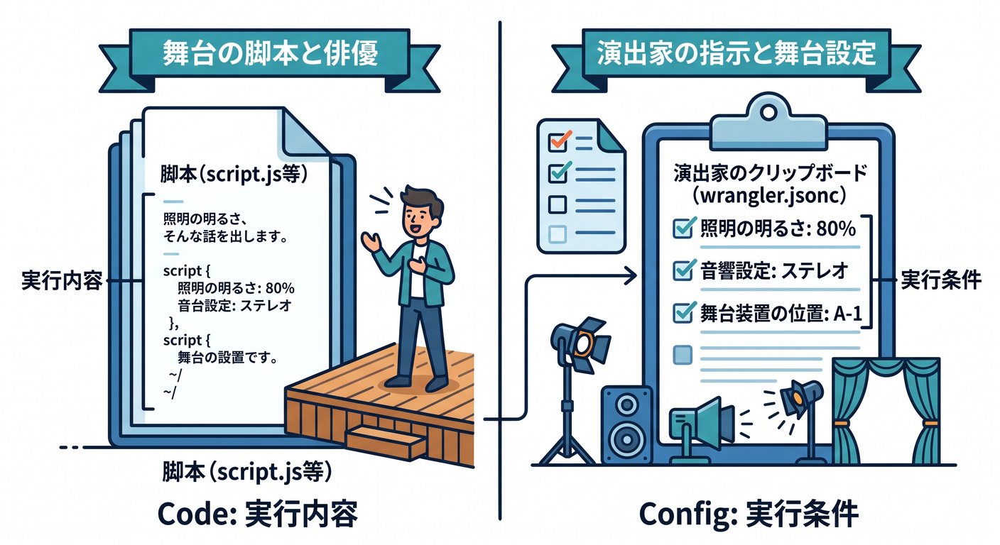
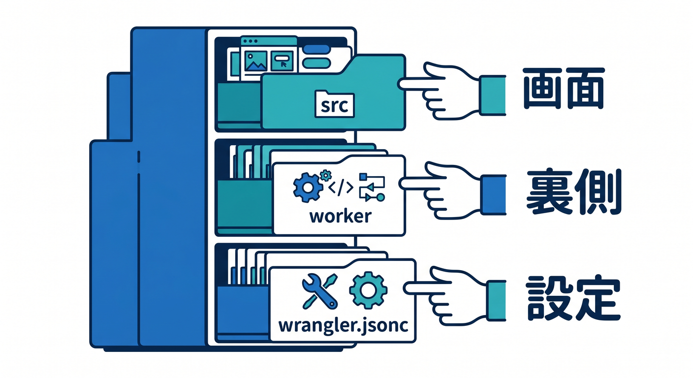
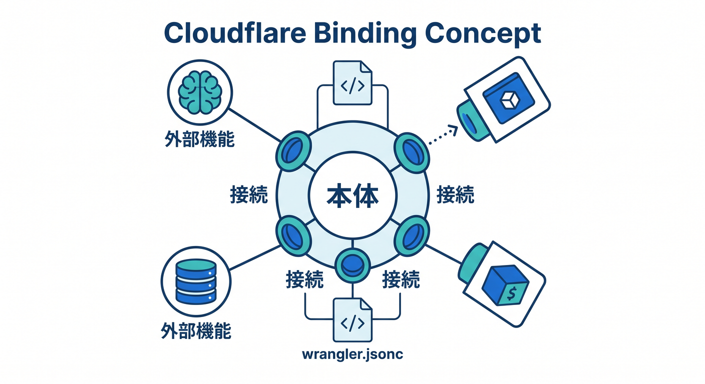
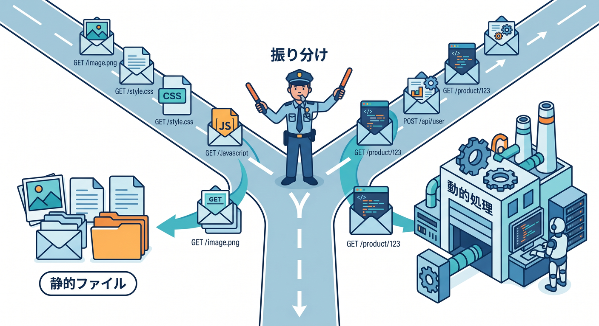
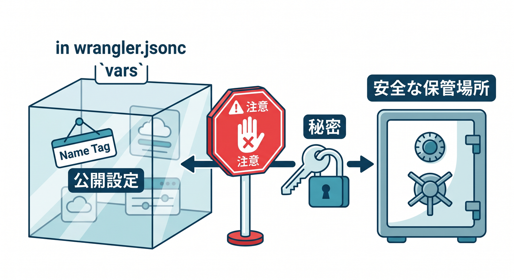

# 第05章：`wrangler.jsonc` とフォルダ構成を読めるようになろう 🧾🗂️☁️

この章のテーマは、**「生成されたCloudflareプロジェクトを、ちゃんと読めるようになること」**です 😊
前の章で C3 からプロジェクトを作れたら、次は「このファイルは何者？」「どれを触ると何が変わるの？」を整理する番です。Cloudflare はいま `wrangler.jsonc` を新規プロジェクト向けに推していて、しかも新しめの機能には JSON 設定が前提のものもあります。だからこの章は、あとで D1、R2、Workers AI、Vectorize を足していくための“設定の読み方”を作る大事な回です。 ([Cloudflare Docs][1])

---

## この章でできるようになること 🎯

* `wrangler.jsonc` を見て、**Cloudflare側の設定の中心**だと説明できる
* `name`、`main`、`compatibility_date`、`assets`、`vars`、`env` あたりの役割がわかる
* フォルダ構成を見て、**フロント側とWorker側の担当**をざっくり分けられる
* 「AIやDBを足すとき、どこに設定を書くのか」がイメージできる

Cloudflare公式では、Worker をデプロイする最低限の基本として `name`、`main`、`compatibility_date` が重要で、`main` は assets-only の場合を除いて中心になる項目です。さらに Vite 系の開発では、Cloudflare Vite plugin がプロジェクトのルートで `wrangler.jsonc` などを読みに行く前提になっています。 ([Cloudflare Docs][1])

---

## 1. `wrangler.jsonc` は何者なの？ 🤔📘



ひとことで言うと、**「このプロジェクトを Cloudflare 上でどう動かすかを書く設定ファイル」**です ✨
アプリ本体のコードは `src` や `worker` にありますが、Cloudflare にとっての“実行条件”は `wrangler.jsonc` に集まります。Worker の名前、どのファイルを入口にするか、どの日付の互換仕様で動かすか、静的ファイルをどう配るか、AI や D1 や R2 をどう結びつけるか――そういう話はここに集約されます。Cloudflare は新規プロジェクトで `wrangler.jsonc` を推奨していて、Wrangler はローカルインストール前提で使う流れが公式です。 ([Cloudflare Docs][1])

ここで大事なのは、**「コードを書く場所」と「コードをどう実行するかを書く場所」は別」**だと切り分けることです 😊
`index.ts` や `App.tsx` は“何をするか”を書く場所、`wrangler.jsonc` は“どんな条件でそれを動かすか”を書く場所です。この区別がつくと、設定ファイルを見ても怖くなくなります。

---

## 2. まずはフォルダ構成を地図として見よう 🗺️📂



Cloudflare の React + Vite の C3 例では、簡略化するとこういう並びになります。`wrangler.jsonc` が真ん中にいて、`worker/index.ts` がバックエンド API、`src/App.tsx` が画面側、`vite.config.ts` がローカル開発やビルドの橋渡しを担当します。公式の React + Vite ガイドでも、まさにこの役割分担で説明されています。 ([Cloudflare Docs][2])

```text
my-cloudflare-app/
├─ src/
│  └─ App.tsx
├─ worker/
│  └─ index.ts
├─ index.html
├─ vite.config.ts
├─ wrangler.jsonc
├─ package.json
└─ node_modules/
```

この見方のコツはシンプルです 😄

* `src/` … 画面まわり。React の部屋 ⚛️
* `worker/` … Cloudflare Workers で動く処理の部屋 ☁️
* `vite.config.ts` … Vite と Cloudflare Vite plugin の接続係 🔌
* `wrangler.jsonc` … Cloudflare 向けの実行ルール本 📘
* `package.json` … Node/依存関係/スクリプトの案内板 📦

Cloudflare の公式 React ガイドでは、`wrangler.jsonc` で `main` が Worker の入口を指し、`assets.not_found_handling` が SPA ルーティングの動きを決める、という読み方まで案内されています。 ([Cloudflare Docs][2])

---

## 3. まず読めるようになりたい最小の `wrangler.jsonc` 🧠✨

下の例は、学習用に少しだけ整理したサンプルです。
**「全部覚える」より、「1行ずつ意味が言える」**ことを目標にしましょう 🌱

```jsonc
{
  "$schema": "./node_modules/wrangler/config-schema.json",
  "name": "cf-study-app",
  "main": "worker/index.ts",
  "compatibility_date": "2026-04-15",

  "assets": {
    "directory": "./dist",
    "binding": "ASSETS",
    "not_found_handling": "single-page-application"
  },

  "vars": {
    "APP_NAME": "Cloudflare Study App"
  },

  "ai": {
    "binding": "AI"
  },

  "env": {
    "staging": {
      "vars": {
        "APP_NAME": "Cloudflare Study App (staging)"
      }
    }
  }
}
```

この形は、Wrangler の基本設定、Static Assets、環境変数、Workers AI バインディング、環境別設定の考え方をまとめて見せるための学習用サンプルです。実際の公式仕様でも、`$schema`、`name`、`main`、`compatibility_date`、`assets`、`vars`、`ai`、`env` は `wrangler.jsonc` の主要項目として登場します。 ([Cloudflare Docs][1])

---

## 4. よく触る項目を、やさしく1つずつ見よう 🔍🧩


## `"$schema"` 🧭

これは VS Code に「この JSONC は Wrangler の設定ファイルですよ」と伝える目印です。
補完や警告が効きやすくなるので、**書き間違いに早く気づける**のがうれしいところです ✨ `node_modules/wrangler/config-schema.json` を指す形は、Cloudflare の公式例でもよく出てきます。 ([Cloudflare Docs][1])

## `"name"` 🏷️

これは Worker の名前です。
Cloudflare 側でプロジェクトを識別するベース名になるので、あとで環境を切ると `my-worker-staging` のような形にもつながります。Worker 名には使える文字のルールがあり、`workers.dev` を使う場合は長さや先頭・末尾の制約もあります。 ([Cloudflare Docs][1])

## `"main"` 🚪

これは **Worker の入口ファイル**です。
「Cloudflare は、まずどの TypeScript ファイルを実行するの？」への答えがここです。React 側の `App.tsx` ではなく、Cloudflare で動く `worker/index.ts` や `src/index.ts` みたいなファイルを指すのが基本です。Cloudflare 公式でも `main` は Worker のエントリーポイントとして説明されています。 ([Cloudflare Docs][1])

## `"compatibility_date"` 📅

これ、かなり大事です ❗
これは **Cloudflare Runtime のどの互換仕様で動かすか**を決める日付です。新規プロジェクトでは当日の日付を使うのが自然で、既存プロジェクトでも定期的に更新すると新しい API や修正を取り込みやすくなります。Node 互換の `nodejs_compat` を使うときも、この日付条件が関わります。 ([Cloudflare Docs][3])

## `"assets"` 🖼️

これは静的ファイル担当です。
HTML、CSS、画像、ビルド済みフロントエンドなどを Cloudflare に載せるときの設定で、`directory` が対象フォルダ、`binding` を付けると Worker から `env.ASSETS.fetch(request)` のように呼べます。さらに `not_found_handling: "single-page-application"` を使うと、SPA のフロントルーティングと相性がよくなります。なお、**Cloudflare Vite plugin を使う場合は `assets.directory` を明示しなくてよいケースもある**、というのも今の重要ポイントです。 ([Cloudflare Docs][4])

## `"vars"` 🧪

ここには**公開してもよい設定値**を書きます。
たとえば API のホスト名、アプリ名、ちょっとした JSON 設定などです。ただし暗号化はされないので、**秘密情報はここに書かない**のが鉄則です。秘密は `.dev.vars` や `.env`、それから `wrangler secret put` などの秘密管理に回します。 ([Cloudflare Docs][5])

## `"env"` 🌿

これは環境ごとの差分を切る場所です。
たとえば `staging` と `production` で URL や接続先を変えたいときに使います。Cloudflare では環境を作ると `<top-level-name>-<environment-name>` の Worker 名になる仕組みで、しかも `vars` や各種 binding は**継承されない項目**が多いので、環境ごとに明示が必要です。ここは初心者がかなりハマりやすいので、早めに知っておくと安心です。 ([Cloudflare Docs][6])

---

## 5. 「ローカルで効く設定」と「本番で効く設定」を分けて考えよう 🏠🚀


初心者さんが一番混乱しやすいのがここです 😵‍💫
`wrangler.jsonc` はローカル開発にも本番デプロイにも関わりますが、**何がそのまま使われ、何が環境で差し替わるのか**は項目ごとに違います。たとえば `name` や `main` や `compatibility_date` は土台側の設定として強く効きます。一方で `vars` や binding は環境ごとの差分管理が重要で、継承のルールにも注意が必要です。 ([Cloudflare Docs][1])

さらに今の Cloudflare では、ローカル開発中に一部の binding を **`remote: true`** にして、ローカル実行しながらリモートの D1 / KV / R2 などにつなぐ仕組みもあります。ただし全部が対象ではなく、`vars` や secrets などはローカル用に分けて扱うのが前提です。 ([Cloudflare Docs][7])

この章では、まず次の感覚が持てれば十分です 🙆

* コード本体はローカルでも本番でも同じものを育てる
* 実行条件や接続先は `wrangler.jsonc` で整理する
* 環境ごとの差分は `env` で切る
* 秘密情報だけは別管理にする

---

## 6. AIサービスを足すときも、入口は `wrangler.jsonc` だよ 🤖☁️✨



ここ、Cloudflareらしくて面白いところです 😆
Workers AI を使いたいときは、`wrangler.jsonc` に `ai` binding を追加します。すると Worker コード側で `env.AI` として使えるようになります。つまり、AI も「特別な魔法」ではなく、**Cloudflare の binding の1種類**として入ってくるんですね。 ([Cloudflare Docs][8])

さらに、AI検索やベクトル検索の方向へ進むと、Vectorize も同じ発想で `wrangler.jsonc` に binding を足します。Cloudflare の公式チュートリアルでも、Vectorize の binding と Workers AI の binding を同じ設定ファイルに書き、Worker から `env.VECTORIZE` と `env.AI` で扱う流れが案内されています。 ([Cloudflare Docs][9])

つまり第5章の時点で覚えたいのは、**「Cloudflare の機能は、だいたい binding として `wrangler.jsonc` に現れる」**という発想です 🌟
あとで D1、R2、KV、Vectorize、AI Search に進んでも、「あ、またこの設定ファイルに戻ってくるんだな」と見えるようになります。

---

## 7. `assets` の考え方は、React や Vite でも超大事 🎨⚡



Cloudflare の今の開発導線では、React や Vite と組み合わせるケースがかなり自然です。
そのとき `assets` は「ビルド済みフロントエンドをどこから出すか」を決める場所になります。Cloudflare の Static Assets は、Worker の動的処理と静的配信をひとまとまりで扱えるのがポイントで、リクエストが静的ファイルに一致すれば Worker を呼ばずに返し、一致しなければ Worker 側に処理が回る、というルーティングが標準です。 ([Cloudflare Docs][4])

SPA では `not_found_handling: "single-page-application"` が大事です 😊
これを入れると、React Router みたいなフロント側ルートにアクセスしても、`index.html` にうまく戻してくれます。公式の React + Vite ガイドでも、この考え方がそのまま説明されています。 ([Cloudflare Docs][2])

---

## 8. Copilot をどう使うと、この章の理解が深まる？ 🧠🤖💬

GitHub Copilot は、この章では**「書かせる相棒」より「読ませる相棒」**として使うのがすごく相性いいです 👍
GitHub の公式でも、Copilot Chat は IDE 内でコードの説明、修正提案、テスト生成、コード修正の提案に使えると案内されています。さらに機能表では、VS Code で Chat、Agent mode、MCP、Workspace indexing がサポートされています。なので `wrangler.jsonc`、`vite.config.ts`、`worker/index.ts` をまとめて見せながら、「この設定は何に効いてる？」と聞く使い方がかなり実用的です。 ([GitHub Docs][10])

ただし注意もあります ⚠️
Copilot は **Cloudflare 公式仕様を自動保証してくれるわけではない** ので、`wrangler.jsonc` の最終判断は公式ドキュメントとエディタの補完で確認するのが安全です。特に binding 名、環境別設定、互換日付まわりは、人間が最後に見てあげるのが大事です。

Copilot に投げやすい質問例はこんな感じです ✍️

```text
この wrangler.jsonc を初心者向けに1行ずつ説明して
```

```text
worker/index.ts と wrangler.jsonc を見て、
main と assets と ai binding のつながりを説明して
```

```text
staging 環境を追加したいです。
vars が non-inheritable である点に注意して、差分案を出して
```

こういう聞き方だと、Copilot が“コード生成マシン”ではなく、かなり良い家庭教師っぽく働きやすいです 😊

---

## 9. この章の演習 🛠️🎓

## 演習1　設定ファイルにふりがなを振るつもりで読む 📖

自分の `wrangler.jsonc` を開いて、次の3つをコメントで説明してみましょう。

* `name`
* `main`
* `compatibility_date`

言葉にできたらかなり前進です 🌱

## 演習2　`assets` の意味を確認する 🖼️

`assets` セクションがあるなら、
「これは何を配る設定？」
「SPA用の `not_found_handling` は入っている？」
を確かめてみましょう。

## 演習3　AIの入口を作るイメージを持つ 🤖

まだ実際に使わなくて大丈夫なので、`ai` binding を追加するとしたらどこに書くか、`env.AI` という名前で使えるようになることをメモしてみましょう。Workers AI は Wrangler 設定経由で Worker に binding するのが公式の基本形です。 ([Cloudflare Docs][8])

## 演習4　環境差分の怖さを知る 🌿

`env.staging` を追加するつもりで、`vars` をどこに書くべきか考えてみましょう。`vars` や binding は environment 間で自動継承されないので、トップレベルに書いただけでは足りないことがあります。 ([Cloudflare Docs][6])

---

## 10. つまずきポイント集 😵‍💫🩹

## ありがち① `vars` に秘密を書いてしまう



これはNGです 🙅
`vars` は暗号化前提ではありません。秘密は secrets 側に回しましょう。ローカルでは `.dev.vars` か `.env` を使い、両方を混ぜないのが公式の案内です。最近は `secrets.required` で「この秘密が必要」と設定ファイル側に宣言する仕組みも入りました。 ([Cloudflare Docs][5])

## ありがち② `env.staging` を作ったのに動かない

原因はだいたいこれです 👉 **non-inheritable の見落とし**。
`vars` や binding は環境ごとに明示が必要です。トップレベルにあるから勝手に引き継がれる、と思わないようにしましょう。 ([Cloudflare Docs][6])

## ありがち③ Node気分で package を入れたら動かない

Workers は Node.js そのものではありません。でも今は `nodejs_compat` がかなり進んでいて、Wrangler の設定で有効化できます。ただし compatibility date の条件があります。ここは「Nodeっぽく書ける範囲が広がった」と捉えると理解しやすいです。 ([Cloudflare Docs][11])

## ありがち④ Vite を使っているのに assets を二重管理する

Cloudflare Vite plugin を使う場合、`assets.directory` を毎回手で書かなくてよいケースがあります。Vite 側の出力と Cloudflare 側の配信がつながるためです。設定を増やしすぎる前に、いまのテンプレートがどこまで自動で面倒を見ているかを確認しましょう。 ([Cloudflare Docs][4])

---

## 11. この章のまとめ ✨📦

この章でいちばん大事なのは、**`wrangler.jsonc` を「謎の設定ファイル」から「Cloudflare用の設計図」に見え方を変えること**です 😊

覚えておきたい芯はこの4つです。

* `wrangler.jsonc` は Cloudflare 側の実行条件を書く中心ファイル 📘
* `main` は Worker の入口、`assets` は静的配信、`env` は環境差分 🌿
* AI や D1 や Vectorize を足すときも、まず binding がここに出てくる 🤖
* Copilot はこの章では「設定を説明させる」「差分を提案させる」使い方が強い 💬

Cloudflare 公式の今の導線でも、`wrangler.jsonc`、Cloudflare Vite plugin、Workers AI binding、環境別設定、ローカルインストールの Wrangler が、2026年時点の標準的な学習ルートとしてつながっています。第5章でここを読めるようになると、第6章のローカル実行、第7章の型、第11章の secrets、第15章の AI まで、かなりスムーズになります。 ([Cloudflare Docs][1])

次に続けるなら、この第5章をベースにして、**「章内のハンズオン手順つき完全版」**にもそのまま展開できます。

[1]: https://developers.cloudflare.com/workers/wrangler/configuration/ "Configuration - Wrangler · Cloudflare Workers docs"
[2]: https://developers.cloudflare.com/workers/framework-guides/web-apps/react/ "React + Vite · Cloudflare Workers docs"
[3]: https://developers.cloudflare.com/workers/best-practices/workers-best-practices/?utm_source=chatgpt.com "Workers Best Practices"
[4]: https://developers.cloudflare.com/workers/static-assets/ "Static Assets · Cloudflare Workers docs"
[5]: https://developers.cloudflare.com/workers/configuration/environment-variables/ "Environment variables · Cloudflare Workers docs"
[6]: https://developers.cloudflare.com/workers/wrangler/environments/ "Environments · Cloudflare Workers docs"
[7]: https://developers.cloudflare.com/workers/development-testing/?utm_source=chatgpt.com "Development & testing - Workers"
[8]: https://developers.cloudflare.com/workers-ai/get-started/workers-wrangler/ "Get started - Workers and Wrangler · Cloudflare Workers AI docs"
[9]: https://developers.cloudflare.com/vectorize/get-started/embeddings/ "Vectorize and Workers AI · Cloudflare Vectorize docs"
[10]: https://docs.github.com/copilot/using-github-copilot/asking-github-copilot-questions-in-your-ide "Asking GitHub Copilot questions in your IDE - GitHub Docs"
[11]: https://developers.cloudflare.com/workers/runtime-apis/nodejs/ "Node.js compatibility · Cloudflare Workers docs"
