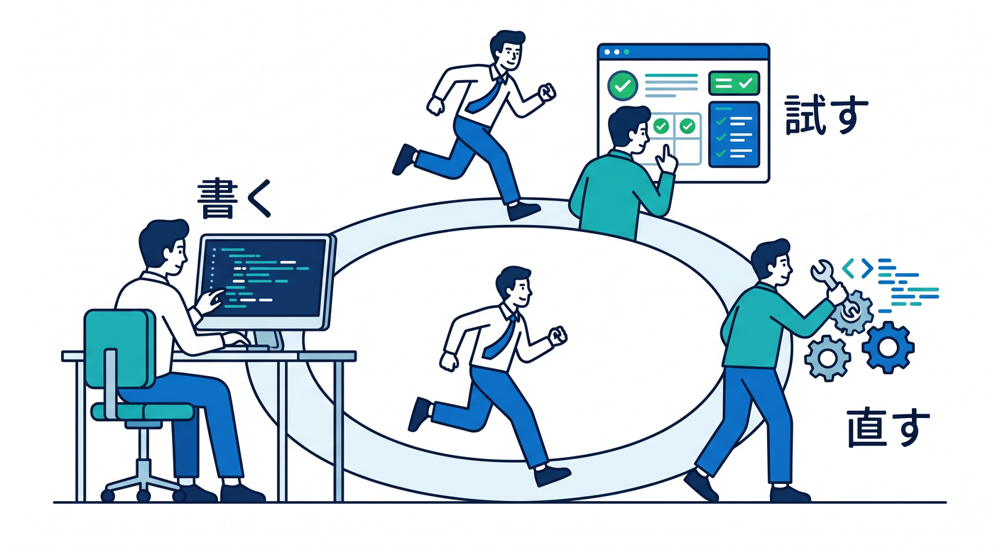
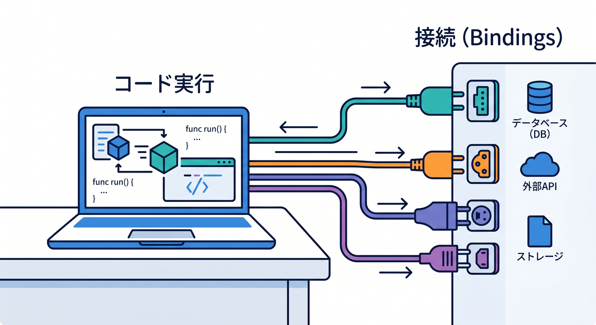
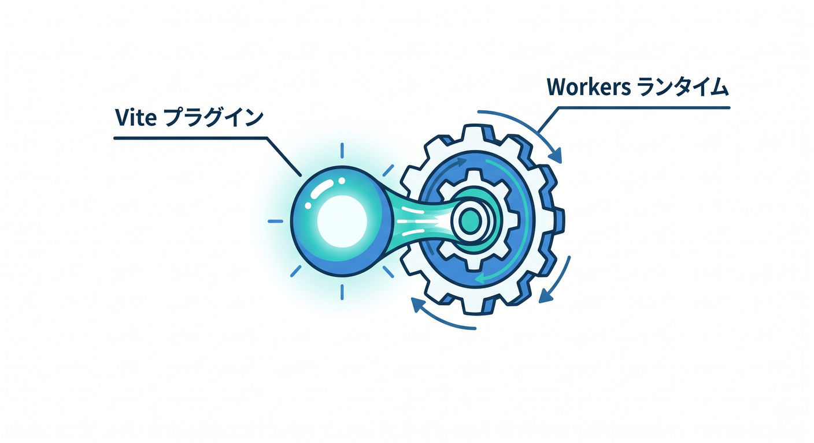
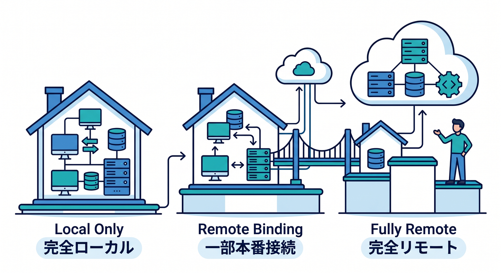
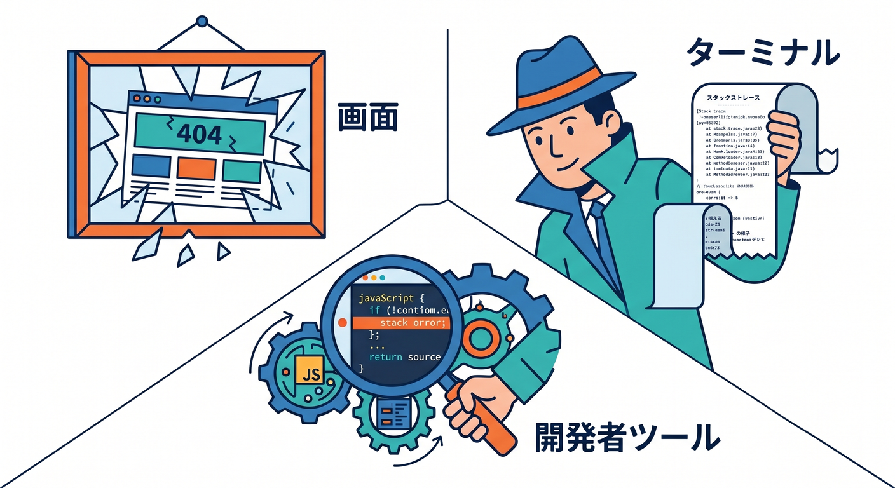
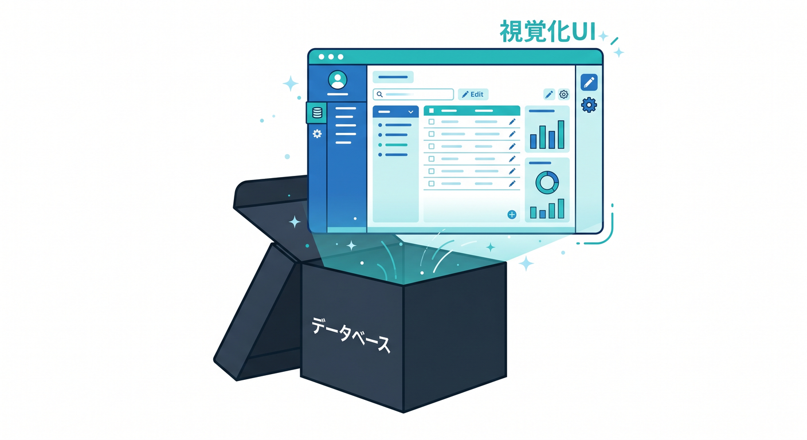

# 第06章：ローカル実行の流れをつかもう 🔍⚡🧪

この章は、**書く → 保存する → すぐ試す → エラーを読む → 直す → もう一度試す**、この小さなループを体に入れる章です 😊



今のCloudflareでは、ローカル開発の中心は **Cloudflare Vite plugin** と **workerd / Miniflare** の組み合わせです。一方で、Worker単体をさっと確認したいときは **Wrangler のローカル実行** もまだ大事です。公式Docsでも、ローカル実行は本番に近いWorkersランタイムを使って手元で試せる流れとして案内されています。 ([Cloudflare Docs][1])

## この章の到達目標 🎯✨

この章を終えるころには、次のことができるようになります。

* ローカルでCloudflareアプリを起動して、ブラウザで確認できる 😊
* ターミナルのログとエラーメッセージを見て、どこが壊れているかを考えられる 🔎
* 「ローカルで動くもの」と「Cloudflare上の本物の資源」を頭の中で分けて考えられる 🧠
* Copilotを使って、エラー調査や修正を速く進められる 🤖
* Workers AI を使うときだけ、ローカル開発の感覚が少し違うことを理解できる ☁️🧠

---

## まず最初に押さえたい全体像 🌍🛠️

Cloudflareのローカル実行で大事なのは、**コードがどこで動いているか** と **データやサービスがどこにつながっているか** を分けて考えることです。
Cloudflare公式はこの2つを、**Worker execution** と **Bindings** という別の概念として説明しています。



ローカル開発では、基本的にコードは自分のPCで動き、KV や D1 や R2 などの binding はまずローカルにシミュレートされます。ただし **AI binding だけは例外** で、モデル実行は常にリモート側です。 ([Cloudflare Docs][1])

つまり、初心者向けにすごく雑に言うとこうです 😄

* **アプリ本体の動作確認** は手元で高速に回す
* **Cloudflareの資源との接続** は、最初はローカルで真似して試す
* 必要になったら、一部だけ本物につなぐ

この考え方がわかると、ローカル開発で頭がかなり整理されます 👍

---

## 今の主役は Vite plugin です ⚡🎉

今のCloudflare学習では、ローカル実行の主役は **Cloudflare Vite plugin** で考えるのが自然です。



Cloudflare公式はこのプラグインをWorkersランタイムとのフル機能統合として案内しており、開発中のコードは **workerd** の中で動きます。しかもこのプラグインは 2025年4月に GA になっていて、Vite 側の Environment API を土台にしています。 ([Cloudflare Docs][2])

公式の最小構成では、**package.json** に次のような流れを置く形です。つまり、日常の開発では **Vite の開発サーバーを起動する** のが入り口になります。Cloudflare Vite plugin は、アプリのルートにある **wrangler.jsonc / wrangler.json / wrangler.toml** を自動で見にいくので、設定と開発がつながりやすいのも大きな利点です。 ([Cloudflare Docs][3])

```json
{
  "scripts": {
    "dev": "vite dev",
    "build": "vite build",
    "preview": "npm run build && vite preview",
    "deploy": "npm run build && wrangler deploy"
  }
}
```

教材としては、まず **npm run dev** を「毎日いちばん使うコマンド」として覚えるのがいちばん親切です 😊
「Cloudflareなのに Vite？」と感じるかもしれませんが、いまは **フロントの快適さ** と **Workersランタイムの正しさ** を両立するために、この形がかなり強いです。 ([Cloudflare Docs][3])

---

## でも Wrangler もまだ大事です 🧰💙

一方で、**Wrangler のローカル実行** もまだしっかり重要です。公式Docsでは **wrangler dev** を、ローカルでWorkerを試すための基本コマンドとして説明していて、起動後は **localhost:8787** で実行を確認でき、**console.log** や例外もターミナルに出ます。 ([Cloudflare Docs][4])

たとえば、次の2つの使い分けがわかるとかなり実務っぽくなります 😎

* **画面つきのフルスタック開発** を気持ちよく回したい → **npm run dev**
* **Worker単体の挙動** をシンプルに見たい → **npx wrangler dev**

```bash
npm run dev
```

```bash
npx wrangler dev
```

さらに、Cloudflare公式は **remote development** も説明していますが、これは **wrangler dev --remote** 専用で、**Vite plugin に同等機能はありません**。教材ではここを深追いしすぎず、「まずはローカルで回す」「必要な binding だけ本物につなぐ」の順で覚えると混乱しにくいです。 ([Cloudflare Docs][5])

---

## ローカル実行の3段階を理解しよう 🪜✨

この章でいちばん大事な整理は、次の3つです。

### 1. ローカル実行＋ローカルbinding 🏠

いちばん基本です。コードは手元で動き、KV・D1・R2 などもローカルにシミュレートされます。Cloudflare公式では、**wrangler dev** と **Vite** の両方で、Miniflare がこうしたローカル資源を自動で作ると説明しています。新しいローカル資源には最初データが入っていないので、必要なら **--local** を付けたWranglerコマンドで中身を入れます。 ([Cloudflare Docs][6])

### 2. ローカル実行＋一部だけ本物のbinding 🌉

これが今のCloudflareでかなり便利な形です。bindingごとに **remote: true** を付けると、コードは手元で動かしつつ、D1 や R2 などの本物の資源に接続できます。Cloudflareはこの **remote bindings** を、より速い反復とデバッグのために推しています。 ([Cloudflare Docs][7])

```json
{
  "r2_buckets": [
    {
      "binding": "FILES",
      "bucket_name": "my-bucket",
      "remote": true
    }
  ]
}
```

### 3. コードごとCloudflare側で実行 ☁️



これは **remote development** です。コードそのものをCloudflare側で動かす形で、**wrangler dev --remote** で使います。ただし公式Docsでも、今は **ローカル実行＋remote bindings** のほうが高速でデバッグしやすいので、まずはこちらを勧めています。 ([Cloudflare Docs][5])

---

## エラーは「敵」ではなく「次の一手のヒント」です 🐞💡

ローカル実行で見る場所は、基本この3つです。

1つ目は **ブラウザの画面**。
2つ目は **ターミナル**。
3つ目は **DevTools** です。



Cloudflare公式では、ローカル実行中に **Chrome DevTools** を使えるようになっていて、ログ確認、ブレークポイント、CPU使用状況、メモリの確認までできます。**wrangler dev** ならターミナルで **D** キー、**Vite plugin** ならコンソールに出る **デバッグURL** をChromeで開く流れです。 ([Cloudflare Docs][8])

初心者のうちは、エラーをこう読むのがおすすめです 😊

* **赤い表示が出たら、いちばん上だけで判断しない**
* **“どのファイルの何行目か” を先に見る**
* **その後で “なぜその値が undefined なのか” を考える**
* **直したらすぐ再実行する**

Cloudflare Workersは Observability まわりもかなり整っていて、ログやリアルタイムログ、Tail Workers などの導線があります。でも第6章では、まず **ローカルで見えるものを丁寧に読む** ところまでで十分です。 ([Cloudflare Docs][9])

---

## Local Explorer がかなり便利です 🧭📦🗃️

最近のCloudflareローカル開発で、初心者にかなりうれしいのが **Local Explorer** です 🎉



これはブラウザで開ける確認画面で、ローカルの binding の中身を見たり、編集したりできます。URL は **/cdn-cgi/explorer** で、ターミナルで **e** を押して開くこともできます。Cloudflare公式によると、KV・R2・D1・Durable Objects・Workflows などを扱えます。 ([Cloudflare Docs][10])

たとえば D1 を使い始めたばかりの人だと、SQLを打って結果を見るだけでも理解がかなり進みます。
「CLIで種データを入れる」「コードの中で無理やり確認用APIを作る」みたいな遠回りをしなくてよくなるので、学習効率がとても上がります 😊
しかもこの Local Explorer には API もあり、Cloudflare公式は **AI coding agents がローカルbindingを操作する用途** まで案内しています。 ([Cloudflare Docs][10])

---

## VS Code でのデバッグもやれます 🪟🧠🔎

もう一歩進めると、VS Code の **Run and Debug** から Workers を追いかけることもできます。Cloudflare公式には、VS Code で **9229番ポートに attach** する設定例もあります。これは初学者の必須項目ではありませんが、「console.log だけだと追いにくい…😵」と感じたらかなり助かります。 ([Cloudflare Docs][11])

なので教材としては、こんな順番がやさしいです。

* 最初は **画面＋ターミナル**
* 次に **DevTools**
* その次に **VS Code のブレークポイント**

この順なら、難しすぎず、でも本格的なデバッグにもつながります ✨

---

## AI を使うときのローカル実行は少しだけ特別です 🤖☁️✨

CloudflareのAI系をこの章でも軽く混ぜるなら、いちばん相性がいいのは **Workers AI** です。Workers AI は **AI binding** を **wrangler.jsonc** に追加して、Workerコードから **env.AI** で呼びます。公式の入門ガイドでもこの形が基本になっています。 ([Cloudflare Docs][12])

```json
{
  "ai": {
    "binding": "AI"
  }
}
```

```ts
export interface Env {
  AI: Ai;
}

export default {
  async fetch(request, env): Promise<Response> {
    const result = await env.AI.run("@cf/meta/llama-3.1-8b-instruct", {
      prompt: "Cloudflare Workers を3行で説明して"
    });

    return Response.json(result);
  }
} satisfies ExportedHandler<Env>;
```

ここで超大事なのは、**Workers AI はローカル開発中でもCloudflareアカウント側にアクセスしてモデルを動かす** という点です。


つまり、普通のローカルbindingみたいに「完全に手元だけ」で閉じるわけではありません。公式Docsでも、**ローカル開発でも利用料金が発生する** と案内されています。 ([Cloudflare Docs][12])

なので第6章では、AIはこう教えるのが自然です 😊

* AIを入れると、**ローカル開発でもネット越しの要素** が混ざる
* そのぶん、**レスポンス時間** や **利用回数** を意識する
* AIの挙動確認は、小さなプロンプトで回す
* 「まず普通のHTTPレスポンスが安定してからAIを載せる」が安全

さらに、Cloudflareの **AI Gateway** を使うと、AIリクエストの **分析、ログ、キャッシュ、レート制限、リトライ、フォールバック** をまとめて扱えます。第6章では深入りしなくてよいですが、「AIを使い始めたら、観測と制御の入り口としてAI Gatewayがある」と先に見せておくのはとてもよいです。 ([Cloudflare Docs][13])

---

## 秘密情報の扱いは、この章では“軽く”触れるだけでOK 🔐🌱

ローカル実行で外部APIやAI Gatewayを使いたくなると、キーやトークンの置き場所も気になります。Cloudflare公式では、ローカル開発用の秘密情報は **.dev.vars** または **.env** を使い、**vars に機密情報を入れない** よう案内しています。さらに、必要な secret 名だけを読み込む **secrets.required** の仕組みもあります。 ([Cloudflare Docs][14])

ただし、この章では「秘密情報はコードに直書きしない」「ローカル用ファイルに分ける」までで十分です 🙆
詳しい運用は後ろの Secrets の章で本格的に回収すれば大丈夫です。

---

## Copilot は“答えを出す機械”より“調査の相棒”として使う 🤝🤖

第6章での Copilot の使いどころは、**生成** より **調査と修正** に寄せるのが効果的です。GitHub公式では、VS Code を含む Copilot 統合環境で **Agent mode** と **MCP** を使えるよう案内しており、MCP は外部ツールやデータソースとAIをつなぐ標準です。Cloudflare側も、Workers向けの prompting ガイドで **VS Code を含むAIエディタ** を前提にしつつ、**cloudflare-docs MCP** と **cloudflare-observability MCP** をつないで、Docs参照やログ確認をAIに手伝わせる流れを示しています。 ([GitHub Docs][15])

この章でおすすめの聞き方は、たとえばこんな感じです ✨

* 「このエラー文を、初心者向けに3行で説明して」
* 「原因候補を3つに絞って」
* 「最小修正版だけ出して」
* 「console.log をどこに足せば原因が切り分けやすい？」
* 「この binding はローカルシミュレーションか、リモート接続か判断して」

こういう聞き方だと、Copilotが“全部を勝手に作る存在”ではなく、**理解を加速する相棒** になります 😊

---

## この章で教えるべき実践ループ 🔁💨

教材としては、受講者にこの流れを何回も回してもらうのがいちばん大事です。

### 6-1. 起動する

まず **npm run dev** でアプリを立ち上げる。
動かなければ、**ターミナルの最初の赤いエラー** を見る。

### 6-2. 画面で確認する

ブラウザでページを開く。
真っ白、404、500、CORSっぽい挙動など、症状をざっくり言葉にする。

### 6-3. ログを見る

ターミナルの **console.log** と例外を見る。
「何が来て、どこで止まったか」を確認する。

### 6-4. binding を疑う

D1 や R2 を使っているなら、**ローカルシミュレーションなのか、本物につないでいるのか** を確認する。
AIを使っているなら、「それは最初からリモート実行だ」と思い出す。

### 6-5. DevTools / Local Explorer を開く

必要に応じて **DevTools** や **Local Explorer** を使う。
目で見える情報を増やす。

### 6-6. Copilot に説明させる

いきなり修正コードを求めるより、**“この症状の意味を説明して”** と頼む。
原因の見当がついたら、最小修正版を出してもらう。

この流れができれば、第6章としてかなり成功です 🌟

---

## 章内ミニ演習案 📝🎓

### 演習1　まずはローカル起動してみよう 🚀

Hello World のWorkerまたはReactつきの最小アプリを起動し、画面が出るところまで確認する。

### 演習2　わざとエラーを出してみよう 🐞

変数名を1か所だけわざと間違えて、
「ブラウザ」「ターミナル」「Copilotの説明」でどう見えるか比較する。

### 演習3　ローカルbindingを見てみよう 🗂️

D1 か KV を1つ用意し、Local Explorer を開いて中身を確認する。

### 演習4　Workers AI を1回だけ呼んでみよう 🤖

短いプロンプトで **env.AI** を試し、
「ローカルなのにAIだけはリモートなんだな」と体感する。

### 演習5　remote binding を1つだけ使ってみよう 🌉

R2 か D1 の binding に **remote: true** を入れ、
手元のコードから本物の資源へつながる感覚を確認する。

---

## Copilot 練習用の問いかけ例 💬🤖

そのまま使えるように、章内にこういう問いを載せると便利です。

* 「このターミナルエラーを初心者向けに説明してください」
* 「原因候補を、設定ミス・型ミス・bindingミスの3分類で整理してください」
* 「修正コードを最小差分で出してください」
* 「Local Explorer で何を見ればこの不具合を切り分けられますか？」
* 「Workers AI を使っているので、ローカルでもリモート要素がある前提で考えてください」

---

## この章のまとめ 🌈✨

第6章の本質は、**ローカル実行を怖がらなくなること** です。
いまのCloudflareでは、**Vite plugin で快適に回しつつ、Workersランタイムにかなり近い形で確認する** のが自然な流れです。必要なら **wrangler dev** でシンプルに確認し、binding は最初ローカル、必要に応じて remote binding へ進む、という順番がとてもわかりやすいです。 ([Cloudflare Docs][3])

そしてAI時代のCloudflareらしさとして、**Workers AI はローカル開発でもリモート実行が混ざる**、**AI Gateway で観測と制御を足せる**、**Copilot や MCP で調査を加速できる**、この3点を軽く先に見せておくと、後ろの章につながりやすいです。 ([Cloudflare Docs][12])

第6章は、「本番に出す前に何を見るのか」を覚える章でもあります 😊
ここで小さな失敗をたくさん回せるようになると、その後の D1・R2・AI・デプロイがぐっと楽になります 🚀☁️

次は、この第6章をさらに教材化して、**学習目標・節ごとの講義本文・演習の模範解答・講師用ノート付き** の形にもできます。

[1]: https://developers.cloudflare.com/workers/development-testing/ "Development & testing · Cloudflare Workers docs"
[2]: https://developers.cloudflare.com/workers/vite-plugin/?utm_source=chatgpt.com "Vite plugin · Cloudflare Workers docs"
[3]: https://developers.cloudflare.com/workers/vite-plugin/get-started/ "Get started · Cloudflare Workers docs"
[4]: https://developers.cloudflare.com/workers/wrangler/commands/general/ "General commands · Cloudflare Workers docs"
[5]: https://developers.cloudflare.com/workers/development-testing/bindings-per-env/ "Supported bindings per development mode · Cloudflare Workers docs"
[6]: https://developers.cloudflare.com/workers/development-testing/local-data/ "Adding local data · Cloudflare Workers docs"
[7]: https://developers.cloudflare.com/changelog/post/2025-09-16-remote-bindings-ga/ "Remote bindings GA - Connect to remote resources (D1, KV, R2, etc.) during local development · Changelog"
[8]: https://developers.cloudflare.com/workers/observability/dev-tools/ "DevTools · Cloudflare Workers docs"
[9]: https://developers.cloudflare.com/workers/observability/ "Observability · Cloudflare Workers docs"
[10]: https://developers.cloudflare.com/workers/development-testing/local-explorer/ "Local Explorer · Cloudflare Workers docs"
[11]: https://developers.cloudflare.com/workers/testing/miniflare/developing/debugger/ "Attaching a Debugger · Cloudflare Workers docs"
[12]: https://developers.cloudflare.com/workers-ai/get-started/workers-wrangler/ "Get started - Workers and Wrangler · Cloudflare Workers AI docs"
[13]: https://developers.cloudflare.com/ai-gateway/ "Overview · Cloudflare AI Gateway docs"
[14]: https://developers.cloudflare.com/workers/configuration/environment-variables/ "Environment variables · Cloudflare Workers docs"
[15]: https://docs.github.com/en/copilot/tutorials/enhance-agent-mode-with-mcp "Enhancing GitHub Copilot agent mode with MCP - GitHub Docs"
