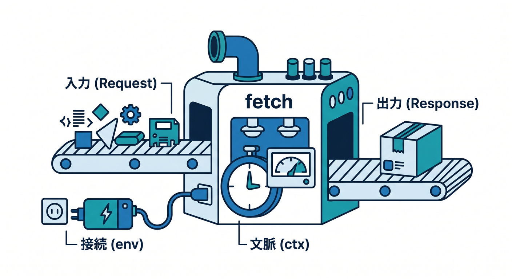
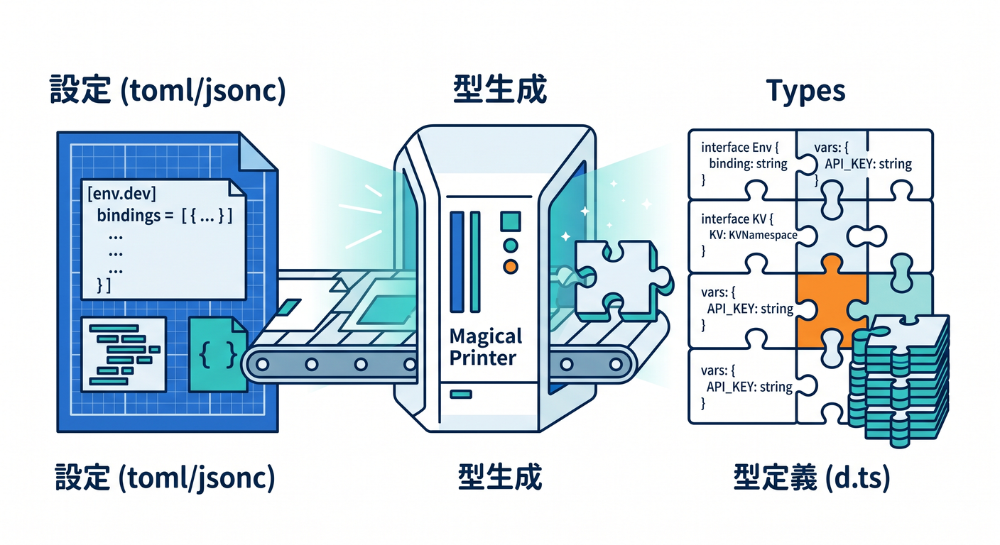
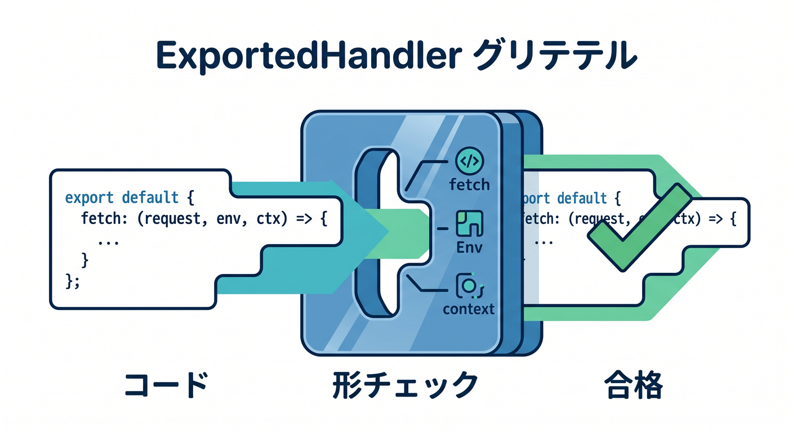
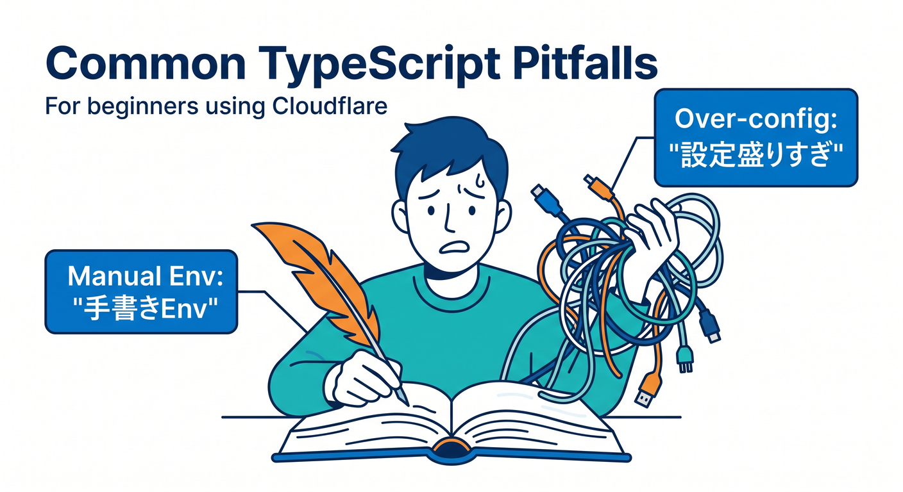

# 第07章：Cloudflare向けTypeScriptの超入門 ✍️🔷☁️

この章では、TypeScriptを「言語として全部学ぶ」のではなく、**Cloudflareで困らない分だけを、実務っぽくやさしく身につける**ことを目標にします 😊
ここで大事なのは、**文法の細かい暗記より、`Request`・`Response`・`env`・`ctx`・`fetch` を“型つきで読める”こと**です。さらに今のCloudflareでは、型を手書きするより **`wrangler types` で実行環境に合った型を生成する**のが公式の本筋です。([Cloudflare Docs][1])

本日時点では TypeScript 6.0 が案内されており、これは 7.0 への橋渡しになる安定版です。つまりこの章では、**古い書き方を覚え込むより、6.0時代の素直な書き方**に寄せておくのが安心です。([Microsoft for Developers][2])

---

## この章でできるようになりたいこと 🎯

この章のゴールは、次の4つです。

1. TypeScriptの基本である「型注釈」「関数」「オブジェクト」「非同期」を、Cloudflareのコードで読めるようになる
2. `fetch(request, env, ctx)` の3引数が何者か分かる
3. `Env` を手で書き続けず、`wrangler types` で型生成する感覚をつかむ
4. Workers AI の binding も「型のある Cloudflare機能」として見られるようになる 🤖✨

---

## まず知っておきたい考え方 💡

Cloudflare Workers の `fetch()` ハンドラは、**受け取るのが `Request`、返すのが `Response`** です。これがこの章のど真ん中です。さらに `env` には binding 群が入り、`ctx` は Worker のライフサイクル制御に使う文脈オブジェクトです。([Cloudflare Docs][3])

つまり、Cloudflare向けTypeScriptの最初の一歩は、こんな感じです。



* `request` → ブラウザやAPIクライアントから来た入力 📩
* `env` → KV、R2、D1、Workers AI などの接続口 🔌
* `ctx` → `waitUntil()` などを使う実行文脈 ⏳
* 戻り値 → `Response` 📤

この形が読めるだけで、Cloudflareのコードはかなり怖くなくなります。([Cloudflare Docs][3])

---

## TypeScriptは「保険」ではなく「地図」🗺️

初学者だと、型は「うるさい警告機能」に見えがちです 😅
でも Cloudflare ではむしろ逆で、**今の runtime で何が使えて、どの binding が存在して、何が返るのかを先に見せてくれる地図**として使うのが気持ちいいです。


Cloudflare公式も、`@cloudflare/workers-types` をアプリ側で抱え込むより、**`wrangler types` で runtime 型と binding 型を生成する方法**を推奨しています。生成される型は `compatibility_date` と `compatibility_flags`、さらにあなたの Worker 設定にある bindings に合わせて決まります。([Cloudflare Docs][1])

---

## 先に覚える文法は、このくらいで十分 👍

この章で先に覚えたいのは、次の小さい範囲です。

* 変数に型をつける
* 関数の引数と戻り値に型をつける
* オブジェクトの形を型で表す
* `async` / `await` を読める
* `null` や `undefined` を雑に扱わない

ここでは難しいジェネリクス祭りはまだ不要です 🙆
Cloudflare学習の序盤では、**「値の形が分かる」「戻り値が分かる」「Promise が分かる」** だけでかなり前に進めます。

---

## Cloudflareで最初に読むべき TypeScript 例 🌱

まずは最小の例からです。

```ts
export default {
  async fetch(request, env, ctx): Promise<Response> {
    const url = new URL(request.url);
    const name = url.searchParams.get("name") ?? "world";

    return new Response(
      JSON.stringify({
        message: `Hello, ${name}!`,
        method: request.method,
      }),
      {
        headers: { "content-type": "application/json; charset=UTF-8" },
      }
    );
  },
} satisfies ExportedHandler<Env>;
```

このコードで見てほしいのは、文法テクニックではなく次の3点です 😊

* `fetch` は非同期関数なので `Promise<Response>` を返す
* `request.url` や `request.method` のように、`Request` には最初から読める情報が入っている
* `Env` は「自分で適当に書く型」ではなく、「Cloudflare設定から寄せる型」にしていく

Cloudflareの `fetch()` ハンドラは `Request` を受けて `Response` を返す形で、`ctx` は3番目の引数として渡されます。`Request` / `Response` は Fetch API ベースです。([Cloudflare Docs][3])

---

## ここが超重要：`Env` を手書きしない 🧠⚡

昔の解説では、こんなふうに `interface Env { ... }` を手書きする例をたくさん見かけます。
でも、**今のCloudflare公式のおすすめは「手書きしない」** です。



Cloudflareのベストプラクティスでは、**`Env` を手書きせず `wrangler types` を実行して、実際の Wrangler 設定に一致した型定義を生成する**よう案内されています。binding 名の追加や変更があったら、`wrangler types` を再実行するのが基本です。([Cloudflare Docs][4])

理由はすごくシンプルです。

* 設定ファイルでは binding 名を `AI` にしたのに、コードで `env.MY_AI` と書いてしまう
* staging だけにある binding と production にある binding がズレる
* `compatibility_date` を変えたのに、型が古いまま残る

こういう事故を、**型生成でかなり前倒しに検出できる**からです。([Cloudflare Docs][1])

---

## `wrangler types` の基本手順 🛠️

Cloudflare公式では、`wrangler types` を実行すると、デフォルトで `worker-configuration.d.ts` が生成され、そこに runtime 型と `Env` 型が入ります。さらに `tsconfig.json` の `compilerOptions.types` にそのファイルを登録する流れが推奨されています。([Cloudflare Docs][1])

手順はこんな感じです。

### 1. 型を生成する

```bash
npx wrangler types
```

### 2. `tsconfig.json` に生成ファイルを登録する

```json
{
  "compilerOptions": {
    "types": ["./worker-configuration.d.ts"]
  }
}
```

### 3. binding を増やえたり名前を変えたら、もう一度生成する

```bash
npx wrangler types
```

Cloudflare公式は、`wrangler types` を **TypeScript に依存するタスクの前に実行する** ことも案内しています。CI や build の前に入れておくのも自然です。`--check` で更新漏れ確認もできます。([Cloudflare Docs][1])

---

## `tsconfig.json` は盛りすぎない 🧾✨

初学者ほど `tsconfig.json` をいじり倒したくなりますが、この段階ではおすすめしません。
まずは **Cloudflareが生成した型を読むための最低限** だけで十分です。

本日時点の TypeScript 6.0 は 7.0 への移行を見据えた節目の版なので、**昔の設定をコピペして温存するより、シンプルな `tsconfig` で始める**ほうが後で楽です。非推奨設定は 7.0 で消える予定のものもあります。([Microsoft for Developers][2])

---

## `compatibility_date` と型はセットで考える 📅🔗

Cloudflareでは、Worker の設定にある `compatibility_date` がとても大事です。Wrangler 設定では `name`、`main`、`compatibility_date` が最低限必要で、`wrangler types` はこの `compatibility_date` や `compatibility_flags` を見て runtime 型を生成します。([Cloudflare Docs][5])

つまり、TypeScriptの型は単なる飾りではなく、**「今日の自分の Worker runtime に合わせた型」** です。


ここが Node.js の普通のサーバー開発と少し違って、Cloudflareらしい気持ちいいところです ☁️

---

## Node.jsっぽい型がほしいときの注意 🟢

Cloudflare Workers は Node.js そのものではありません。
ただし Node互換機能を使う場面もあり、その場合 Cloudflare公式の TypeScript ページでは、`nodejs_compat` を使っているなら **`@types/node` も追加して `tsconfig.json` の `types` に `"node"` を入れる** よう案内されています。([Cloudflare Docs][1])

たとえばこんな形です。

```json
{
  "compilerOptions": {
    "types": ["./worker-configuration.d.ts", "node"]
  }
}
```

この章ではまだ Node互換を深掘りしませんが、**「Cloudflareの型」と「Nodeの型」は別物で、必要なときだけ足す**という感覚だけ持っておくと十分です 😊

---

## `fetch(request, env, ctx)` を型で読む練習 📘

ここは声に出して読むくらいでちょうどいいです。

* `request` は `Request`
* `env` は bindings の集合
* `ctx` は Context API
* 返り値は `Response` か `Promise<Response>`

Cloudflare docs でも `fetch(request, env, ctx)` が基本形として案内されていて、`ctx` は Context API の入口、`env` は binding 参照口です。`Request` のコンストラクタや `Response` のコンストラクタも型情報つきで整理されています。([Cloudflare Docs][3])

---

## `satisfies ExportedHandler<Env>` は怖く見えるけど便利 😌

Cloudflareのサンプルでは、末尾に `satisfies ExportedHandler<Env>` がついていることがあります。
これは雑に言うと、**「この `export default` の形は Cloudflare Worker として正しい？」を型でチェックするためのお守り**です。



Workers AI の公式 TypeScript 例でも、この書き方が使われています。つまり、序盤から慣れておく価値があります。([Cloudflare Docs][6])

---

## Workers AI まで見据えると、TypeScriptがさらに気持ちよくなる 🤖💙

CloudflareのAI機能も、TypeScriptの章で早めに軽く触れておくと理解が深まります。
Workers AI を Worker から使うには、Wrangler 設定に AI binding を追加し、その binding はコード上で `env.AI` として使えます。さらに `env.AI.run()` でモデルを実行できます。([Cloudflare Docs][6])

設定の例です。

```json
{
  "ai": {
    "binding": "AI"
  }
}
```

コードの最小例はこんな感じです。

```ts
export default {
  async fetch(request, env): Promise<Response> {
    const result = await env.AI.run("@cf/meta/llama-3.1-8b-instruct", {
      prompt: "TypeScriptとは何かをやさしく一言で説明して",
    });

    return new Response(JSON.stringify(result), {
      headers: { "content-type": "application/json; charset=UTF-8" },
    });
  },
} satisfies ExportedHandler<Env>;
```

この例でうれしいのは、**AI ですら “なんとなく呼ぶ外部サービス” ではなく、`env.AI` という型のある binding として扱える**ことです。


「Cloudflare向けTypeScript」は、AI時代ほど価値が上がります ✨([Cloudflare Docs][6])

---

## しかも Workers AI は TypeScript と相性がいい 🚀

Cloudflareは Workers AI について、**JavaScript / TypeScript コードベースで Vercel AI SDK を使える**ことも案内しています。さらに OpenAI互換 endpoint もあり、OpenAI SDK のコードをベースURLとモデル名の切り替えで流用しやすい導線もあります。([Cloudflare Docs][7])

つまり将来的には、

* まずは `env.AI.run()` で素直に触る
* 次に OpenAI互換 endpoint で既存コード資産を流用する
* 必要なら AI SDK に広げる

という段階的な学び方ができます。
この流れに乗るためにも、**型つきで `env` や戻り値を読める力**が効いてきます。([Cloudflare Docs][8])

---

## VS Code と Copilot はどう絡むの？ 🤝💻

本日時点の GitHub公式資料では、**VS Code は Copilot の chat、code completion、agent mode、MCP、workspace indexing をサポート**しています。また GitHubは、**最新の安定版IDEとCopilot拡張を使うこと**を推奨しています。([GitHub Docs][9])

つまりこの章では、Copilotにコードを書かせ切るより、次の使い方が相性抜群です。

* 「この `Request` の型を日本語で説明して」
* 「この `env` に何の binding が入っている想定？」
* 「この型エラーは、文法ミスか設定ミスかどっち？」
* 「`wrangler types` を前提にすると、ここはどう直す？」

こういう聞き方をすると、**TypeScriptの学習補助**としてかなり強いです 🤖✨

さらに GitHub docs では、Copilot の agent mode を MCP で拡張する使い方も案内されています。将来的に Cloudflare系のドキュメントやツール文脈を強く渡したいとき、この流れはかなり重要です。([GitHub Docs][10])

---

## Cloudflare公式のVS Code拡張はある？ 🧩

あります。Visual Studio Marketplace には **Cloudflare Workers Extension** があり、説明では **Cloudflare Worker の bindings 管理** を目的にした拡張として案内されています。([marketplace.visualstudio.com][11])

ただし、学習の主役はあくまでこれではありません。
Cloudflare公式のデバッグ導線を見ると、**VS Code での基本線は `launch.json` を使ったデバッガ接続**です。つまり、実務の中心は **Wrangler + 型生成 + VS Code + Copilot** で、拡張は補助輪くらいに考えるのが自然です。([Cloudflare Docs][12])

---

## 初学者がつまずきやすいポイント 😵‍💫

### 1. `Env` を自作してしまう



いちばん多いです。
「今は動く」けれど、binding名変更や環境差分で壊れやすいです。Cloudflare公式は手書きより `wrangler types` を推奨しています。([Cloudflare Docs][4])

### 2. `tsconfig.json` を盛りすぎる

最初から難解な設定を入れると、TypeScriptの勉強ではなく設定ファイル格闘編になります。
6.0時代は特に、古い設定の温存より素直な構成が安全です。([Microsoft for Developers][2])

### 3. `fetch` の戻り値を雑にする

Cloudflareの `fetch()` ハンドラは `Response` を返す世界です。
ここを曖昧にすると、型の恩恵が一気に減ります。([Cloudflare Docs][3])

### 4. AI binding を「外部APIキー直呼び」と同じ感覚で考える

Workers AI は Cloudflare binding として扱えるので、`env.AI` の設計に慣れておくと後で伸びやすいです。([Cloudflare Docs][6])

---

## この章のおすすめ演習 🧪🎓

### 演習1：クエリ文字列を読む

`?name=komiyamma` を受け取って JSON を返す Worker を作る。
ねらいは `Request`、`URL`、`Response` に慣れることです。

### 演習2：`wrangler types` を回す

`AI` や `vars` を1つ追加して、`worker-configuration.d.ts` がどう変わるか見る。
ねらいは「型は手で書くものではなく、設定から育つもの」と体感することです。

### 演習3：Workers AI を1回だけ呼ぶ

`env.AI.run()` で短い文章生成をして、結果を JSON で返す。
ねらいは「AIも型のある binding」と理解することです。([Cloudflare Docs][6])

### 演習4：Copilotに説明させる

次のように聞いてみます。

```text
この Worker の TypeScript 初学者向けに、
request / env / ctx / Response の役割を
1つずつ日本語で説明して。
また、wrangler types を使う前提で
Env を手書きしない理由も説明して。
```

この使い方だと、Copilotが「答えを全部出す機械」ではなく、**理解を言語化してくれる家庭教師**になってくれます 🤝

---

## この章の完成イメージ 🏁✨

この章が終わった時点で、次の状態になっていれば大成功です。

* `fetch(request, env, ctx)` を見てビビらない
* `Request` と `Response` の役割が分かる
* `Env` は `wrangler types` で作るのが正道だと分かる
* `worker-configuration.d.ts` を `tsconfig.json` に入れる意味が分かる
* Workers AI の `env.AI.run()` を見ても「型のある binding だな」と思える

Cloudflareの今の公式導線では、TypeScriptは「おまけ」ではなく、**runtime・bindings・AI・複数環境を安全につなぐための中心道具**です。特に `wrangler types` は、Cloudflare向けTypeScript学習の要になります。([Cloudflare Docs][1])

---

## 章末のひとこと 🌈

この章では、TypeScriptを難しくしすぎないのがコツです。
**「型理論の勉強」ではなく、「Cloudflareのコードを安心して読めるようになる練習」** と考えると、かなり進めやすいです 😊

次の第8章では、この型つきの土台を使って、**最小のWorkerを作りながら HTTP の流れそのもの**を気持ちよく体感していく流れにすると、とてもつながりがよくなります 🌐📨

必要なら次に、そのまま続けて
**「第7章の学習目標・演習課題・成果物・想定学習時間つき教材設計版」**
まで落とし込めます。

[1]: https://developers.cloudflare.com/workers/languages/typescript/ "Write Cloudflare Workers in TypeScript · Cloudflare Workers docs"
[2]: https://devblogs.microsoft.com/typescript/announcing-typescript-6-0/ "Announcing TypeScript 6.0 - TypeScript"
[3]: https://developers.cloudflare.com/workers/runtime-apis/handlers/fetch/ "Fetch Handler · Cloudflare Workers docs"
[4]: https://developers.cloudflare.com/workers/best-practices/workers-best-practices/ "Workers Best Practices · Cloudflare Workers docs"
[5]: https://developers.cloudflare.com/workers/wrangler/configuration/ "Configuration - Wrangler · Cloudflare Workers docs"
[6]: https://developers.cloudflare.com/workers-ai/get-started/workers-wrangler/ "Get started - Workers and Wrangler · Cloudflare Workers AI docs"
[7]: https://developers.cloudflare.com/workers-ai/configuration/ai-sdk/?utm_source=chatgpt.com "Vercel AI SDK · Cloudflare Workers AI docs"
[8]: https://developers.cloudflare.com/workers-ai/configuration/open-ai-compatibility/ "OpenAI compatible API endpoints · Cloudflare Workers AI docs"
[9]: https://docs.github.com/en/copilot/reference/copilot-feature-matrix "Copilot feature matrix - GitHub Docs"
[10]: https://docs.github.com/en/copilot/tutorials/enhance-agent-mode-with-mcp "Enhancing GitHub Copilot agent mode with MCP - GitHub Docs"
[11]: https://marketplace.visualstudio.com/items?itemName=cloudflare.cloudflare-workers-bindings-extension "
        Cloudflare Workers - Visual Studio Marketplace
    "
[12]: https://developers.cloudflare.com/workers/testing/miniflare/developing/debugger/ "Attaching a Debugger · Cloudflare Workers docs"
