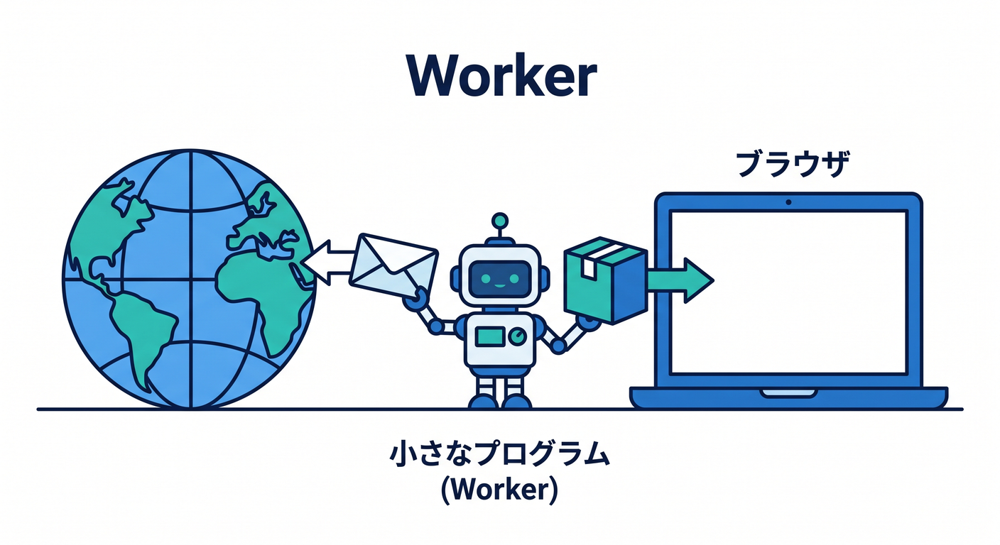
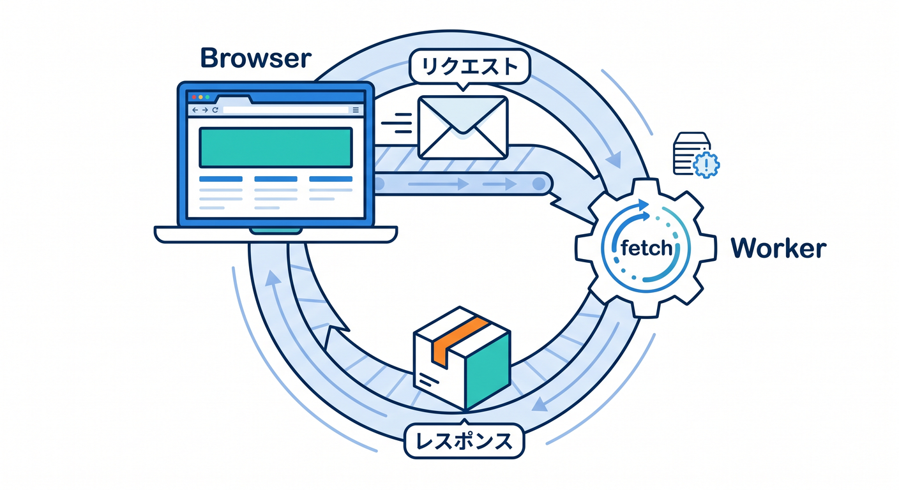
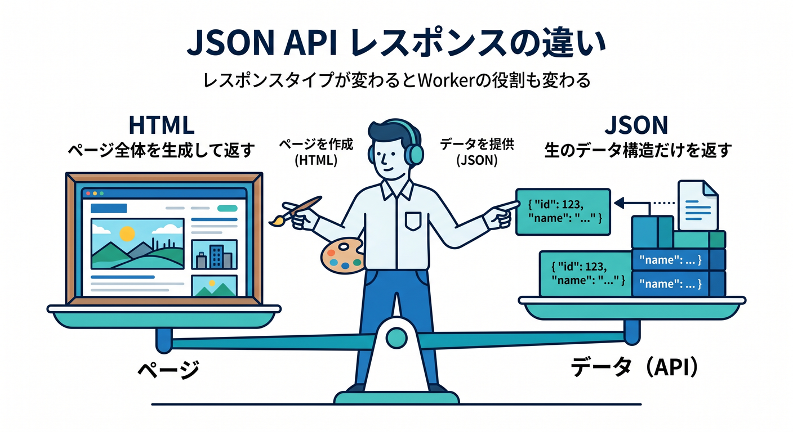
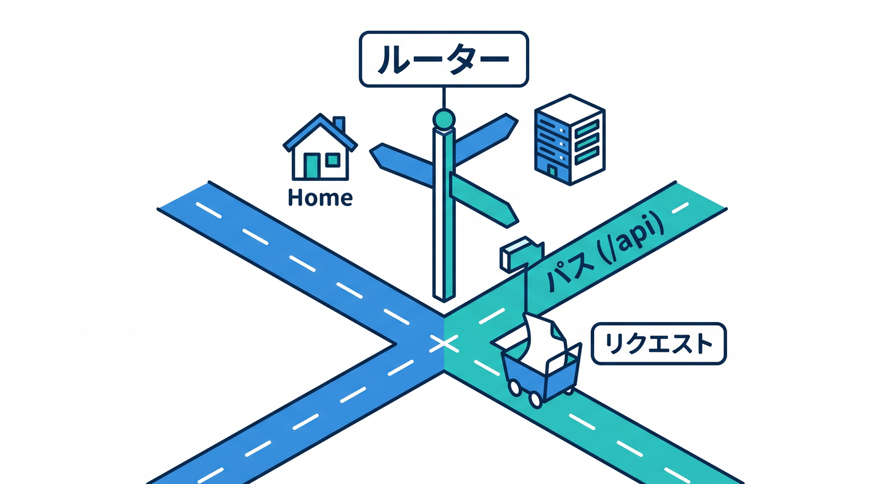
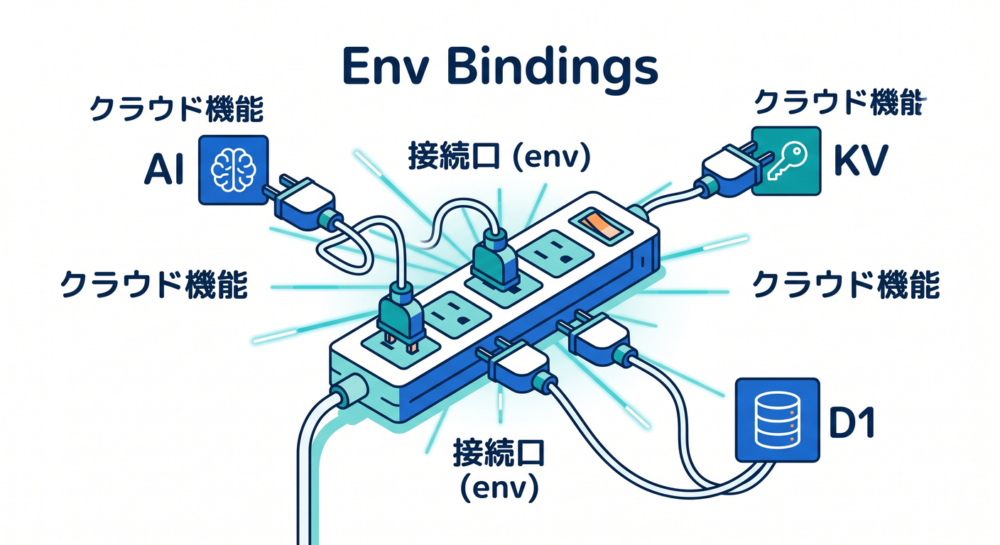
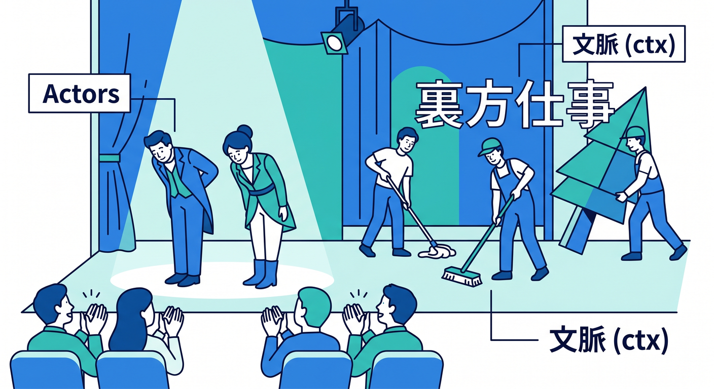

# 第08章：最小のWorkerを作ってHTTPの流れを体感しよう 🌐📨✨

この章は、Cloudflare学習の最初の山場です 🎉
ここでやることは、とてもシンプルです。

**「URLにアクセスしたら、Cloudflare上の自分のコードが動いて、Responseが返る」**
この流れを、手で確かめながらつかみます 💡

Cloudflare公式の現在の導線でも、まずは C3 で Hello World の Worker を作り、`fetch()` ハンドラで `Request` を受け取り、`Response` を返す形が基本になっています。しかも新規プロジェクトでは `wrangler.jsonc` と最小の Worker ファイルが作られるので、この章はその土台をそのまま育てていくイメージです。 ([Cloudflare Docs][1])

---

## この章のゴール 🎯

この章の終わりには、次のことができるようになるのが目標です 😊

* Worker の最小コードを読める ✨
* `Request` と `Response` の役割を説明できる 📬
* HTML と JSON を返し分けられる 🌍
* URL や HTTP メソッドで処理を分岐できる 🛣️
* `env` と `ctx` が何者かをざっくり言える 🔑
* 「この先、AI や DB やストレージもここにつながるんだな」と見通せる 🤖☁️

Cloudflare Workers は、React や Next.js などのフレームワークとも組み合わせられる実行基盤として案内されており、まずはこの最小単位を理解することが、その後の full-stack 開発の入口になります。 ([Cloudflare Docs][2])

---

## 1. まず「Workerって何？」をやさしく整理しよう 🧠☁️

Worker は、**HTTPリクエストを受け取って、HTTPレスポンスを返す小さなプログラム**です。



言い換えると、Cloudflareのネットワーク上で動く、Webアプリの超ミニ本体です 🌍⚡

ブラウザでURLにアクセスすると、Cloudflare側では `fetch(request, env, ctx)` という入り口に `Request` オブジェクトが渡されます。そこで処理をして、最後に `Response` オブジェクトを返します。Cloudflare公式もこの形を、最小の Worker の基本形として説明しています。 ([Cloudflare Docs][3])

すごく大事なのは、**「特別な独自ルールの塊」ではなく、かなりWeb標準寄り」**ということです。`Request` も `Response` も Fetch API の考え方に沿っていて、Webの延長として理解しやすい作りです。 ([Cloudflare Docs][4])

---

## 2. 最小のWorkerはこれです ✨

まずは、いちばん小さい形を見ましょう 👀

```ts
export default {
  async fetch(request, env, ctx): Promise<Response> {
    return new Response("Hello World!");
  },
} satisfies ExportedHandler;
```

この形は、Cloudflare公式の `fetch()` ハンドラの基本形そのものです。HTTPリクエストは `Request` として渡され、返すものは `Response` です。 ([Cloudflare Docs][3])

このコードの見方はこうです 😊

* `request`
  今来たHTTPリクエストです 📩
  URL、メソッド、ヘッダー、本文などが入っています。

* `env`
  Cloudflareの各種 binding に触るための入口です 🔑
  AI、KV、R2、D1、環境変数などがここにつながります。Bindings は `env` オブジェクトからアクセスし、REST API より高性能で制約も少ない形で使えると公式に案内されています。 ([Cloudflare Docs][5])

* `ctx`
  Worker の実行ライフサイクルを扱うための情報です ⏱️
  たとえば後で出てくる `waitUntil()` などはここから使います。Cloudflare公式でも `ctx` は `fetch(request, env, ctx)` の第3引数として説明されています。 ([Cloudflare Docs][6])

---

## 3. HTTPの流れを、頭の中で図にしよう 🗺️

この章では、次の流れを頭に入れるのが超大事です ✨

**ブラウザ → Cloudflare Worker → Response → ブラウザ**

もう少し細かく書くと、こうです 👇

1. ブラウザがURLへアクセスする 🌐
2. Cloudflareの Worker にリクエストが届く 📩
3. `fetch(request, env, ctx)` が呼ばれる ⚙️
4. コードが `Response` を作る 🧱
5. その `Response` がブラウザへ返る 📬

この「受け取る → 判断する → 返す」が、Cloudflare開発の核です。



APIでも、HTML配信でも、AI呼び出しでも、だいたいこの骨組みの上に乗ります。Workers はアプリや API をグローバルに動かす中心基盤として公式に位置づけられていますし、Workers AI も Workers や Pages から呼べる形になっています。 ([Cloudflare Docs][7])

---

## 4. HTMLを返して「ページっぽさ」を感じよう 🖼️

最小の文字列レスポンスだけだと、まだ少し味気ないです。
そこで次は、HTMLを返してみます 😊

```ts
export default {
  async fetch(request): Promise<Response> {
    const html = `<!DOCTYPE html>
    <body>
      <h1>こんにちは Cloudflare 👋</h1>
      <p>これは Worker が返したHTMLです。</p>
    </body>`;

    return new Response(html, {
      headers: {
        "content-type": "text/html; charset=UTF-8",
      },
    });
  },
} satisfies ExportedHandler;
```

Cloudflare公式にも、HTML文字列を `new Response()` で返し、`content-type: text/html;charset=UTF-8` を付ける例があります。つまり Worker は API だけでなく、**その場で小さなHTMLページを返す**ことも自然にできます。 ([Cloudflare Docs][8])

ここで覚えてほしいのは、**レスポンス本文だけでなく、ヘッダーも大事**ということです 🧾


ブラウザは `content-type` を見て、「これはHTMLなんだな」と判断します。

---

## 5. JSONを返して「APIっぽさ」を感じよう 📦

次は JSON です。
Cloudflare開発では、こっちのほうがむしろ本命になりやすいです 😎

```ts
export default {
  async fetch(request): Promise<Response> {
    const data = {
      message: "こんにちは",
      from: "Cloudflare Worker",
      ok: true,
    };

    return Response.json(data);
  },
} satisfies ExportedHandler;
```

Cloudflare公式にも `Response.json(data)` を使って JSON を直接返す例があります。これは API や middleware を作る時の基本パターンです。 ([Cloudflare Docs][9])

ここでのポイントはとてもシンプルです ✨

* **HTMLを返せばページっぽい**
* **JSONを返せばAPIっぽい**

同じ Worker でも、返す `Response` の中身を変えるだけで、役割がかなり変わります。



---

## 6. URLで分岐してみよう 🛣️

Worker が面白くなるのはここからです 🎉
アクセスされた URL によって、返すものを変えます。

```ts
export default {
  async fetch(request): Promise<Response> {
    const url = new URL(request.url);

    if (url.pathname === "/") {
      return new Response("トップページです 🏠");
    }

    if (url.pathname === "/api/hello") {
      return Response.json({
        message: "こんにちは！",
      });
    }

    return new Response("Not Found", { status: 404 });
  },
} satisfies ExportedHandler;
```

Cloudflare公式の conditional response の例でも、`new URL(request.url)` を使って URL を見て分岐する流れが紹介されています。Host、拡張子、HTTPメソッド、User-Agent などで条件分岐できるのが Worker の基本パターンです。 ([Cloudflare Docs][10])

この時点で、かなり大事な感覚が生まれます 💡
**「1本の Worker の中に、小さなルーターを作れる」**



ということです。

まだ React も Next.js も出てきていませんが、Webアプリの入口っぽさがかなり出てきます。

---

## 7. HTTPメソッドでも分岐してみよう ✋📨

URLだけでなく、`GET` と `POST` でも処理を分けられます。

```ts
export default {
  async fetch(request): Promise<Response> {
    const url = new URL(request.url);

    if (url.pathname === "/contact" && request.method === "GET") {
      return new Response("お問い合わせフォームを表示します ✉️");
    }

    if (url.pathname === "/contact" && request.method === "POST") {
      return new Response("お問い合わせを受け取りました ✅");
    }

    return new Response("Not Found", { status: 404 });
  },
} satisfies ExportedHandler;
```

Cloudflare公式の conditional response でも、`request.method === "POST"` のように HTTP メソッドで分岐する例が示されています。つまり Worker は、URLとメソッドの組み合わせで、かなり普通のWebバックエンドらしい動きを作れます。 ([Cloudflare Docs][10])

ここまでくると、**Worker = ただの Hello World ではなく、Webの入口を持った小さなサーバー的コード**として見えてきます 😊

---

## 8. `request` は「届いた封筒」だと思うとわかりやすい 📮

`request` は、届いたHTTPリクエストそのものです。
URL、メソッド、ヘッダー、本文などが入っています。Cloudflare公式でも、`Request` は Fetch API の HTTP request を表すオブジェクトとして説明されています。 ([Cloudflare Docs][4])

ここで初心者が引っかかりやすいポイントが1つあります ⚠️
**受け取った `request` はそのままでは immutable、つまり変更不可**です。変更したい場合は、新しい `Request` を作ります。これは公式にも明記されています。 ([Cloudflare Docs][4])

たとえば「ヘッダーをちょっと足した別リクエストを作りたい」なら、こういう考え方になります。

```ts
export default {
  async fetch(request): Promise<Response> {
    const modifiedRequest = new Request(request.url, request);
    modifiedRequest.headers.set("x-demo", "1"); // 実際は immutable の扱いに注意して別構築する考え方を学ぶ

    return new Response("リクエストを加工する考え方の例です");
  },
} satisfies ExportedHandler;
```

この章ではまだ深追いしませんが、
**「読むのは request、返すのは response、変更したい時は新しく作る」**
この感覚だけ持てれば十分です 🙆

---

## 9. `env` は「Cloudflareの機能につながる差し込み口」🔌☁️

`env` は、第8章ではまだ脇役です。
でも将来の主役候補です 😄

Cloudflare公式では、bindings は `env` 上にあり、Worker が Cloudflare Developer Platform の各種リソースとやり取りするための仕組みだと説明されています。しかも REST API より高性能で制約が少ない形で使えます。 ([Cloudflare Docs][5])

たとえば、単純な環境変数ならこんな感じです。

```ts
export default {
  async fetch(request, env): Promise<Response> {
    return new Response(`ようこそ、${env.APP_NAME} さん 👋`);
  },
} satisfies ExportedHandler;
```

Cloudflare公式の bindings ドキュメントでも、`env.NAME` のように handler の第2引数から binding に触る例が載っています。 ([Cloudflare Docs][5])

この章では、
**env = あとで AI、KV、R2、D1、Secrets につながる場所**



と覚えておけば十分です 🔑

---

## 10. `ctx` は「今すぐ返事しつつ、裏でも少し仕事する」ための入口 ⏳

`ctx` は最初は少し抽象的に見えます。
でもイメージは難しくありません 😊

Cloudflare公式では、`ctx` は Worker のライフサイクル管理に関わる Context API で、`fetch(request, env, ctx)` の第3引数として渡されます。とくに `ctx.waitUntil()` は、レスポンスを返した後も少し処理を続ける時に使います。 ([Cloudflare Docs][6])

たとえば将来的には、こんなことに使います。

* ログ送信 📝
* キャッシュ保存 📦
* ちょっとした後処理 🔄

今の段階では、
**ctx = 裏方の仕事用の入口**



くらいで大丈夫です 👍

---

## 11. ここでAIをちょい足ししてみよう 🤖✨

ユーザーの希望どおり、CloudflareのAIサービスもこの章から少し絡めます 😎

Cloudflare Workers AI は、Cloudflareのグローバルネットワーク上で serverless に AI モデルを動かせる仕組みで、Workers や Pages などから呼び出せます。公式では `env.AI.run()` でモデルを実行する形が案内されています。 ([Cloudflare Docs][11])

たとえば、最小の Worker に AI を足すと、考え方はこうなります。

```ts
export interface Env {
  AI: Ai;
}

export default {
  async fetch(request, env): Promise<Response> {
    const result = await env.AI.run("@cf/meta/llama-3.1-8b-instruct", {
      prompt: "『こんにちは』に対して、やさしく1文で返事してください。",
    });

    return Response.json(result);
  },
} satisfies ExportedHandler<Env>;
```

Cloudflare公式の Workers AI bindings ドキュメントでも、`env.AI.run(model, options)` でモデルを呼び出す例が紹介されています。ストリーミングも可能です。 ([Cloudflare Docs][12])

この章ではまだ「本格AIアプリ」はやりません。
でも大事なのは、**AIも結局はこの `fetch → 処理 → Response` の流れに乗る**ということです 💡

つまり第8章の最小Workerは、後の AI 章の土台そのものです。

さらに Cloudflare は OpenAI 互換エンドポイントも案内していて、`openai-node` SDK から base URL と model 名を切り替える形で Workers AI を使いやすくしています。TypeScript 系の開発者にはかなり入りやすい流れです。 ([Cloudflare Docs][13])

---

## 12. VS Code と GitHub Copilot は、この章でかなり相性がいい 🤝🤖

この章の内容は、Copilotとめちゃくちゃ相性がいいです ✨
なぜなら、最小Workerは構造が小さく、AIに質問しやすいからです。

GitHub公式では、Visual Studio Code は Copilot の MCP 対応IDEの例として挙げられていて、Agent mode と MCP サーバーを組み合わせる流れも案内されています。Cloudflare側も、Workers を VS Code・Codex・OpenCode などの editor/agent から prompt ベースで作れると案内し、さらに `cloudflare-docs` MCP と `cloudflare-observability` MCP を agent に接続する方法まで公式に出しています。 ([GitHub Docs][14])

この章で Copilot に頼むと良い聞き方は、たとえばこんな感じです 💬

* 「この Worker の `request` と `response` の流れを中学生向けに説明して」
* 「このコードを `/` と `/api/hello` に分岐して」
* 「この Worker を HTML返却版と JSON返却版の2つに書き換えて」
* 「`env` と `ctx` の役割をコメント付きで説明して」
* 「この Worker に Workers AI の最小例を足して」

特に Cloudflare公式が MCP サーバーとして `cloudflare-docs` と `cloudflare-observability` を案内しているのは大きいです。
**“Cloudflareの文脈を知ったCopilot/agentにする”** という発想が、2026年のかなり今っぽい学び方です。 ([Cloudflare Docs][15])

---

## 13. まずはこの3段階演習をやろう 🧪🎓

## 演習1　最小Worker

やることはこれだけです 😊

* `"Hello World!"` を返す
* ブラウザで表示する
* `fetch(request, env, ctx)` の3引数を声に出して説明する

## 演習2　HTMLとJSONの返し分け

次にこうします ✨

* `/` ではHTMLを返す
* `/api/hello` ではJSONを返す
* 存在しないURLは `404` を返す

## 演習3　ちいさなAI入口

最後に予告編です 🤖

* `/api/ai` を作る
* 将来そこに `env.AI.run()` をつなぐ前提で、今はダミーJSONを返す
* 「ここにAIが入るのか」を意識する

この3段階をやると、**ページ・API・AI入口** が1本の Worker の中でどう並ぶかが見えてきます。

---

## 14. 詰まりやすいポイントまとめ ⚠️🛠️

## ① `Response` を返し忘れる

Worker は最後に `Response` を返すのが基本です。
ここが曖昧だと、コード全体がぼんやり見えます。

## ② HTMLなのに `content-type` を付けない

HTMLを返す時は、ブラウザにHTMLだと伝える必要があります。Cloudflare公式の HTML 例でも `text/html;charset=UTF-8` を明示しています。 ([Cloudflare Docs][8])

## ③ URL文字列をそのまま雑に見る

`request.url` は文字列なので、`new URL(request.url)` にして `pathname` を見る癖をつけるとスッキリします。Cloudflare公式の conditional response 例でもこの形です。 ([Cloudflare Docs][10])

## ④ 古い書き方を拾ってしまう

今は `addEventListener("fetch", ...)` より、**Module Workers の `export default { async fetch(...) {} }`** を主軸に学ぶのが自然です。Cloudflare公式も Service Workers は deprecated だと案内しています。 ([Cloudflare Docs][16])

## ⑤ 外部HTTP呼び出しを global scope でやろうとする

`fetch()` のような非同期処理は handler の中で行う必要があります。Cloudflare公式でも、global scope で呼ぶとエラーになると説明されています。 ([Cloudflare Docs][16])

---

## 15. この章のまとめ 🌈

第8章の本質は、たった1つです。

**「Cloudflare Worker は、Request を受けて Response を返す」**

ここが腹落ちすると、その先の世界が一気に見やすくなります ✨

* HTMLを返せば小さなページになる 🖼️
* JSONを返せばAPIになる 📦
* `env` を使えばAIやストレージにつながる 🔌
* `ctx` を使えば裏方の仕事もできる ⏳
* URLやメソッドで分岐すれば、立派なWebアプリの入口になる 🚪

そして今のCloudflare公式は、Workers を VS Code や各種 agent から prompt ベースで作る流れ、さらに docs / observability の MCP 連携まで案内しています。つまり第8章は、昔ながらの「Hello World」で終わる章ではなく、**今どきの Cloudflare 開発体験の最初の一歩**です。 ([Cloudflare Docs][15])

---

## この章の最後に置くとよい課題 📝🎁

**課題名：ミニ自己紹介Workerを作ろう**

仕様はこんな感じです 😊

* `/` にアクセスしたらHTMLで自己紹介ページを返す
* `/api/profile` にアクセスしたらJSONで自己紹介データを返す
* `/api/ai` にアクセスしたら、将来AIコメントを返す予定のダミーJSONを返す
* それ以外は `404 Not Found`

この課題ができれば、第9章でReactとつなぐ準備がかなり整います ⚛️✨

次に続けるなら、このまま**第8章用の「学習目標・演習問題・確認テスト・成果物・想定学習時間」付きの教材完成版**として整えることもできます。

[1]: https://developers.cloudflare.com/workers/get-started/guide/ "Get started - CLI · Cloudflare Workers docs"
[2]: https://developers.cloudflare.com/workers/ "Overview · Cloudflare Workers docs"
[3]: https://developers.cloudflare.com/workers/runtime-apis/handlers/fetch/ "Fetch Handler · Cloudflare Workers docs"
[4]: https://developers.cloudflare.com/workers/runtime-apis/request/ "Request · Cloudflare Workers docs"
[5]: https://developers.cloudflare.com/workers/runtime-apis/bindings/ "Bindings (env) · Cloudflare Workers docs"
[6]: https://developers.cloudflare.com/workers/runtime-apis/context/ "Context (ctx) · Cloudflare Workers docs"
[7]: https://developers.cloudflare.com/workers/?utm_source=chatgpt.com "Overview · Cloudflare Workers docs"
[8]: https://developers.cloudflare.com/workers/examples/return-html/ "Return small HTML page · Cloudflare Workers docs"
[9]: https://developers.cloudflare.com/workers/examples/return-json/ "Return JSON · Cloudflare Workers docs"
[10]: https://developers.cloudflare.com/workers/examples/conditional-response/ "Conditional response · Cloudflare Workers docs"
[11]: https://developers.cloudflare.com/workers-ai/ "Overview · Cloudflare Workers AI docs"
[12]: https://developers.cloudflare.com/workers-ai/configuration/bindings/ "Workers Bindings · Cloudflare Workers AI docs"
[13]: https://developers.cloudflare.com/workers-ai/configuration/open-ai-compatibility/ "OpenAI compatible API endpoints · Cloudflare Workers AI docs"
[14]: https://docs.github.com/en/copilot/tutorials/enhance-agent-mode-with-mcp "Enhancing GitHub Copilot agent mode with MCP - GitHub Docs"
[15]: https://developers.cloudflare.com/workers/get-started/prompting/ "Prompting · Cloudflare Workers docs"
[16]: https://developers.cloudflare.com/workers/runtime-apis/fetch/ "Fetch · Cloudflare Workers docs"
