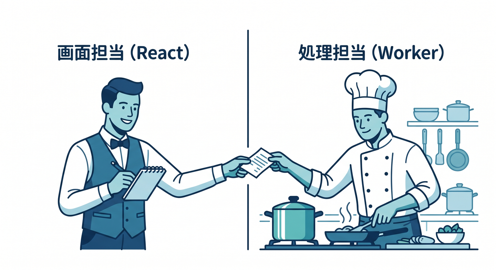
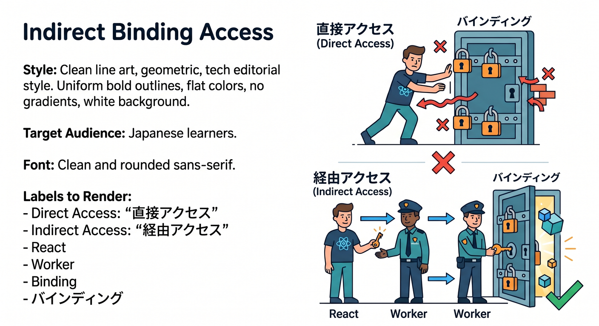
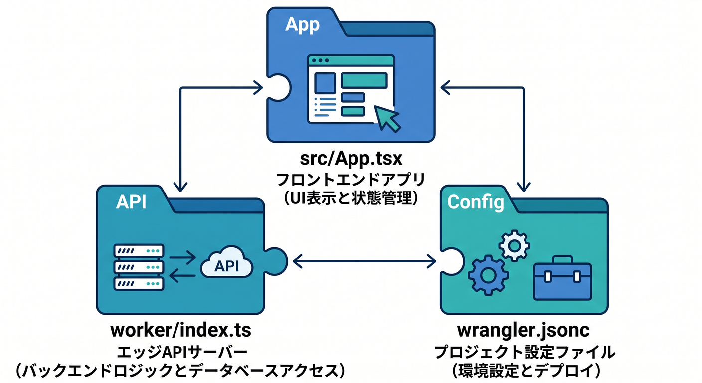
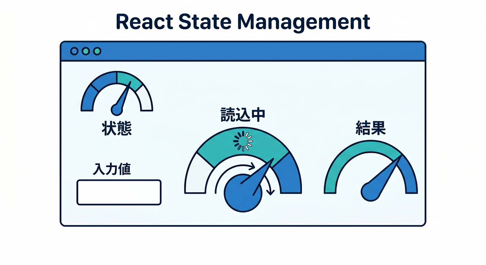
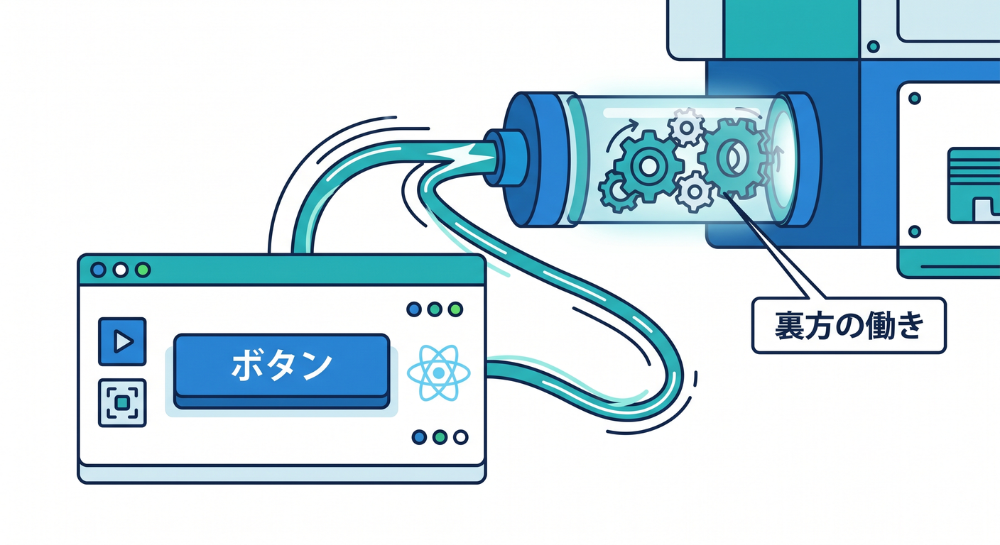
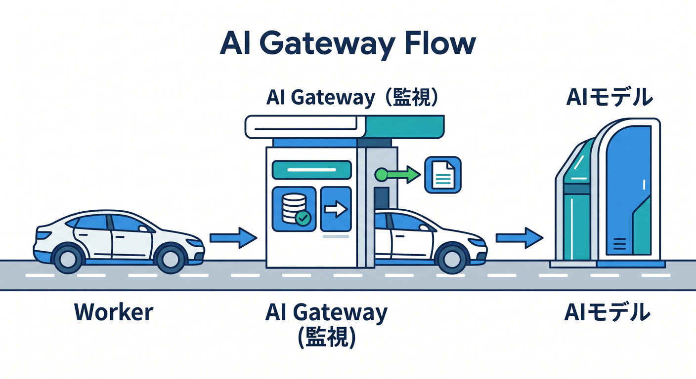

# 第09章：Reactとつないで“小さな画面付きアプリ”にしよう ⚛️🎨☁️

ここはかなり楽しい章です 😊
前の章までで「Worker が動く！」をつかめたので、ここからは **React の画面** をつないで、**入力 → 送信 → 結果表示** までをひとつの小さなアプリとして完成させます ✨

本日時点のCloudflare公式では、React学習の入口として **React SPA + Cloudflare Workers API + Cloudflare Vite plugin** をまとめて作る導線が用意されています。しかも Vite plugin は Worker のコードを `workerd` 上で動かし、ローカル開発を本番にかなり近い形で回せます。React側の最新ドキュメントも現在は **19.2** です。つまりこの章は、**Reactを重く学ぶ章ではなく、Cloudflareアプリに“画面”を付ける章**として進めるのがいちばん自然です。 ([Cloudflare Docs][1])

さらに今のCloudflareは、Vite plugin まわりで **React Router v7 の公式サポート** を出しており、2026年2月には **React Server Components 向けの連携改善** も入っています。とはいえ、この章ではそこへ深く入らず、まずは **SPA + Worker API** の形に絞るほうが学習効率がとてもいいです。 ([Cloudflare Docs][2])

---

## この章のゴール 🎯

この章が終わるころには、次のことができるようになるのが目標です 🌱

1. React の画面から Worker のAPIを呼べる
2. `useState` を使って、入力・読み込み中・結果表示を扱える
3. フロントとバックエンドの役割分担を説明できる
4. Cloudflareの binding は **Reactから直接ではなく Worker 経由** で使う感覚がわかる
5. 発展として **Workers AI** をつないで、AI付きミニアプリに育てられる

---

## この章で作るもの 🛠️✨

作るのは、こんな小さなアプリです 😊

* 画面にテキスト入力欄がある
* ボタンを押す
* React が Worker に `fetch()` する
* Worker が入力を受け取って返事を返す
* その返事を画面に表示する
* 発展版では Worker が **Workers AI** に聞いて、AIの返答を返す

この形ができると、ただの「Hello World」から一歩進んで、**“使えるアプリの最小形”** が見えてきます 🚀

---

## まず最初に頭へ入れたいこと 🧠💡

この章でいちばん大事なのは、**役割分担**です。

React は **画面担当** です。入力欄、ボタン、結果表示、読み込み中の表示、エラー表示などを受け持ちます。
Worker は **処理担当** です。リクエストを受けて、データを整え、必要なら Cloudflare の binding や AI を使います。



Cloudflare公式の React + Vite ガイドでも、`worker/index.ts` がバックエンド API、`src/App.tsx` がそのAPIを呼ぶ画面、という構成になっています。 ([Cloudflare Docs][1])

ここで特に重要なのが、**Reactアプリは Workers の binding に直接アクセスできない**、という点です。



binding は Worker 側で使い、React 側は Worker に `fetch()` して間接的に利用します。これは今後 D1、KV、R2、Workers AI を使うときにもずっと効いてくる大事な基本です。 ([Cloudflare Docs][1])

また、React を SPA として使う場合、Cloudflare 側では `not_found_handling = "single-page-application"` の考え方が重要です。React が担当する画面ルートは SPA 側へ回し、静的アセットに当たらないときだけ Worker を呼ぶ、という整理が入ります。C3 の React + Vite テンプレートでも、この考え方が前提になっています。 ([Cloudflare Docs][1])

---

## 章の進め方 📚⚡

この章は、次の順番で進めるとかなり理解しやすいです。

## 1. React プロジェクトをCloudflare流で作る

まずは C3 で React 用の土台を作ります。

```bash
npm create cloudflare@latest -- my-react-app --framework=react
cd my-react-app
npm run dev
```

Cloudflare公式の React + Vite ガイドでは、この作り方で **React SPA + Worker API + Cloudflare Vite plugin** をまとめて用意できます。ローカル起動は `npm run dev` が基本です。 ([Cloudflare Docs][1])

---

## 2. フォルダの見方を覚える 🗂️

この章では、最低でも次の3つを見られればOKです。

* `src/App.tsx` … 画面
* `worker/index.ts` … API
* `wrangler.jsonc` … Cloudflare設定



公式ガイドでも、`main` は `worker/index.ts` を指し、`src/App.tsx` がそのAPIを呼ぶ形になっています。`vite.config.ts` には Cloudflare Vite plugin が設定されていて、ローカルでも Workers runtime にかなり近い形で開発できます。 ([Cloudflare Docs][1])

---

## 3. まずは“非AI版”でつなぐ 🌐

いきなりAIへ行く前に、まずは **React → Worker → React** の往復だけを完成させます。
ここは絶対に飛ばさないほうがいいです 👍

`worker/index.ts` の例です。

```ts
export default {
  async fetch(request: Request): Promise<Response> {
    const url = new URL(request.url);

    if (url.pathname === "/api/message" && request.method === "POST") {
      const body = (await request.json()) as { text?: string };
      const text = body.text?.trim();

      if (!text) {
        return Response.json(
          { error: "文字を入力してください" },
          { status: 400 }
        );
      }

      return Response.json({
        message: `受け取りました ✨「${text}」ですね！`,
      });
    }

    return new Response("Not Found", { status: 404 });
  },
} satisfies ExportedHandler;
```

このコードでやっていることはとてもシンプルです 😊
React から送られてきた文字列を受け取り、空ならエラー、入っていれば JSON で返しています。第8章の `Request` / `Response` を、今度は **画面と接続した形** で使うわけです。

---

## 4. React 側に入力欄と表示欄を作る ⚛️🖼️

次に `src/App.tsx` 側です。

```tsx
import { useState } from "react";

export default function App() {
  const [text, setText] = useState("");
  const [result, setResult] = useState("");
  const [error, setError] = useState("");
  const [loading, setLoading] = useState(false);

  const sendMessage = async () => {
    setLoading(true);
    setError("");
    setResult("");

    try {
      const res = await fetch("/api/message", {
        method: "POST",
        headers: {
          "Content-Type": "application/json",
        },
        body: JSON.stringify({ text }),
      });

      const data = (await res.json()) as {
        message?: string;
        error?: string;
      };

      if (!res.ok) {
        throw new Error(data.error ?? "エラーが発生しました");
      }

      setResult(data.message ?? "");
    } catch (err) {
      setError(err instanceof Error ? err.message : "不明なエラーです");
    } finally {
      setLoading(false);
    }
  };

  return (
    <main style={{ maxWidth: 720, margin: "40px auto", padding: 16 }}>
      <h1>Cloudflare × React ミニアプリ ⚡</h1>

      <textarea
        value={text}
        onChange={(e) => setText(e.target.value)}
        rows={5}
        style={{ width: "100%", marginTop: 12 }}
        placeholder="ここに文字を入れてください"
      />

      <button
        onClick={sendMessage}
        disabled={loading}
        style={{ marginTop: 12, padding: "8px 16px" }}
      >
        {loading ? "送信中..." : "送信する"}
      </button>

      {error && (
        <p style={{ color: "crimson", marginTop: 16 }}>
          エラー 😢: {error}
        </p>
      )}

      {result && (
        <div style={{ marginTop: 16 }}>
          <h2>結果 🎉</h2>
          <p>{result}</p>
        </div>
      )}
    </main>
  );
}
```

この時点で、もう立派な「画面付きCloudflareアプリ」です 🌈
React 側では `useState` を使って、**入力値・結果・エラー・読み込み中** をそれぞれ分けて持っています。



ここは難しい状態管理を入れず、まずは **小さな state を丁寧に分ける** だけで十分です。

---

## ここで学んでほしい“実務っぽさ” 🧩

この章で急に実務っぽくなる理由は、**APIを呼ぶ理由が目に見える** からです。

第8章までは Worker 単体で完結していたので、「APIって何のためにあるの？」が少しぼんやりしがちです。
でも第9章では、ボタンを押した瞬間に **Worker が“画面の裏方”として働く** のが見えます 👀✨



この経験はかなり大きいです。
ここでフロントとバックの境界が見えると、あとで D1 や KV や AI を足すときも、頭の中がごちゃつきにくくなります。

---

## ここからAI版へ進化させる 🤖☁️

Cloudflareらしさをしっかり感じるなら、ここで **Workers AI** を足したいです。
Workers AI を Worker から使うには、`wrangler.jsonc` に AI binding を追加します。


Cloudflare公式では `ai.binding = "AI"` と設定すると、Worker 内で `env.AI` として使えます。 ([Cloudflare Docs][3])

たとえば `wrangler.jsonc` には、追加分としてこんな感じです。

```jsonc
{
  "ai": {
    "binding": "AI"
  }
}
```

Workers AI の公式ガイドでは、`env.AI.run("@cf/meta/llama-3.1-8b-instruct", { prompt: ... })` という形でモデルを呼び出せます。TypeScript 例では `AI: Ai` を `Env` に持たせる形も案内されています。 ([Cloudflare Docs][3])

AI版の `worker/index.ts` は、こんな形にできます。

```ts
export interface Env {
  AI: Ai;
}

export default {
  async fetch(request: Request, env: Env): Promise<Response> {
    const url = new URL(request.url);

    if (url.pathname === "/api/ai" && request.method === "POST") {
      const body = (await request.json()) as { prompt?: string };
      const prompt = body.prompt?.trim();

      if (!prompt) {
        return Response.json(
          { error: "質問を入力してください" },
          { status: 400 }
        );
      }

      const response = await env.AI.run("@cf/meta/llama-3.1-8b-instruct", {
        prompt,
      });

      return Response.json(response);
    }

    return new Response("Not Found", { status: 404 });
  },
} satisfies ExportedHandler<Env>;
```

React 側は `/api/message` の代わりに `/api/ai` を叩くだけです。
返ってくる JSON には `response` が入る形が公式チュートリアルでも示されています。 ([Cloudflare Docs][4])

ひとつだけ注意です ⚠️
Cloudflare公式では、**Workers AI はローカル開発中でもアカウントへアクセスし、利用料金が発生する** と案内されています。学習中は長文を何度も投げすぎず、まずは短い入力で試すのがおすすめです。 ([Cloudflare Docs][4])

---

## AI Gateway まで入れると、さらに“今どき”になる 🌟

AI付きミニアプリが動いたら、その次に相性がいいのが **AI Gateway** です。
AI Gateway は、Cloudflare公式いわく **analytics / logging / caching / rate limiting / retries / model fallback** などをまとめて扱える仕組みで、しかも「1行で始められる」と案内されています。 ([Cloudflare Docs][5])

つまりこの章の発展としては、

* React で入力
* Worker が Workers AI を呼ぶ
* AI Gateway で可視化・制御する



という流れまでつなげられます 🚀

さらに 2026年3月には、AI Gateway のログで **本文を保存せずメタデータだけ残す** ための `cf-aig-collect-log-payload: false` ヘッダーも案内されています。プロンプト本文を保存したくない場面ではかなり便利です。 ([Cloudflare Docs][6])

---

## GitHub Copilot の使いどころ 🤝🤖

この章は、Copilot がかなり活きます。

GitHub公式では、**edit mode** は「決まったファイルをピンポイントに直す」向け、**agent mode** は「複数ファイルにまたがる複雑な作業」向けとされています。しかも agent mode は、必要に応じて **MCP server など外部アプリとも連携** できます。VS Code でこの章を進めるなら、かなり相性がいいです。 ([GitHub Docs][7])

この章での使い分けは、こんな感じがおすすめです 😊

* `App.tsx` の見た目だけ少し直したい → **edit mode**
* `worker/index.ts` と `src/App.tsx` と `wrangler.jsonc` をまたいで変更したい → **agent mode**
* エラー原因を一緒に追いたい → Chat で説明させる

Cloudflare自身も、AI対応エディタとして **VS Code を含むエディタ群** を前提にした prompting ガイドを出しており、`cloudflare-docs` MCP と `cloudflare-observability` MCP を接続して、ドキュメント参照やログ確認に使う流れを案内しています。なので、**Copilot の agent mode + CloudflareのMCP系情報源** はかなり噛み合います。 ([Cloudflare Docs][8])

この章で Copilot に投げると強い指示の例は、こんな感じです ✍️

```text
worker/index.ts に POST /api/ai を追加して、
src/App.tsx から fetch する UI を作ってください。
Cloudflare Workers 前提で、Node.js 固有 API は使わず、
エラー時は JSON を返してください。
```

```text
App.tsx に loading / error / success の3状態を追加して、
初心者が読みやすい構成に整理してください。
```

```text
Cloudflare Workers の binding は React から直接使わず、
Worker 経由にする形へ修正してください。
```

---

## Pages はどう扱うの？ ☁️📄

この章は **Workersベース** で進めるのがおすすめです。理由は、React画面と Worker API と binding を、ひとつの流れで理解しやすいからです。Cloudflare公式にも **React + Vite on Workers** の導線があります。 ([Cloudflare Docs][1])

ただし、フロント中心で「まず静的サイトっぽく公開したい」なら **Pages** も選べます。Pages の React ガイドでは C3 で `--platform=pages` を付ける流れが案内されており、GitHub連携で push ごとに再ビルド・再デプロイ、さらに preview deployment まで使えます。Pages Functions は Workers の上で動きます。 ([Cloudflare Docs][9])

なので整理すると、

* **第9章の本筋** → Workers ベース
* **静的公開をラクに見せたい発展** → Pages

この分け方がきれいです 🌸

---

## この章の演習課題 🧪✨

最後に、教材として入れたい演習です。

## 演習1　まずは非AI版

入力した文章を Worker に送り、そのまま整形して返すアプリを作る。
目的は **React と Worker の往復** を体に入れることです。

## 演習2　エラー表示

空文字で送信したら、React 側に赤いエラーを出す。
目的は **`res.ok` とエラー処理** を覚えることです。

## 演習3　AI版へ拡張

Workers AI binding を追加し、入力した質問に AI が答える形へ広げる。
目的は **binding は Worker 側で使う** ことを実感することです。

## 演習4　見た目を少し整える

ボタンの無効化、送信中表示、結果カード表示を入れる。
目的は **React が“画面担当”であること** を強めることです。

## 演習5　Copilot で改善

Copilot に「ローディング中スピナーを入れて」「コードを関数ごとに整理して」と依頼してみる。
目的は **AIを“丸投げ”ではなく“改善相棒”として使う** 感覚をつかむことです。

---

## この章のまとめ 🎉

この章の本質は、Reactを詳しく覚えることではありません。
**Cloudflareアプリに“画面”を付けて、ユーザー操作とWorker処理をつなぐこと** が主役です。

ここで

* React は画面
* Worker は処理
* binding や AI は Worker 側
* React は `fetch()` でつなぐ

という形が腹に落ちると、次の章で外部ライブラリや Node互換の話へ進んでも、かなり迷いにくくなります 😊

この第9章は、教材全体の中でもかなり気持ちいい山場です ⚛️☁️✨
「Cloudflareって、ちゃんとアプリ作れるんだ！」が見える章にすると、とても強いです。

[1]: https://developers.cloudflare.com/workers/framework-guides/web-apps/react/ "React + Vite · Cloudflare Workers docs"
[2]: https://developers.cloudflare.com/workers/vite-plugin/ "Vite plugin · Cloudflare Workers docs"
[3]: https://developers.cloudflare.com/workers-ai/configuration/bindings/ "Workers Bindings · Cloudflare Workers AI docs"
[4]: https://developers.cloudflare.com/workers-ai/get-started/workers-wrangler/ "Get started - Workers and Wrangler · Cloudflare Workers AI docs"
[5]: https://developers.cloudflare.com/ai-gateway/ "Overview · Cloudflare AI Gateway docs"
[6]: https://developers.cloudflare.com/changelog/post/2026-03-17-collect-log-payload-header/ "Log AI Gateway request metadata without storing payloads · Changelog"
[7]: https://docs.github.com/en/copilot/get-started/features "GitHub Copilot features - GitHub Docs"
[8]: https://developers.cloudflare.com/workers/get-started/prompting/ "Prompting · Cloudflare Workers docs"
[9]: https://developers.cloudflare.com/pages/framework-guides/deploy-a-react-site/ "React · Cloudflare Pages docs"
