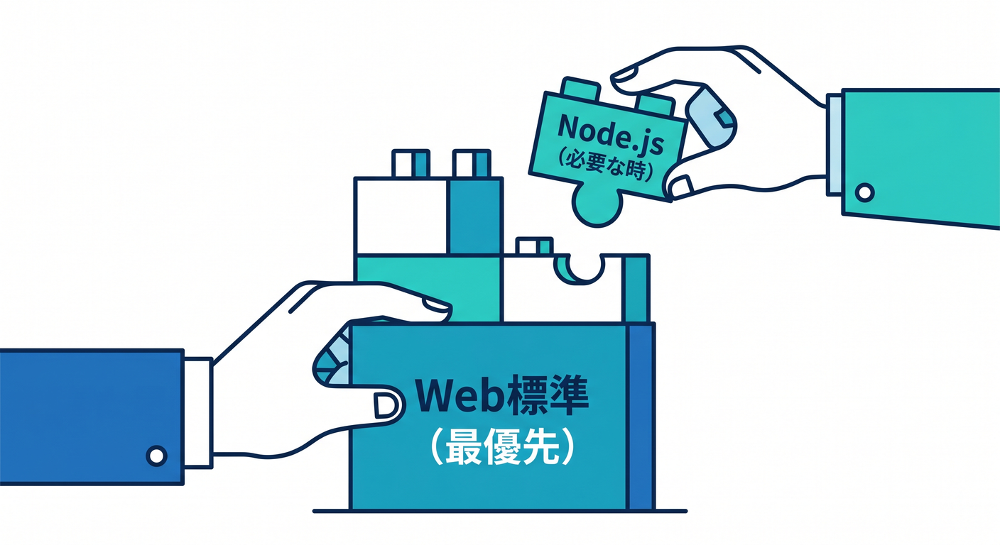
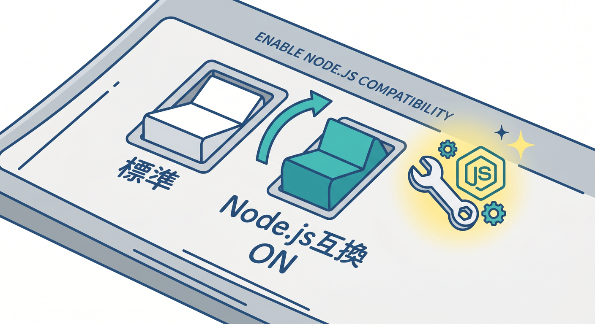
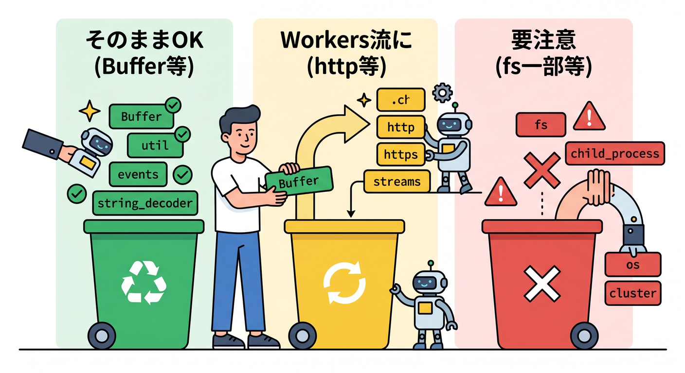
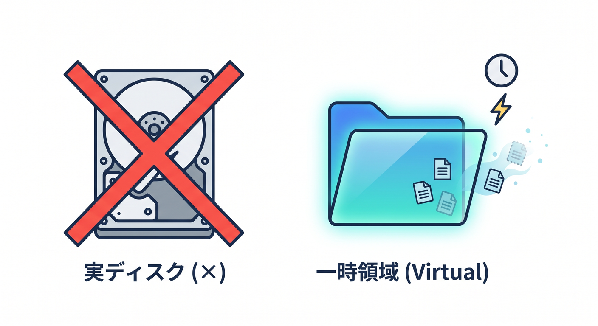
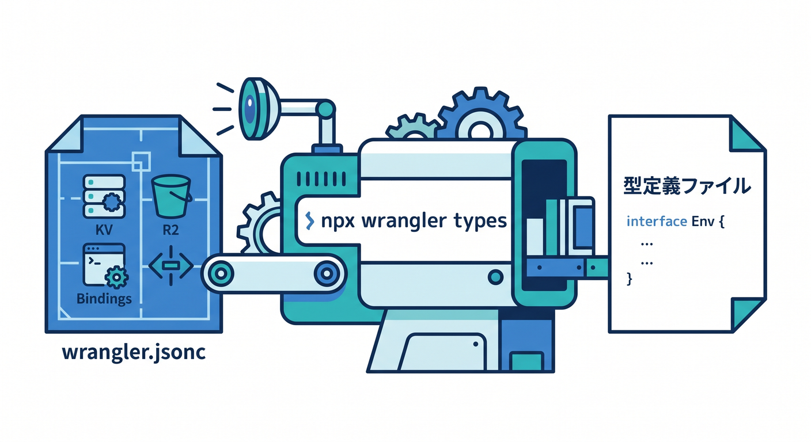

# 第10章：Node.js気分のまま書いていい範囲を知ろう 🧰🟢☁️

この章のテーマは、とても大事です 😊
Cloudflare Workers は **Node.js にかなり近づいてきた** のですが、**Node.js そのものではありません**。
なので学習のコツは、**「Nodeの知識を捨てる」ではなく、「Workers向けに補正する」** ことです。Workers runtime は V8 上で動き、できるだけ Web 標準 API を使う設計になっています。つまり基本姿勢は `fetch`、`Request`、`Response`、`URL`、Streams で、必要なところに Node.js 互換を足していくイメージです。 ([Cloudflare Docs][1])

この章を終えるころには、次の3つができるようになるのが目標です ✨
1つ目は、**「これは Node.js っぽくそのまま行ける」ものと「Workers流に考え直す」ものを見分けること**。
2つ目は、**`nodejs_compat` と `compatibility_date` の意味を理解して、自分で設定できること**。
3つ目は、**npm パッケージを使う前に、動きそうかどうかの当たりを付けられること**です。Cloudflare の互換機能は compatibility flag と compatibility date を軸に動いており、型生成もそこに連動します。 ([Cloudflare Docs][2])

---

## 1. まず結論です 🎯

初心者向けにひとことで言うと、こうです。

* **まずは Web API を第一候補にする** 🌐


* **Node.js API は「必要なときだけ」足す** 🔧
* **npm パッケージは、Node依存が強すぎないかを確認してから入れる** 📦
* **Cloudflare独自サービスへは bindings でつなぐ** ☁️

この順番で考えると、かなり迷いにくくなります。Workers は Web 標準寄りの runtime でありつつ、`nodejs_compat` で Node.js API のかなり広い範囲を使えるようになっています。さらに bindings は、REST API を叩くよりも制約が少なく、性能面でも有利な接続方法として案内されています。 ([Cloudflare Docs][3])

---

## 2. `nodejs_compat` は何をしてくれるの？ 🪄

`nodejs_compat` は、Cloudflare Workers で **Node.js built-in API と polyfill を有効にするための入口** です。


しかも現在の公式では、**`compatibility_date` が 2024-09-23 以降**なら、`nodejs_compat` を入れると **`nodejs_compat_v2` も自動的に有効**になります。v2 は互換性をさらに高めますが、そのぶん **bundle size は増えます**。 ([Cloudflare Docs][4])

さらに Cloudflare は、`compatibility_date` を「そのときの runtime 変更をどこまで取り込むか」の基準として使っています。新しい機能は新しい日付でしか使えないことがあり、逆に古い Worker を壊さないために、古い日付の挙動も保たれます。つまり、**日付はただの飾りではなく、runtime の仕様選択スイッチ**です。 ([Cloudflare Docs][5])


教材では、設定の中心は `wrangler.jsonc` で考えるのがいちばん自然です。Cloudflare は新規プロジェクトで `wrangler.jsonc` を推奨しており、新しめの機能の一部は JSON 設定前提です。 ([Cloudflare Docs][6])

### まずはこんな設定から始めると安心です 🧾

```json
{
  "name": "chapter10-nodeish-worker",
  "main": "src/index.ts",
  "compatibility_date": "2026-04-15",
  "compatibility_flags": ["nodejs_compat"],
  "ai": {
    "binding": "AI"
  }
}
```

この形なら、**Node.js 互換を有効化しつつ、Workers AI も同じ Worker から呼べる**状態を作れます。Workers AI は `ai` binding を `wrangler.jsonc` に追加し、コード側では `env.AI.run()` でモデル実行できます。 ([Cloudflare Docs][7])

---

## 3. どこまで Node.js 気分で書いていいの？ 🟢🟡🔴

ここは感覚で覚えるより、**ざっくり3色**で覚えるとラクです 😄


### 🟢 比較的そのまま入りやすいもの

`Buffer`、`Crypto`、`Path`、`Events`、`Streams`、`URL`、`Process`、`Zlib` などは、Workers runtime でサポート対象に入っています。`DNS`、`HTTP`、`HTTPS`、`net`、`fs` も現在はかなり前進しています。 ([Cloudflare Docs][4])

### 🟡 名前は使えるが、Workers流の理解が必要なもの

`http.get()` や `http.request()` は使えますが、Workers では **内部的に `fetch()` のラッパー**です。Node本家とまったく同じネットワークの感覚ではなく、対応していない request option もあります。だから教材では、**まずは `fetch()` を優先し、Node流の `http` は「既存コードを寄せるための橋」として扱う**のが分かりやすいです。 ([Cloudflare Docs][8])

### 🔴 まだ慎重に見たほうがいいもの

`child_process`、`cluster`、`readline`、`repl`、`udp/datagram`、`vm`、`async_hooks` の一部、Node の test runner などは、部分対応・非機能 stub・未対応が含まれます。**import できても、実際に呼ぶとダメ**というケースがあるので要注意です。Cloudflare の公式も、polyfill によって import 自体は通っても、呼び出し時に noop やエラーになる場合があると明記しています。 ([Cloudflare Docs][4])

---

## 4. 2026年のいちばん大事な考え方 💡

昔の感覚だと、「Workers は Node.js じゃないから npm はあまり使えないのでは？」と思いがちです。
でも今はそこがかなり変わっていて、Cloudflare 公式も **Node.js API の native support と polyfill により、既存 npm パッケージとの互換をできるだけ高める方向**で進めています。実際、Hyperdrive の公式 examples では `mysql2` のような Node.js 向けドライバを Workers から使う例まで案内されています。 ([Cloudflare Docs][4])

ただし、ここで大事なのは「Node.js パッケージなら全部同じように動く」と思わないことです。
**Cloudflare に合わせて動くように整えられた経路**を使うと成功率が上がります。たとえば DB なら Hyperdrive、AI なら AI binding、別 Worker 呼び出しなら Service bindings、外部 API なら `fetch()` です。Cloudflare はこうした bindings を、性能・制約の面で REST より有利な手段として位置づけています。 ([Cloudflare Docs][9])

---

## 5. `fs` が使えるからといって「サーバーのディスク」ではないよ 🗂️⚠️

ここ、誤解しやすいです 😅
今の Workers では `node:fs` も使えますが、これは **普通の Linux サーバーの実ディスクを触る感覚ではありません**。Cloudflare の公式では、Workers の `fs` は **virtual file system** と説明されています。`/bundle` は read-only、`/tmp` は書き込み可能ですが **リクエストごとに独立した一時領域**で、永続保存には使えません。 ([Cloudflare Docs][10])


つまり、
「設定ファイルやテンプレートを bundle から読む」📄
「一時ファイルをその場で作る」🧪
のような用途には向いていますが、
「サーバーのローカルディスクに保存し続ける」💾
の発想には向いていません。永続データは R2、D1、KV など別の Cloudflare ストレージで考えるべきです。bindings ベースで設計する発想が大事になります。 ([Cloudflare Docs][10])

---

## 6. サンプル：Node.js 互換と Workers AI を一緒に使う ✨🤖

ここでは「Node.js気分」と「Cloudflareらしさ」を1つにまとめた小さな例を見ます。
`Buffer` と `node:crypto` を使いながら、最後に Workers AI で要約を返す Worker です。`env.AI.run()` は Workers AI binding の基本形です。 ([Cloudflare Docs][11])

```ts
import { Buffer } from "node:buffer";
import { createHash } from "node:crypto";

export interface Env {
  AI: Ai;
}

export default {
  async fetch(request: Request, env: Env): Promise<Response> {
    const url = new URL(request.url);
    const text = url.searchParams.get("text") ?? "Cloudflare Workers is not plain Node.js.";

    const sha256 = createHash("sha256").update(text).digest("hex");
    const base64 = Buffer.from(text, "utf8").toString("base64");

    const aiResult = await env.AI.run("@cf/meta/llama-3.1-8b-instruct", {
      prompt: `次の文章を1文でやさしく要約してください: ${text}`
    });

    return Response.json({
      original: text,
      sha256,
      base64,
      summary: aiResult
    });
  }
};
```

この例のポイントは3つです 😊
まず、**Node.js built-in API をそのまま使う部分**として `Buffer` と `node:crypto` を入れています。次に、**Worker の本筋は Web API**なので、入口は `fetch()` handler と `Request` / `Response` です。最後に、**AI は Cloudflare binding でつなぐ**ので、外部 SDK を大量に抱え込まずに Worker 内へ自然に組み込めます。 ([Cloudflare Docs][4])

---

## 7. 型は手書きで頑張りすぎないで、`wrangler types` を使おう 🔷

Cloudflare 学習でかなり重要なのがここです。
Workers の型は、**binding・compatibility date・compatibility flags** によって変わります。つまり、`nodejs_compat` を入れたか、`nodejs_als` を入れたか、AI binding があるかで、正しい型が変わります。なので公式は **`npx wrangler types` で実際の設定に合った型を生成する**流れを推奨しています。


さらに `nodejs_compat` を使うなら `@types/node` も入れるよう案内されています。 ([Cloudflare Docs][12])

```bash
npm install -D @types/node
npx wrangler types
```

`tsconfig.json` には生成された型ファイルを追加します 🛠️

```json
{
  "compilerOptions": {
    "types": ["./worker-configuration.d.ts"]
  }
}
```

これをやっておくと、Copilot の提案もかなり安定します。なぜなら、IDE が **「この Worker に本当にある API」** を把握しやすくなるからです。 ([Cloudflare Docs][12])

---

## 8. `fetch` と `node:http`、どっちを使えばいいの？ 🌐➡️📨

答えはシンプルです。**新規コードならまず `fetch`** です 👍
Cloudflare 自身も、外部 API 連携は `fetch()` を基本として案内しています。しかも Workers の `http.get()` / `http.request()` は、内部的には `fetch()` ラッパーです。なので「Nodeらしく書ける」ことと、「それが最も自然」というのは別問題です。 ([Cloudflare Docs][13])

ただし、既存の Node コード資産を少しずつ移したいときには `node:http` / `node:https` の互換が役立ちます。さらに今の docs では `http.createServer()` や `https.createServer()` 系まで入ってきていますが、互換 flag や動きの差分があるので、初心者学習では **“使えることを知る” まで**にして、日常の基本は `fetch` で進むのが安全です。 ([Cloudflare Docs][8])

---

## 9. npm パッケージを入れる前の見極めチェック ✅📦

パッケージを追加するときは、次の順で見ると失敗しにくいです。

* **そのパッケージは何の API に依存していそうか？**
  Node.js API への依存が強いなら、まず Cloudflare の Node.js compatibility ページで対応状況を見る。対応・部分対応・未対応が分かれています。 ([Cloudflare Docs][4])

* **Cloudflare 公式の“そのまま使う経路”があるか？**
  たとえば DB 接続なら Hyperdrive examples があり、`mysql2` の実例も公開されています。 ([Cloudflare Docs][9])

* **Cloudflare binding に寄せられないか？**
  AI は `env.AI.run()`、内部サービスは Service bindings、Cloudflare資源は各種 bindings が基本です。 ([Cloudflare Docs][11])

この見方ができると、
「このライブラリ、たぶん行ける 😊」
「これは import は通っても実行で怪しい 😅」
の勘が育ってきます。

---

## 10. GitHub Copilot はどう使うと効果的？ 🤖💬

この章では、Copilot を **“自動生成マシン” ではなく、“互換性チェックの相棒”** として使うのがとても良いです。GitHub 公式では、Copilot の agent mode は MCP と組み合わせることで外部リソースにアクセスしながら多段の作業を進められると説明しています。企業・組織では MCP 利用がポリシーで制御されることもあります。 ([GitHub Docs][14])

また Cloudflare は、AI ツール向けに **Workers の API や best practices を与えるための“ベースプロンプト”** まで公式に公開しています。教材では、Copilot Chat に対しても次のような聞き方を徹底すると精度が上がります ✨ ([Cloudflare Docs][15])

* 「これは plain Node.js ではなく Cloudflare Workers で動かします」
* 「`fetch` / `Request` / `Response` を優先してください」
* 「必要なら `nodejs_compat` を前提にして、使う API が supported か確認してください」
* 「npm パッケージが動く前提を説明してからコードを書いてください」
* 「Workers AI binding を使って、外部 SDK を増やしすぎない構成にしてください」

この聞き方をすると、Copilot が Node.js 前提でズレた提案を出す率をかなり下げられます 😊


---

## 11. Cloudflare AI をここで絡める意味 🤖☁️

第10章で AI を絡める意味は大きいです。
なぜなら、Node.js 出身の人は「AI を使うならまず外部 SDK を入れる」と考えがちですが、Cloudflare では **Workers AI binding を使うと Worker 内で直接モデル実行**できます。しかも AI Gateway 経由なら、キャッシュや観測も載せられます。 ([Cloudflare Docs][11])

さらに、Workers AI には **OpenAI-compatible endpoint** もあります。なので、既存の Node.js 的な「chat completions / embeddings」の考え方から入りたい人にも、頭の切り替えがしやすいです。つまりこの章では、**Node.js の慣れた感覚を入口にしつつ、Cloudflare流の binding 設計へ移す**という橋渡しができます。 ([Cloudflare Docs][16])

---

## 12. この章でよくあるつまずき 😵‍💫

### つまずき1：import は通ったのに実行で落ちる

これはかなり典型です。Cloudflare 公式も、polyfill により import はできても、実際のメソッド呼び出しで noop や error になる場合があると説明しています。**「import できた = 完全対応」ではありません。** ([Cloudflare Docs][4])

### つまずき2：`compatibility_date` を古いままにしている

古い日付だと、新しい互換や自動有効化される flag が入らず、「docs の通りにやったのに違う」が起きやすいです。Cloudflare は current date を使い、更新時はテストしながら追随することを勧めています。 ([Cloudflare Docs][5])

### つまずき3：型がズレている

`wrangler types` を回していないと、IDE はその Worker の本当の runtime 条件を知りません。Node互換や bindings を変えたら型も更新、が基本です。 ([Cloudflare Docs][12])

### つまずき4：`fs` を永続保存だと思っている

Workers の `fs` は virtual file system で、`/tmp` は request ごとの一時領域です。永続化用途ではありません。 ([Cloudflare Docs][10])

---

## 13. この章のミニ演習 🏃‍♂️💨

### 演習A：Buffer と hash を返す Worker を作る

クエリ文字列 `?text=...` を受け取って、`base64` と `sha256` を JSON で返してみましょう。
目的は、**Node.js built-in API を Workers で使う最小成功体験**です。`Buffer` と `node:crypto` はサポート対象です。 ([Cloudflare Docs][4])

### 演習B：`fetch` 版と `node:http` 版を両方書く

同じ外部 API 呼び出しを、`fetch` と `http.get()` で2通り作って比べてみましょう。
目的は、**「動く」と「自然」は別だと体感すること**です。`http.get()` は wrapper ですが、基本思想は `fetch` 側にあります。 ([Cloudflare Docs][8])

### 演習C：Workers AI を1本足す

演習Aで受け取った `text` を `env.AI.run()` に渡して、1文要約を返してみましょう。
目的は、**Node.js的な文字列処理と Cloudflare AI binding を同じ Worker に載せる感覚**をつかむことです。 ([Cloudflare Docs][11])

---

## 14. この章のまとめ 🌈

この章のいちばん大事なメッセージは、これです。

**Cloudflare Workers は、Node.js をかなり使える。
でも、考え方の中心は今でも Web API と Cloudflare bindings。** ([Cloudflare Docs][1])

だから実務感覚では、

* まず `fetch` / `Request` / `Response` で考える 🌐
* 足りないところに `nodejs_compat` を足す 🔧
* npm パッケージは compatibility を見て選ぶ 📦
* AI や DB や内部連携は Cloudflare の bindings に寄せる ☁️
* 型は `wrangler types` で runtime に合わせる 🔷
* Copilot には「Workers前提」で聞く 🤖

この流れがいちばん強いです。
ここを押さえると、第11章の secrets や、第12章のデバッグ、第15章の AI 活用まで、かなりスムーズにつながります 🚀✨

次はこのまま、**第10章を教材ページとしてそのまま使える「学習目標・本文・演習・確認問題つきの完成版」** に整えます。

[1]: https://developers.cloudflare.com/workers/reference/how-workers-works/ "How Workers works · Cloudflare Workers docs"
[2]: https://developers.cloudflare.com/workers/configuration/compatibility-flags/ "Compatibility flags · Cloudflare Workers docs"
[3]: https://developers.cloudflare.com/workers/runtime-apis/?utm_source=chatgpt.com "Runtime APIs - Workers"
[4]: https://developers.cloudflare.com/workers/runtime-apis/nodejs/ "Node.js compatibility · Cloudflare Workers docs"
[5]: https://developers.cloudflare.com/workers/configuration/compatibility-dates/ "Compatibility dates · Cloudflare Workers docs"
[6]: https://developers.cloudflare.com/workers/wrangler/configuration/ "Configuration - Wrangler · Cloudflare Workers docs"
[7]: https://developers.cloudflare.com/workers-ai/get-started/workers-wrangler/ "Get started - Workers and Wrangler · Cloudflare Workers AI docs"
[8]: https://developers.cloudflare.com/workers/runtime-apis/nodejs/http/ "http · Cloudflare Workers docs"
[9]: https://developers.cloudflare.com/hyperdrive/examples/connect-to-mysql/mysql-drivers-and-libraries/mysql2/ "mysql2 · Cloudflare Hyperdrive docs"
[10]: https://developers.cloudflare.com/workers/runtime-apis/nodejs/fs/ "fs · Cloudflare Workers docs"
[11]: https://developers.cloudflare.com/workers-ai/configuration/bindings/ "Workers Bindings · Cloudflare Workers AI docs"
[12]: https://developers.cloudflare.com/workers/languages/typescript/ "Write Cloudflare Workers in TypeScript · Cloudflare Workers docs"
[13]: https://developers.cloudflare.com/workers/configuration/integrations/apis/?utm_source=chatgpt.com "APIs - Workers"
[14]: https://docs.github.com/en/copilot/tutorials/enhance-agent-mode-with-mcp "Enhancing GitHub Copilot agent mode with MCP - GitHub Docs"
[15]: https://developers.cloudflare.com/workers/get-started/prompting/ "Prompting · Cloudflare Workers docs"
[16]: https://developers.cloudflare.com/ai-gateway/usage/providers/workersai/ "Workers AI · Cloudflare AI Gateway docs"
