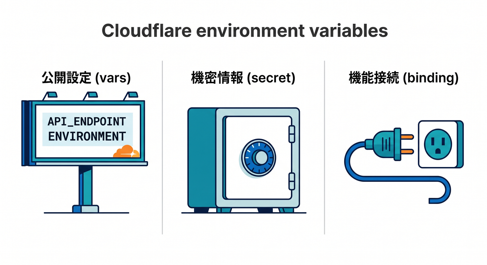
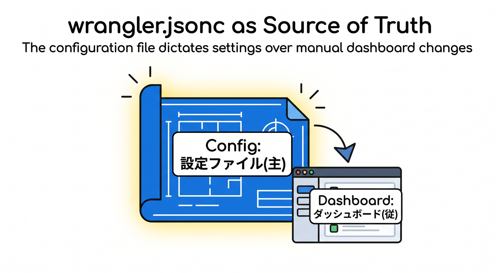
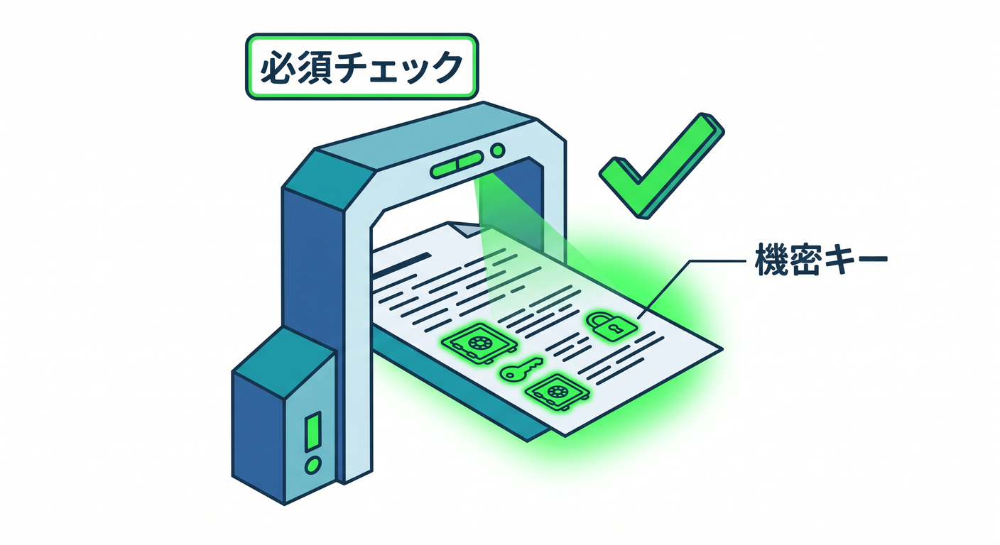
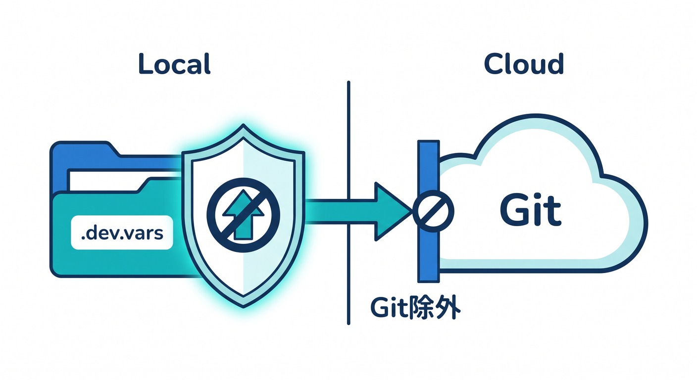
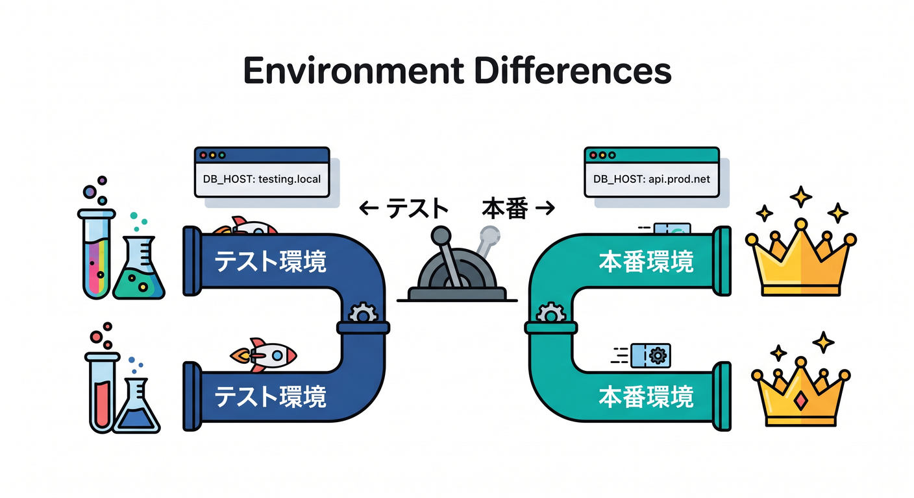
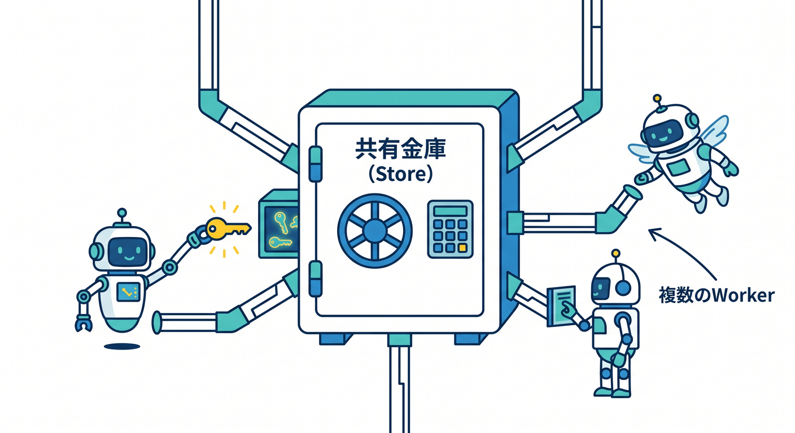
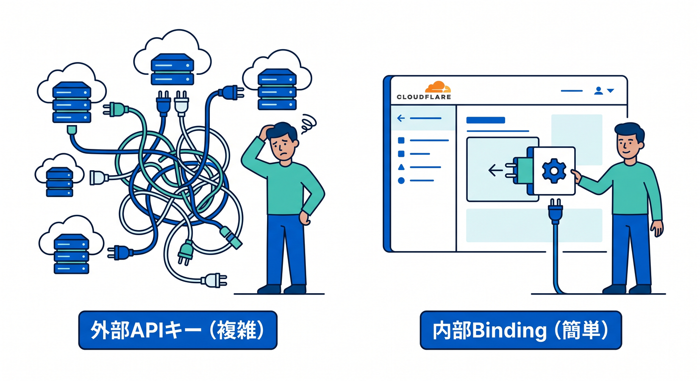

# 第11章：設定・環境変数・Secretsをきちんと扱おう 🔐🧪☁️

この章では、Cloudflare開発でありがちな「動いたけど、設定の置き場が危ない😇」を卒業します。
特に今の Cloudflare では、`vars`、`secrets`、`bindings`、`Secrets Store`、`wrangler.jsonc`、型生成がかなりきれいにつながるようになっていて、2026年3月には `secrets.required` を設定ファイルへ書けるようになりました。これにより、ローカル開発・デプロイ前チェック・型生成の3つを1本の流れで扱いやすくなっています。 ([Cloudflare Docs][1])

---

## この章のゴール 🎯

この章を終えるころには、こんな状態を目指します ✨

* 公開してよい設定と、絶対に隠すべき値を分けられる
* `wrangler.jsonc` のどこに何を書くか迷いにくくなる
* ローカル用の `.dev.vars` / `.env` と、本番用の secret の役割がわかる
* `staging` と `production` の差分を安全に持てる
* Workers AI や AI Gateway を使うときも、設定をぐちゃぐちゃにしない
* Copilot に「設定を安全に整理させる」頼み方がわかる

---

## 1. まずは用語を頭の中で整理しよう 🧭

Cloudflare Workers では、設定はだいたい `env` オブジェクトに集まります。
その中でも、**平文でよい設定**は environment variables、**隠すべき設定**は secrets、**Cloudflare の機能そのものにつなぐ窓口**は bindings、と考えるとかなり整理しやすいです。Cloudflare 公式でも、environment variables は「文字列や JSON の設定値」、secrets は「暗号化された機密値」、bindings は AI・KV・R2・Secrets Store などの各種リソースへつなぐ仕組みとして案内されています。 ([Cloudflare Docs][2])

かんたんに言うと、こんな感じです 😊

* `vars` … APIのベースURL、機能フラグ、公開してよい設定値
* `secret` … APIキー、トークン、接続パスワード
* `binding` … `env.AI`、`env.DB`、`env.MY_BUCKET` のような「Cloudflare機能への入口」
* `Secrets Store` … Workerごとではなく、**アカウント単位で再利用したい秘密情報**の保管場所

この区別がつくと、後の章で D1・R2・AI・Queues が出てきても、「あ、これも binding なんだな」と自然につながります。 ([Cloudflare Docs][3])


---

## 2. `vars` と `secrets` の違いを、最初にハッキリさせよう 🔍

Environment variables は `env` から使える設定値ですが、**暗号化されない平文の設定**です。文字列や JSON を入れられるので便利ですが、機密情報を置く場所ではありません。Cloudflare 公式も「機密情報に plaintext environment variables を使わないこと」「`vars` に機密情報を入れず secrets を使うこと」をはっきり案内しています。 ([Cloudflare Docs][2])

Secrets は、同じく Worker からは environment variable のように見えますが、**値が Wrangler やダッシュボード上で見えない**形で扱われます。Worker のコードから見ると `env.MY_SECRET` のように使えるので、書き心地はほぼ同じです。違うのは「見えてよい値か、見えてはいけない値か」です。 ([Cloudflare Docs][4])

なので、迷ったときの基準はすごく単純です ✍️

* ユーザーに見えても困らない → `vars`
* GitHub に流出したら困る → `secret`
* Cloudflare の機能やデータベースそのものに接続する → `binding`

---

## 3. `wrangler.jsonc` は“設定の本拠地”として使おう 🏠

Wrangler の設定ファイルは、今の Cloudflare 開発ではかなり大事です。
Cloudflare は、**Wrangler の設定を source of truth として扱う**ことを推奨していて、ダッシュボードで後から値を変える運用より、設定ファイルを基準にする運用を勧めています。さらに、新しい Wrangler 機能の一部は JSON 形式の設定で先に使えるようになっています。 ([Cloudflare Docs][5])

たとえば、第11章ではこんな形がきれいです 👇

```json
{
  "$schema": "./node_modules/wrangler/config-schema.json",
  "name": "chapter11-secret-demo",
  "main": "src/index.ts",
  "compatibility_date": "2026-04-15",

  "vars": {
    "APP_NAME": "Secret Demo",
    "PUBLIC_API_BASE": "https://api.example.com"
  },

  "secrets": {
    "required": ["ADMIN_BEARER", "EXTERNAL_API_KEY"]
  },

  "ai": {
    "binding": "AI"
  },

  "env": {
    "staging": {
      "vars": {
        "PUBLIC_API_BASE": "https://staging-api.example.com"
      }
    },
    "production": {
      "vars": {
        "PUBLIC_API_BASE": "https://api.example.com"
      }
    }
  }
}
```

この形のポイントは3つです 😊
1つ目は `vars` に公開設定だけを入れること。
2つ目は `secrets.required` で「この Worker はこの secret がないと困る」と宣言すること。
3つ目は `env.staging` / `env.production` に環境差分を書くことです。`vars` のような bindings は **non-inheritable** なので、環境ごとに明示的に書く必要があります。 ([Cloudflare Docs][1])


---

## 4. `secrets.required` は今の第11章の主役 🌟

2026年3月から、Cloudflare では `wrangler.jsonc` に **required secret names** を書けるようになりました。これで、必要な secret 名を設定ファイル側に宣言でき、**ローカル開発時と deploy 時に検証され、型生成の source of truth としても使われる**ようになっています。これはかなり大きい進化です。 ([Cloudflare Docs][1])

この機能のうれしいところは、ただの「メモ」ではない点です 🎉

* 開発中に「あ、この secret 足りない」を早めに気づける
* チームで「必要な secret 名」が共有しやすい
* 型生成とつながるので、`env.ADMIN_BEARER` みたいな値の存在をコード側でも扱いやすい

第11章では、ここを「安全性アップ機能」としてだけでなく、**設定をコードベースに寄せるための設計機能**として教えると、とても実践的です。 ([Cloudflare Docs][1])


---

## 5. ローカル開発では `.dev.vars` か `.env` を使う 🧪💻

ローカルで secrets を試すときは、Cloudflare 公式は **`.dev.vars` または `.env` を同じ階層に置く**方法を案内しています。大事なのは、**両方を混ぜない**ことです。`.dev.vars` が存在すると `.env` 側は `env` オブジェクトに読み込まれません。さらに、これらのファイルは Git にコミットしないよう `.gitignore` に入れる必要があります。 ([Cloudflare Docs][4])

たとえばこんな感じです 👇

```dotenv
ADMIN_BEARER="super-secret-token"
EXTERNAL_API_KEY="very-secret-key"
```

そして `.gitignore` には、少なくともこれを入れておくと安心です 👇

```gitignore
.dev.vars*
.env*
```

Cloudflare 公式は、環境別のローカル secrets として `.dev.vars.<environment-name>` や `.env.<environment-name>` もサポートしています。
ただし挙動が少し違って、`.dev.vars.staging` がある場合は **そのファイルだけ**が読み込まれ、通常の `.dev.vars` は読み込まれません。一方 `.env` 系は複数ファイルがマージされ、より具体的なファイルが優先されます。ここは初心者がつまずきやすいので、教材ではかなり丁寧に扱う価値があります。 ([Cloudflare Docs][4])


---

## 6. 環境ごとの差分は「気合い」ではなく「設計」で分けよう 🧱

Cloudflare の environments では、同じ Worker に対して `staging` と `production` のような差分設定を持てます。
ただし、`vars` のような bindings は **継承されません**。つまり、「上に書いてあるから下でも使えるだろう」と思っているとハマります。教材ではここを「Cloudflare は環境ごとの差分を明示的に書かせる」と覚えてもらうとわかりやすいです。 ([Cloudflare Docs][2])

また、Cloudflare Vite plugin を使う場合は、環境選択が `--env` ではなく `CLOUDFLARE_ENV` になる、という今どきの注意点もあります。前の章までで Vite ベースの流れを扱っているなら、第11章でもここを軽くつないでおくと受講者が迷いにくいです。 ([Cloudflare Docs][6])


---

## 7. Worker の中では `env` をどう使うの？ 🤔

Worker 内では、基本は `fetch(request, env)` の `env` パラメータから設定を読みます。
さらに Cloudflare は、`cloudflare:workers` から `env` を import して、リクエストハンドラの外でも使える形を案内しています。トップレベルで API クライアントを初期化したいときなどに便利です。 ([Cloudflare Docs][4])

たとえばこんなイメージです 👇

```ts
import { env } from "cloudflare:workers";

const apiBase = env.PUBLIC_API_BASE;

export default {
  async fetch(): Promise<Response> {
    return new Response(`API base is ${apiBase}`);
  }
};
```

Node.js 互換を有効にしている Worker では、`process.env` 経由でも environment variables と secrets にアクセスできます。しかも `nodejs_compat_populate_process_env` は、compatibility date が 2025-04-01 以降なら既定で有効です。Node 気分のライブラリを混ぜるときは助かりますが、第11章では「Cloudflare ではまず `env` を基本に考え、必要なら `process.env` も使える」と教えるのが安全です。 ([Cloudflare Docs][2])

---

## 8. Secret を本番へ入れる方法も知っておこう 🚀

本番 Worker に secret を入れる基本コマンドは `wrangler secret put` です。
このコマンドは **Worker の新しい version を作って、そのまま即デプロイ**します。もし段階的デプロイや version 運用をしているなら、`wrangler versions secret put` を使うと「新しい version だけ作る」流れにできます。 ([Cloudflare Docs][4])

複数の secrets をまとめて入れたいときは `wrangler secret bulk` が使えます。
JSON ファイルや `.env` 形式のファイル、あるいは stdin からまとめて投入できます。Pages プロジェクトにも `pages secret put` / `pages secret bulk` / `pages secret list` があります。 ([Cloudflare Docs][7])

ここで初心者に伝えたいコツはひとつです ✨
**「手で 1 個ずつ入れる」だけで終わらず、どの secret 名が必要かは `wrangler.jsonc` に宣言し、値の投入は CLI で管理する**。これがいちばん散らかりにくいです。 ([Cloudflare Docs][1])

---

## 9. ダッシュボードで直接いじる運用は、ほどほどにしよう ⚠️

Cloudflare は、Wrangler の設定を source of truth にすることを推奨しています。
実際、ダッシュボードで environment variables を変えても、次回の deploy で Wrangler 側の設定に上書きされることがあります。これを避けたいときは `--keep-vars` を使えますが、教材としては「基本は設定ファイルを正とする」のほうがわかりやすいです。なお、secrets は deploy で削除されません。 ([Cloudflare Docs][7])

この章では、「ダッシュボードは確認や一時操作には便利。でも、継続運用はコード側に寄せる」が基本姿勢だよ、と教えるのがちょうどいいです 😊

---

## 10. さらに一歩進むなら `Secrets Store` を知ろう 🗝️🏦

通常の secrets は **Worker 単位**です。
一方で、Cloudflare Secrets Store は **アカウント単位で再利用する秘密情報**を扱う仕組みです。Worker には `secrets_store_secrets` binding として接続し、コード側では `env` 上の binding に対して `get()` を呼んで取り出します。 ([Cloudflare Docs][8])

たとえば概念的にはこんな感じです 👇

```json
{
  "secrets_store_secrets": [
    {
      "binding": "PAYMENT_API_KEY",
      "store_id": "your-store-id",
      "secret_name": "payment-api-key"
    }
  ]
}
```

これを使うと、複数 Worker で同じ機密値を再利用しやすくなります。
ただし今の Secrets Store は **open beta** で、**1アカウントにつき1つの store** という制限があります。また、ローカル開発では本番側の store secret は直接読めず、ローカル用に `secrets-store secret` コマンドを `--remote` なしで使う必要があります。 ([Cloudflare Docs][9])


---

## 11. Cloudflare AI を使うと、設定設計がむしろラクになる場面がある 🤖☁️

Cloudflare AI 系をこの章にちゃんと絡めると、とても今っぽい教材になります。
Workers AI は `wrangler.jsonc` に `ai` binding を書くことで `env.AI` から使えます。つまり、Cloudflare 内の AI を使う基本ルートでは、「まず binding を生やす」という発想になります。 ([Cloudflare Docs][10])

```json
{
  "ai": {
    "binding": "AI"
  }
}
```

```ts
export default {
  async fetch(request: Request, env: Env): Promise<Response> {
    const result = await env.AI.run("@cf/meta/llama-3.1-8b-instruct", {
      prompt: "こんにちはを英語でやさしく言い換えて"
    });

    return Response.json(result);
  }
} satisfies ExportedHandler<Env>;
```

Workers AI は `env.AI.run()` でモデルを実行でき、AI Gateway を組み合わせると analytics・caching・security を追加できます。AI Gateway 側では Workers AI を OpenAI 互換 endpoint でも扱えますし、binding 経由で `gateway.id` などを指定して使う方法も公式に案内されています。 ([Cloudflare Docs][10])

ここが教材としておもしろいところです 💡
**外部の LLM API を直にたたく構成だと、外部プロバイダの API キーを secret で持つ必要が出やすい**です。
でも **Workers AI + `env.AI` binding** に寄せる構成なら、少なくとも基本の推論処理では「まず Cloudflare binding でつなぐ」考え方にできるので、設定設計がシンプルになりやすいです。これは Cloudflare AI を学ぶ価値のひとつとして、第11章で軽く触れると刺さります。 ([Cloudflare Docs][10])


---

## 12. この章のミニ実践例 🍰

第11章の練習題材は、こんな小さな API がちょうどいいです。

## お題

「管理用の Bearer トークンを secret で守りつつ、Workers AI に翻訳させる API を作る」

## 学べること

* `vars` に公開設定を置く
* `secrets.required` を書く
* ローカルで `.dev.vars` を使う
* `env.ADMIN_BEARER` で簡単な認可を入れる
* `env.AI.run()` を使って AI 処理を動かす

たとえばこんな形です 👇

```ts
export interface Env {
  APP_NAME: string;
  ADMIN_BEARER: string;
  AI: Ai;
}

export default {
  async fetch(request: Request, env: Env): Promise<Response> {
    const auth = request.headers.get("authorization");

    if (auth !== `Bearer ${env.ADMIN_BEARER}`) {
      return new Response("Unauthorized", { status: 401 });
    }

    const body = await request.json<{ text?: string }>();
    const text = body.text ?? "";

    const result = await env.AI.run("@cf/meta/llama-3.1-8b-instruct", {
      prompt: `Translate this into simple English:\n${text}`
    });

    return Response.json({
      app: env.APP_NAME,
      result
    });
  }
} satisfies ExportedHandler<Env>;
```

この例の良さは、「Chapter 11 の全部が1本に入っている」ことです。
`APP_NAME` は `vars`、`ADMIN_BEARER` は secret、`AI` は binding。役割分担がすごく見えやすいです。 ([Cloudflare Docs][2])

---

## 13. GitHub Copilot は、この章では“整理役”として使うと強い 🧠✨

今の GitHub Copilot は、VS Code で Ask / Plan / Agent mode を使い分けられます。
Agent mode では、複数ファイルの編集やターミナルコマンド提案まで含む複雑なタスクを進められ、MCP 連携が必要な外部アプリ統合にも向いています。GitHub 公式も、IDE での Agent mode と MCP の組み合わせをかなり明確に案内しています。 ([GitHub Docs][11])

第11章では、Copilot は「全部書かせる相棒」より、**設定を安全に整理させる相棒**として使うのが特に相性いいです 😊

おすすめの使い方はこの3つです。

## Ask mode 向け

* 「この `wrangler.jsonc` の値を、`vars` と `secret` に分けて説明して」
* 「この Worker で Git に入れてはいけないファイルを洗い出して」

## Plan mode 向け

* 「ハードコードされた API キーを secrets 化する手順を、`wrangler.jsonc`、`.dev.vars`、本番投入まで段階で書いて」

## Agent mode 向け

* 「このプロジェクトから直書きトークンを探して、`secrets.required` と `wrangler secret put` 前提の構成へリファクタして」
* 「Workers AI binding を導入して、外部 LLM 依存を減らせる部分を提案して」

GitHub 公式ドキュメントでは、VS Code 上の Copilot Agent はファイル編集、ターミナルコマンド、複数ステップの自律実行を扱えます。VS Code 向けの GitHub Copilot 拡張の説明でも、agent が end-to-end で編集・コマンド実行・自己修正を行う流れが案内されています。 ([GitHub Docs][11])

---

## 14. Cloudflare と Copilot の“つなぎ方”は、いまは MCP が本命寄り 🔌🤖

Cloudflare 側は 2026年時点で、**managed remote MCP servers** を公式提供しています。
Cloudflare API 全体へアクセスできる MCP server もあり、OAuth 経由で接続し、設定読み取りや提案、変更まで可能です。Cloudflare 公式はこれを Claude や Windsurf、AI Playground、MCP 対応 SDK/クライアント向けに案内しています。 ([Cloudflare Docs][12])

一方 GitHub Copilot 側は、公式に MCP をサポートしていて、Agent mode で外部アプリ連携に使えると明言しています。
なので、**VS Code + Copilot + MCP で Cloudflare 情報へつなぐ**のが、今かなり自然な考え方です。 ([GitHub Docs][13])

ここでひとつ大事な観察があります 👀
今回の公式調査では、**Cloudflare 専用の GitHub Copilot 拡張**を Cloudflare 公式の主導線としては確認できませんでした。
その代わり、Cloudflare 公式は **Cloudflare 自前の MCP servers** と、一部エージェント向けの **Cloudflare Skills plugin** を案内しています。つまり現状の教材としては、「Cloudflare 専用 Copilot 拡張を探す」よりも、「Copilot の Agent/MCP 機能で Cloudflare 文脈を取り込む」と教えるほうが実態に合っています。 ([Cloudflare Docs][12])

---

## 15. 初心者がやりがちなミス集 🙈

## ミス1：`vars` に APIキーを入れる

これはダメです。`vars` は平文設定用です。機密情報は secret か Secrets Store を使います。 ([Cloudflare Docs][2])

## ミス2：`.dev.vars` と `.env` を同時に使う

Cloudflare 公式は「どちらか片方」を案内しています。混ぜると「あれ、読み込まれてない😵」になりやすいです。 ([Cloudflare Docs][4])

## ミス3：`staging` に `vars` を書き忘れる

`vars` は non-inheritable です。環境ごとに明示が必要です。 ([Cloudflare Docs][2])

## ミス4：ダッシュボードで設定を直して満足する

次回 deploy で Wrangler 側に戻されることがあります。 ([Cloudflare Docs][7])

## ミス5：Secrets Store の本番値をローカルで読めると思う

ローカルでは production secret をそのまま読めません。ローカル用の扱いが必要です。 ([Cloudflare Docs][8])

---

## 16. この章の演習課題 📝🎓

## 演習1　公開設定と秘密設定を分けよう

次の4つを `vars` / `secret` に分類する

* `APP_NAME`
* `PUBLIC_API_BASE`
* `STRIPE_SECRET_KEY`
* `ADMIN_BEARER`

## 演習2　`secrets.required` を書こう

`wrangler.jsonc` に必要な secret 名を宣言する

## 演習3　ローカルで安全に試そう

`.dev.vars` を作り、`.gitignore` に除外設定を入れる

## 演習4　環境差分を作ろう

`staging` と `production` で `PUBLIC_API_BASE` を分ける

## 演習5　AI を安全に組み込もう

`env.AI` binding を使って、管理トークン付きの簡単な AI API を作る

## 発展課題 🌈

複数 Worker で共通利用したい secret を、Secrets Store で管理する設計を考える

---

## 17. 章末まとめ ✅🎉

第11章でいちばん大事なのは、これです。

**「設定は全部同じではない」**
これを身体で覚える章です。

* 公開設定は `vars`
* 機密値は `secrets`
* Cloudflare の機能接続は `bindings`
* 共通機密は `Secrets Store`
* 必要な secret 名は `secrets.required`
* ローカルは `.dev.vars` か `.env`
* 環境差分は明示的に書く
* AI も `env.AI` binding で整理できる
* Copilot には「安全に整理させる」使い方が効く

この章がしっかり入ると、その後の D1、R2、AI Gateway、外部 API 連携で事故りにくくなります。
つまり第11章は、地味だけどめちゃくちゃ効く“守りの神回”です 🔐✨

必要なら次に、そのまま教材へ貼れる形で
**「第11章の学習目標・演習解答例・小テスト・完成サンプルコード付き版」**
へ展開できます。

[1]: https://developers.cloudflare.com/changelog/post/2026-03-24-secrets-config-property/ "Declare required secrets in your Wrangler configuration · Changelog"
[2]: https://developers.cloudflare.com/workers/configuration/environment-variables/ "Environment variables · Cloudflare Workers docs"
[3]: https://developers.cloudflare.com/workers/runtime-apis/bindings/ "Bindings (env) · Cloudflare Workers docs"
[4]: https://developers.cloudflare.com/workers/configuration/secrets/ "Secrets · Cloudflare Workers docs"
[5]: https://developers.cloudflare.com/workers/wrangler/configuration/?utm_source=chatgpt.com "Configuration - Wrangler · Cloudflare Workers docs"
[6]: https://developers.cloudflare.com/workers/wrangler/configuration/ "Configuration - Wrangler · Cloudflare Workers docs"
[7]: https://developers.cloudflare.com/workers/wrangler/commands/general/ "General commands · Cloudflare Workers docs"
[8]: https://developers.cloudflare.com/secrets-store/integrations/workers/ "Workers integration · Cloudflare Secrets Store docs"
[9]: https://developers.cloudflare.com/workers/wrangler/commands/secrets-store/ "Secrets Store · Cloudflare Workers docs"
[10]: https://developers.cloudflare.com/workers-ai/configuration/bindings/?utm_source=chatgpt.com "Workers Bindings · Cloudflare Workers AI docs"
[11]: https://docs.github.com/copilot/using-github-copilot/asking-github-copilot-questions-in-your-ide "Asking GitHub Copilot questions in your IDE - GitHub Docs"
[12]: https://developers.cloudflare.com/agents/model-context-protocol/mcp-servers-for-cloudflare/ "Cloudflare's own MCP servers · Cloudflare Agents docs"
[13]: https://docs.github.com/en/copilot/concepts/context/mcp "About Model Context Protocol (MCP) - GitHub Docs"
