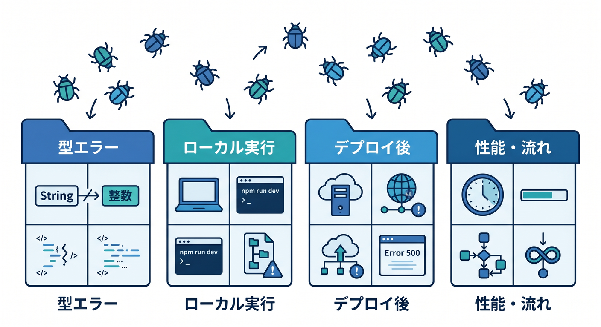
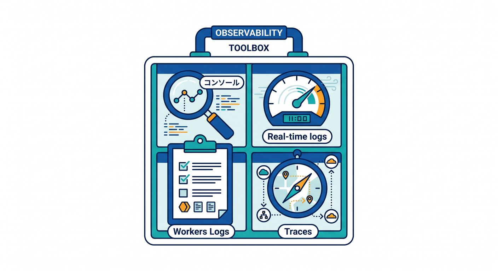
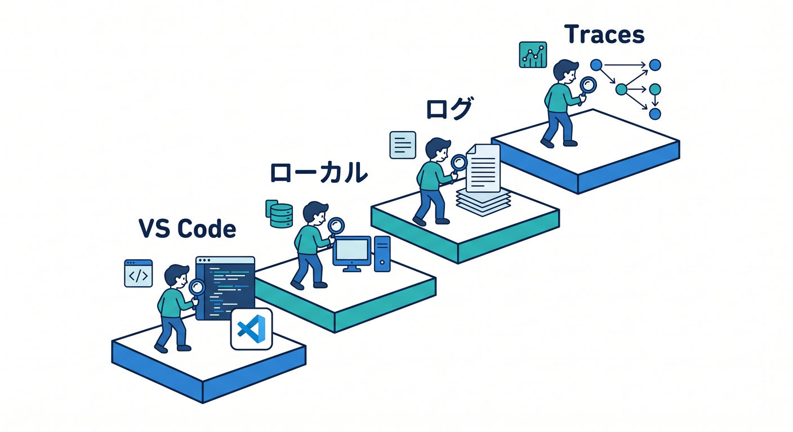
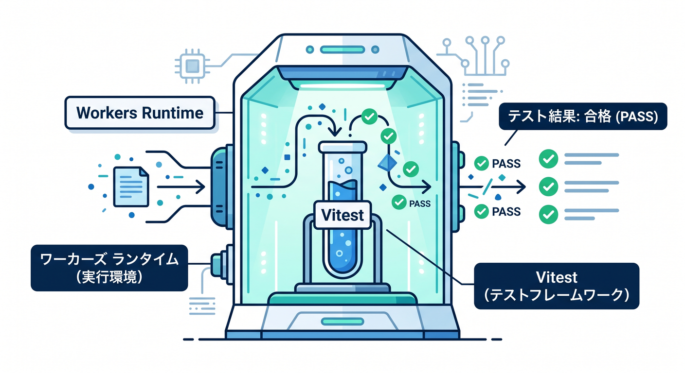
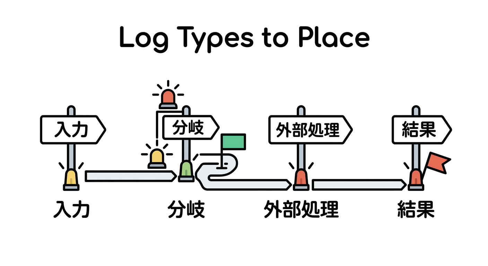
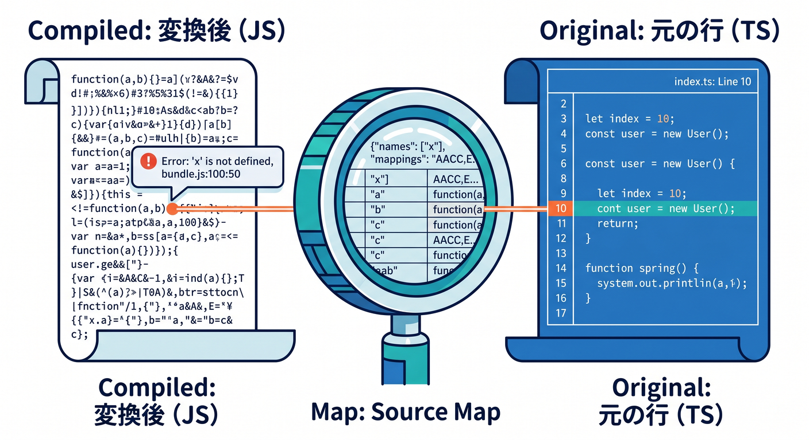
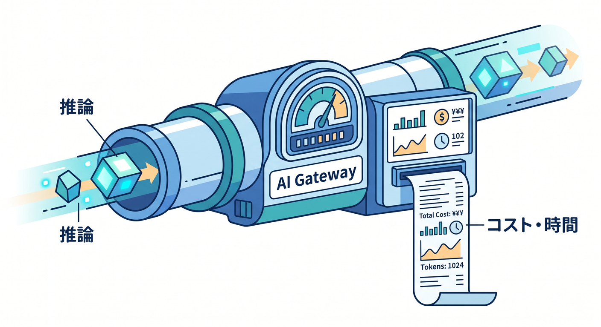

# 第12章：テスト・ログ・デバッグの基本を身につけよう 🐞📈☁️

この章では、**「動かないときに勘で直す」状態から卒業する**のが目標です ✨
2026年のCloudflare公式の流れでは、**テストは Workers Vitest integration、観測は Workers Logs / Real-time logs / Traces** で進めるのがかなり自然です。しかも新しく作る Worker では、**observability が最初から有効**になっているので、最初のうちから「見ながら直す」習慣を作りやすいです。 ([Cloudflare Docs][1])

さらに 2026年2月には、Workers Observability に**検索バーでの構造化クエリ**や、**可視化・共有リンク・JSON/CSV エクスポート**の改善も入りました。なので今の第12章は、昔ながらの `console.log()` だけの章ではなく、**テスト + ログ + 観測 + 調査の流れ**をまとめて身につける章にしたほうが、かなり実践的です 🚀 ([Cloudflare Docs][2])

---

## この章のゴール 🎯

この章を終えるころには、次のことができるようになるのが理想です。

* エラーを見たときに、**どこを見るべきかを切り分け**られる
* ローカルの失敗と、本番に近い環境での失敗を**混同しない**
* `console.log()` に頼りすぎず、**Workers Logs や Traces** で状況を追える
* **Vitest で小さなテスト**を書ける
* Workers AI を使った処理でも、**AI Gateway で利用状況や失敗原因を追える**
* Copilot に「書かせる」だけでなく、**原因調査やテスト作成の相棒**として使える 🤖

---

## 12-1. まずは「バグの種類」を分けて考えよう 🧠🔍

Cloudflare の開発で起きる不具合は、だいたい次の4つに分けて考えると整理しやすいです。

1. **型エラー**
   TypeScript の型が合っていない、`env` の型が足りない、戻り値の形が違う、など。

2. **ローカル実行エラー**
   `npm run dev` や `wrangler dev` 中に落ちるエラー。
   変数が `undefined`、JSONの扱いミス、非同期処理の書き方ミスなどが多いです。

3. **デプロイ後の実行エラー**
   ローカルでは動くのに、Cloudflare 上でだけ失敗するタイプです。
   bindings、環境差、権限、データ、外部API応答などが原因になりがちです。

4. **性能・流れの問題**
   「落ちはしないけど遅い」「どのサブリクエストが重いのかわからない」みたいな問題です。
   ここでは Logs より **Traces** が効きます。Cloudflare の tracing は、**コード変更やSDK追加なしで自動計測**され、`fetch`、KV、R2、Durable Objects などの流れを追えるのが強みです。 ([Cloudflare Docs][3])

ここで大事なのは、**全部を同じ“エラー”として見ないこと**です。
型エラーに本番ログを見に行っても遠回りですし、遅さの原因を `console.log()` だけで追うのもつらいです。
**「型なのか」「実行なのか」「観測なのか」** を分けるだけで、かなり強くなれます 💪



---

## 12-2. Cloudflareで使う「観測の道具箱」を覚えよう 🧰☁️

この章で使う道具は、まずこの4つです。



## ① ローカルのコンソールとエラー表示 🖥️

`console.log()` などのサポートされている console メソッドは、**ローカル開発中のコンソール**に出ます。さらに、それらは**live logs** や `wrangler tail`、Tail Worker / Logpush 系にも流せます。 ([Cloudflare Docs][4])

## ② Real-time logs ⚡

すぐ確認したいときのログです。
ただし **保存はされません**。また高トラフィック時は**sampling**が入り、取りこぼしが起きることもあります。
「今どうなってる？」を見る道具であって、「あとでじっくり調べる」用途には向きません。 ([Cloudflare Docs][5])

## ③ Workers Logs 📚

Cloudflareダッシュボード上で、**自動収集・保存・フィルタ・分析**できるログです。
**invocation logs / custom logs / errors / uncaught exceptions** が入り、新規 Worker では observability がデフォルト有効です。2026年2月からは検索バーで**自由文検索とフィールド単位のクエリ**が使いやすくなり、Query Builder と連動するようになっています。 ([Cloudflare Docs][6])

## ④ Traces 🧭

**リクエスト全体の流れ**を見る道具です。
「どの `fetch` が遅いのか」「KV や R2 へのアクセスにどれくらいかかっているか」を追いたいときに向いています。Cloudflare の tracing は**自動計測**で、span 属性には Worker 名、バージョン、実行リージョンなども入ります。 ([Cloudflare Docs][3])

---

## 12-3. デバッグの基本フローは、こう覚えると強いです 🔁🛠️

初心者のうちは、次の順番で見るクセをつけるとかなり安定します。



## ステップ1：まず VS Code で赤線を見る ✍️

一番安いエラーは型エラーです。
実行する前に分かることは、先に潰したほうが早いです。

## ステップ2：ローカルで再現する 🔬

その場で `console.log()` を置いて、入力値・分岐・戻り値を確認します。
この段階で直るバグはとても多いです。

## ステップ3：Cloudflare 上のログで確かめる ☁️

ローカルで再現しない問題は、**Real-time logs / `wrangler tail` / Workers Logs** を見ます。
Bindings や実データが絡むと、ここで初めて見えることが出てきます。 ([Cloudflare Docs][4])

## ステップ4：遅い・複雑なら Traces へ 🧭

外部API、KV、R2、Durable Objects、サブリクエストが絡むと、ログだけでは「どこで時間が溶けているか」が見えにくいです。
そういうときは Traces が向いています。 ([Cloudflare Docs][3])

---

## 12-4. まずは小さなテストを書こう 🧪✨

Cloudflare 公式は、Workers のテスト方法として **Vitest integration** を推しています。
この仕組みでは、`@cloudflare/vitest-pool-workers` を使って、**Workers runtime の中で**ユニットテストや統合テストを動かせます。bindings に直接触れたり、テストファイルごとにストレージを分離したり、ローカルで Miniflare 上で動かしたりできます。 ([Cloudflare Docs][7])



また、初回セットアップでは次の点も大事です。

* ES modules 形式であること
* compatibility date が `2022-10-31` 以降であること
* Vitest と `@cloudflare/vitest-pool-workers` を devDependencies に入れること
* `vitest.config.ts` で `cloudflareTest()` を使い、`wrangler.jsonc` を参照させること
* Workers Vitest integration 使用時は、**Vitest の custom environment / custom runner は非対応**であること ([Cloudflare Docs][8])

最小の準備イメージはこんな感じです 👇

```ts
// vitest.config.ts
import { defineConfig } from "vitest/config";
import { cloudflareTest } from "@cloudflare/vitest-pool-workers";

export default defineConfig({
  plugins: [
    cloudflareTest({
      wrangler: {
        configPath: "./wrangler.jsonc",
      },
    }),
  ],
});
```

この形にしておくと、**Wrangler の設定や bindings をテスト側とつなぎやすい**です。Cloudflare 公式もこの方向で案内しています。 ([Cloudflare Docs][8])

---

## 12-5. テストは「小さい関数」から始めてOKです 🌱

最初から大きな統合テストをやる必要はありません。
むしろ、次の順番のほうが自然です。

## 1. 純粋関数のテスト

計算、文字列整形、JSON 変換など。
Cloudflare 固有の知識がほぼ要らないので、最初の成功体験を作りやすいです。

## 2. `fetch()` ハンドラのテスト

URL によって JSON を返す、ステータスコードを返す、など。
「HTTP の入口」を検証できます。

## 3. bindings を使うテスト

KV、D1、Durable Objects など。
Cloudflare らしさが出てきます。

Workers Vitest integration では、`cloudflare:workers` と `cloudflare:test` から helper を使えます。
たとえば `env` で bindings を触ったり、`createExecutionContext()` と `waitOnExecutionContext()` で `ctx.waitUntil()` を含む処理をちゃんと待ってから確認できます。さらに `exports.default.fetch()` を使って、メイン Worker に対する統合テストも書けます。 ([Cloudflare Docs][9])

イメージはこんな感じです 👇

```ts
import { describe, it, expect } from "vitest";
import { env, exports } from "cloudflare:workers";
import { createExecutionContext, waitOnExecutionContext } from "cloudflare:test";
import worker from "../src/index";

describe("worker test", () => {
  it("GET /api/hello でJSONを返す", async () => {
    const response = await exports.default.fetch("https://example.com/api/hello");
    expect(response.status).toBe(200);
    expect(await response.json()).toEqual({ message: "hello" });
  });

  it("waitUntil を含む処理も待てる", async () => {
    const request = new Request("https://example.com/task");
    const ctx = createExecutionContext();

    const response = await worker.fetch(request, env, ctx);
    await waitOnExecutionContext(ctx);

    expect(response.status).toBe(200);
  });
});
```

この章では、**「テストは全部を保証する魔法」ではなく、“壊れやすい場所を先に固定する道具”** くらいの理解で十分です 😊

---

## 12-6. ログは「何を出すか」を決めてから置こう 🪵🧠

初心者のうちは、`console.log("ここ通った")` を乱発しがちです。
でもそれだけだと、あとで見返したときに意味がわかりにくいです。

おすすめは、**4種類だけ意識して出す**ことです。



## 入力ログ

* URL
* メソッド
* 必要ならリクエストID的なもの

## 分岐ログ

* 「if のどっちに入ったか」
* 「認証OK / NG」
* 「キャッシュHIT / MISS」

## 外部処理ログ

* 外部APIを叩いたか
* KV / D1 / R2 を読んだか
* AI推論を呼んだか

## 結果ログ

* 成功か失敗か
* ステータスコード
* 返した件数や件名など

Cloudflare の console 出力は、ローカル、live logs、`wrangler tail`、Tail Worker / Logpush 系へ流せるので、**最小限でも意味のあるログ**を置いておくとかなり効きます。 ([Cloudflare Docs][4])

---

## 12-7. TypeScriptのスタックトレースは source maps でかなり救われます 🗺️💥

本番に近い環境で例外が出たとき、変換後の JavaScript だけを見ても、
「どの TS ファイルの何行か」が分からずしんどいことがあります。

Cloudflare では、**uncaught exception の stack trace を source map で元のソースへ戻す**仕組みがあります。
その結果は **real-time logs** や **Tail Workers** で確認できます。source map の取得は invocation 後の非同期処理なので、Worker 実行の CPU 利用には影響しません。 ([Cloudflare Docs][10])

つまりこの章では、**ログを見るだけでなく、“元の TS の行に戻って読める” 状態を作る**ことも大事です ✨



---

## 12-8. Workers AI を使うなら、AIの観測も入れよう 🤖☁️📊

この教材全体では Cloudflare の AI サービスも積極的に使いたいので、第12章でも**AIまわりのデバッグ**を入れておくととても良いです。

Cloudflare では、**Workers AI を AI Gateway 経由で使う**導線が用意されています。
AI Gateway を通すと、**analytics・caching・security** を足しやすく、Workers 内の binding 経由でもつなげられます。Workers AI には OpenAI 互換エンドポイントもあります。 ([Cloudflare Docs][11])

さらに AI Gateway のログでは、**prompt / model response / provider / timestamp / status / token usage / cost / duration** まで確認できます。OTEL 連携を使えば、**モデル・プロバイダ・トークン量・コスト・カスタムメタデータ**を含む trace span の外部出力も可能です。 ([Cloudflare Docs][12])

なので、AI を使う Worker のデバッグは、次の順番がおすすめです。

1. Worker 側で、AI呼び出し直前・直後のログを入れる
2. 失敗時は Workers Logs で Worker 自体の例外を見る
3. AI Gateway 側で、**モデル応答時間・コスト・失敗率** を見る
4. 必要に応じて OTEL で外部監視へつなぐ

しかも 2026年3月時点では、AI Gateway で **`cf-aig-collect-log-payload: false`** を使うと、**payload 本体を保存せず、メタデータだけログに残す**こともできます。
「利用状況は見たいけど、プロンプト本文は保存したくない」というときにかなり便利です。DLP もあり、機密情報の流出対策を入れやすいです。 ([Cloudflare Docs][13])



---

## 12-9. Copilot は「修正係」ではなく「調査係」として使うと強いです 🤝🤖

今の VS Code / GitHub Copilot は、かなりエージェント寄りです。
GitHub の公式説明では **agent mode** は、タスクに合わせて対象ファイルを判断し、コード変更やターミナルコマンドを提案し、必要に応じて反復修正していく使い方です。VS Code 側でも、エージェントはローカル・CLI・クラウド・サードパーティの形で動かせて、**拡張機能のツールや MCP ツール**も使えます。 ([GitHub Docs][14])

この章でのCopilotの使い方は、こんな感じがおすすめです。

## 使い方A：まず原因候補を言わせる

「直して」より先に、**原因の可能性を3つ出して**もらうほうが勉強になります。

例：

```text
この Worker の失敗原因を3つに絞って説明して。
TypeScript の型ミス、Cloudflare bindings、実行時エラーのどれに近いか分類して。
```

## 使い方B：テストを書かせる

関数や `fetch()` ハンドラを見せて、**Vitest の最小テストだけ作らせる**と学習効率が高いです。

例：

```text
この fetch handler に対する Vitest の最小テストを書いて。
Cloudflare Workers のテストとして、成功ケースと 404 ケースだけに絞って。
```

## 使い方C：ログ設計を相談する

AIに「どこへログを置くべきか」を相談すると、無駄ログが減ります。

例：

```text
この Worker で障害調査しやすいように、
入力・分岐・外部処理・結果の4段階で console.log の候補を提案して。
個人情報や secret は絶対に出さないで。
```

## 使い方D：AI機能の調査に使う

VS Code のエージェントは MCP や拡張機能ツールも扱えるので、
Cloudflare 公式ドキュメントを参照しながら「Workers Logs と Traces の違いを調べる」「Vitest設定を点検する」みたいな流れとも相性が良いです。 ([GitHub Docs][15])

---

## 12-10. この章の演習課題案 📝🔥

## 演習1：壊れた Worker を直そう

* `/api/hello` が 500 になる Worker を配る
* まず型エラーがないか確認
* ローカルログで原因を見る
* 修正後に動作確認

## 演習2：最初の Vitest

* 正常系 1本
* 失敗系 1本
* 404 のテスト 1本

## 演習3：Workers Logs で調査

* 例外をわざと起こす
* ログからエラー時刻、内容、発生箇所を読む
* 「何が入力されていたか」を推定する

## 演習4：AI付き Worker を観測

* `env.AI.run()` などで簡単な推論を呼ぶ
* AI Gateway 経由にして token usage や duration を確認する
* 必要なら payload 非保存設定を試す

---

## 12-11. この章の成果物 🎁

この章の終わりには、受講者が次の4点を持てていると理想です。

* **最小の Worker**
* **最小の Vitest 設定**
* **意味のあるログを入れた実装**
* **「壊れたらどこを見るか」の手順メモ**

これが揃うと、第13章のデプロイや第15章のAI活用でも、
「動かなかったら終わり」ではなく、**ちゃんと直しながら前へ進める状態**になります 🌈

---

## まとめ 🌟

第12章は、単なる“不具合対応の章”ではありません。
ここで身につけたいのは、**Cloudflare開発を怖がらなくなるための基礎体力**です。

今のCloudflare公式の流れに合わせるなら、要点はこの3つです。

* **テストは Vitest integration を軸にする** 🧪
* **ログは Real-time logs と Workers Logs を使い分ける** 📚⚡
* **遅さや複雑な流れは Traces で見る** 🧭

そして AI を使うなら、**Workers AI + AI Gateway + 観測** まで一緒に考えると、2026年らしいCloudflare教材になります 🤖☁️✨ ([Cloudflare Docs][7])

次の流れとしては、この第12章に合わせて
**「学習目標」「ハンズオン手順」「サンプルコード一式」「演習の模範解答」付きの教材版**まで、そのまま展開できます。

[1]: https://developers.cloudflare.com/workers/testing/ "Testing · Cloudflare Workers docs"
[2]: https://developers.cloudflare.com/changelog/post/2026-02-24-observability-query-language/ "Write structured queries to filter and search your Workers logs and traces · Changelog"
[3]: https://developers.cloudflare.com/workers/observability/traces/ "Traces · Cloudflare Workers docs"
[4]: https://developers.cloudflare.com/workers/runtime-apis/console/ "Console · Cloudflare Workers docs"
[5]: https://developers.cloudflare.com/workers/observability/logs/real-time-logs/ "Real-time logs · Cloudflare Workers docs"
[6]: https://developers.cloudflare.com/workers/observability/logs/workers-logs/ "Workers Logs · Cloudflare Workers docs"
[7]: https://developers.cloudflare.com/workers/testing/vitest-integration/ "Vitest integration · Cloudflare Workers docs"
[8]: https://developers.cloudflare.com/workers/testing/vitest-integration/write-your-first-test/ "Write your first test · Cloudflare Workers docs"
[9]: https://developers.cloudflare.com/workers/testing/vitest-integration/test-apis/ "Test APIs · Cloudflare Workers docs"
[10]: https://developers.cloudflare.com/workers/observability/source-maps/ "Source maps and stack traces · Cloudflare Workers docs"
[11]: https://developers.cloudflare.com/ai-gateway/usage/providers/workersai/ "Workers AI · Cloudflare AI Gateway docs"
[12]: https://developers.cloudflare.com/ai-gateway/observability/logging/ "Logging · Cloudflare AI Gateway docs"
[13]: https://developers.cloudflare.com/ai-gateway/observability/logging/?utm_source=chatgpt.com "Logging - AI Gateway"
[14]: https://docs.github.com/copilot/using-github-copilot/asking-github-copilot-questions-in-your-ide "Asking GitHub Copilot questions in your IDE - GitHub Docs"
[15]: https://docs.github.com/ja/copilot/how-tos/provide-context/use-mcp-in-your-ide/extend-copilot-chat-with-mcp "モデル コンテキスト プロトコル (MCP) サーバーを使用した GitHub Copilot Chatの拡張 - GitHubドキュメント"
