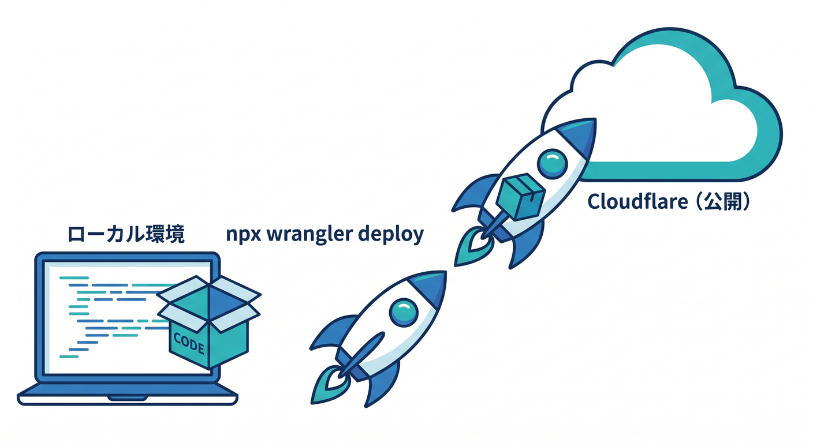
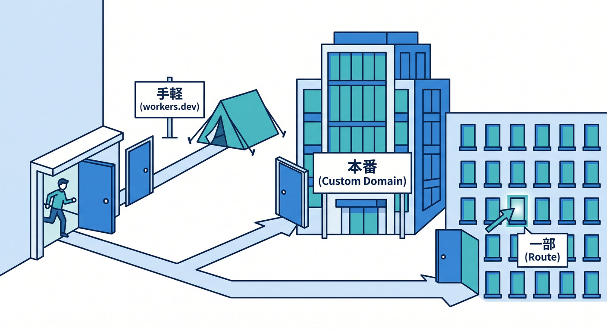
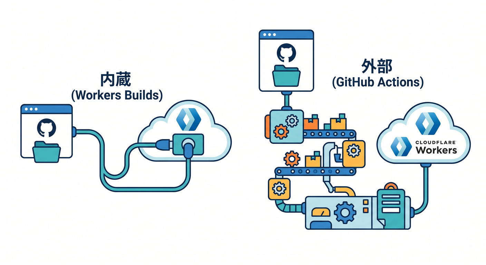
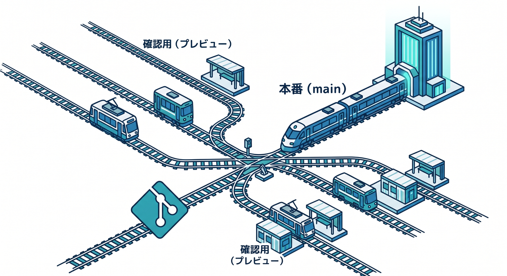
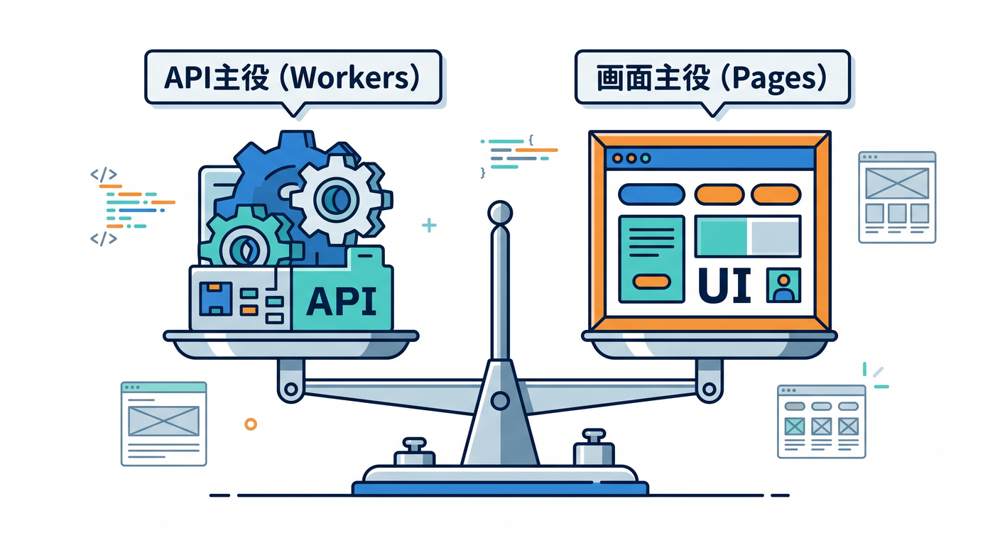
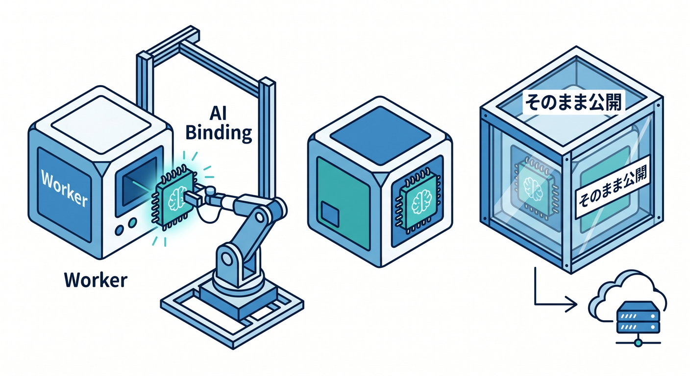

# 第13章：デプロイ・GitHub連携・公開の流れを作ろう 🚢🔗☁️✨

この章では、ローカルで動いた Cloudflare アプリを「自分だけの確認用」から「人に見せられる公開物」へ育てます 😊
ここまでで作ってきた Worker や小さな React 画面を、`wrangler deploy` で外に出し、Cloudflare ダッシュボードで確認し、さらに GitHub とつないで自動デプロイまで持っていくのが主役です。Cloudflare 公式の現在の導線では、手動デプロイは Wrangler、継続運用は Workers Builds または GitHub Actions が中心です。 ([Cloudflare Docs][1])

この章が終わるころには、「保存したコードを本当に公開する」「main に push したら自動で反映される」「ブランチごとに確認用 URL を使う」という流れがかなり自然に見えるようになります 🌈
しかも今の Cloudflare は、Workers AI を binding でつないで AI 付き Worker をそのままデプロイでき、AI Gateway でその推論リクエストを観測・制御する流れまで用意されています。つまり第13章は、ただの公開手順ではなく、「今どきの Cloudflare アプリを外へ出す章」です。 ([Cloudflare Docs][2])

---

## この章の学習目標 🎯

この章のゴールは、次の4つです ✍️

1. `npx wrangler deploy` で Worker を公開できる
2. Cloudflare ダッシュボードでデプロイ状態と公開先を確認できる
3. GitHub 連携のやり方を、**Workers Builds** と **GitHub Actions** の2本立てで理解できる
4. AI 付き Worker や React 付きアプリも「公開運用の形」に乗せられる

Cloudflare 公式では、Wrangler が Worker の作成・開発・デプロイの基本 CLI であり、公開先は `workers.dev` サブドメインまたは Custom Domain が基本です。さらに Workers Builds では GitHub/GitLab 接続、GitHub Actions では公式 `cloudflare/wrangler-action@v3` が案内されています。 ([Cloudflare Docs][1])

---

## 1. まず「公開」とは何をするのかをつかもう 🌍📦

ローカルで `wrangler dev` している間は、まだ自分の PC の中で試しているだけです。
でも `npx wrangler deploy` を実行すると、コードが Cloudflare 側へアップロードされ、公開された Worker として動き始めます。初回デプロイ後は、`<worker名>.<自分のsubdomain>.workers.dev` の形で確認できます。Cloudflare 公式の CLI ガイドでも、`npx wrangler deploy` のあとに `workers.dev` または Custom Domain で確認する流れが示されています。 ([Cloudflare Docs][1])

ここで大事なのは、「デプロイ＝ファイルをどこかに置く」というより、「Cloudflare の実行基盤に新しい版を載せる」感覚です ☁️



Cloudflare は **version と deployment** を分けて扱っていて、通常の `wrangler deploy` は新しい version を作って、そのまま 100% トラフィックに出す流れです。一方で、あとで出す版として保存しておきたい場合は `wrangler versions upload`、公開割合を切り替えたい場合は `wrangler versions deploy` という考え方があります。 ([Cloudflare Docs][3])

---

## 2. 手動デプロイの基本フローを身につけよう 🖐️🚀

初心者のうちは、いきなり自動化せず、まずは**手で1回出してみる**のがとても大事です 😊
Cloudflare 公式でも、最初の Worker は C3 か `wrangler deploy` で作成・初回アップロードする流れが基本で、初回アップロードに `wrangler versions upload` は使えません。最初の1回は「ちゃんと自分で出す」経験を作るのが安全です。 ([Cloudflare Docs][1])

おすすめの流れはこんな感じです 👇

```powershell
npm run build
npx wrangler deploy
```

React や Vite 側でビルドが必要な構成なら先に build、そのあと Wrangler で公開、という流れです。Cloudflare の Builds 設定でも build command と deploy command は分かれていて、deploy command のデフォルトは `npx wrangler deploy` です。 ([Cloudflare Docs][4])

公開後は、Cloudflare ダッシュボードの **Workers & Pages → 対象 Worker → Deployments** を見る癖をつけましょう 👀
「今どの版が出ているか」「新しい版が作られたか」を、コマンドだけでなく画面でも確認できるようにしておくと、あとで GitHub 連携したときに混乱しにくくなります。 ([Cloudflare Docs][3])

---

## 3. 公開先は3つある、と覚えるとわかりやすいよ 🧭✨

Cloudflare Worker の公開先は、ざっくり次の3つです。



* `workers.dev` で試す
* Custom Domain で本番っぽく出す
* Route で既存ドメインの一部パスに差し込む

Wrangler の設定では `workers_dev`、`routes`、`custom_domain` がそれぞれ使えます。`workers.dev` はアカウントのサブドメインで手軽、Custom Domain はサブドメインやドメインを直接 Worker に結びつける形、Route は URL パターンに対して Worker を割り当てる形です。 ([Cloudflare Docs][5])

この章では、最初は `workers.dev` で十分です 🙆
独自ドメインや細かい Route 設計まで一気に詰めると、学習者は「公開」が怖くなりがちです。だからここでは、まず「公開 URL が生まれる」「人に見せられる」ことを優先し、独自ドメインは軽く紹介に留めるのがやさしい進め方です。Cloudflare 公式でも、初回の確認先は `workers.dev` が自然な入口です。 ([Cloudflare Docs][1])

なお、**routes / domains / cron triggers を変えたときは `wrangler triggers deploy` が必要**という点は、初心者がつまずきやすいので軽く触れておくと親切です。コードだけ再デプロイしても、トリガー側の変更は別反映になることがあります。 ([Cloudflare Docs][3])

---

## 4. GitHub 連携は「Cloudflare内蔵型」と「GitHub Actions型」の2本立てで覚えよう 🔗🐙

第13章のコアはここです 💡
GitHub とつなぐ方法は大きく分けて2つあります。

## A. Workers Builds を使う方法 ☁️🔄

Cloudflare 側の Git integration を使って、GitHub または GitLab のリポジトリを Worker に接続する方法です。push すると自動で build と deploy が走ります。Cloudflare 公式では、**新規 Worker でも既存 Worker でもリポジトリ接続可能**で、Workers Builds が GitHub/GitLab 連携の標準ルートとして案内されています。 ([Cloudflare Docs][6])

## B. GitHub Actions を使う方法 ⚙️📤

GitHub 側の workflow で `wrangler deploy` を実行する方法です。Cloudflare 公式は `cloudflare/wrangler-action@v3` を案内していて、`CLOUDFLARE_ACCOUNT_ID` と `CLOUDFLARE_API_TOKEN` を GitHub Secrets に入れて動かす構成が基本です。GitHub 以外の Git プロバイダや、もっと細かい制御をしたいときはこちらが強いです。 ([Cloudflare Docs][7])

初心者向けに言うと、**まずは Workers Builds、必要が出たら GitHub Actions** がわかりやすいです 😊



Cloudflare の中で完結したいなら Workers Builds、テストや lint や monorepo の複雑な流れを GitHub 側で厳密に組みたいなら Actions、という住み分けが自然です。Workers Builds には root directory、build command、deploy command などの設定欄もあり、Next.js や Remix のような build 前提プロジェクトも扱えます。 ([Cloudflare Docs][4])

---

## 5. Workers Builds の教え方は「main だけ自動公開」から始めるとやさしい 🌱🚦

Workers Builds では、GitHub/GitLab リポジトリを接続すると push で自動ビルド・自動デプロイできます。設定画面では **Build command** と **Deploy command** を分けて持てて、deploy のデフォルトは `npx wrangler deploy`、非本番ブランチの deploy はデフォルトで `npx wrangler versions upload` です。さらに、使用する Wrangler は `package.json` に入っているバージョンが使われます。 ([Cloudflare Docs][4])

教材では、最初は **production branch = main** の1本で始めるとよいです 🌼
そのあとで「main 以外もビルドする」を有効にすると、非本番ブランチの build が走り、**preview URLs** や **PR コメント** を使った確認の流れまで広げられます。



Cloudflare 公式でも、non-production branch builds を有効にすると preview URL と pull request comments を活用できると説明されています。 ([Cloudflare Docs][8])

ここで1つ、かなり大事な注意があります ⚠️
**Cloudflare ダッシュボード上の Worker 名と、対象ディレクトリの `wrangler.jsonc` の `name` が一致しないと build が失敗**します。これは学習者が意外と見落とすので、教材中で太字レベルで強調しておく価値があります。 ([Cloudflare Docs][6])

さらに、Build variables と Build secrets は**ビルド時専用**で、**実行時には見えない**点も分けて教えるとスッキリします。ランタイムで使う環境変数や secrets は、別に Variables & Secrets 側で持つ考え方です。 ([Cloudflare Docs][4])

---

## 6. GitHub Actions は「自分でパイプラインを持つ」感覚で教えよう 🧰🛠️

GitHub Actions では、GitHub の workflow ファイルの中で checkout、build、deploy を自分で並べます。Cloudflare 公式サンプルでは `actions/checkout@v6` のあとに `cloudflare/wrangler-action@v3` を使い、`apiToken` と `accountId` を secrets から渡す形です。 ([Cloudflare Docs][7])

教材で見せる最小例は、たとえばこんな形で十分です 👇

```yaml
name: Deploy Worker

on:
  push:
    branches:
      - main

jobs:
  deploy:
    runs-on: ubuntu-latest
    steps:
      - uses: actions/checkout@v6
      - run: npm ci
      - run: npm run build --if-present
      - uses: cloudflare/wrangler-action@v3
        with:
          apiToken: ${{ secrets.CLOUDFLARE_API_TOKEN }}
          accountId: ${{ secrets.CLOUDFLARE_ACCOUNT_ID }}
          command: deploy
```

この形なら、「GitHub で push → 自動で Cloudflare へ公開」の最小の筋道が見えます。Cloudflare 公式でも、CI/CD では `CLOUDFLARE_ACCOUNT_ID` と `CLOUDFLARE_API_TOKEN` を秘密情報として保存し、repository に直書きしないよう明確に注意しています。 ([Cloudflare Docs][7])

Actions を採用する理由としては、たとえばこんな場面が説明しやすいです 😊

* deploy 前に test や lint を必ず通したい
* monorepo の一部だけ build / deploy したい
* GitHub 以外の流れも含めて CI/CD を自分で管理したい
* Workers だけでなく Pages や別サービスも同時に触りたい

Cloudflare 公式でも、GitHub / GitLab 以外の Git プロバイダや self-hosted 系では、external CI/CD と Wrangler を使う流れが案内されています。 ([Cloudflare Docs][9])

---

## 7. React を含む公開は Workers と Pages を整理して教えよう ⚛️📄

学習者はここで「React の画面はどこに置くの？」と迷いやすいです 😌
Cloudflare の今の導線では、**Worker 중심のフルスタック**として出す方法と、**Pages で front-end を出す方法**の両方があります。Pages は GitHub/GitLab 連携、自動デプロイ、ブランチ preview URL、PR 上の status 表示までかなり整っています。 ([Cloudflare Docs][10])

この教材シリーズでは Cloudflare 本体が主役なので、第13章ではこう整理するとわかりやすいです 👇



* API やサーバー処理が主役 → Workers 中心
* 小さな React 画面をいっしょに載せたい → Workers + assets / framework 対応
* ほぼ front-end 公開が主役 → Pages も候補

しかも現在の Wrangler は、**既存プロジェクトに `wrangler deploy` を打つだけで framework を検出し、必要な adapter 導入や `wrangler.jsonc` 作成、`package.json` の script 追加まで案内**できます。最低必要 Wrangler は 4.68.0 とされています。これにより、Vite/React 側から Cloudflare に入る道もかなりやさしくなっています。 ([Cloudflare Docs][11])

Pages については、Git integration を使うと preview deployments や PR 表示が便利ですが、**Git integration で始めた Pages project は後から Direct Upload へ切り替えできない**という注意点があります。逆に、自動デプロイを止めて Wrangler で直接 Pages へ出す運用は可能です。 ([Cloudflare Docs][12])

---

## 8. この章では AI 付き公開例を入れると、Cloudflareらしさが一気に出る 🤖🌟

せっかく Cloudflare を学ぶなら、第13章の公開サンプルは **ただの Hello World ではなく、小さな AI Worker** にすると印象が強いです。Cloudflare 公式の Workers AI ガイドでも、Worker に `ai` binding を追加し、`env.AI.run(...)` でモデルを叩いて、そのままデプロイする流れが案内されています。binding 名は `wrangler.jsonc` に書き、コード側では `env.AI` から使います。 ([Cloudflare Docs][2])



たとえば教材のミニ演習は、こんな感じがちょうどいいです ✨

* React 画面で質問文を入力
* Worker がそれを受け取る
* `env.AI.run()` で返答を生成
* 公開 URL で友達に見せる

こうすると、「Cloudflare で API を作る」「AI を呼ぶ」「公開する」が1本につながります。Workers AI は Worker だけでなく Pages Function にも binding できます。 ([Cloudflare Docs][2])

さらに一歩進めるなら、**AI Gateway** も紹介できます 🚀
Cloudflare 公式では、Workers AI は AI Gateway とシームレスに連携でき、analytics、caching、security を加えられるとされています。つまり「AI を動かす」だけでなく、「AI の呼び出しを観測する・最適化する」まで Cloudflare 内でつながります。第13章では深入りしすぎず、公開後の運用先として軽く見せるのがちょうどよいです。 ([Cloudflare Docs][13])

---

## 9. VS Code と GitHub Copilot は「公開作業の補助役」としてかなり強い 💬🧠

この章では Copilot をコード生成マシンとしてではなく、**公開フローの壁打ち相手**として使うのがおすすめです 😊
GitHub 公式では、Copilot の agent mode は VS Code など MCP 対応 IDE で使えます。Cloudflare 側も managed remote MCP servers を提供しており、Cloudflare API や製品情報にアクセスする仕組みがあります。 ([GitHub Docs][14])

ただし、ここは教え方に少し注意が必要です ⚠️
**「Copilot が Cloudflare を完全にネイティブ統合して全部面倒を見る」と言い切るのはまだ雑**です。正確には、GitHub Copilot 側は MCP を扱える、Cloudflare 側は MCP サーバーや Skills 的な仕組みを用意している、という状態です。なので教材では、「Copilot に workflow の雛形を作らせる」「`wrangler.jsonc` を読ませる」「deploy error を説明させる」という実用的な補助用途を中心にすると、誇張がなくて親切です。 ([GitHub Docs][14])


加えて Cloudflare 公式は、Workers アプリを **VS Code などの editor / agent から prompt で作る流れ**も案内しています。つまり今の Cloudflare 開発は、CLI だけでなく AI との対話込みでかなり前向きに設計されています。第13章でも、Copilot にこんな指示を出す練習を入れると良いです 💡 ([Cloudflare Docs][15])

* 「この `wrangler deploy` 用 workflow を初心者向けに説明して」
* 「このデプロイエラーは secrets 不足か name 不一致か見分けて」
* 「Workers Builds と GitHub Actions の違いを 3 行でまとめて」
* 「AI binding を含む `wrangler.jsonc` をレビューして」

---

## 10. この章のおすすめ演習 📚🔥

## 演習1：手動公開してみよう

`npx wrangler deploy` で公開し、`workers.dev` URL を開いて結果を確認する演習です。
ここでは「公開できた」感覚が最重要です。Cloudflare 公式でも、初回の基本公開は Wrangler から始める流れです。 ([Cloudflare Docs][1])

## 演習2：Deployments 画面を読もう

ダッシュボードで自分の Worker の Deployments を開き、今出ている版を確認します。
CLI の成功だけで満足せず、画面側でも「何が本番なのか」を読む習慣をつけます。 ([Cloudflare Docs][3])

## 演習3：GitHub 連携をつけよう

Workers Builds で GitHub リポジトリを接続し、main に push して自動反映を確認します。
余裕があれば non-production branch builds も有効にし、preview URL を見るところまで進めます。 ([Cloudflare Docs][6])

## 演習4：AI 付き公開物にしよう

Workers AI binding を追加し、入力した文章に AI が返事する小さな Worker を公開します。
ここまで行くと、第13章だけで「Cloudflare っぽい作品」が1つ完成します。 ([Cloudflare Docs][2])

---

## 11. この章で強調したい“初心者つまずきポイント” 🧱💥

* deploy したのに URL を開いていない
* ダッシュボードの Deployments を見ていない
* `wrangler.jsonc` の `name` と Cloudflare 側の Worker 名がズレている
* GitHub Secrets に API token を入れていない
* build 時の変数と runtime の secrets をごっちゃにしている
* custom domain や route 変更をコード再デプロイだけで済むと思っている

このあたりは全部、公開フローでかなり起きやすいです。公式 docs にも name 一致、CI secrets、build settings、routes / triggers の注意点がはっきりあります。 ([Cloudflare Docs][6])

---

## まとめ 🌟

第13章は、「作る章」から「届ける章」への切り替えです 🚢
Cloudflare の今の標準導線では、まず `wrangler deploy` で手動公開し、そのあと **Workers Builds** か **GitHub Actions** で継続デプロイへ進むのが自然です。Workers Builds は GitHub/GitLab 直結でやさしく、GitHub Actions はより自由度が高い、という整理で教えると理解しやすいです。 ([Cloudflare Docs][1])

さらに、React 側の公開先として Pages も視野に入れつつ、Cloudflare らしさを出すなら **Workers AI を載せた小さな公開アプリ**をゴールにすると、とても教材映えします 🤖✨
公開 URL ができて、push で自動反映されて、AI まで動いたら、学習者はかなり「作れた！」を感じられます。 ([Cloudflare Docs][2])

次の流れとしては、この第13章をそのまま教材フォーマットに落として、**「学習目標」「本文」「ハンズオン手順」「演習問題」「提出課題」付きの完全版」**に整えるのがやりやすいです。

[1]: https://developers.cloudflare.com/workers/get-started/guide/ "Get started - CLI · Cloudflare Workers docs"
[2]: https://developers.cloudflare.com/workers-ai/get-started/workers-wrangler/ "Get started - Workers and Wrangler · Cloudflare Workers AI docs"
[3]: https://developers.cloudflare.com/workers/configuration/versions-and-deployments/ "Versions & Deployments · Cloudflare Workers docs"
[4]: https://developers.cloudflare.com/workers/ci-cd/builds/configuration/ "Configuration · Cloudflare Workers docs"
[5]: https://developers.cloudflare.com/workers/wrangler/configuration/ "Configuration - Wrangler · Cloudflare Workers docs"
[6]: https://developers.cloudflare.com/workers/ci-cd/builds/ "Builds · Cloudflare Workers docs"
[7]: https://developers.cloudflare.com/workers/ci-cd/external-cicd/github-actions/ "GitHub Actions · Cloudflare Workers docs"
[8]: https://developers.cloudflare.com/workers/ci-cd/builds/build-branches/ "Build branches · Cloudflare Workers docs"
[9]: https://developers.cloudflare.com/workers/ci-cd/builds/git-integration/ "Git integration · Cloudflare Workers docs"
[10]: https://developers.cloudflare.com/pages/configuration/git-integration/github-integration/ "GitHub integration · Cloudflare Pages docs"
[11]: https://developers.cloudflare.com/workers/framework-guides/automatic-configuration/ "Deploy an existing project · Cloudflare Workers docs"
[12]: https://developers.cloudflare.com/pages/configuration/git-integration/ "Git integration · Cloudflare Pages docs"
[13]: https://developers.cloudflare.com/ai-gateway/usage/providers/workersai/ "Workers AI · Cloudflare AI Gateway docs"
[14]: https://docs.github.com/en/copilot/tutorials/enhance-agent-mode-with-mcp "Enhancing GitHub Copilot agent mode with MCP - GitHub Docs"
[15]: https://developers.cloudflare.com/workers/get-started/prompting/ "Prompting · Cloudflare Workers docs"
