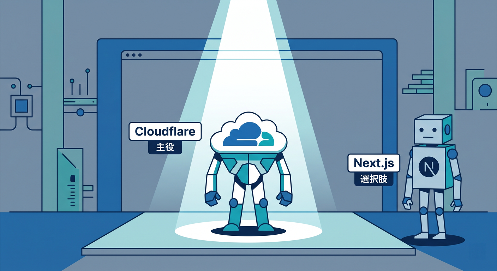
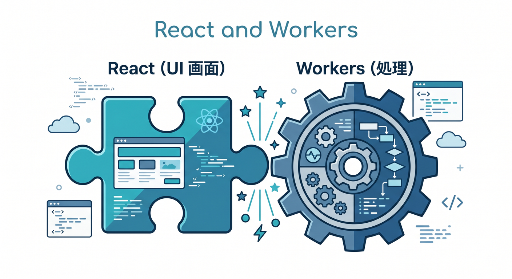
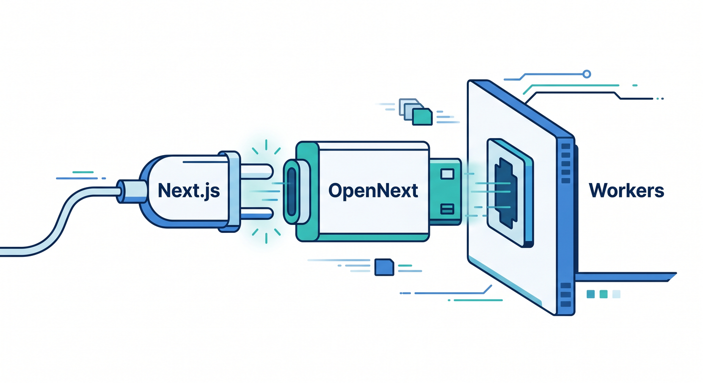
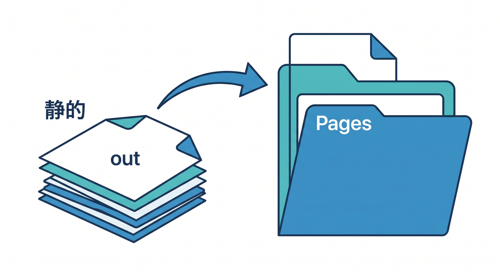
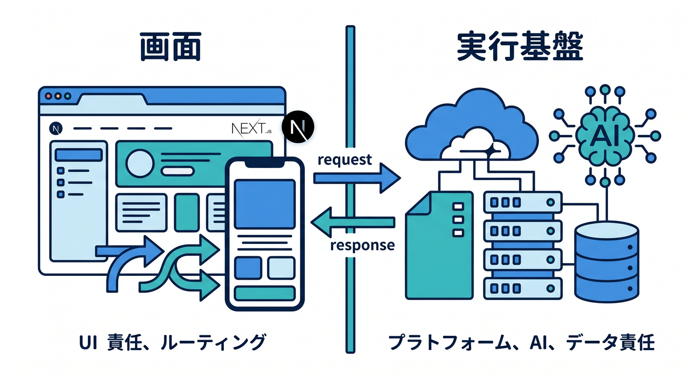
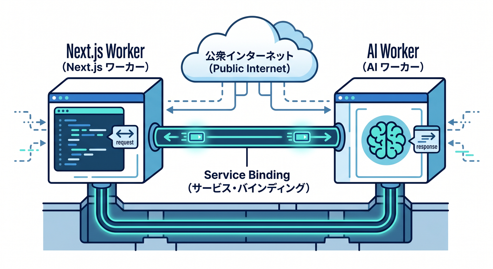
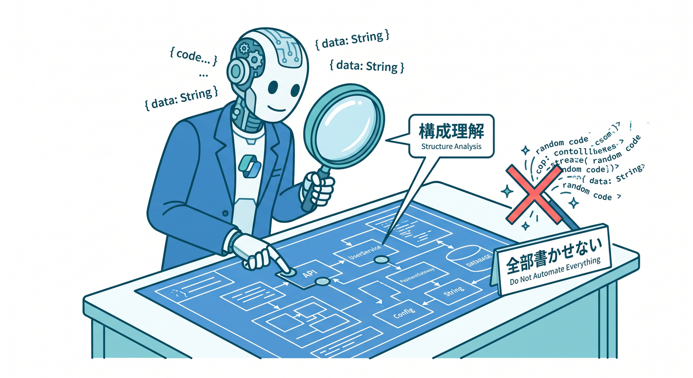

# 第14章：Next.jsは“紹介するけど主役にしない”で学ぼう ▲⚛️☁️

この章では、Next.js を「がっつり習得する対象」としてではなく、**Cloudflareの上でどう位置づけるかを理解するための地図**として扱います 😊
いまの Cloudflare 公式の導線では、**フルスタックの Next.js は Workers 側**で案内され、**静的書き出しだけを使う特殊ケースは Pages 側**で案内されています。さらに Workers の Next.js ガイドは、詳しい実装方法として **OpenNext の Cloudflare アダプタ**を参照する形になっています。 ([Cloudflare Docs][1])

---

## この章のゴール 🎯

この章を終えるころには、次の3つを迷わず言えるようになるのが目標です ✨

* **学習の主役は Cloudflare** で、Next.js は必要になったときに使う選択肢

* **フルスタックの Next.js を Cloudflare で動かすなら Workers 寄り**
* **静的サイトとして出すだけなら Pages もあり。ただし限定用途**

この整理は Cloudflare 公式の現行ガイドそのものと一致しています。Pages の静的 Next.js ガイドには、**「静的 export に特定の理由がある場合以外は使わず、Next.js は Workers でのデプロイを推奨する」**と明記されています。 ([Cloudflare Docs][2])

---

## まず結論から 🌟

## 1. 学習用として最初におすすめなのは「React + Workers」

Cloudflare を学ぶ段階では、まず **React で画面を作って、Workers で処理する** 形のほうが全体像をつかみやすいです 😊
Next.js は便利ですが、SSR、ルーティング、ビルド、アダプタ、キャッシュ戦略など、理解する層が一気に増えます。Cloudflare 側も Next.js を **Workers + OpenNext アダプタ** で動かす構成として案内しています。 ([Cloudflare Docs][3])

## 2. フルスタック Next.js を使うなら「Workers + OpenNext」

Cloudflare の Next.js ガイドでは、C3 で `--framework=next` を使って始められますが、詳細な使い方は **OpenNext サイトを参照**する形です。OpenNext 側は、**Next.js のビルド出力を Cloudflare Workers 上で動く形へ変換する**と説明しています。 ([Cloudflare Docs][1])

## 3. 静的サイトだけなら「Pages」も選べる

Next.js は static export を使えば `out` フォルダに静的成果物を出せます。これは Pages に載せやすいです 👍
ただし static export では、**サーバーを必要とする Next.js 機能は使えません**。だから Pages は「たまたま Next.js を使っている静的サイト」に向いていて、「Next.js の強みをフルに使う場」ではありません。 ([Next.js][4])

---

## なぜ「主役にしない」のか 🧭

理由はシンプルです。**Cloudflareの理解に必要な本体知識と、Next.js固有知識が別物だから**です 😌

Next.js そのものは、Cloudflare 公式でも **フルスタックアプリ向けの React フレームワーク**として紹介されています。Server-side rendering、Client-side rendering、Partial Prerendering まで含むので、とても高機能です。つまり便利なぶん、初心者には理解コストも上がります。 ([Cloudflare Docs][3])

さらに Next.js 公式のデプロイ文書でも、**Node.js サーバー / Docker / static export / adapters** と複数の出し方が並んでいて、Cloudflare は「独自 integration を提供するプラットフォーム」として案内されています。加えて、**Cloudflare と Netlify は verified adapter を構築中**で、現時点では独自統合が中心だと整理されています。
なので教材としては、Next.js を“全部学ぶ”より、**Cloudflareで使うときの置き場所だけを先に理解する**ほうが親切です。 ([Next.js][5])

---

## 2026年4月15日時点のおすすめ整理 🪄

## パターンA：Cloudflareを学びたい

**React + Workers** で進めるのがいちばん自然です 🌱

この教材全体の中軸にも合っています。

## パターンB：Next.js で画面も API もまとめたい

**Workers + OpenNext** が本命です 🚀

Cloudflare の Next.js ガイドもこの向きで、OpenNext Cloudflare アダプタが中心です。 ([Cloudflare Docs][1])

## パターンC：実質ほぼ静的サイト

**Pages + static export** が候補です 📄

ただし Pages 側の公式ガイドが、**“specific use case” のときだけ**と注意書きを入れているので、常用の第一候補ではありません。 ([Cloudflare Docs][2])

---

## 公式の最新導線をやさしく整理するとこうです 🛣️

## 新しく始める場合

Cloudflare の Workers 向け Next.js ガイドでは、C3 から次の形で始められます。 ([Cloudflare Docs][1])

```bash
npm create cloudflare@latest -- my-next-app --framework=next
```

## 既存の Next.js プロジェクトを持っている場合

Cloudflare の Workers 側には、**Wrangler が既存プロジェクトを自動検出して構成する**案内があります。しかもこの導線は、**Wrangler 4.68.0 以上**が前提です。 ([Cloudflare Docs][6])

一方で、OpenNext の Cloudflare CLI には、**Cloudflare 向けの開発・ビルド・デプロイは `opennextjs-cloudflare` CLI を使い、`wrangler` を直接たたくのは文書で指示された場合か、理解している場合に限る**とあります。さらに `migrate` コマンドで、依存導入、`wrangler.jsonc`、`open-next.config.ts`、`.dev.vars`、スクリプト更新、キャッシュ設定まで自動化できます。 ([OpenNext][7])

このため教材では、**既存 Next.js を Cloudflare に載せたいときは、Cloudflare の自動検出を知識として押さえつつ、実務的には OpenNext の流れを本線として理解する**、という教え方がいちばん混乱しにくいです。 ([Cloudflare Docs][6])

---

## Pages と Workers の住み分けを、この章ではこう覚えよう 🧠

## Workers が向いているもの

* SSR を使いたい
* API も同居させたい
* AI 呼び出しも同じ基盤に寄せたい
* 認証、動的処理、キャッシュ制御もやりたい

Cloudflare の現行ガイドでも、**フルスタック SSR の Next.js は Workers 側を参照**するよう案内されています。 ([Cloudflare Docs][8])

## Pages が向いているもの

* 静的 export のみ
* 更新頻度が低いコーポレートサイト
* ブログやドキュメント中心
* 「Next.js を使っているけど、実質静的サイト」な案件

Next.js の static export は `next build` で `out` フォルダを生成しますが、**サーバーが必要な機能は使えません**。 ([Next.js][4])

---

## この章で押さえたい “Cloudflareらしい” Next.js の考え方 ☁️⚛️

Next.js を使うと、つい「全部を Next の中に入れたくなる」ことがあります。
でも Cloudflare 学習では、**Next.js は画面とルーティングの便利役**、**Cloudflare は実行基盤とAI・データ・配信の主役**、という分け方がとても大事です 😊


たとえば、AI 機能を入れるなら次の考え方が自然です。

* 画面：Next.js
* 推論：Workers AI
* AI 通信の可視化やキャッシュ：AI Gateway
* ベクトル検索：Vectorize
* 検索全体をマネージドで寄せたい：AI Search

Workers AI は **Workers / Pages / Cloudflare API から使え**、AI Gateway は **Workers AI への推論リクエストに対して analytics・caching・security** を付けられます。Vectorize は **Cloudflare のベクトルDB**、AI Search は **Webサイトや非構造データを取り込んで自然言語検索できる managed search** として案内されています。 ([Cloudflare Docs][9])

---

## AI機能を入れるなら、この章ではこの設計がきれいです 🤖✨

## いちばんわかりやすい形

**Next.js の画面 → Cloudflare 側のAI処理** です。
つまり、「UI は Next.js」「AI 実行は Cloudflare」という役割分担です。

## さらに Cloudflare 中心にしたい形

**Next.js の前段・横に Worker を置く** 形もきれいです。
Cloudflare の **Service bindings** を使うと、**公開URLを通さずに Worker 同士をつなげる**ことができます。なので、Next 側の処理と AI 専用 Worker を分けても、内部通信をすっきり保てます。 ([Cloudflare Docs][10])


この設計にすると、あとから
「検索は Vectorize に分離」
「AI Gateway を通してログを見たい」
「AI Search を追加したい」
みたいな拡張がしやすくなります。AI Search は Vectorize、AI Gateway、R2、Browser Rendering、Workers AI とネイティブ統合する形で案内されています。 ([Cloudflare Docs][11])

---

## VS Code と GitHub Copilot は、この章ではどう使う？ 💻🤝

この章では Copilot を **“全部書かせる道具” ではなく “構成を理解する補助役”** として使うのがおすすめです ✍️


VS Code の agent mode は、**コードベース解析、複数ファイル編集提案、ターミナルコマンド実行、エラーを見ての自動修正ループ**まで扱え、さらに **MCP サーバー**や拡張機能のツールも利用できます。VS Code 側の MCP 文書でも、MCP は外部ツールやサービスにつなぐための標準として説明されています。 ([Visual Studio Code][12])

また GitHub の公式 MCP サーバーを VS Code の Copilot Chat で使うと、**Agent モードから issue 作成、PR 一覧取得、repo 情報取得**などを直接扱えます。
つまりこの章では、Copilot に
「`wrangler.jsonc` の意味を説明して」
「`open-next.config.ts` の役割を初心者向けに整理して」
「この変更で Pages 向きか Workers 向きか判定して」
のように聞くのが、とても相性がいいです。 ([GitHub Docs][13])

---

## この章の教材本文 📘✨

## 14-1. Next.js は“便利な選択肢”であって、最初の必修ではない

Cloudflare 学習では、最初から Next.js に入るより、Workers と React の役割を先に理解したほうが全体が見えやすいです。
Next.js は後から載せてもよく、むしろ **「なぜ Next.js が必要なのか」** が分かってからのほうが吸収しやすいです 😊

## 14-2. Cloudflare での Next.js は「Workers + OpenNext」が本線

いまの公式導線では、Cloudflare 上でフルスタック Next.js をやるときの中心は Workers 側です。
Cloudflare の Next.js ガイドは OpenNext を参照し、OpenNext はビルド出力を Workers 実行向けに変換する役目を担います。 ([Cloudflare Docs][1])

## 14-3. Pages は「静的に出すだけ」のときに使う

Pages にも Next.js ガイドはありますが、これは static export 向けです。
Cloudflare 自身が「特定用途以外では Workers 推奨」と言っているので、学習者は **Pages = 静的寄り** と覚えておけば十分です。 ([Cloudflare Docs][2])

## 14-4. AI を入れるなら、Next.js に全部背負わせない

Next.js を UI 担当、Cloudflare を AI・検索・配信担当にすると、構成がきれいです。
Workers AI、AI Gateway、Vectorize、AI Search がすでに揃っているので、Next.js はあくまで入口画面として使うと、Cloudflare中心の教材としても筋が通ります。 ([Cloudflare Docs][9])

---

## この章で見せたい最小コマンド例 🛠️

## 新規作成のイメージ

```bash
npm create cloudflare@latest -- my-next-app --framework=next
```

Cloudflare の公式 Next.js ガイドにある出発点です。 ([Cloudflare Docs][1])

## 既存プロジェクトを Cloudflare 向けに寄せるイメージ

```bash
npx @opennextjs/cloudflare migrate
pnpm opennextjs-cloudflare preview
pnpm opennextjs-cloudflare deploy
```

OpenNext の Cloudflare CLI は、migrate / preview / deploy を提供していて、Cloudflare 向けの構成変換やローカル確認、デプロイを担います。 ([OpenNext][7])

---

## 演習課題 🧪🎓

## 演習1　3つの案件を分類しよう

次の案件が **React+Workers / Next+Workers / Next static + Pages** のどれ向きか考えてみましょう。

* お問い合わせフォーム付きの小規模LP
* ログイン後にユーザー別の内容を出すダッシュボード
* AIチャット付きのナレッジ検索サイト

答えの目安としては、
静的中心なら Pages も候補、
動的処理や AI が入るなら Workers 寄り、
という整理です。Pages Functions 自体は動的コードも扱えますが、Next.js の full-stack SSR の案内先はやはり Workers 側です。 ([Cloudflare Docs][14])

## 演習2　Copilot に“説明役”をやらせよう

VS Code の Copilot Chat で、次のように質問してみましょう 💬

* 「この `wrangler.jsonc` を初心者向けに説明して」
* 「`open-next.config.ts` は何のためにある？」
* 「このアプリは Pages と Workers のどちらが向いている？」
* 「Workers AI を組み込みたい。Next.js 側と Cloudflare 側の責務分割を提案して」

agent mode は複数ファイルやターミナルも扱えるので、設定の読み解きに向いています。 ([Visual Studio Code][12])

## 演習3　AIを1つだけ足す設計図を書こう

Next.js の画面から、Cloudflare 側の AI 機能を **1つだけ** 呼ぶ設計を紙に書いてみましょう 📝
候補は次のどれかで十分です。

* Workers AI で文章要約
* Vectorize で類似検索
* AI Search で自然言語検索
* AI Gateway で AI リクエストの可視化

Workers AI と AI Gateway は相性がよく、AI Search はマネージド検索として別の入口も作れます。 ([Cloudflare Docs][15])

---

## よくあるハマりどころ ⚠️😵

## 「Next.js だからとりあえず Pages」

これは初心者がやりがちです。
でも Cloudflare の公式整理では、**フルスタック Next.js は Workers**、**static export の特定用途だけ Pages** です。 ([Cloudflare Docs][2])

## 「static export なのに SSR 前提で考える」

static export は便利ですが、**サーバー機能が必要な Next.js 機能は使えません**。
「静的なのか、動的なのか」を先に切り分けるのが大事です。 ([Next.js][5])

## 「AI を全部 Next.js の中に押し込む」

Cloudflare には Workers AI、AI Gateway、Vectorize、AI Search があるので、**AI 処理を Cloudflare 側に寄せる**ほうが教材としても設計としてもきれいです。 ([Cloudflare Docs][9])

## 「Copilot の提案をそのまま正解と思う」

Copilot は強いですが、章の目的は **理解して選べること** です。
特に Next.js と Cloudflare の境界は変化しやすいので、生成結果より **公式ドキュメントとの整合確認** を優先しましょう。Cloudflare 側も OpenNext、Wrangler、自動構成、Pages/Workers の住み分けをそれぞれ別文書で案内しています。 ([Cloudflare Docs][1])

---

## 発展メモ 🚧✨

OpenNext + Cloudflare には、**remote bindings を使ってローカル開発中の Next.js から、実際に Cloudflare 上の D1 / KV / R2 などへつなぐ**ベータ機能も案内されています。
これはかなり便利ですが、初学者には少し高度なので、本章では「将来こういう本格運用もある」くらいの紹介で十分です。 ([Cloudflare Docs][16])

---

## まとめ 🌈

この章でいちばん大事なのは、**Next.js を学ぶこと**ではなく、**Cloudflareの中で Next.js をどう使い分けるかを理解すること**です 😊

覚え方はこれだけでOKです ✨

* **学習の本線**：React + Workers
* **Next.js を本格運用**：Workers + OpenNext
* **静的サイトとして割り切る**：Pages + static export
* **AI は Cloudflare 側に寄せる**：Workers AI / AI Gateway / Vectorize / AI Search

これで、第14章の役目である「Next.js を見ても迷子にならない交通整理」は十分です。Cloudflare の公式導線でも、まさにこの住み分けが見える形になっています。 ([Cloudflare Docs][1])

次に続けるなら、そのまま第15章向けに、**Cloudflare AI・Copilot・MCP を前提にした詳細教材**へきれいにつなげられます。

[1]: https://developers.cloudflare.com/workers/framework-guides/web-apps/nextjs/ "Next.js · Cloudflare Workers docs"
[2]: https://developers.cloudflare.com/pages/framework-guides/nextjs/deploy-a-static-nextjs-site/ "Get started · Cloudflare Pages docs"
[3]: https://developers.cloudflare.com/workers/framework-guides/web-apps/nextjs/?utm_source=chatgpt.com "Next.js · Cloudflare Workers docs"
[4]: https://nextjs.org/docs/app/guides/static-exports "Guides: Static Exports | Next.js"
[5]: https://nextjs.org/docs/pages/getting-started/deploying "Getting Started: Deploying | Next.js"
[6]: https://developers.cloudflare.com/workers/framework-guides/automatic-configuration/ "Deploy an existing project · Cloudflare Workers docs"
[7]: https://opennext.js.org/cloudflare/cli "CLI - OpenNext"
[8]: https://developers.cloudflare.com/pages/framework-guides/nextjs/?utm_source=chatgpt.com "Next.js · Cloudflare Pages docs"
[9]: https://developers.cloudflare.com/workers-ai/ "Overview · Cloudflare Workers AI docs"
[10]: https://developers.cloudflare.com/workers/runtime-apis/bindings/service-bindings/?utm_source=chatgpt.com "Service bindings - Runtime APIs · Cloudflare Workers docs"
[11]: https://developers.cloudflare.com/ai-search/?utm_source=chatgpt.com "Cloudflare AI Search"
[12]: https://code.visualstudio.com/blogs/2025/04/07/agentMode "Agent mode: available to all users and supports MCP"
[13]: https://docs.github.com/en/copilot/how-tos/provide-context/use-mcp-in-your-ide/use-the-github-mcp-server "Using the GitHub MCP Server in your IDE - GitHub Docs"
[14]: https://developers.cloudflare.com/pages/?utm_source=chatgpt.com "Overview · Cloudflare Pages docs"
[15]: https://developers.cloudflare.com/ai-gateway/usage/providers/workersai/ "Workers AI · Cloudflare AI Gateway docs"
[16]: https://developers.cloudflare.com/changelog/post/2025-06-25-getplatformproxy-support-remote-bindings/ "Remote bindings (beta) now works with Next.js — connect to remote resources (D1, KV, R2, etc.) during local development · Changelog"
