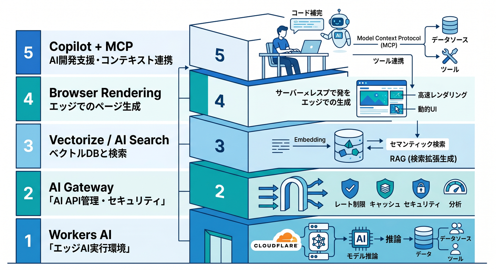
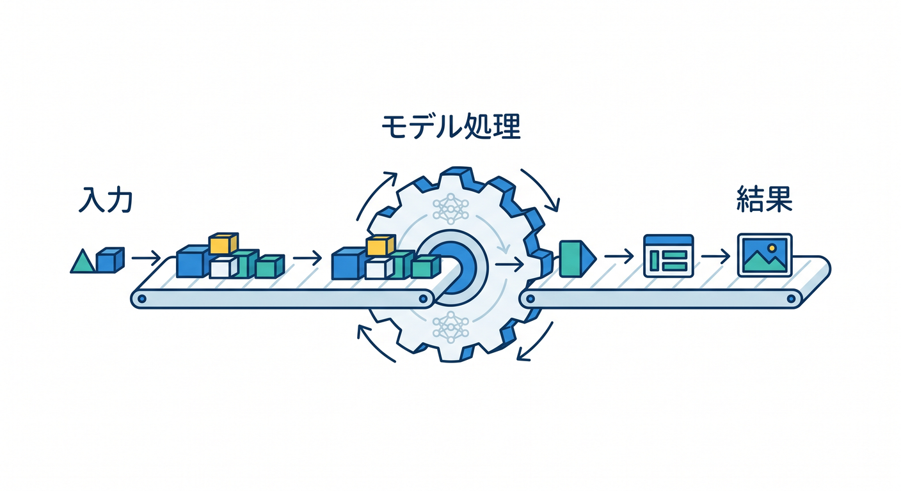
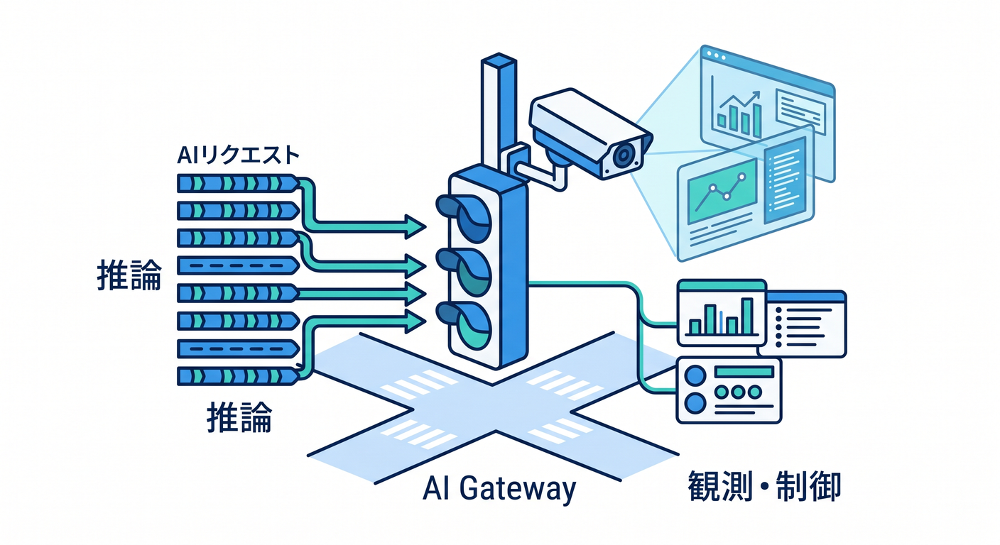
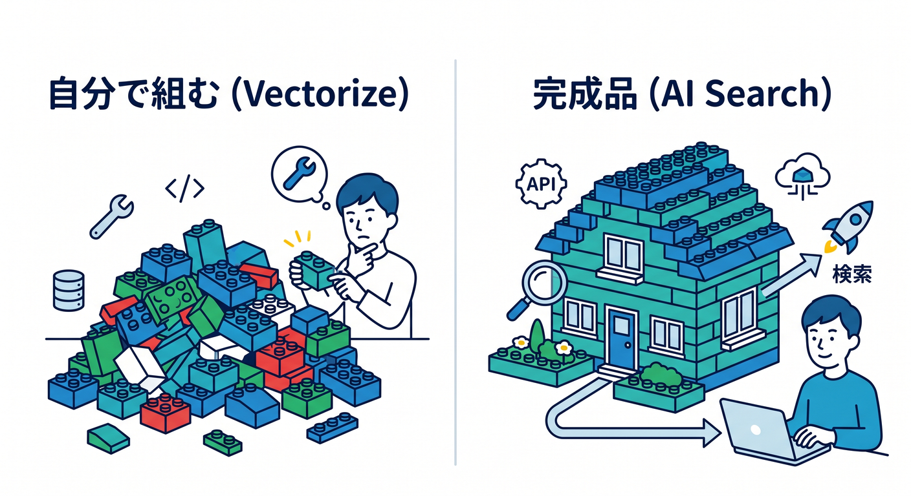
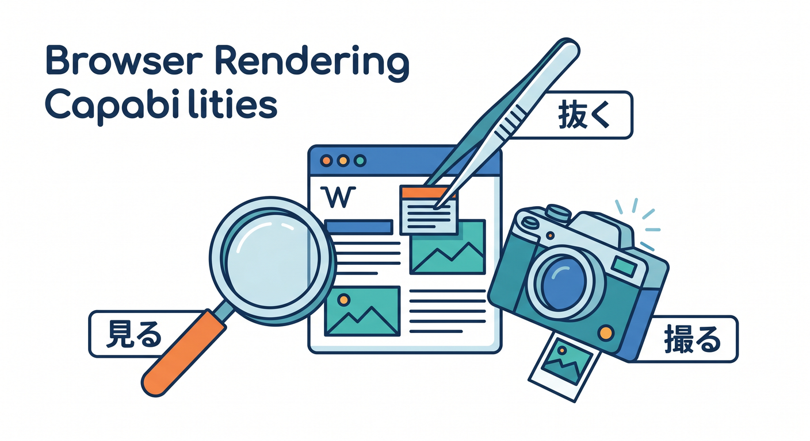
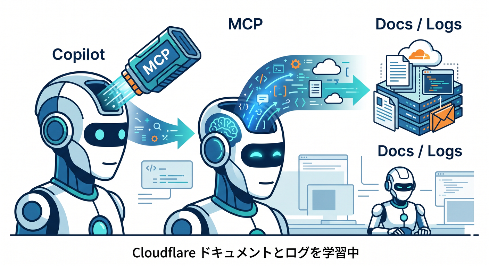
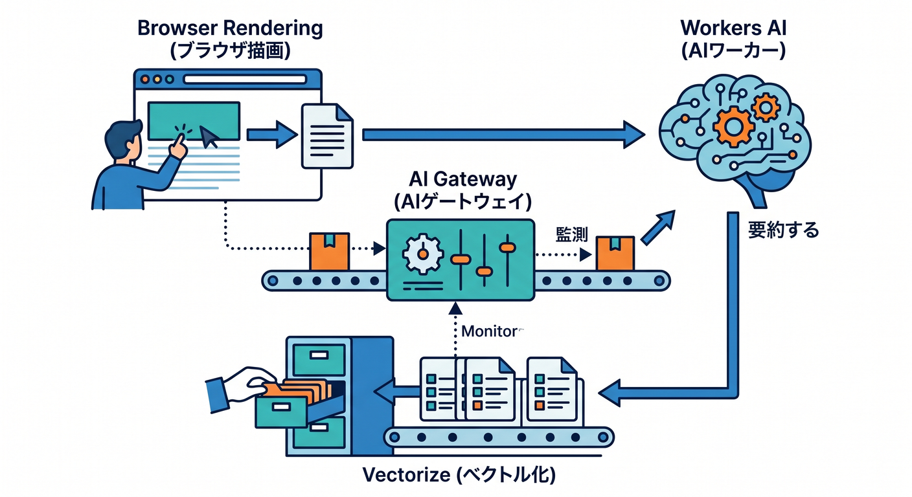

# 第15章：Cloudflare AI・Copilot・MCPで“今どきの開発体験”を仕上げよう 🤖☁️🪄

この章は、Cloudflareを「公開先」ではなく「AIも開発体験も含めてまとめて回せる土台」として理解する総仕上げです ☁️✨
Workers AI は Cloudflare のネットワーク上でサーバーレスにAIモデルを実行でき、AI Gateway はそのAI利用を観測・制御し、Vectorize はベクトル検索の土台、AI Search はデータを継続的にインデックス化して自然言語で検索できる managed search、Browser Rendering は Cloudflare 上で headless Chrome を動かせます。さらに 2026年3月〜4月には、AI Search に public endpoint・UI snippets・MCP が追加され、Browser Rendering には CDP と MCP client 連携も入り、かなり“今どき”な構成になっています。 ([Cloudflare Docs][1])

この章のねらいは、AI機能を1個ずつ覚えることではありません 😊
「モデルを動かす」「ログを見る」「検索の土台を持つ」「Webページを読む」「AIエージェントに作業を渡す」を、Cloudflareの中でどうつなぐかをつかむことです。ここまでの章で作ってきた Worker や小さな React アプリに、最後に“AI時代の運転席”をつけるイメージです。 ([Cloudflare Docs][1])

## この章で到達したい状態 🎯

受講後は、次の3つができる状態を目指します 🌟

* Workers AI と AI Gateway の役割の違いを説明できる
* Vectorize・AI Search・Browser Rendering を「どんな場面で使うか」で言い分けられる
* VS Code と GitHub Copilot に MCP をつなぎ、Cloudflare の情報を読ませながら開発を進められる ([Cloudflare Docs][1])

---

## 1. まずは全体像を1枚の地図として覚えよう 🗺️☁️

この章では、CloudflareのAIまわりを5つの層に分けて覚えると混乱しにくいです 😊
1つ目が「考えるAI」である Workers AI、2つ目が「見張る・制御する」AI Gateway、3つ目が「覚えて探す」Vectorize / AI Search、4つ目が「ブラウザで実際に見る」Browser Rendering、5つ目が「開発そのものを助ける」Copilot + MCP です。Cloudflare公式の最新導線でも、これらは別製品というより連携前提の部品として並んでいます。 ([Cloudflare Docs][1])

この見方が大事なのは、初心者ほど「AIは全部ひとまとめ」に見えやすいからです 😵‍💫
でも実際には、文章を生成するのと、失敗時に別モデルへ切り替えるのと、社内文書を意味検索するのと、実際のWebページを開いて内容を抜くのでは、役割がまったく違います。この章は、その違いをふわっとではなく、使いどころで整理する章です。 ([Cloudflare Docs][2])

---

## 2. Workers AI は「AIを実行する入口」として覚えよう 🧠⚡

Workers AI は、Cloudflareのグローバルネットワーク上でAIモデルをサーバーレスに実行する仕組みです。Cloudflare公式では、Workers・Pages・Cloudflare API から呼べる形で案内されていて、50以上のオープンモデルがモデルカタログとして用意されています。つまり第15章では、まず「自分の Worker からAIを呼ぶ」ことを AI 活用の出発点として押さえるのが自然です。 ([Cloudflare Docs][1])

教材では、ここを難しいモデル比較の章にしないほうが親切です 🙌
初心者には「どのモデルが世界一か」より、「Worker から AI を1回呼べる」「返ってきた結果を画面に出せる」「必要ならストリーミングできる」の3つが大切です。Workers AI の binding を作ると Worker 側から env.AI.run() でモデル実行でき、stream オプションも使えます。 ([Cloudflare Docs][3])

この章の説明では、AIを“魔法の箱”にしないのがポイントです ✨
入力を渡す → モデルが処理する → 結果を返す、という流れを既存の Request / Response の延長で教えると、Cloudflare学習の軸がぶれません。画像認識・テキスト生成・物体検出など複数タスクに使えることは紹介しつつ、教材の実習はまず短文要約や分類のような軽めの例に絞ると進みやすいです。 ([Cloudflare Docs][1])

---

## 3. AI Gateway は「AIの交通整理役」として教えよう 🚦🤖

Workers AI を使い始めると、次に必要になるのは“ちゃんと見えること”です 👀
Cloudflare の AI Gateway は、AIアプリの analytics と logging を取りつつ、caching、rate limiting、request retries、model fallback までまとめて扱える仕組みとして案内されています。しかも公式は「1行で始めやすい」としており、初心者にも導入意図を説明しやすいです。 ([Cloudflare Docs][2])

ここで受講者に伝えたいのは、「AIを呼べる」だけでは実務になりにくい、ということです 📊
レスポンスが遅いとき、失敗したとき、同じ質問が何回も来るとき、どのくらいお金やトークンを使っているかを見たいとき、そういう“運用の現実”を受け止めるのが AI Gateway です。公式にも request timeout で retry や fallback を発動させる考え方が明記されています。 ([Cloudflare Docs][2])

教材では、AI Gateway を「高級オプション」ではなく「AIを雑に使わないための基本」として扱うのがきれいです 💡
特に第15章は総仕上げなので、Workers AI 単体で終えるより、「推論は Workers AI、観測と制御は AI Gateway」と役割を分けて覚えさせたほうが、後でモデルやプロバイダが変わっても理解が崩れません。AI Gateway は Workers AI だけでなく Anthropic、Google Gemini、OpenAI など複数プロバイダにも対応しています。 ([Cloudflare Docs][2])

---

## 4. Vectorize と AI Search は「覚える仕組み」と「探す仕組み」で分けよう 🔎🧷

AIアプリで次に欲しくなるのは、“手元の知識を参照できること”です 📚
Vectorize は Cloudflare のグローバル分散ベクトルデータベースで、埋め込みを保存して意味検索や推薦、分類、異常検知などに使えます。Workers AI で作った埋め込みも使えますし、OpenAI など他プロバイダの埋め込みも持ち込めます。さらに検索結果から R2・KV・D1 側の実データへつなぐ構成も Cloudflare 公式が案内しています。 ([Cloudflare Docs][4])

一方の AI Search は、もっと“完成品寄り”です 🚀
Cloudflare 公式では managed search service とされていて、Webサイトや非構造データをつないで継続更新されるインデックスを作り、自然言語で検索できます。しかも Vectorize、AI Gateway、R2、Browser Rendering、Workers AI とネイティブ統合されています。つまり教材では、「自分で検索基盤を組み立てたいなら Vectorize」「まず検索体験を素早く作りたいなら AI Search」という教え方がしやすいです。 ([Cloudflare Docs][5])

2026年3月には AI Search に大きな更新が入りました ✨
public endpoint、UI snippets、MCP support、新しい OpenAI互換の REST API が追加され、AIエージェントや既存SDKとつなぎやすくなっています。さらに NLWeb では、AI Search を使って website 側に /ask と /mcp エンドポイントを出す流れも案内されています。 ([Cloudflare Docs][6])

教材ではここで、受講者が混乱しやすい点も先に言っておくと親切です 😊
AI Search は新名称ですが、現時点の Workers binding や一部 API 名には autorag という表記が残っています。ドキュメントやサンプルで名前が混ざっても「中身が急に別物になったわけではない」と教えておくと、検索時の不安が減ります。 ([Cloudflare Docs][7])

---

## 5. Browser Rendering は「AIに目を持たせる」役として入れよう 🌐👁️

Browser Rendering は、Cloudflare のネットワーク上で headless Chrome を動かせる機能です。公式では browser automation、web scraping、testing、content generation の用途が案内されていて、Quick Actions を使うと screenshot、HTML取得、PDF化、Markdown抽出、snapshot、scrape、JSON抽出、links取得、crawl まで扱えます。 ([Cloudflare Docs][8])

この章で特におもしろいのは、「ただブラウザを開ける」だけで終わらないことです 😎
Browser Rendering の /json エンドポイントは、Webページから構造化データを抜くときに Workers AI を使います。さらに /crawl はサイト全体をたどって HTML・Markdown・JSON で返せるので、RAG や監視、調査系の教材と相性がいいです。 ([Cloudflare Docs][9])

そして 2026年4月、Browser Rendering はさらに一段おもしろくなりました 🪄
Cloudflare は CDP を公開し、Playwright や Puppeteer の既存スクリプトを Cloudflare 側のブラウザに接続できるようにしました。しかも MCP client 連携も追加され、Claude Desktop、Claude Code、Cursor、OpenCode などから remote browser として扱えるようになっています。Cloudflare の CDP ドキュメントでも persistent session や複数タブ管理、WebSocket 経由の CDP commands、DevTools UI での可視化が説明されています。 ([Cloudflare Docs][10])

学習者向けには、ここを2段階で教えるのがやさしいです 😊
まずは Quick Actions で「URLから本文をMarkdownにする」「スクリーンショットを撮る」を体験し、そのあと必要なら CDP や Playwright に進む流れです。最初からブラウザ自動操作を全部やろうとすると重くなりやすいので、第15章では“見る・抜く・撮る”くらいから入るのがちょうどいいです。 ([Cloudflare Docs][11])

---

## 6. Copilot と VS Code と MCP を、Cloudflare学習の相棒にしよう 🤝💻

2026年の VS Code と Copilot は、かなり本格的に agent 的な開発へ寄っています 🤖
VS Code 公式では、chat で使える tool は built-in tools、MCP tools、extension tools の3種類があり、Agent モードで tools picker から有効化できます。MCP server は resources、prompts、interactive apps まで提供できます。さらに VS Code 1.110 では、agent mode が従来の edit mode より高機能な前提になり、edit mode は既定で隠され、agent plugins には skills・commands・agents・MCP servers・hooks を含められるようになっています。 ([Visual Studio Code][12])

GitHub Copilot 側も、VS Code 上で agent mode と MCP をかなり前提にした案内になっています ✨
GitHub の feature matrix では、最新の VS Code 系で Agent mode、MCP、Custom agents などがサポートされています。また GitHub Docs では、MCP は Copilot の能力を他システムとつないで拡張する仕組みと説明されていて、Visual Studio Code の Copilot Chat から GitHub MCP server の tools を使う手順も案内されています。 ([GitHub Docs][13])

Cloudflare 側も、この流れをかなり強く意識しています ☁️🧠
Cloudflare の Prompting ドキュメントでは、Workers アプリを VS Code などの agent / editor から prompt で作っていく流れを案内しており、cloudflare-docs MCP server と cloudflare-observability MCP server をつないで、Docs を読ませたり、ログや例外を見せたりすることを明記しています。これは「AIでコード補完する」だけでなく、「Cloudflareの最新仕様を読ませながら直す」方向へ進んでいる、ということです。 ([Cloudflare Docs][14])

さらに Cloudflare 自身が managed remote MCP servers を公開しています 🌈
Documentation、Workers Bindings、Observability、Browser Rendering、AI Gateway、AI Search、Containers などの product-specific MCP servers があり、Cloudflare API MCP server では 2,500 以上の API endpoint を search() と execute() の2つの道具から扱えると案内されています。第15章では、ここを「Cloudflareの知識と操作をAIエージェントに手渡す入口」として紹介すると、とても今風です。 ([Cloudflare Docs][15])

---

## 7. この章の教材ストーリーは「小さなAI付き調査アプリ」がちょうどいい 🧪📝

第15章の成果物は、背伸びしすぎない小さなアプリにするとまとまりやすいです 😊
おすすめは、「URLを入れると、そのページの内容を取り込み、要約し、あとで意味検索できる調査メモアプリ」です。React の小さな入力画面から URL や文章を送信し、Worker 側で Browser Rendering から本文を取り込み、Workers AI で要約し、必要に応じて Vectorize に埋め込みを保存し、すべてのAI呼び出しは AI Gateway 経由で見る、という構成です。AI Search を使うなら、“自前で埋め込み管理を頑張らない版”として並行紹介できます。 ([Cloudflare Docs][11])

この教材構成のよいところは、各サービスの役割が見えやすいことです 💡
Browser Rendering は読む目、Workers AI は考える頭、Vectorize や AI Search は覚える棚、AI Gateway は交通整理と記録、Copilot + MCP は開発補助の相棒、と分かれます。しかも全部を一気に必須にせず、コア実習と発展実習に分けやすいです。 ([Cloudflare Docs][2])

---

## 8. 授業の進め方は「必須コア」と「発展」で分けよう 🪜✨

この章は欲張ると一気に重くなるので、授業は前半と後半で明確に分けるのがコツです 😊
前半の必須コアでは、Workers AI と AI Gateway と Copilot + docs/observability MCP に絞ります。ここで「AIを呼ぶ」「ログを見る」「CopilotにCloudflareの最新Docsを読ませる」の3点を体験させれば、第15章として十分に価値があります。 ([Cloudflare Docs][1])

後半の発展では、学習者の好みに応じて2ルートに分けるとわかりやすいです 🌿
検索系に興味がある人には Vectorize / AI Search、Web操作や取得に興味がある人には Browser Rendering を伸ばします。AI Search は public endpoint と MCP が入ったことで“AIに見せる検索窓”として教えやすく、Browser Rendering は CDP / MCP 連携が入ったことで“AIにブラウザを触らせる”入口として教えやすくなりました。 ([Cloudflare Docs][6])

---

## 9. Copilot に投げる問いも、この章では教材の一部にしよう 💬🤖

この章では、Copilot への聞き方そのものを教材化すると伸びやすいです 📘
たとえば「この Worker で Workers AI と AI Gateway の役割差だけを初心者向けに説明して」「このコードに Cloudflare docs MCP を前提として、公式流儀に沿う修正案を出して」「observability の観点でログ不足の場所を指摘して」のように、コード生成ではなく“理解補助”“構造化”“比較”を頼む聞き方を先に教えると、AI任せの雑な学習になりにくいです。Copilot と VS Code は agent mode、MCP、custom agents、tools の組み合わせでこうした流れを支えられる状態にあります。 ([Visual Studio Code][12])

Cloudflare 側の MCP をつなぐと、質問の質も上がります 🔧
docs MCP なら最新仕様を参照しながら説明させやすく、observability MCP ならログや異常を見ながら直させやすいです。Cloudflare は product-specific MCP servers を複数提供しているので、第15章では「Copilotを賢くするには、正しい道具を渡す」という発想まで到達させたいところです。 ([Cloudflare Docs][14])

---

## 10. この章で特に注意したい“つまずきポイント” 🚧😅

一番よくある混乱は、「Vectorize と AI Search が同じに見える」ことです。
Vectorize はベクトルDBそのもの、AI Search は検索体験まで寄せてくれる managed search です。教材では両者を並べて比較し、「自分で土台を組むか」「まず使える検索を持つか」で分けて話すと整理しやすいです。 ([Cloudflare Docs][4])

次に多いのが、「Browser Rendering を何にでも使いたくなる」ことです 🌐
でも公式も Quick Actions は簡単な取得や変換向け、より複雑な自動化や persistent session は Playwright・Puppeteer・CDP を使う流れとして分けています。教材でも、単純なHTML取得まで何でも Browser Rendering に寄せるのではなく、“JavaScriptを実行した後の実ページを見たいとき”に強いと教えるのがバランスよいです。 ([Cloudflare Docs][11])

もうひとつは、「MCP を増やせば増やすほど賢くなる」と思ってしまうことです 🤯
VS Code 公式は、relevant な tool だけを選ぶほうが結果が良いと案内しており、1リクエストで有効化できる tool 数にも上限があります。第15章では、docs・observability・必要なら browser くらいから始める運用感を教えるほうが実用的です。 ([Visual Studio Code][12])

---

## 11. 第15章のまとめとして、こう締めるときれいです 🎓☁️

この章の本質は、「CloudflareにもAI機能があります」で終わらないことです 😊
最新の Cloudflare は、Workers AI で推論し、AI Gateway で観測し、Vectorize や AI Search で知識を持ち、Browser Rendering で実ページを読み、MCP でその知識や操作を Copilot や他エージェントへ渡せる方向へ強く進んでいます。だから第15章は、単なる付録ではなく、“Cloudflareを2026年らしく使うための総まとめ”として置くのがいちばん自然です。 ([Cloudflare Docs][1])

受講者の気持ちとしては、ここまで来たらもう「Cloudflareってよくわからない箱」ではありません 🌈
「コードを書く場所」「公開する場所」だけでなく、「AIを動かす場所」「検索を作る場所」「ブラウザを遠隔で動かす場所」「AIエージェントに正しい道具を渡す場所」として見えるようになります。第15章は、その視界を開いて終わる章にすると、とても気持ちよく締まります。

[1]: https://developers.cloudflare.com/workers-ai/ "Overview · Cloudflare Workers AI docs"
[2]: https://developers.cloudflare.com/ai-gateway/ "Overview · Cloudflare AI Gateway docs"
[3]: https://developers.cloudflare.com/workers-ai/configuration/bindings/ "Workers Bindings · Cloudflare Workers AI docs"
[4]: https://developers.cloudflare.com/vectorize/ "Overview · Cloudflare Vectorize docs"
[5]: https://developers.cloudflare.com/ai-search/ "Cloudflare AI Search · Cloudflare AI Search docs"
[6]: https://developers.cloudflare.com/ai-search/platform/release-note/ "Release note · Cloudflare AI Search docs"
[7]: https://developers.cloudflare.com/ai-search/usage/workers-binding/ "Workers Binding · Cloudflare AI Search docs"
[8]: https://developers.cloudflare.com/browser-rendering/ "Browser Rendering · Cloudflare Browser Rendering docs"
[9]: https://developers.cloudflare.com/browser-rendering/quick-actions/json-endpoint/ "/json - Capture structured data using AI · Cloudflare Browser Rendering docs"
[10]: https://developers.cloudflare.com/changelog/post/2026-04-10-browser-rendering-cdp-endpoint/ "Browser Rendering adds Chrome DevTools Protocol (CDP) and MCP client support · Changelog"
[11]: https://developers.cloudflare.com/browser-rendering/quick-actions/ "Quick Actions · Cloudflare Browser Rendering docs"
[12]: https://code.visualstudio.com/docs/copilot/agents/agent-tools "Use tools with agents"
[13]: https://docs.github.com/en/copilot/reference/copilot-feature-matrix "Copilot feature matrix - GitHub Docs"
[14]: https://developers.cloudflare.com/workers/get-started/prompting/ "Prompting · Cloudflare Workers docs"
[15]: https://developers.cloudflare.com/agents/model-context-protocol/mcp-servers-for-cloudflare/ "Cloudflare's own MCP servers · Cloudflare Agents docs"
