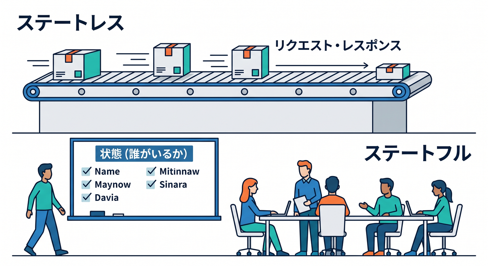
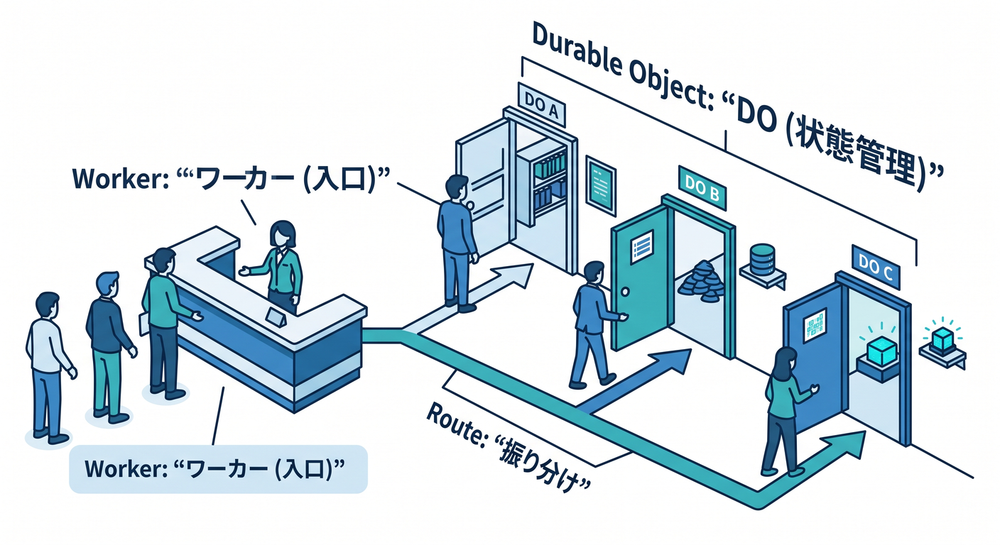
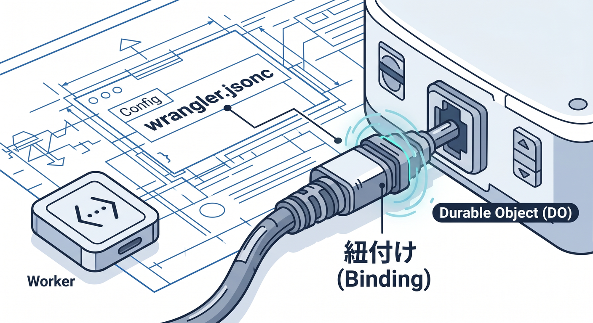
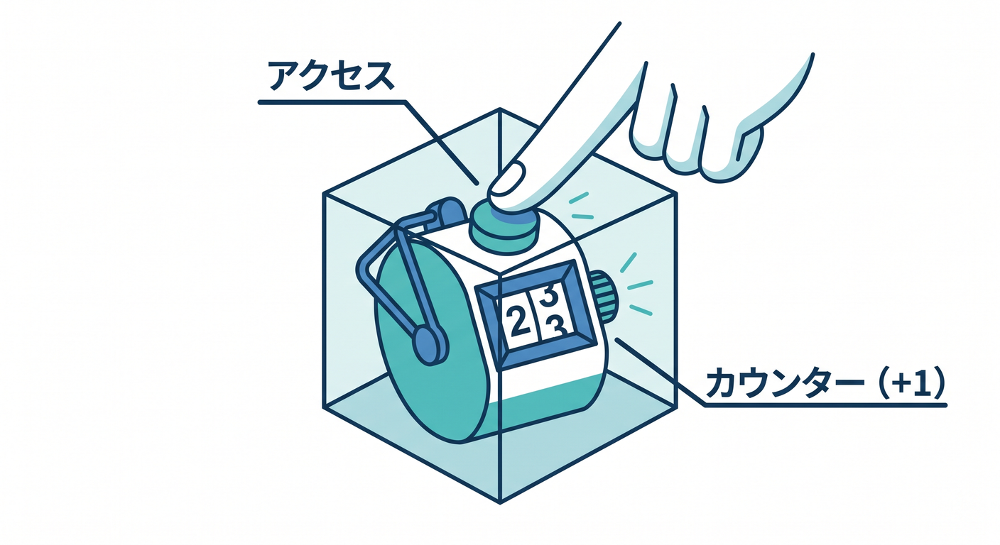
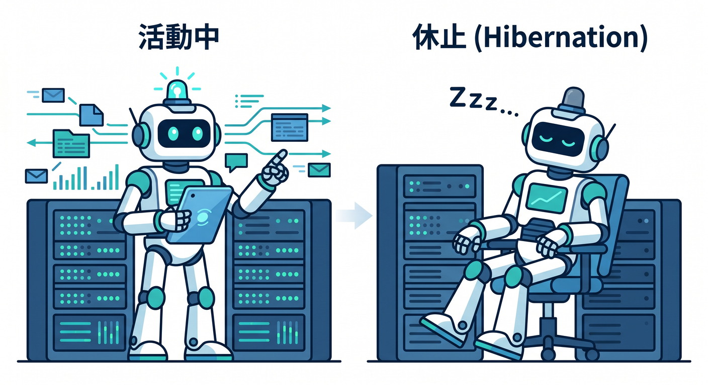

# Cloudflare Durable Objectsで“状態のあるアプリ”へ 15章アウトライン 🧵✨

確認日: 2026-04-24  
主な確認先: Cloudflare Durable Objects Overview / Get started / Bindings / Migrations / RPC / Storage API / SQLite Storage / WebSockets / WebSocket Hibernation / Alarms / Limits 公式ドキュメント

## 第1章　状態のあるアプリって何だろう 🧵

普通のAPIは、リクエストが来たら処理して返すのが得意です。  
でもチャット、共同編集、ゲームの部屋、リアルタイム通知では「今この部屋に誰がいるか」のような状態が必要です。  
Durable Objectsは、特定のIDにひもづく小さな状態管理役をCloudflare上に作れる仕組みです。  
この章では、statelessとstatefulの違いを文系のたとえでつかみます 😊

React画面、Worker API、Durable Objectの役割分担も見ます。  
この章のゴールは、Durable Objectsが必要になる場面を説明できることです ✅

## 第2章　Durable Objectは“1つの部屋の管理人” 🏠

Durable Objectは、名前やIDごとに1つのインスタンスへ処理を集められます。  
たとえば `room-123` というチャット部屋の状態を、同じDurable Objectが管理します。

同じ部屋への操作が1か所に集まるので、順番や一貫性を考えやすくなります。  
computeとstorageを近くに持てるのも大きな特徴です。  
この章では、部屋、カウンター、共同編集メモを題材にイメージを固めます 🧭  
この章のゴールは、IDごとに状態を分ける考え方を理解することです。

## 第3章　WorkersとDurable Objectsの関係 🌉

外からの入口はWorkers、状態を持つ担当がDurable Objectです。

WorkerはURL、認証、入力チェック、ルーティングを担当します。  
Durable Objectは、そのユーザーや部屋に関する状態操作を担当します。  
TypeScriptでは `DurableObjectNamespace` bindingと、DOクラスを組み合わせます。  
Reactから直接DOへ触るのではなく、まずWorker APIを入口にします 🔐  
この章のゴールは、WorkerとDOの責任分担を描けることです。

## 第4章　Wrangler設定とbindingを作ろう ⚙️

Durable Objectを使うには、`wrangler.jsonc` にbindingとmigrationを書きます。

公式ドキュメントでは、新しいDurable ObjectクラスはSQLite-backedとして作る流れが案内されています。  
`new_sqlite_classes` migrationでクラスを追加し、Workerから `env.MY_DO` として呼び出します。  
TypeScriptの `Env` 型も忘れずに書きます。  
この章では、最小構成の設定を作ります 🛠️  
この章のゴールは、DOをWorkerへbindingできることです。

## 第5章　最初のCounter Durable Object 🔢

最初の題材は、アクセスするたびに数字が増えるCounterです。

Durable Objectの中に数字を保存し、Workerから呼び出します。  
HTTPの `fetch()` 形式と、RPC形式の違いにも軽く触れます。  
小さなCounterは、状態が1か所に集まる感覚をつかむのに向いています。  
ローカル開発では `wrangler dev` で動かします 🚀  
この章のゴールは、動くDOを1つ作ることです。

## 第6章　IDとstubを理解しよう 🪪

WorkerからDOを呼ぶには、IDとstubを使います。  
`idFromName()` は文字列から安定したIDを作り、同じ名前なら同じObjectへつながります。  
`get(id)` でstubを取得し、そこからDOへリクエストやRPCを送ります。  
チャットなら部屋ID、ユーザー設定ならユーザーIDなどが候補です。  
個人情報をそのままID名にしない配慮も学びます 🔐  
この章のゴールは、どの状態をどのIDへ集めるか設計できることです。

## 第7章　RPCでメソッドを呼び出そう 📞

Durable Objectsは、WorkerからRPCでpublic methodを呼べます。  
`stub.increment()` のように、HTTPより自然にTypeScriptのメソッドとして扱えます。  
APIの入口はWorker、内部の状態操作はRPCという分け方ができます。  
ただし、外部公開APIとして何でもRPCに寄せるのではなく、境界を意識します。  
型を整えるとCopilotにも意図が伝わりやすくなります 🤖  
この章のゴールは、HTTPとRPCの使い分けを理解することです。

## 第8章　SQLite-backed Storageを使おう 🗄️

Durable Objectsは、SQLite-backed storageを使えます。  
公式では新しいクラスにSQLite-backed Durable Objectsを推奨しています。  
`ctx.storage.sql.exec()` でSQLを実行し、DOの近くにデータを保存できます。  
カウンター、部屋の設定、接続履歴、短いイベントログなどに向きます。  
D1とDO内SQLiteの違いも整理します 🧠  
この章のゴールは、DOのstorageへデータを保存できることです。

## 第9章　チャット部屋を作ってみよう 💬

チャットはDurable Objectsの代表的な題材です。  
部屋IDごとに1つのDOを割り当て、参加者やメッセージを管理します。  
Workerは `/rooms/:id/messages` のようなAPIを受け、DOへ処理を渡します。  
最初はHTTPで投稿と一覧取得を作り、後の章でWebSocketへ広げます。  
AI要約を入れるなら、メッセージ履歴の扱いにも注意します ✨  
この章のゴールは、部屋単位で状態を分けるAPIを作ることです。

## 第10章　WebSocketでリアルタイム更新しよう ⚡

Durable ObjectsはWebSocketと相性がよいサービスです。  
同じ部屋の接続をDOが持ち、メッセージを参加者へ配信できます。  
普通のHTTP pollingよりリアルタイム感を出しやすくなります。  
React側ではWebSocket接続を作り、受け取ったメッセージで画面を更新します。  
接続数、切断、再接続、認証を忘れずに考えます 🔐  
この章のゴールは、DOでリアルタイム配信の基本を理解することです。

## 第11章　WebSocket Hibernationを知ろう 😴

WebSocketを長時間つなぐと、サーバー側の効率が気になります。  
Cloudflare Durable ObjectsにはWebSocket Hibernation APIがあります。  
接続中でもイベントがない間はDOを休ませ、必要なときに起こす設計ができます。

チャットや通知のようなアプリで、コストと効率に関係します。  
最初は通常WebSocket、発展としてhibernationを学びます 🧭  
この章のゴールは、長時間接続の運用イメージを持つことです。

## 第12章　Alarmsであとから処理しよう ⏰

Durable ObjectsにはAlarmsという、指定時刻にDOを起こす仕組みがあります。  
一定時間後のクリーンアップ、期限切れ部屋の整理、リマインダーに使えます。  
QueuesやCron Triggersとの違いも軽く整理します。  
DOの中の状態に近い小さな予定処理に向いています。  
失敗時の再試行や冪等性も大切です 🧯  
この章のゴールは、状態に近い予約処理を設計できることです。

## 第13章　D1・KV・R2・Queuesとの使い分け 🗺️

Durable Objectsは万能データベースではありません。  
グローバルな表データならD1、軽い設定ならKV、ファイルならR2、非同期処理ならQueuesが候補です。  
DOは「同じIDの処理を1か所に集めたい」ときに強いです。  
チャット部屋の現在状態はDO、長期検索用メッセージはD1、添付ファイルはR2のように分けます。  
この章では、保存先の地図をもう一段細かくします 🧭  
この章のゴールは、DOを使いすぎない判断ができることです。

## 第14章　AIアプリとDurable Objects 🤖

AIチャット、共同プロンプト編集、生成ジョブの進行状況表示では状態管理が必要です。  
Durable Objectsは、会話ルーム、ユーザーごとの一時状態、リアルタイム進捗の管理に使えます。  
AI Gatewayで外部AI APIを守り、Workers AIやVectorize、R2、D1と組み合わせる設計も考えます。  
秘密情報はSecretsに置き、DO storageへAPIキーを保存しないようにします 🔐  
この章のゴールは、AIアプリでDOを使う場所をイメージできることです。

## 第15章　小さなリアルタイムメモアプリを完成させよう 📝

最後はReact + Workers + Durable Objectsで、小さなリアルタイムメモアプリをまとめます。  
部屋IDでDOを選び、現在のメモ本文と接続中ユーザーを管理します。  
HTTPで初期データを取得し、WebSocketで更新を配信する構成にします。  
入力チェック、認証、Rate Limiting、ログ、Copilotレビューも入れます。  
本番前にはlimits、課金、データ保存方針を確認します ✅  
この章のゴールは、状態のあるアプリの全体像を自分で説明できることです。

---

## 参照URL

- https://developers.cloudflare.com/durable-objects/
- https://developers.cloudflare.com/durable-objects/get-started/
- https://developers.cloudflare.com/durable-objects/reference/durable-objects-bindings/
- https://developers.cloudflare.com/durable-objects/reference/durable-objects-migrations/
- https://developers.cloudflare.com/durable-objects/best-practices/create-durable-object-stubs-and-send-requests/
- https://developers.cloudflare.com/durable-objects/api/rpc/
- https://developers.cloudflare.com/durable-objects/api/storage-api/
- https://developers.cloudflare.com/durable-objects/best-practices/access-durable-objects-storage/
- https://developers.cloudflare.com/durable-objects/best-practices/websockets/
- https://developers.cloudflare.com/durable-objects/best-practices/websocket-hibernation-server/
- https://developers.cloudflare.com/durable-objects/api/alarms/
- https://developers.cloudflare.com/durable-objects/platform/limits/
- https://developers.cloudflare.com/workers/configuration/smart-placement/
