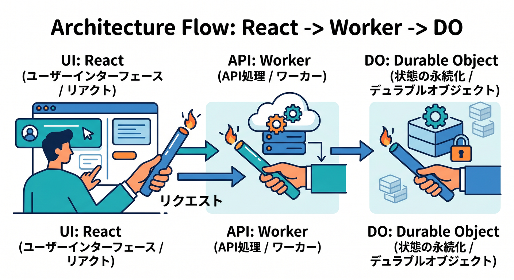
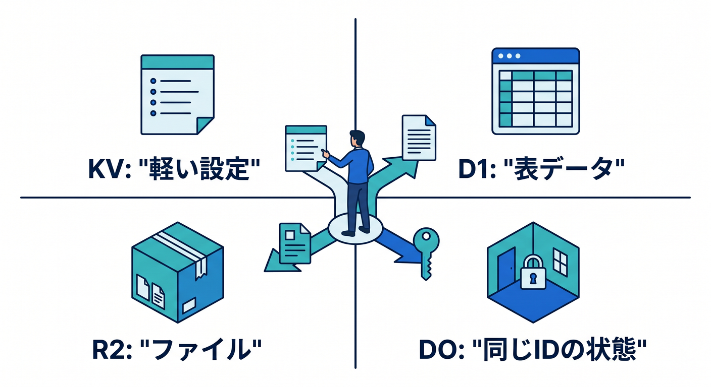

# 第01章：状態のあるアプリって何だろう 🧵

これまで作ってきたAPIは、リクエストを受けて、処理して、返す形が中心でした。  
でもアプリが少し育つと、「前の状態を覚えておきたい」場面が出てきます。  
この章では、Durable Objectsに入る前の考え方をゆっくり整理します 😊

---

## 1. StatelessなAPIのイメージ 🧾

普通のWorkers APIは、こんな動きが得意です。


```text
リクエストが来る
  ↓
必要な処理をする
  ↓
レスポンスを返す
```

この形はシンプルで速いです。  
天気API、検索API、フォーム送信APIなどにはかなり向いています。

ただし、API自身が「今この部屋に誰がいるか」を覚えるのは得意ではありません。

---

## 2. Statefulなアプリの例 💬

状態を持つアプリには、こんなものがあります。


- チャット部屋
- 共同編集メモ
- オンラインゲームの部屋
- ライブ投票
- AIチャットの進行状況

どれも「今どうなっているか」が大切です。  
メッセージの順番、参加者、編集中の本文、処理中のAIジョブなどを扱います。

---

## 3. Durable Objectsの役割 🧵

Durable Objectsは、特定のIDにひもづく状態管理役を作れるCloudflareの機能です。  
たとえば `room-123` という部屋なら、その部屋の担当DOに処理を集められます。




```text
React
  ↓
Worker API
  ↓
Durable Object: room-123
```

同じ部屋の処理が1か所に集まると、状態を扱いやすくなります。

---

## 4. 何でもDOにするわけではない 🧭

Durable Objectsは便利ですが、何でも入れる場所ではありません。



```text
軽い設定 → KV
表データ → D1
ファイル → R2
同じIDの状態管理 → Durable Objects
```

「同時に触られる状態を1か所で管理したい」ときに、DOが候補になります。

---

## 5. 章末チェック ✅

- stateless APIのイメージが分かる
- stateful appが必要になる場面が分かる
- Durable ObjectsはIDごとの状態管理役だと分かる
- Workerを入口にしてDOへ渡す構成が分かる
- DOを使いすぎない意識を持てる

この章で覚える一言はこれです。  
**Durable Objectsは、“同じ部屋の状態”を1か所に集めるための仕組みです 🧵**
