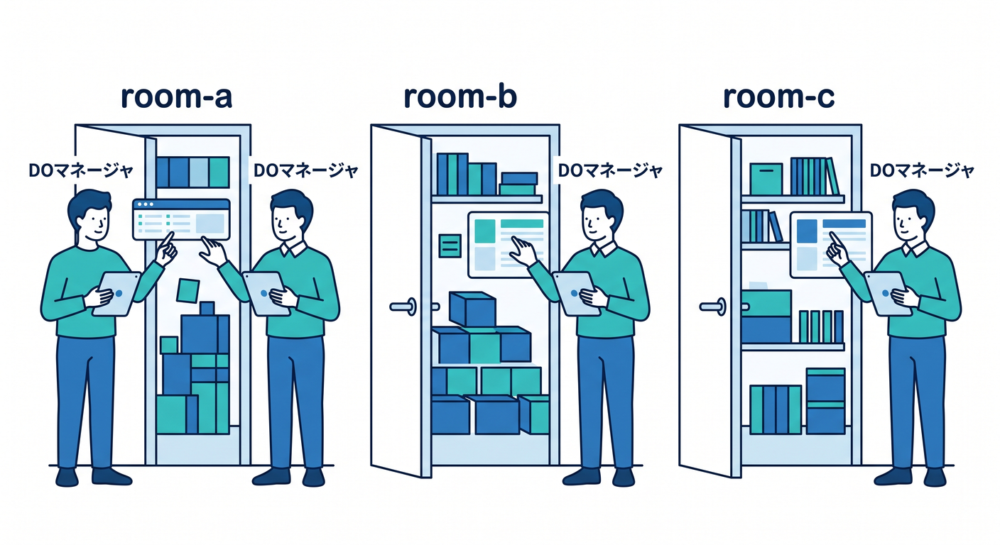
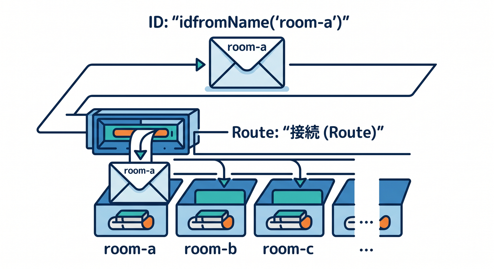
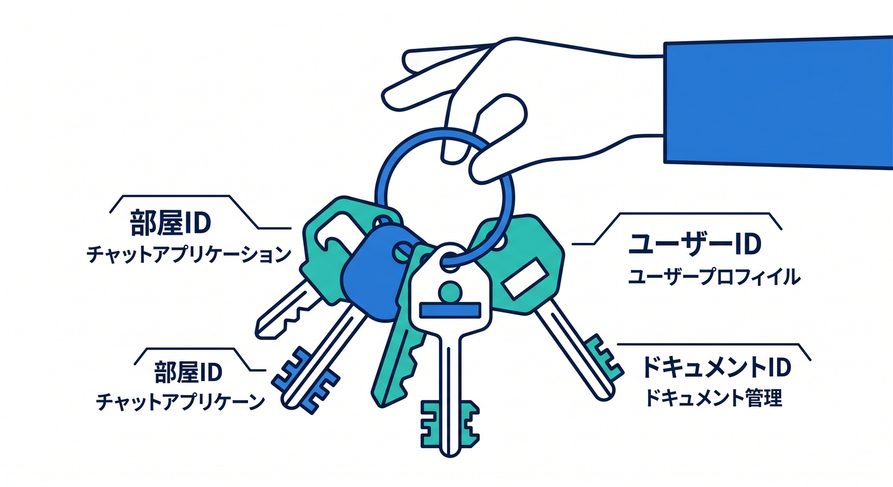
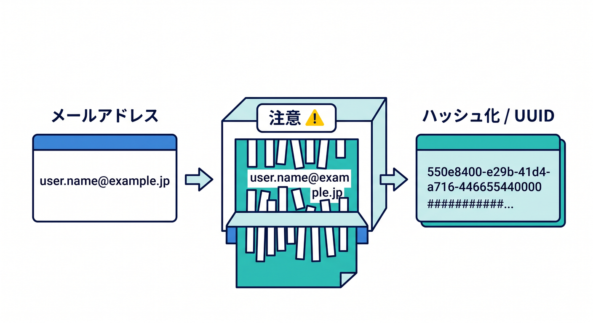

# 第02章：Durable Objectは“1つの部屋の管理人” 🏠

Durable Objectsは、最初は少し抽象的に見えます。  
でも「部屋ごとに管理人がいる」と考えると、かなり分かりやすくなります 😊

---

## 1. 部屋ごとの管理人 🧑‍💼

チャットアプリを考えてみます。



```text
room-a → room-a担当のDurable Object
room-b → room-b担当のDurable Object
room-c → room-c担当のDurable Object
```

`room-a` のメッセージや参加者は、`room-a` 担当が管理します。  
`room-b` とは別の状態として扱えます。

---

## 2. 同じIDの処理を集められる 🪪

Durable Objectsでは、IDを使ってObjectを選びます。  
同じIDなら同じObjectへつながるので、状態を集めやすいです。



```ts
const id = env.CHAT_ROOM.idFromName("room-a");
const room = env.CHAT_ROOM.get(id);
```

この `room` が、`room-a` の管理人への窓口です。

---

## 3. computeとstorageが近い 🗄️

Durable Objectsは、処理と保存場所を近くに持てるのが特徴です。


公式ドキュメントでも、stateful applicationsのための仕組みとして案内されています。

部屋の設定、現在の本文、短い履歴などを、そのObjectの近くで扱えます。

---

## 4. どんな単位で分ける？ 🧭

IDの切り方は設計の大事なポイントです。



- チャットなら部屋ID
- ユーザー設定ならユーザーID
- 共同編集ならドキュメントID
- ゲームならマッチID
- AIジョブならジョブID

ただし、メールアドレスなどの個人情報をそのままID名にするのは避けます 🔐



---

## 5. 章末チェック ✅

- DOを部屋の管理人としてイメージできる
- 同じIDなら同じObjectへつながると分かる
- computeとstorageが近い感覚が分かる
- ID設計が大切だと分かる
- 個人情報をID名にそのまま使わないと分かる

この章で覚える一言はこれです。  
**Durable Objectは、IDごとに置ける小さな管理人です 🏠**
