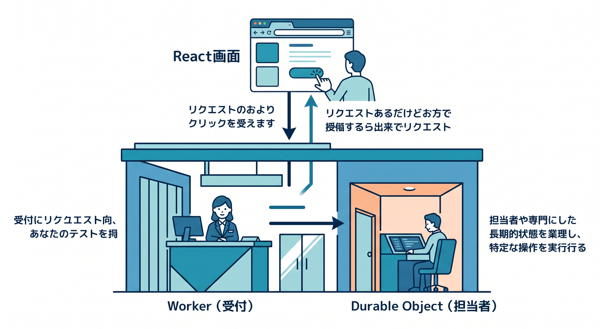
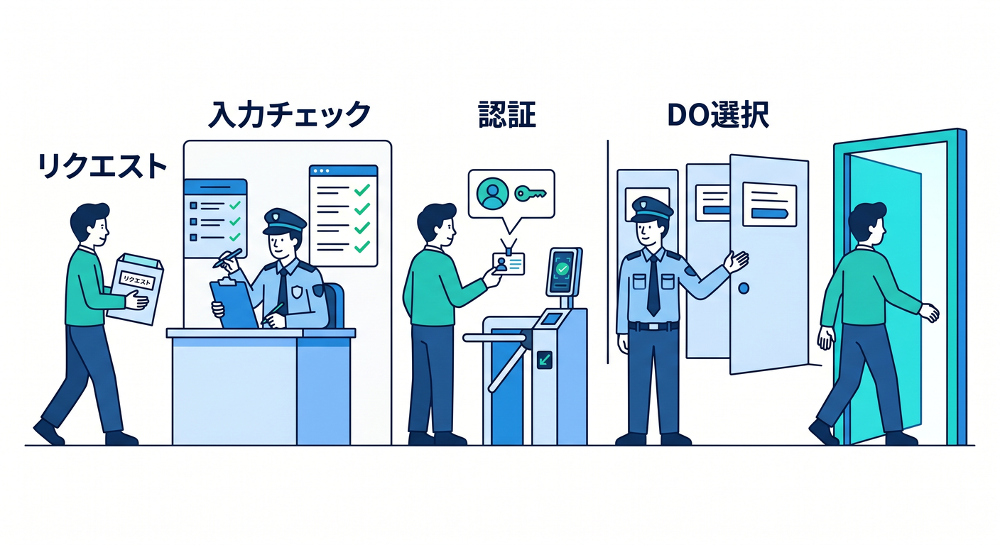
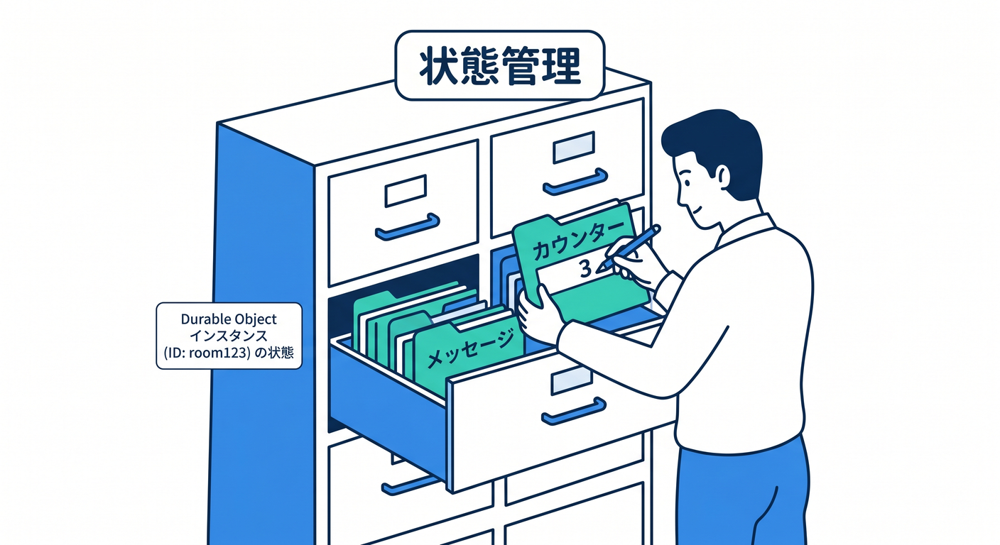
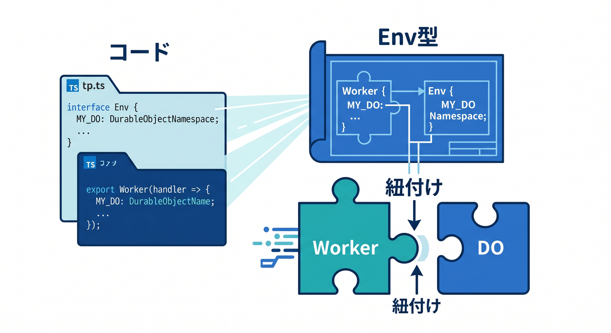
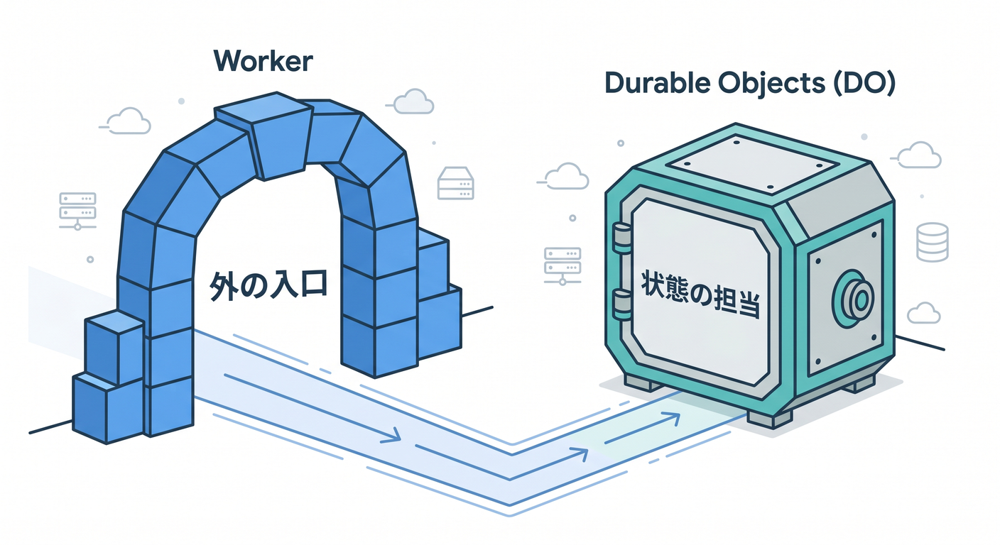

# 第03章：WorkersとDurable Objectsの関係 🌉

Durable Objectsは単体でいきなりブラウザから使うものではありません。  
基本はWorkersを入口にして、その中からDurable Objectへ処理を渡します。

---

## 1. Workerは受付、DOは担当者 🧑‍💻

役割を分けるとこうです。



```text
React画面
  ↓ fetch
Worker: 受付・認証・入力チェック
  ↓
Durable Object: 状態管理
```

Workerは外向きのAPIです。  
Durable Objectは内側で状態を扱う担当者です。

---

## 2. Workerでやること 🚪

Worker側では、外から来るリクエストを整理します。



- URLの判定
- HTTPメソッドの確認
- 認証
- 入力チェック
- Rate Limitingとの連携
- Durable ObjectのID選択

外から来るものは、まずWorkerで受け止めます。

---

## 3. Durable Objectでやること 🧵

DO側では、そのIDに関する状態を扱います。



- カウンターを増やす
- 部屋のメッセージを保存する
- 接続中ユーザーを管理する
- WebSocketへ配信する
- Alarmで後処理する

「この部屋の話」はDOに寄せる、という感覚です。

---

## 4. TypeScriptのEnv型 🧩

WorkerからDOを使うには、bindingをEnv型にも書きます。



```ts
export interface Env {
  CHAT_ROOM: DurableObjectNamespace<ChatRoom>;
}
```

型があると、`env.CHAT_ROOM` の使い方をエディタやCopilotが理解しやすくなります 🤖

---

## 5. 章末チェック ✅

- ReactからはWorker APIへアクセスすると分かる
- Workerは受付、DOは状態担当だと分かる
- Workerで入力チェックや認証をする理由が分かる
- DOで状態管理をする理由が分かる
- Env型にbindingを書くと分かる

この章で覚える一言はこれです。  
**外の入口はWorker、状態の担当はDurable Objectです 🌉**


