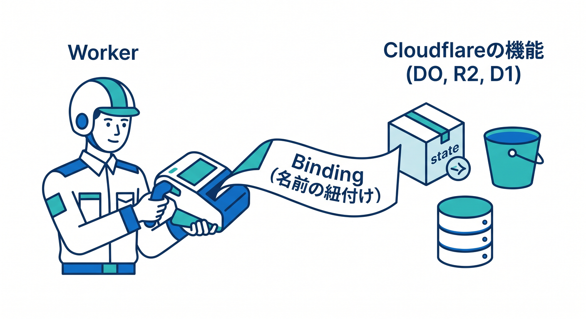
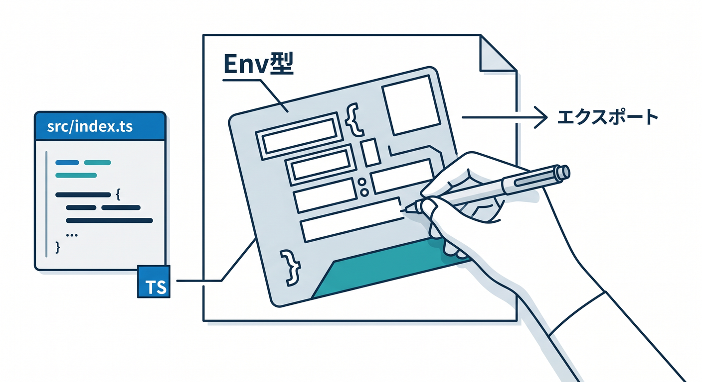
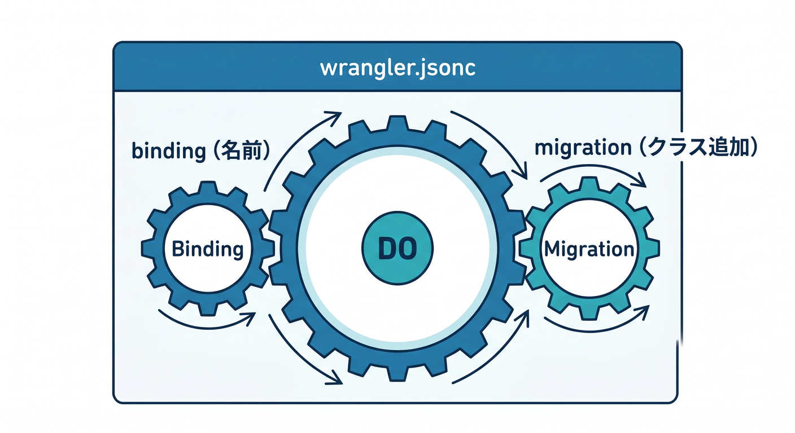

# 第04章：Wrangler設定とbindingを作ろう ⚙️

Durable Objectを使うには、コードだけでなく `wrangler.jsonc` の設定も必要です。  
この章では、最小構成のbindingとmigrationを作ります 🛠️

---

## 1. bindingとは何か 🌉

bindingは、WorkerからCloudflareの機能へアクセスするための名前です。



R2なら `BUCKET`、D1なら `DB` のように、DOにも名前を付けます。

```jsonc
{
  "durable_objects": {
    "bindings": [
      {
        "name": "COUNTER",
        "class_name": "Counter",
      },
    ],
  },
}
```

Workerでは `env.COUNTER` として使います。

---

## 2. migrationも必要 🧱

Durable Objectのクラスを追加するときはmigrationを書きます。


公式ドキュメントでは、新しいクラスにはSQLite-backed Durable Objectsのmigrationが案内されています。

```jsonc
{
  "migrations": [
    {
      "tag": "v1",
      "new_sqlite_classes": ["Counter"],
    },
  ],
}
```

この設定で、`Counter` クラスをDurable Objectとして使えるようにします。

---

## 3. TypeScript側の型 🧩

`src/index.ts` 側ではEnv型を書きます。



```ts
export interface Env {
  COUNTER: DurableObjectNamespace<Counter>;
}
```

DOクラスも同じファイル、または別ファイルからexportします。

```ts
export class Counter extends DurableObject<Env> {
  constructor(ctx: DurableObjectState, env: Env) {
    super(ctx, env);
  }
}
```

---

## 4. 名前は分かりやすく 🏷️

binding名は、使い道が分かる名前にします。


```text
COUNTER
CHAT_ROOM
LIVE_NOTE
AI_JOB_ROOM
```

後から見たときに「何のDOか」が分かる名前がよいです。

---

## 5. 章末チェック ✅

- `durable_objects.bindings` の役割が分かる
- `migrations` が必要だと分かる
- 新規クラスでは `new_sqlite_classes` を使うと分かる
- Env型にDurable Object namespaceを書くと分かる
- binding名を分かりやすく付けられる

この章で覚える一言はこれです。  
**Durable Objectは、bindingとmigrationをセットで用意します ⚙️**


